# 14：神经网络与反向传播 🧠

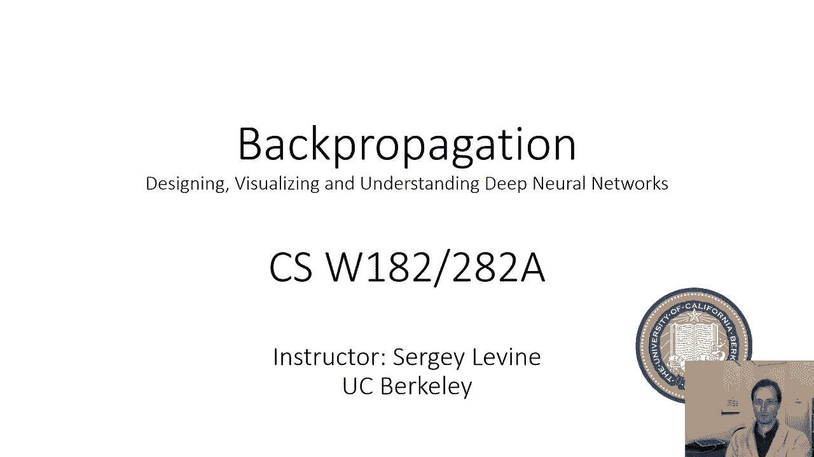

在本节课中，我们将学习神经网络的基本工作原理，特别是如何通过计算图来理解和构建它们。我们将从简单的线性回归和逻辑回归模型开始，逐步过渡到更复杂的多层神经网络，并理解其背后的核心概念。

---

## 计算图：可视化机器学习程序 📊

上一节我们介绍了机器学习算法本质上是一个带有参数的程序。本节中我们来看看如何用计算图来可视化这个程序。

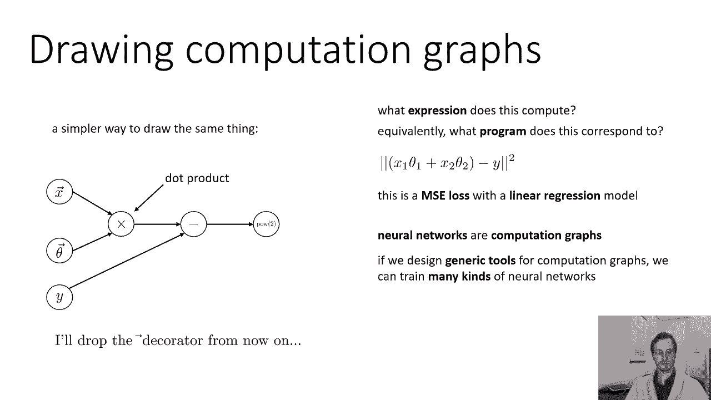

计算图是一种有向无环图，其中节点代表数学运算。它清晰地展示了数据（如输入 `x` 和标签 `y`）与参数（如 `θ`）如何通过一系列运算最终产生一个标量损失值。这对于理解模型和后续的梯度计算至关重要。

例如，一个简单的线性回归模型可以表示为以下计算图：
1.  输入 `x1` 和 `x2`。
2.  参数 `θ1` 和 `θ2`。
3.  计算 `x1 * θ1` 和 `x2 * θ2`。
4.  将两个乘积相加，得到预测值。
5.  从预测值中减去真实标签 `y`。
6.  将差值平方，得到均方误差损失。

这个图完整描述了线性回归的均方误差损失计算过程。

---

## 向量化表示：简化计算图 🔢

使用标量绘制计算图会显得繁琐。我们可以利用向量和矩阵来简化表示。

对于线性回归，我们可以将输入 `x` 和参数 `θ` 都视为向量。计算图中的乘法节点则变为点积运算 `x^T θ`。这样，整个计算图变得更加简洁，但数学含义完全相同。

在后续的图表中，除非特别说明，`x`、`θ` 等变量通常都代表向量或矩阵。

---

## 逻辑回归的计算图 🧮

逻辑回归是一种分类算法，其损失函数是负对数似然。让我们画出它的计算图。

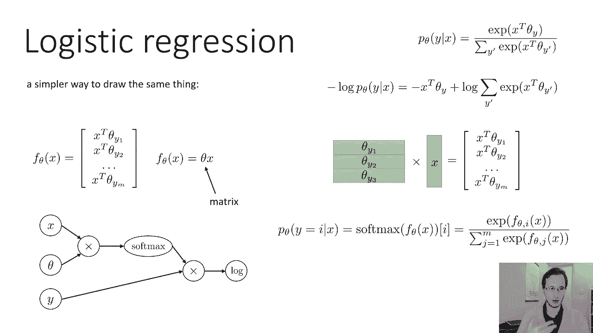

逻辑回归的预测由 Softmax 函数作用于线性模型给出。负对数似然损失公式为：
`L = - (x^T θ_y) + log( sum_{y‘} exp(x^T θ_{y‘}) )`
其中 `θ_y` 是对应于真实标签 `y` 的参数向量。

以下是构建该计算图的步骤：
1.  将输入 `x` 与每个类别的权重向量 `θ_{y‘}` 做点积，得到一个分数向量。
2.  将真实标签 `y` 表示为一个独热向量（例如，对于两个类别，标签1表示为 `[1, 0]`，标签2表示为 `[0, 1]`）。
3.  计算分数向量与独热向量的点积，这相当于选取了真实类别对应的分数，得到损失公式的第一部分 `x^T θ_y`。
4.  对分数向量中的每个元素求指数，然后求和，再取对数，得到损失公式的第二部分。
5.  将第二部分减去第一部分（注意公式前的负号），得到最终的负对数似然损失。

这个图清晰地展示了逻辑回归如何将输入映射为类别概率并计算损失。

---

## 矩阵表示与简化视图 🎯

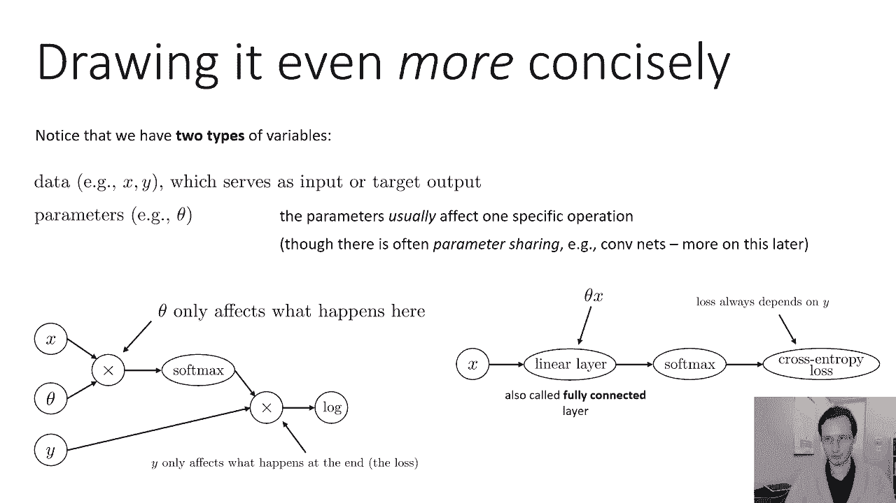

我们可以用矩阵形式进一步简化逻辑回归的计算图。

将所有权重向量堆叠成矩阵 `Θ`，那么 `Θ * x` 就直接得到了所有类别的分数向量。然后应用 Softmax 函数得到概率向量，再与独热标签向量 `y` 计算点积并取负对数，得到交叉熵损失（即负对数似然）。

基于机器学习模型的共性，我们可以绘制更简洁的计算图：
*   **数据** (`x`, `y`)：`x` 是输入，在图中向前传播；`y` 是目标，仅出现在损失计算中。
*   **参数** (`θ`)：通常只影响图中某个特定的局部操作（如一个线性变换层）。

因此，我们可以将逻辑回归简洁地画为一个操作链：
`x` → **线性层** (`Θ`) → **Softmax** → **交叉熵损失** (`y`)。
这消除了图中的冗余信息，突出了核心结构。

---

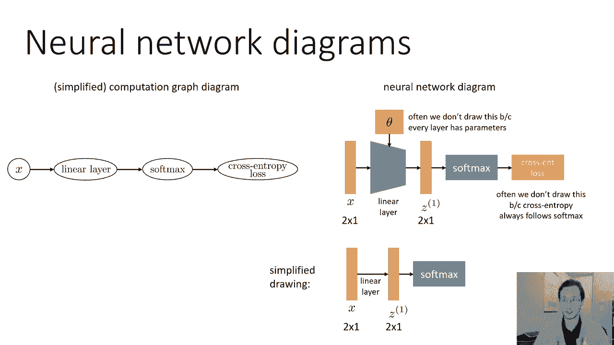

## 神经网络的常见图示 🖼️

在神经网络的研究中，常见的图示方法侧重于展示数据的流动和变换。

一种典型画法是将变量（数据）可视化为方块或层：
1.  输入 `x` 作为一个向量。
2.  **线性层** 将 `x` 转换为中间表示 `z^1`。该层包含参数矩阵 `W^1`，但通常在图中不显式画出。
3.  **激活函数**（如 Sigmoid）将 `z^1` 转换为激活值 `a^1`。
4.  可能还有更多的线性层和激活函数层。
5.  最后是 **Softmax 层** 和 **交叉熵损失**。

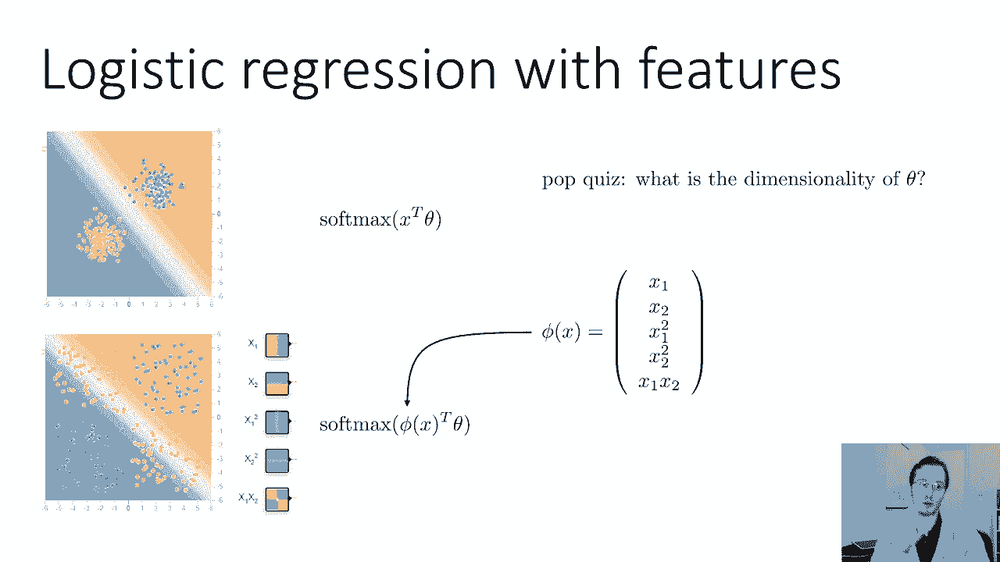

更简化的研究论文图示会省略损失函数和具体的运算框，仅用带标签的箭头表示层与层之间的变换（如“Linear”、“Sigmoid”）。这种图示与详细的计算图是等价的，只是侧重点不同。

---

## 超越逻辑回归：学习特征 🚀

逻辑回归在数据近似线性可分时效果很好。但如果数据复杂（如棋盘格分布），线性模型就无法很好地区分类别。

解决方案是使用特征映射。我们不是直接在原始输入 `x` 上做逻辑回归，而是在一个转换后的特征空间 `φ(x)` 中进行，其中 `φ(x)` 可能包含 `x` 的高次项、交叉项等。关键问题是如何自动学习这些有用的特征，而不是手动设计。

一个想法是：让每个特征本身都是一个简化逻辑回归模型（二分类）的输出。具体来说，每个特征 `φ_i` 的计算方式是：
`φ_i = σ(w_i^T x)`
其中 `σ` 是 Sigmoid 函数（即二分类 Softmax），`w_i` 是学习到的权重向量。

如果我们有很多这样的特征，可以用矩阵形式简洁地表示：
`φ = σ(W^1 x)`
这里 `W^1` 是一个矩阵，其每一行都是一个权重向量 `w_i^T`，`σ` 是逐元素应用的 Sigmoid 函数。

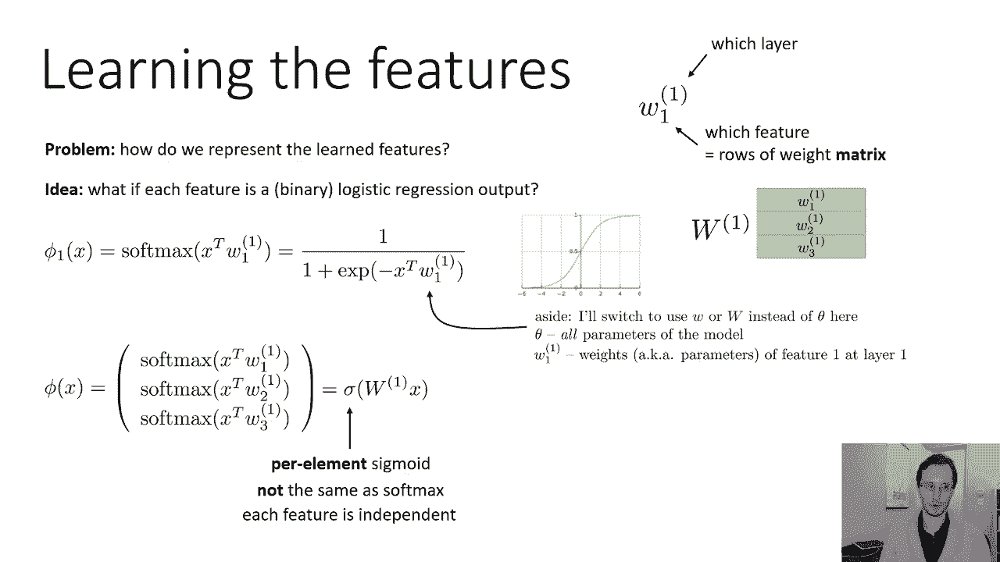

这实际上就是在原始输入 `x` 之上添加了一个“层”：一个线性变换（`W^1 x`）后接一个非线性激活函数（`σ`）。然后，我们在这个学习到的特征 `φ` 之上，再进行标准的逻辑回归（线性层 + Softmax）。这就构成了一个最简单的**神经网络**。

---

## 激活函数与深度网络 🌊

我们称 `σ` 这样的非线性函数为**激活函数**。它的存在至关重要。

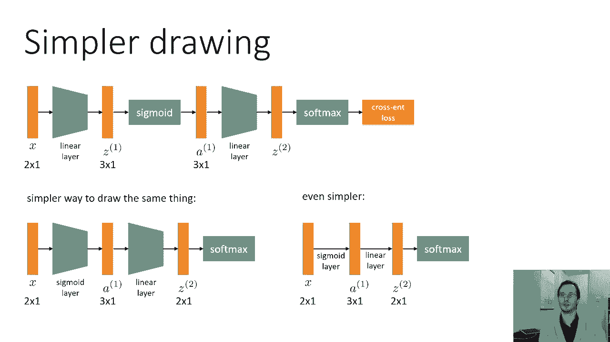

如果激活函数是线性的（例如恒等函数 `f(x)=x`），那么多个线性层的堆叠 `W^2 (W^1 x)` 可以合并为单个线性层 `(W^2 W^1) x`，这并没有增加模型的表达能力。而非线性激活函数的引入，使得多层堆叠能够学习输入数据中极其复杂的模式和表示。

因此，神经网络可以看作是在“线性代数千层面”：在矩阵乘法层（线性变换）和非线性激活层之间交替。只要激活函数是非线性的，多层堆叠就是有意义的。

我们可以构建更深的网络，例如：
`x` → 线性层 → Sigmoid → 线性层 → Sigmoid → 线性层 → Softmax → 损失
每一层都在学习更抽象、更复杂的特征。

---

## 演示与名称由来 💡

通过工具演示可以看到，对于线性不可分数据，简单的逻辑回归性能有限，而引入隐藏层（即神经网络）后，模型能够学习到复杂的决策边界，从而有效分类。

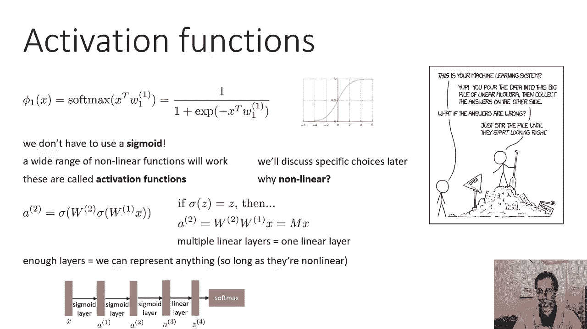

最后，解释一下“神经”网络的名称由来。这源于对人脑神经元的极度简化建模：
*   **树突**：接收来自其他神经元的信号，对应神经网络中上一层的输出。
*   **细胞体**：对输入信号进行加权求和（`w^T x`），对应线性变换。
*   **激活**：根据求和结果决定是否“放电”及放电强度，对应激活函数（如 Sigmoid）。
*   **轴突**：将输出信号传递给下游神经元，对应本层的输出。

因此，人工神经网络中的每个单元（神经元）都模拟了这种“接收信号-加权求和-非线性激活-传递信号”的过程。

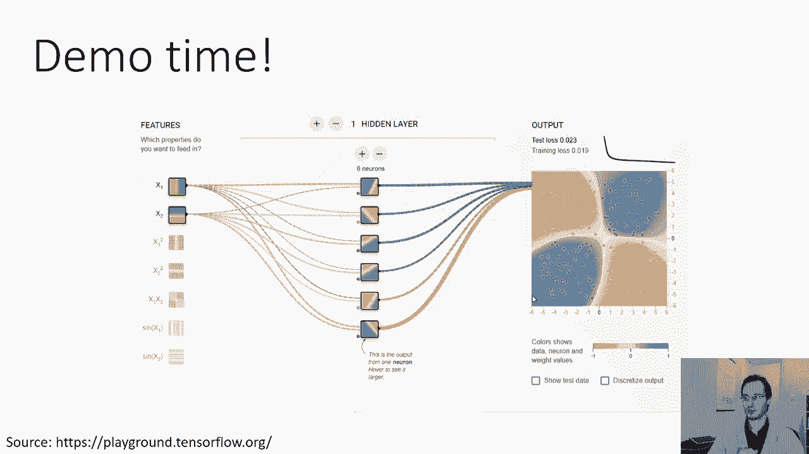

---

## 总结 ✨

本节课中我们一起学习了：
1.  如何使用**计算图**来可视化和理解机器学习模型。
2.  如何将**逻辑回归**表示为计算图，并用向量/矩阵形式进行简化。
3.  神经网络的核心思想：通过堆叠**线性层**和**非线性激活函数层**来自动学习多层次的特征表示。
4.  激活函数必须是非线性的，否则深层网络会退化为浅层网络。
5.  神经网络的图示惯例及其与生物神经元的粗略类比。

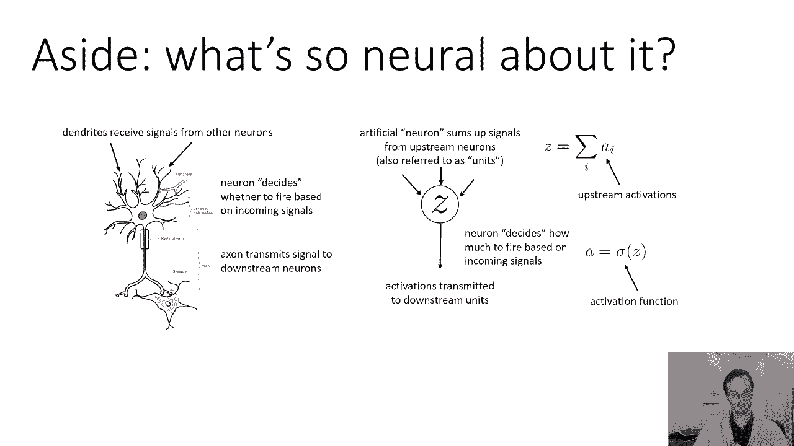

在接下来的课程中，我们将探讨如何“搅拌”这堆线性代数千层面——即如何使用反向传播算法来高效计算梯度，从而训练这些复杂的神经网络。