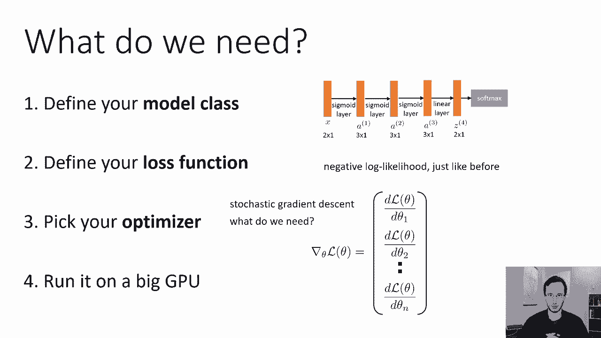
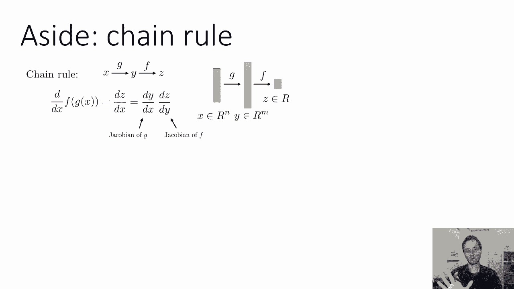
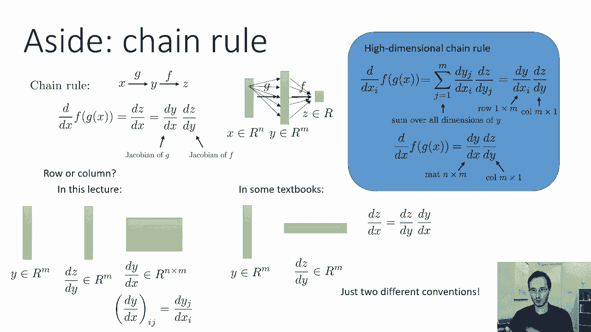
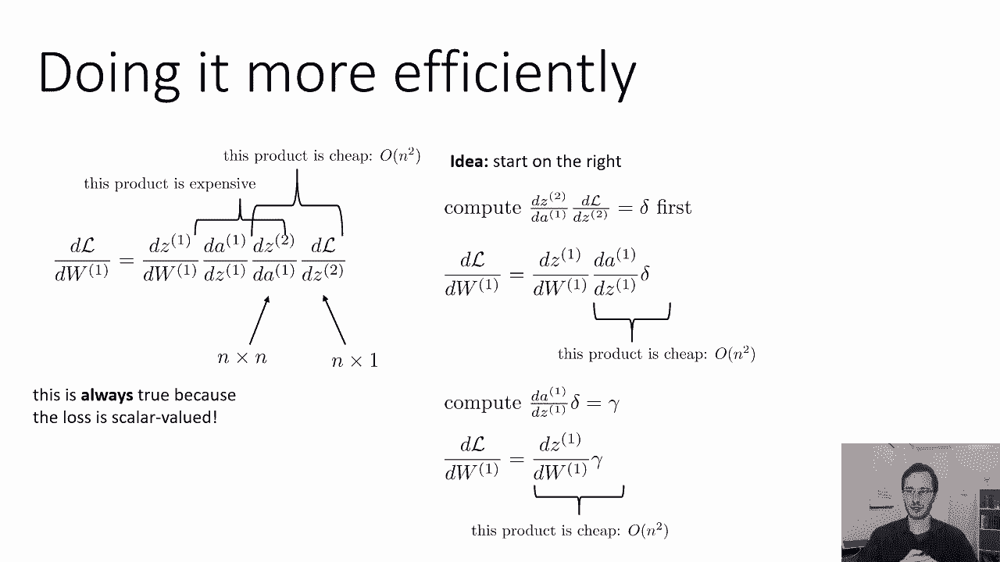
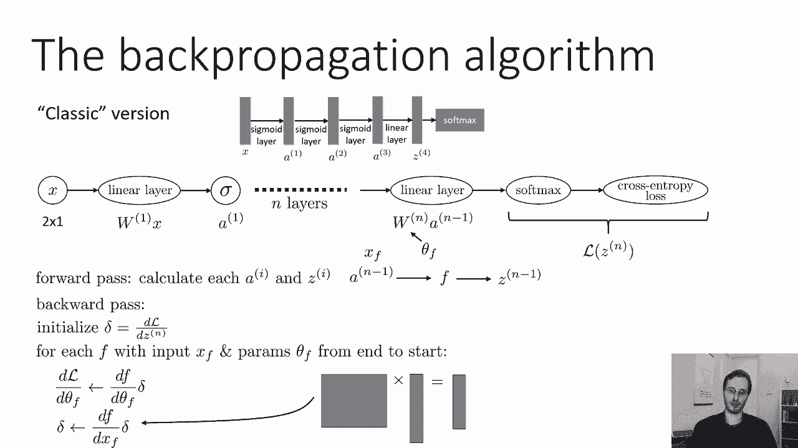
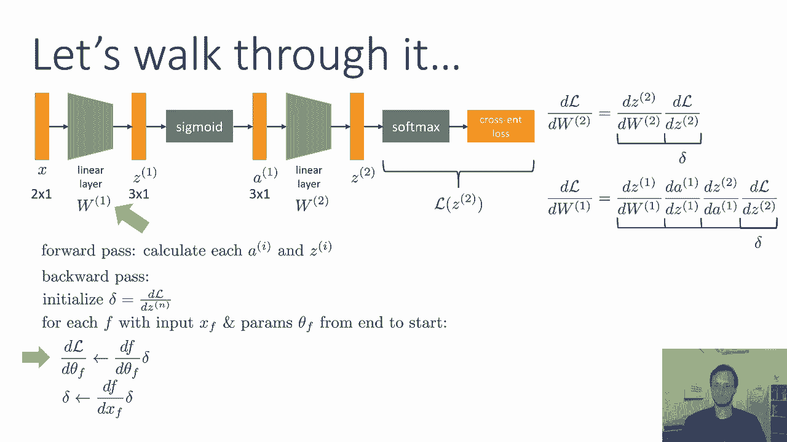

# 15：CS 182 - 第5讲 - 第2部分 - 反向传播 🧠

在本节课中，我们将学习如何训练多层神经网络。核心是推导并理解**反向传播**算法，该算法能自动计算神经网络中所有参数的梯度，从而让我们能够使用梯度下降等优化方法高效地训练网络。

---

## 概述

在上一节中，我们讨论了如何设计多层神经网络。本节中，我们将探讨如何训练它们，即如何构建一个完整的学习算法。我们将遵循第二课中解决机器学习问题的标准步骤：

1.  定义模型类（我们已经定义了神经网络）。
2.  定义损失函数（我们沿用负对数似然）。
3.  选择优化器（我们将使用随机梯度下降）。

为了将梯度下降应用于神经网络，我们需要计算损失函数相对于每个参数的梯度。虽然理论上可以手动推导这些导数，但对于复杂的网络结构，这非常耗时且容易出错。因此，我们需要一种能**自动计算梯度**的算法，这就是**反向传播**。它是几乎所有现代深度学习方法的基石。

---

## 链式法则回顾 🔗

神经网络由许多函数组合而成。对复合函数求导，需要用到微积分中的**链式法则**。

考虑一个简单的复合函数：`z = f(g(x))`。我们想计算 `dz/dx`。链式法则告诉我们：
`dz/dx = (dz/dy) * (dy/dx)`
其中 `y = g(x)`。

对于多元函数（这是神经网络中的常见情况），链式法则依然适用，但需要小心处理矩阵和向量的维度顺序。

假设 `x` 是 `n` 维向量，`g: R^n -> R^m`，`f: R^m -> R`（输出标量，如损失）。那么：
`dz/dx = (dz/dy) * (dy/dx)`
这里：
*   `dz/dy` 是一个 `m` 维的**列向量**（每个元素是 `z` 对 `y` 中一个分量的偏导）。
*   `dy/dx` 是一个 `n x m` 的**雅可比矩阵**（第 `i` 行第 `j` 列是 `y_j` 对 `x_i` 的偏导）。
*   因此，`dz/dx` 是一个 `n` 维的列向量，通过**矩阵-向量乘法**得到。

**本课程约定**：函数的导数（梯度）表示为其输入的**列向量**。这使得我们存储的梯度维度与原始参数维度完全一致，在深度学习中非常方便。

---

## 神经网络中的梯度计算 🧮

让我们回顾一个简单的两层神经网络：
1.  输入 `x`
2.  线性层：`z1 = W1 * x`
3.  激活函数（如Sigmoid）：`a1 = σ(z1)`
4.  线性层：`z2 = W2 * a1`
5.  输出层（Softmax）与交叉熵损失：`L`

参数是权重矩阵 `W1` 和 `W2`。我们可以直接应用链式法则写出梯度：

*   损失 `L` 对 `W2` 的梯度：
    `dL/dW2 = (dL/dz2) * (dz2/dW2)`

*   损失 `L` 对 `W1` 的梯度（链条更长）：
    `dL/dW1 = (dL/dz2) * (dz2/da1) * (da1/dz1) * (dz1/dW1)`

理论上，我们可以计算出每一个雅可比矩阵（如 `dz2/da1`, `da1/dz1`），然后把它们乘起来。然而，如果中间变量维度是 `n`，那么每个雅可比矩阵是 `n x n`，矩阵乘法是 `O(n^3)` 的操作，对于大型网络（如AlexNet有4096维的层）来说，计算成本极高。

---

## 反向传播的高效直觉 💡

我们注意到一个关键点：**损失函数 `L` 是标量**。因此，链条最末端的 `dL/dz2` 是一个向量，而不是矩阵。

高效算法的直觉是：**从右向左计算**，避免显式构造和相乘大型雅可比矩阵，而是进行一系列**矩阵-向量**乘法（`O(n^2)`）。

步骤如下：
1.  计算 `δ2 = dL/dz2` （向量）。
2.  计算 `dL/dW2 = (dz2/dW2) * δ2` （矩阵-向量乘，得到 `dL/dW2`）。
3.  将 `δ2` 向左传播：`γ1 = (dz2/da1) * δ2` （矩阵-向量乘，得到新向量）。
4.  继续向左：`δ1 = (da1/dz1) * γ1` （通常是对角矩阵乘向量，很高效）。
5.  计算 `dL/dW1 = (dz1/dW1) * δ1`。

这样，每一步都是 `O(n^2)` 的操作，总成本远低于直接计算 `O(n^3)` 的矩阵链乘积。

---

## 通用反向传播算法 ⚙️

基于以上直觉，我们可以形式化通用的反向传播算法。假设网络有 `N` 层，每层可视为一个函数 `f`，其输入为 `x_f`，参数为 `θ_f`。

**算法步骤：**

1.  **前向传播**：运行网络，计算并保存每一层的输入 `x_f`、输出 `a_f` 以及中间变量 `z_f`（对于线性层）。

2.  **初始化**：设 `δ` 为损失 `L` 对网络最后一层输出 `z_N` 的梯度，即 `δ = dL/dz_N`。

3.  **反向传播循环**（从最后一层到第一层）：
    对于网络中的每个函数 `f`（按反向顺序）：
    *   **计算参数梯度**：如果 `f` 有参数 `θ_f`，则计算 `dL/dθ_f = (df/dθ_f) * δ` 并保存。这里 `df/dθ_f` 是函数输出对其参数的雅可比。
    *   **更新 δ**：计算 `δ = (df/dx_f) * δ`。这会将 `δ` 更新为损失 `L` 对当前函数 `f` 的**输入** `x_f` 的梯度，以便用于前一层。
    *   循环继续，`δ` 就像是一个梯度信号，从输出层逐层反向流回输入层。

**算法要点**：
*   `δ` 在循环开始时，总是损失对**当前层输出**的梯度。
*   在计算完当前层参数梯度后，`δ` 被更新为损失对**当前层输入**的梯度。
*   对于无参数层（如激活函数），只执行更新 `δ` 的步骤。

---

## 算法示例演示 📝

让我们用之前的两层网络来演练：

1.  **前向传播**：计算 `z1, a1, z2, L`。
2.  **初始化**：`δ = dL/dz2`。
3.  **循环第一轮（最后一层线性层）**：
    *   函数 `f`：`z2 = W2 * a1`。参数 `θ_f = W2`，输入 `x_f = a1`。
    *   计算参数梯度：`dL/dW2 = (dz2/dW2) * δ`。
    *   更新 `δ`：`δ = (dz2/da1) * δ`。现在 `δ` 是 `dL/da1`。
4.  **循环第二轮（Sigmoid激活层）**：
    *   函数 `f`：`a1 = σ(z1)`。无参数。
    *   更新 `δ`：`δ = (da1/dz1) * δ`。现在 `δ` 是 `dL/dz1`。
5.  **循环第三轮（第一层线性层）**：
    *   函数 `f`：`z1 = W1 * x`。参数 `θ_f = W1`，输入 `x_f = x`。
    *   计算参数梯度：`dL/dW1 = (dz1/dW1) * δ`。
    *   更新 `δ`：`δ = (dz1/dx) * δ`（至此，所有参数梯度已计算完毕）。

通过这个过程，我们高效地计算出了 `dL/dW1` 和 `dL/dW2`，而无需显式构造和相乘整个链条上的大型雅可比矩阵。

---

## 总结

本节课中，我们一起学习了**反向传播**算法的原理与推导。

*   我们首先回顾了**链式法则**在多元函数中的应用及其矩阵表示。
*   接着，我们分析了直接计算神经网络梯度时面临的**计算效率问题**（`O(n^3)` 复杂度）。
*   然后，我们发现了利用损失函数为标量的特性，通过**从右向左进行矩阵-向量乘法**来高效计算梯度的核心直觉。
*   最后，我们形式化了通用的**反向传播算法**，它通过前向传播存储中间变量，再反向迭代每一层，计算参数梯度并传播梯度信号，从而以 `O(n^2)` 的复杂度计算出所有参数的梯度。

掌握反向传播是理解深度学习如何工作的关键。有了它，我们就能利用梯度下降自动优化任何神经网络结构，这是训练现代深度模型的基础。