# 16：CS 182 第5讲 第3部分 - 反向传播 🧠


在本节课中，我们将学习神经网络的实际实现细节，特别是反向传播算法。我们将讨论激活函数的选择、偏置项的重要性，并详细推导线性层、Sigmoid和ReLU激活函数的反向传播梯度计算。

---

## 概述 📋

在上一节中，我们介绍了神经网络的基本结构。本节中，我们将探讨如何实际训练一个神经网络，包括层数、大小、激活函数的选择以及反向传播的具体实现细节。

---

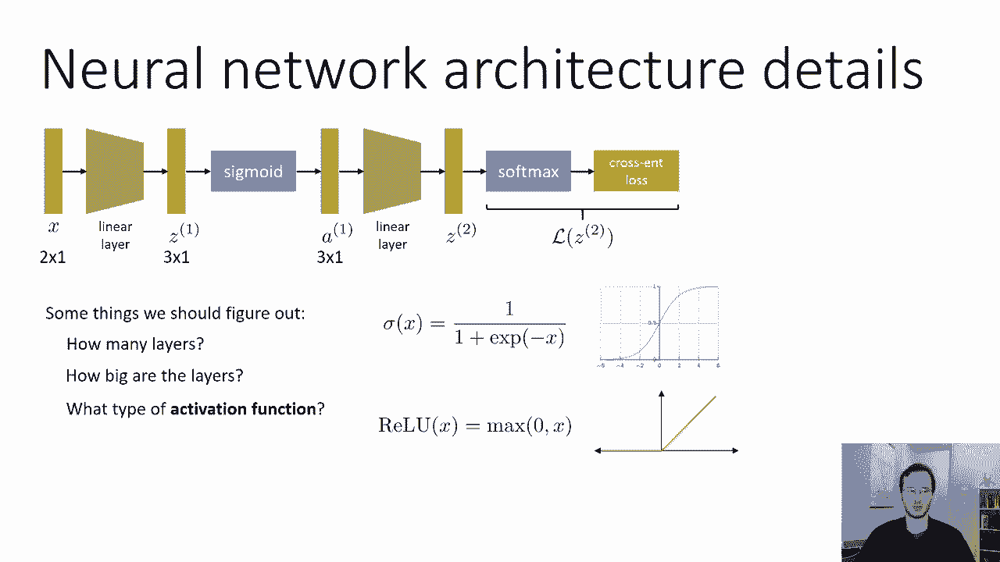

## 激活函数的选择 ⚙️

在训练神经网络之前，我们需要确定使用何种激活函数。在第一部分中，我们学习了Sigmoid函数，它适用于将每个特征视为二元逻辑回归问题。然而，Sigmoid并非唯一选择。

一个特别受欢迎的选择是**整流线性单元**，简称ReLU。ReLU函数的定义是取前一层激活值 `z` 与零之间的最大值。

**公式**：
```
a = max(0, z)
```

与S形弯曲的Sigmoid函数不同，ReLU在正区间是线性的，在负区间输出为零。起初，这看起来可能不够非线性，但实际上它在实践中表现优异。

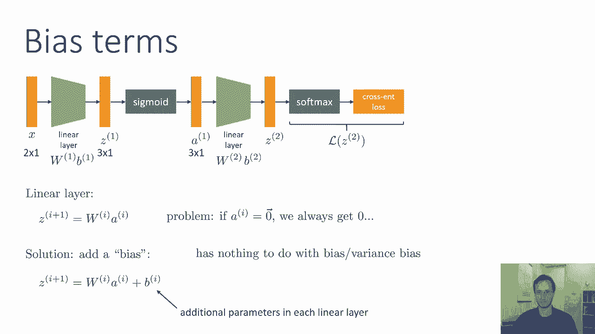

以下是ReLU的两个主要优点：
*   **计算高效**：对于大型神经网络，ReLU能显著提升计算速度。
*   **梯度简单**：其导数计算非常简单，这进一步提高了计算效率并易于使用。

因此，在实践中，ReLU是目前最流行的激活函数，尽管Sigmoid和Tanh函数有时也会被使用。

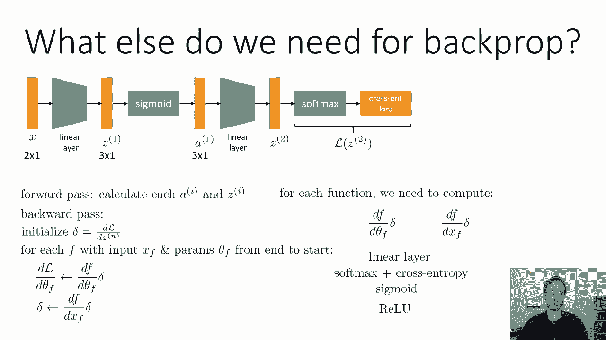

---

## 偏置项的重要性 ➕

接下来，我们必须讨论神经网络实际实现中的另一个关键细节：**偏置项**。

之前描述的线性层 `z = W * a` 存在一个主要限制：如果输入 `a` 是零向量，那么输出 `z` 也将永远是零。这意味着这样的神经网络无法表示某些函数，不是一个通用的函数逼近器。

解决方法是引入一个**偏置向量** `b`。这样，线性层变为：

**公式**：
```
z = W * a + b
```

这有时也被称为仿射层。拥有偏置项和非线性激活函数（如Sigmoid）的神经网络，只要层足够大，就可以以任意精度逼近任何函数。没有偏置项，则无法做到这一点。

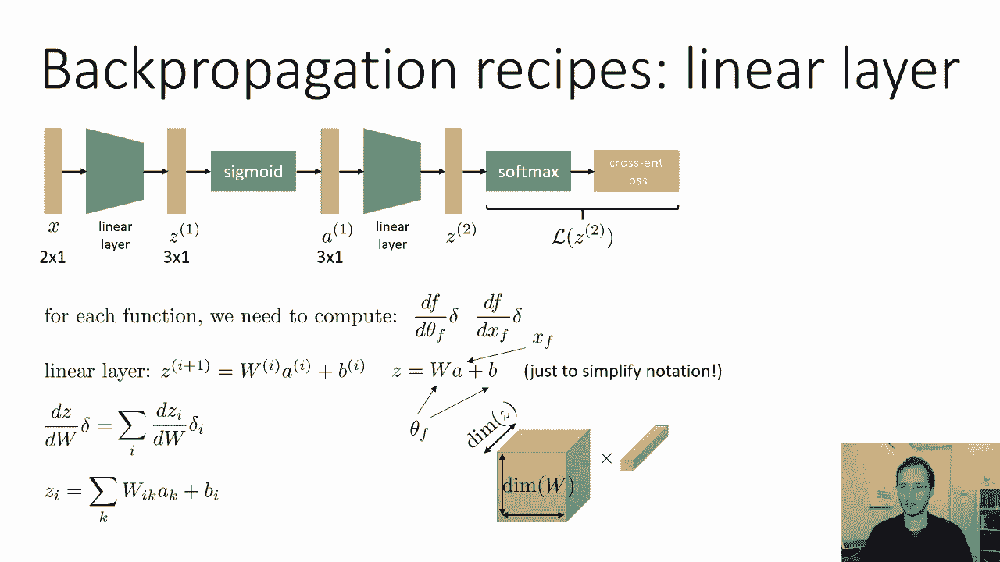

因此，神经网络的参数通常包括权重矩阵 `W1`、`W2` 和偏置向量 `b1`、`b2`。这几乎成为线性层的标准配置。

---

## 反向传播的实现 🔄

现在，我们已经具备了实现神经网络的大部分要素。为了实际实现反向传播，我们需要能够为网络中的每个函数 `f` 计算两个关键量：
1.  损失函数 `L` 对函数 `f` 的参数 `θ_f` 的梯度：`dL/dθ_f`
2.  损失函数 `L` 对函数 `f` 的输入 `x_f` 的梯度：`dL/dx_f`

我们不需要显式构造整个雅可比矩阵，只需实现一个函数来计算雅可比矩阵与上游梯度 `δ` 的乘积即可。我们需要为线性层、Softmax加交叉熵损失、Sigmoid、ReLU等函数完成此操作。其中，线性层的计算最为复杂，因为它包含可学习的参数。

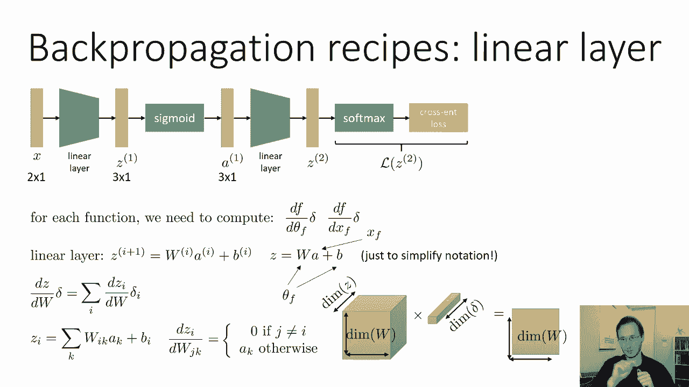

---

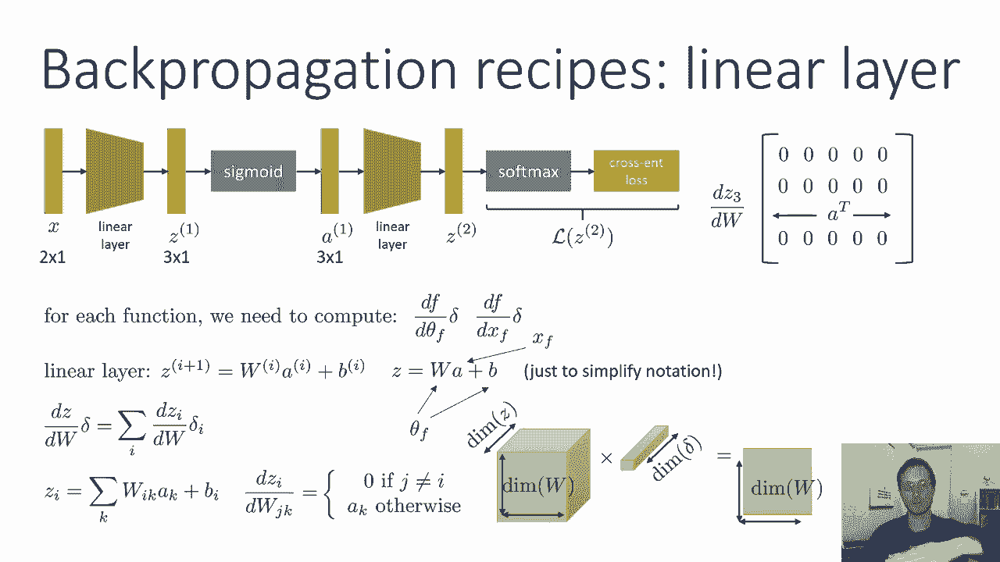

### 线性层的反向传播

线性层的表达式为：
**公式**：
```
z = W * a + b
```
其中，输入 `x_f = a`，参数 `θ_f` 包含 `W` 和 `b`。

我们需要计算三个梯度：
*   `dz/dW * δ` （关于权重）
*   `dz/db * δ` （关于偏置）
*   `dz/da * δ` （关于输入，用于向后传递）

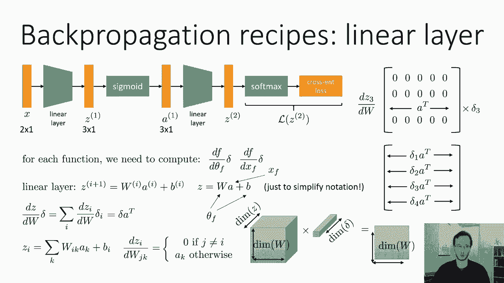

#### 1. 关于权重 `W` 的梯度

`W` 是一个矩阵，`dz/dW` 是一个三维张量。计算 `(dz/dW) * δ` 的最终结果是一个与 `W` 同维的矩阵。通过标量推导，可以得到一个简洁的表达式：

**公式**：
```
dL/dW = δ * a^T
```
这实际上是梯度 `δ` 与输入激活 `a` 的转置的外积。

#### 2. 关于偏置 `b` 的梯度

`dz/db` 是单位矩阵。因此：
**公式**：
```
dL/db = δ
```
计算非常简单。

#### 3. 关于输入 `a` 的梯度

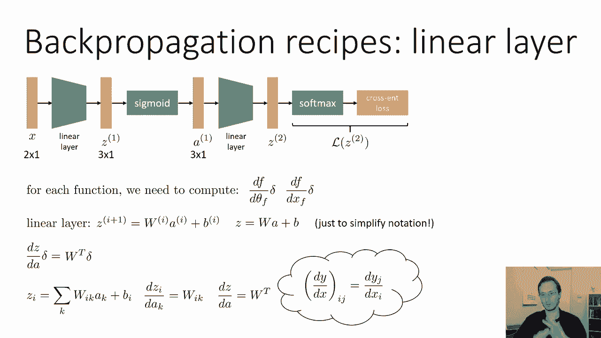

`dz/da` 实际上是权重矩阵 `W` 的转置。因此：
**公式**：
```
dL/da = W^T * δ
```
这个结果将作为上一层的上游梯度 `δ` 继续反向传播。

---

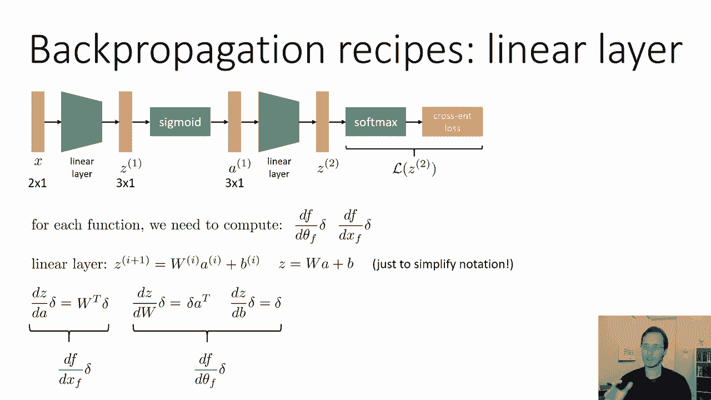

### Sigmoid 层的反向传播

Sigmoid函数是逐元素操作，其雅可比矩阵是对角矩阵。单元素的导数为：
**公式**：
```
dσ(z)/dz = σ(z) * (1 - σ(z))
```
因此，对于整个向量，`(dσ/dz) * δ` 的计算就是逐元素相乘：
**公式**：
```
δ_new = δ ⊙ (σ(z) * (1 - σ(z)))
```
其中 `⊙` 表示逐元素乘法。Sigmoid层没有参数，因此无需计算关于参数的梯度。

---

### ReLU 层的反向传播

ReLU函数也是逐元素操作，其导数更简单：
**公式**：
```
dReLU(z)/dz = 1 (如果 z > 0), 否则为 0
```
因此，反向传播时：
**公式**：
```
δ_new = δ ⊙ mask
```
其中 `mask` 是一个与 `z` 同维的向量，在 `z > 0` 的位置为1，否则为0。

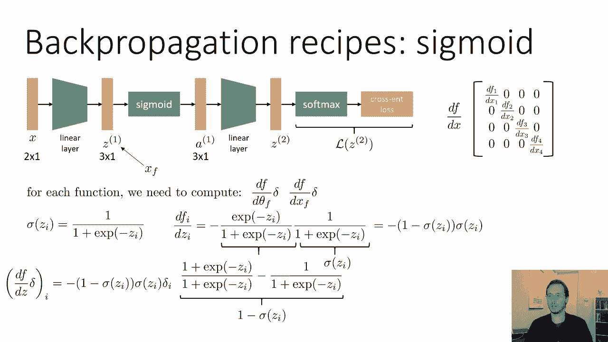

---

## 总结 🎯

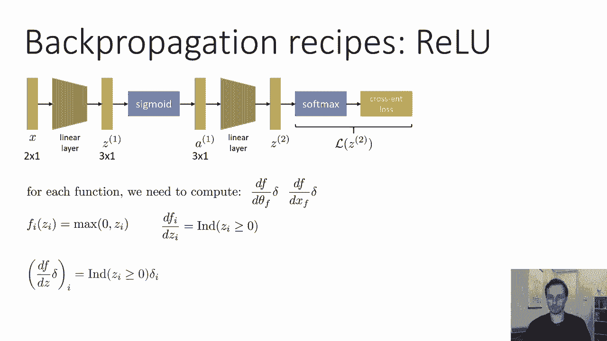

本节课中，我们一起学习了神经网络实现的核心细节。

*   我们首先讨论了**激活函数**的选择，指出**ReLU**因其计算高效和梯度简单的优点成为当前最流行的选择。
*   接着，我们强调了**偏置项**的重要性，它使神经网络成为通用的函数逼近器。
*   最后，我们深入剖析了**反向传播算法**的具体实现，推导了**线性层**、**Sigmoid**层和**ReLU**层的梯度计算公式。

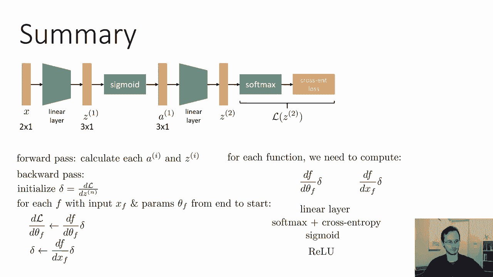

反向传播算法从最后一层开始，逐层向前计算损失对每层参数和输入的梯度。对于每个函数，我们都需要计算两个雅可比矩阵与上游梯度的乘积。掌握这些基础组件的梯度计算，是理解和构建复杂神经网络的关键。