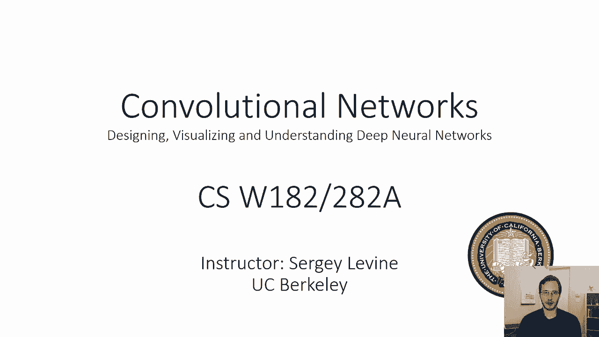
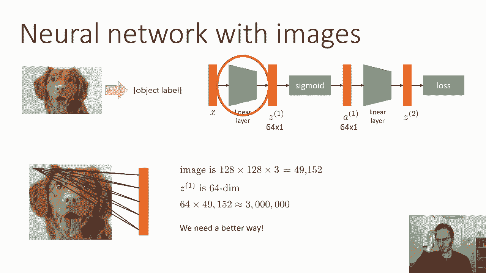
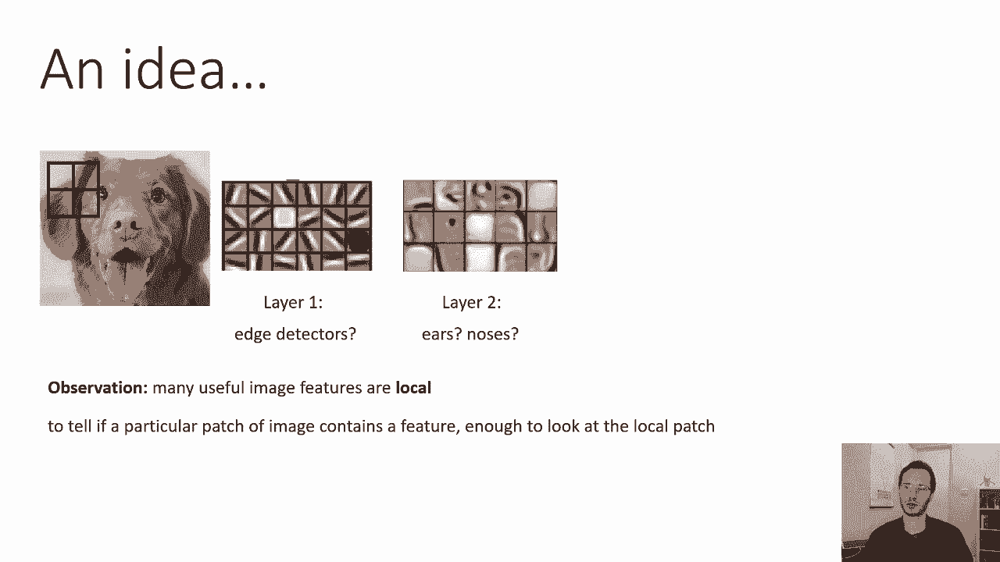
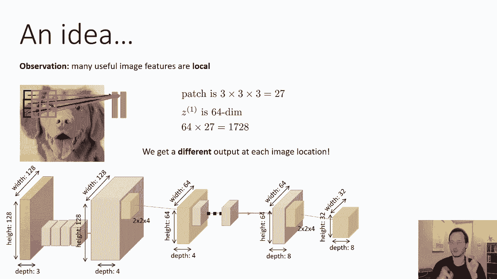
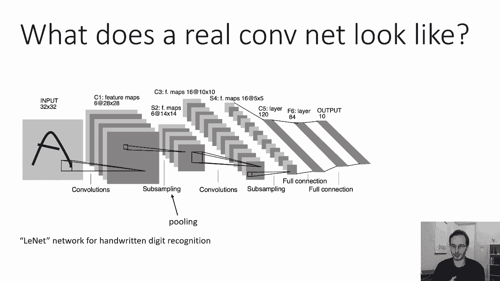

# 17：卷积神经网络 🖼️

在本节课中，我们将学习如何构建能够处理图像的神经网络，即**卷积神经网络**。我们将了解为何传统神经网络在处理图像时效率低下，并探索卷积操作如何利用图像的局部特性来大幅减少参数数量，同时提升模型对图像平移等变化的鲁棒性。

---

## 传统神经网络处理图像的挑战

上一节我们介绍了神经网络的基本结构。本节中我们来看看，如果直接将上一节课开发的神经网络应用于图像分类任务，会遇到哪些困难。

第一个线性层读取图像并产生第一个激活向量。该层中的权重数量等于第一个隐藏层的激活数 `Z` 乘以整个图像的像素值数量。

对于一个 `128 x 128 x 3` 的图像（128像素高，128像素宽，3个颜色通道），输入共有 `128 * 128 * 3 = 49,152` 个数字。如果第一个隐藏层有64个维度，那么第一个权重矩阵的参数总数将是 `64 * 49,152 ≈ 3.15 百万`。

这仅仅是第一层，且隐藏层维度很小。在实践中，我们可能需要更多的隐藏单元，导致参数量巨大。此外，还有一个更根本的问题：如果图像中的小狗向左或向右移动哪怕一个像素，对于这个网络来说，输入将变得完全不同，模型难以识别。

---

## 利用图像的局部特性

为了解决上述问题，我们观察到许多视觉特征本质上是**局部**的。

识别一张小狗的照片，我们可能先提取边缘，再识别局部区域如耳朵和鼻子。这些特征都是局部的。判断特定位置是否有边缘，只需要查看附近的像素；识别鼻子可能需要查看稍大的区域，但仍然是局部的。

神经科学研究也表明，哺乳动物大脑的视觉处理初期是局部的，存在空间相干特征探测器。因此，我们可以设计一种神经网络，先进行局部操作以减少参数量，待信息浓缩后再进行全局操作。

核心思想是：判断一个图像块是否包含某个特征，**仅查看局部图像块就足够了**。

---

## 卷积操作：局部特征提取

基于局部性的观察，我们尝试构建一个网络，一次只查看图像的一个小区域（补丁），并且**不同位置共享相同的特征检测器**。

假设我们使用一个 `3x3` 的补丁，并且图像有3个颜色通道，那么每个补丁有 `3 * 3 * 3 = 27` 个数值。如果我们想为此计算64个特征，参数数量仅为 `64 * 27 = 1,728`。这与之前全连接层的300多万参数相比，是巨大的减少。

这个小网络（也称为**过滤器**或**卷积核**）会被**滑动**应用到图像的每一个 `3x3` 补丁上（补丁之间通常重叠）。对于每个位置，它都会输出一个特征向量（例如长度为64）。这样，我们就把原始的 `128x128x3` 图像，转换成了一个 `128x128x64` 的**特征图**。

**公式描述**：对于一个二维卷积操作，输出特征图在位置 `(i, j)` 的值由以下公式计算：
`output[i, j] = sum( input[i+m, j+n] * filter[m, n] ) + bias`
其中求和遍历过滤器 `filter` 的所有位置 `(m, n)`。

在卷积操作之后，我们必须像在常规神经网络中一样，应用一个**非线性激活函数**（如ReLU）。

---

## 池化操作：下采样与特征强化

卷积减少了参数，但特征图的大小（分辨率）仍然和原始图像一样大，甚至深度（特征数量）更多。为了进一步缩减数据量并增强特征的鲁棒性，我们引入**池化**操作。

最常见的是**最大池化**。我们以 `2x2` 最大池化为例：将特征图划分为不重叠的 `2x2` 区域，对每个区域中的**每个通道**，取该区域内所有激活值的最大值。

**为什么最大池化有效？** 如果特征图中的激活值表示某个特征存在的程度，那么取一个区域内的最大值，就相当于判断“这个特征是否在该区域的任何地方出现”。这使网络对特征的小幅平移更加不敏感。

经过 `2x2` 最大池化后，特征图的高度和宽度会减半（例如从 `128x128` 变为 `64x64`），但深度（通道数）保持不变。

---

## 构建卷积神经网络架构

现在我们可以组合这些操作来构建一个完整的卷积神经网络。

一个典型的顺序是：
1.  **卷积层** + **非线性激活**
2.  **池化层**（通常是最大池化）
3.  重复步骤1和2多次
4.  将最后的特征图**展平**成一个一维向量
5.  连接一个或多个**全连接层**（就像传统的神经网络）进行最终分类或回归。

**关键参数**：
*   **过滤器大小**：如 `3x3`, `5x5`。通常使用奇数尺寸。
*   **过滤器数量**：决定输出特征图的深度。
*   **池化大小**：如 `2x2`, `4x4`。
*   **步长**：过滤器每次滑动的像素数。
*   **填充**：处理图像边缘时，通过在边缘补零来保持输出尺寸。

---

## 实例：LeNet-5网络

让我们看一个经典的卷积神经网络实例——**LeNet-5**，它用于手写数字识别。

1.  **输入**：`32x32` 的手写数字图像。
2.  **C1层**：卷积层，使用6个 `5x5` 的过滤器，得到6个 `28x28` 的特征图。（尺寸变小是因为卷积未使用填充）。
3.  **S2层**：池化层（子采样），`2x2` 最大池化，得到6个 `14x14` 的特征图。
4.  **C3层**：卷积层，使用16个 `5x5` 的过滤器，得到16个 `10x10` 的特征图。
5.  **S4层**：池化层，`2x2` 最大池化，得到16个 `5x5` 的特征图。
6.  **展平**：将16个 `5x5` 的特征图展平为 `16*5*5=400` 个神经元。
7.  **全连接层**：连接传统的全连接层进行最终10个数字类别的分类。

**重要提醒**：在每一个卷积层（C1, C3）之后，实际上都跟着一个非线性激活函数（如Sigmoid或ReLU），图中虽未明确画出，但这是架构的必需部分。

---

## 总结

本节课中我们一起学习了卷积神经网络的核心概念：
1.  **动机**：全连接网络处理图像参数量巨大且对平移敏感。
2.  **核心思想**：利用图像的**局部性**，使用共享权重的**过滤器**在图像上滑动进行特征提取。
3.  **卷积层**：执行局部特征检测，后接非线性激活函数。
4.  **池化层**（尤其是最大池化）：对特征图进行下采样，减少数据量并增强平移不变性。
5.  **典型架构**：交替堆叠卷积层、激活函数和池化层，最后连接全连接层。
6.  **实例**：通过LeNet-5网络了解了卷积神经网络的实际组成和工作流程。

通过这种设计，卷积神经网络能够以更少的参数、更高的效率有效地处理图像数据，并成为计算机视觉领域的基石。