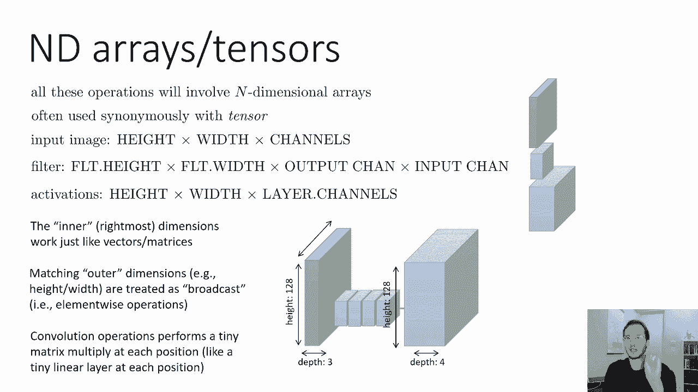
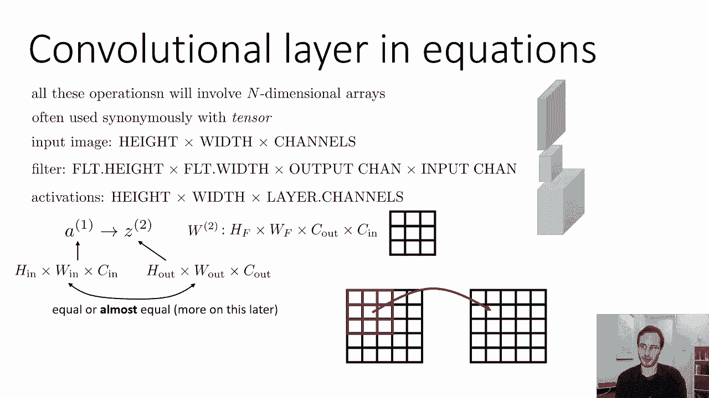
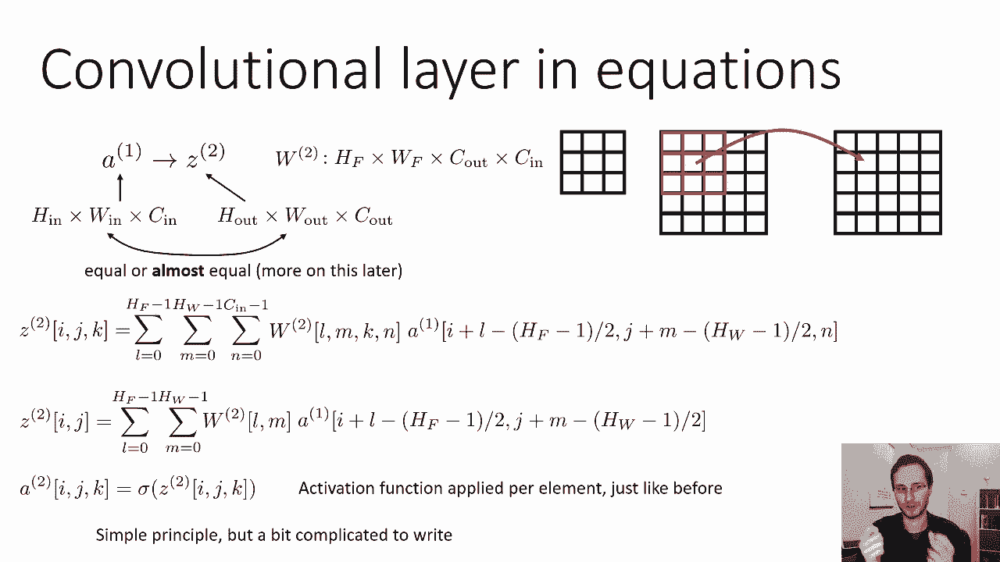
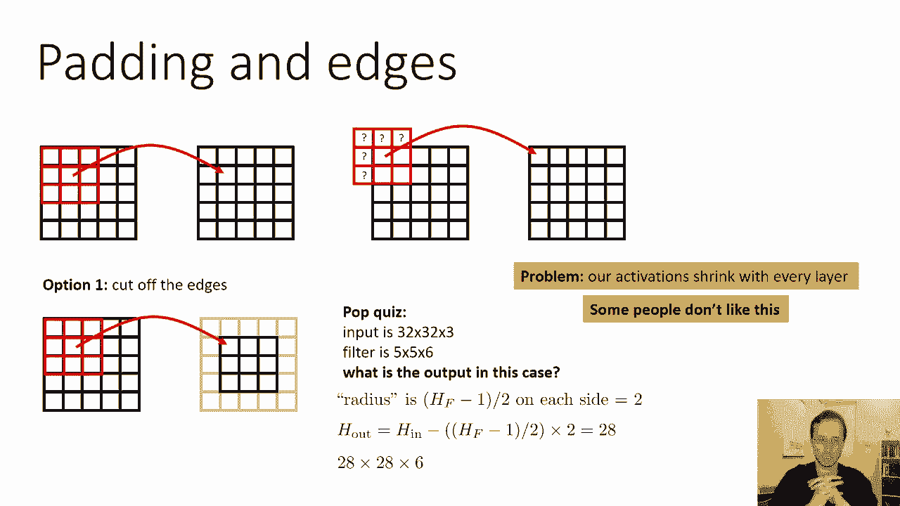
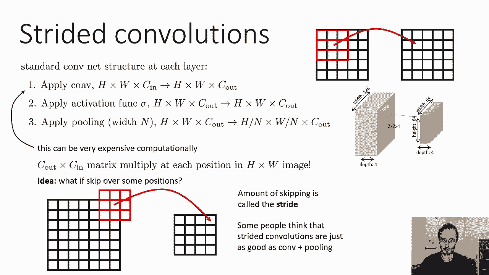

# 18：CS 182 讲座 6 - 第 2 部分 - 卷积网络 🧠

在本节课中，我们将学习卷积神经网络（CNN）的核心实现细节。我们将从卷积的基本思想回顾开始，然后深入探讨如何用数学公式和代码描述卷积操作，最后讨论填充（Padding）和步长（Stride）等关键概念。

---

## 卷积网络回顾 🔄


上一节我们介绍了卷积网络的基本思想。本节中，我们来看看如何具体实现这些操作。

卷积层是一种避免图像处理需要数百万参数的方法。它也能更有效地学习，因为在一个位置有用的特征，在图像的其他位置也可能有用。我们构建一个小型过滤器，并将其滑动到输入图像的每个位置。因此，每一层都是局部的，因为每个过滤器只关注一个小区域，但它会查看每一个这样的区域，从而在下一个激活图中产生一个不同的点。

每一层都会产生一个可以视为图像的三维体积，其宽度和高度大致与前一层相同，但通道数等于过滤器数量。然后，在每个位置独立地应用激活函数或非线性变换。

如果你想降低这些层的分辨率（例如，为了最终得到一个单一的输出），你需要进行池化操作。最常见的池化类型是最大池化，它对每一层的激活图进行采样，在每个不重叠的区域中取最大值。这使得网络对微小的平移变化具有鲁棒性。



最后，在通过卷积、非线性和池化将分辨率降低到足够小之后，你需要将其转换为一个全连接层。最终，你会得到一个足够小的三维体积，可以将其展平为一个向量，然后送入标准的全连接线性层。

这是卷积神经网络背后的基本思想。现在，让我们来谈谈如何真正实现这一切。

---

## 张量与多维数组 📦

我们需要使用n维数组，也称为张量。在深度学习中，我们通常将张量简化为n维数组。例如：
*   **输入图像** 是一个三维数组，维度为：`[高度, 宽度, 通道数]`。
*   **过滤器** 是一个四维数组，维度为：`[过滤器高度, 过滤器宽度, 输出通道数, 输入通道数]`。
*   **激活图** 通常也是三维的：`[高度, 宽度, 通道数]`。



这与标准神经网络不同，标准神经网络中的权重是二维矩阵，激活是一维向量。在卷积网络中，过滤器总是比激活图多一个维度。

对于卷积操作，高度和宽度维度并不直接匹配。卷积是在每个位置执行一个微小的矩阵乘法，就像每个位置的一个微小的线性层，然后将这个操作滑动到每个位置。

---

## 卷积运算的数学描述 🧮

让我们用公式来描述卷积运算。假设我们有一个输入激活图 `A1`，其维度为 `[H_in, W_in, C_in]`。我们想通过卷积得到 `Z2`，其维度为 `[H_out, W_out, C_out]`。权重 `W2` 是一个四维张量，维度为 `[H_f, W_f, C_out, C_in]`。

输出特征图 `Z2` 在位置 `(i, j, k)` 的值由以下公式计算：

**公式 1：逐元素求和形式**
```
Z2[i, j, k] = Σ_{l=0}^{H_f-1} Σ_{m=0}^{W_f-1} Σ_{n=0}^{C_in-1} ( W2[l, m, k, n] * A1[i + l - (H_f-1)/2, j + m - (W_f-1)/2, n] )
```
其中，`i + l - (H_f-1)/2` 和 `j + m - (W_f-1)/2` 确保了过滤器以 `(i, j)` 为中心进行滑动。这看起来有些复杂，主要是为了精确表达索引关系。

**公式 2：向量化形式（更清晰）**
我们也可以用矩阵向量乘法来表示每个位置的操作：
```
Z2[i, j] = Σ_{l=0}^{H_f-1} Σ_{m=0}^{W_f-1} ( W2[l, m] * A1[i + l - (H_f-1)/2, j + m - (W_f-1)/2] )
```
这里，`Z2[i, j]` 是一个长度为 `C_out` 的向量，`W2[l, m]` 是一个 `C_out x C_in` 的矩阵，`A1[...]` 是一个长度为 `C_in` 的向量。这个形式更清楚地表明，**卷积是在每个位置执行一个微小的线性层（矩阵乘法）**。

完成卷积得到 `Z2` 后，别忘了应用非线性激活函数（如 ReLU）来得到 `A2`。

在实践中，这些操作通常使用高效的矩阵乘法在 GPU 上实现，因为虽然参数不多，但计算量非常大（需要在每个位置重复计算）。



---

## 边界处理：填充（Padding）⚙️

到目前为止，我们巧妙地避开了边界问题。当过滤器滑动到图像边缘时，部分索引可能落在图像之外。有两种主要的处理方法：

**1. 有效卷积（Valid Convolution）**
这种方法直接剪掉边缘。不允许过滤器在索引无效（为负数或超出图像宽度）的位置进行计算。
*   **结果**：输出特征图的尺寸会缩小。
*   **尺寸计算**：如果输入尺寸为 `(H_in, W_in)`，过滤器尺寸为 `(H_f, W_f)`，则输出尺寸为：
    ```
    H_out = H_in - (H_f - 1)
    W_out = W_in - (W_f - 1)
    ```
    例如，`32x32` 的输入经过 `5x5` 的过滤器后，会得到 `28x28` 的输出。这种收缩在深层网络中可能很明显。

**2. 零填充（Zero Padding）**
这种方法在图像边界外围填充零，使得过滤器可以在每个位置（包括角落）进行计算。
*   **结果**：输出特征图的尺寸得以保持（如果填充足够）。
*   **常用策略**：为了保持输入输出尺寸相同，通常设置填充大小 `P = (F-1)/2`（当过滤器尺寸 `F` 为奇数时）。
*   **注意**：由于填充的是零，通常需要先将输入图像进行归一化（例如减去均值），使得零值代表平均强度，这样效果更好。

零填充因其概念简单且能保持空间维度而非常流行。

---

## 降低计算成本：步长（Stride）🏃



标准的卷积层结构计算成本可能很高，因为需要在输入图像的每个位置评估过滤器。为了降低计算量，可以引入**步长卷积**。

**步长（Stride）** 指的是过滤器每次滑动时跳过的像素数。默认步长为 1（每个位置都计算）。如果步长为 2，则过滤器每次移动 2 个像素，从而跳过中间的位置。

*   **与池化的区别**：池化是在每个位置计算后，再对区域取最大值。而步长卷积是直接跳过某些位置不计算。
*   **优点**：步长卷积能显著减少计算量，尤其是在网络早期激活图分辨率很大的时候。
*   **输出尺寸**：如果输入尺寸为 `(H_in, W_in)`，过滤器尺寸为 `(H_f, W_f)`，步长为 `S`，填充为 `P`，则输出尺寸为：
    ```
    H_out = floor( (H_in + 2P - H_f) / S ) + 1
    W_out = floor( (W_in + 2P - W_f) / S ) + 1
    ```


步长卷积是实现快速神经网络的一个重要工具。

---

## 总结 📝

本节课中，我们一起学习了卷积神经网络的核心实现细节：

1.  **核心数据结构**：我们使用张量（多维数组）来表示图像、过滤器和激活图。
2.  **卷积运算**：其本质是在输入特征图的每个位置，进行一个微小的矩阵乘法（线性变换），然后滑动到所有位置。我们用数学公式清晰地描述了这一过程。
3.  **边界处理**：我们探讨了处理图像边缘的两种方法——**有效卷积**（会缩小尺寸）和**零填充**（能保持尺寸）。
4.  **步长**：为了降低计算成本，我们引入了**步长卷积**，通过跳过一些位置来高效地降低特征图的空间分辨率。



理解这些实现细节，是构建和优化高效卷积神经网络的基础。下一部分，我们将可能看到这些概念在实际网络架构中的应用。