# 19：CS 182 - 第6讲 - 第3部分 - 卷积网络 🧠

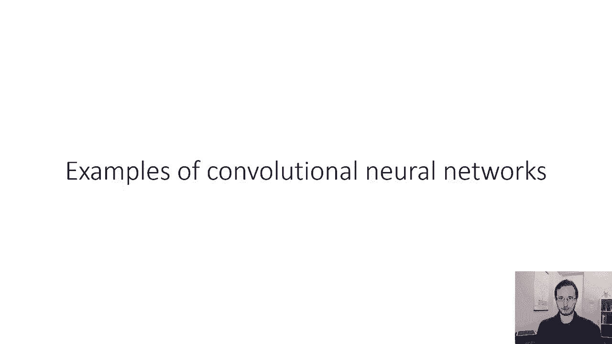

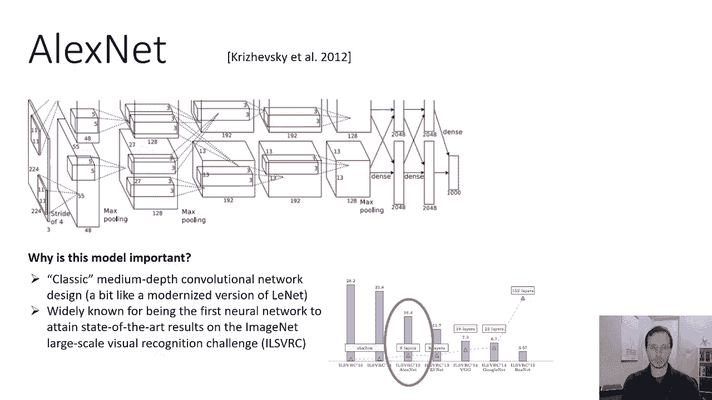

在本节课中，我们将通过几个实际的卷积神经网络（CNN）模型，来了解之前学习的组件是如何在计算机视觉任务中应用的。我们将重点分析三个里程碑式的网络：AlexNet、VGGNet 和 ResNet，理解它们的设计思路、演变过程以及为何能取得突破性成果。

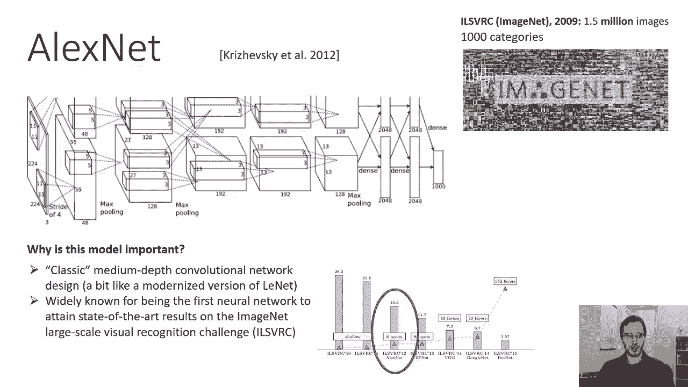

***

## AlexNet：深度学习的里程碑 🏆

上一节我们介绍了卷积网络的基本组件。本节中，我们来看看第一个在大型视觉识别挑战中取得突破性成果的网络——AlexNet。

AlexNet 由 Alex Krizhevsky 等人在 2012 年提出，并在 ImageNet 大规模视觉识别挑战赛（ILSVRC）中首次击败了传统的浅层学习方法。这是一个标志性的事件，因为它证明了深度神经网络在处理大规模、复杂视觉任务上的巨大潜力。

ImageNet 数据集之所以重要，原因如下：
*   **规模巨大**：训练集包含约150万张图像，远超当时仅包含数万张图像的数据集。
*   **任务困难**：包含1000个视觉类别，且图像内容复杂、背景杂乱，更贴近真实世界场景。

以下是 AlexNet 的核心架构设计：

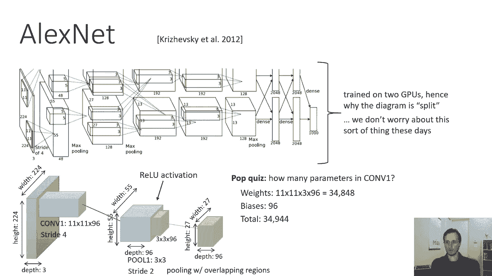

1.  **输入层**：接收 224x224x3 的 RGB 图像。
2.  **卷积层 1 (Conv1)**：使用 **96** 个 **11x11** 的过滤器，**步幅 (stride)** 为 **4**，无零填充。公式表示为：`Conv(11x11, stride=4, filters=96)`。此操作将图像尺寸大幅缩减。
3.  **池化层 1**：使用 **3x3** 的**最大池化**，步幅为 **2**，这是一个重叠池化。
4.  **局部响应归一化 (LRN)**：对局部区域激活值进行归一化（现已不常用）。
5.  **卷积层 2 (Conv2)**：使用 **256** 个 **5x5** 的过滤器，步幅为 **1**。
6.  **池化层 2**：再次使用 3x3 最大池化，步幅为 2。
7.  **后续卷积层 (Conv3, Conv4, Conv5)**：均使用 **3x3** 的过滤器，数量分别为 **384**, **384**, **256**，并采用**零填充**以保持空间尺寸。
8.  **池化层 3**：3x3 最大池化，步幅为 2，将特征图尺寸降至 6x6x256。
9.  **全连接层**：将 6x6x256 的特征图展平为长度为 9216 的向量，随后连接两个大小为 4096 的全连接层。
10. **输出层**：最后一个全连接层输出 1000 个值（对应1000个类别），后接 **Softmax** 函数产生分类概率。

AlexNet 在每个卷积层和全连接层（除输出层外）后都使用了 **ReLU** 激活函数。其设计模式清晰：随着网络加深，**空间分辨率降低**，**特征通道数增加**；最后通过全连接层整合信息并分类。虽然其层数（8层）在今天看来不算深，但它奠定了现代CNN的基础结构。

***

## VGGNet：模块化与深度化 🧱

AlexNet 展示了深度网络的有效性，但其设计较为特设化。接下来，我们看看如何通过模块化设计来构建更深的网络——VGGNet。

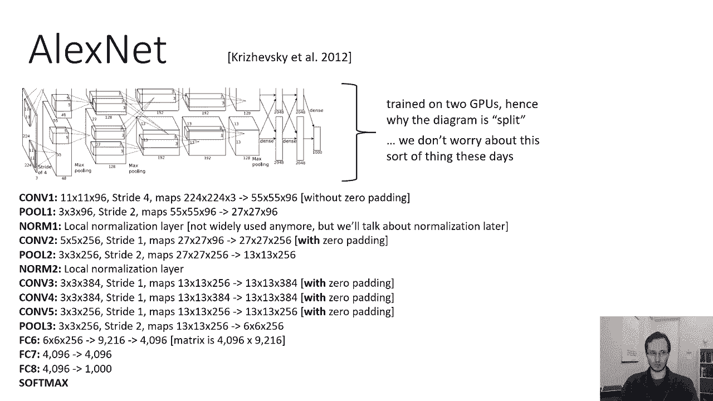

VGGNet 的核心思想是使用**小型卷积核（3x3）的堆叠**来替代大型卷积核，并通过重复简单的构建块来增加网络深度。这种设计带来了更好的非线性表达能力，且参数更少。

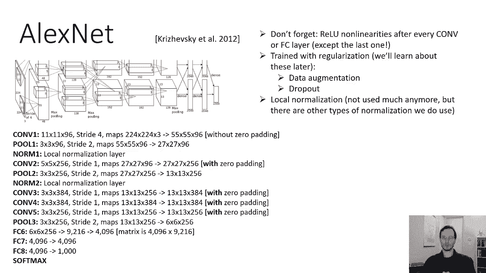

以下是 VGGNet（以 VGG-16 为例）的架构特点：

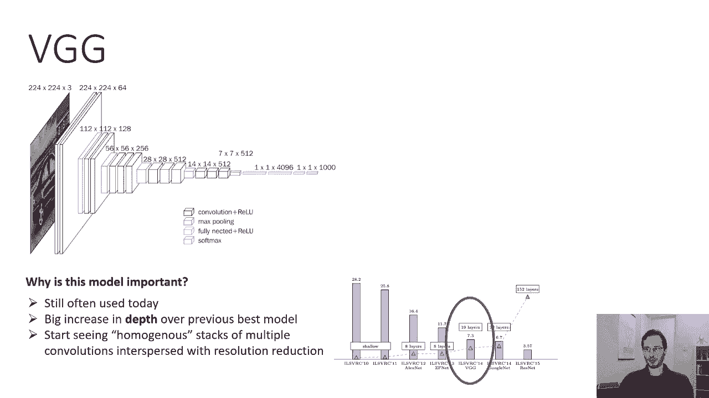

1.  **持续使用小卷积核**：全部使用 **3x3** 的卷积过滤器，步幅为 **1**，并配合 **1** 的零填充以保持分辨率。两个连续的 3x3 卷积层其感受野相当于一个 5x5 卷积层，但参数更少、非线性更强。
2.  **清晰的阶段划分**：网络由多个阶段组成，每个阶段结束后通过一个 **2x2、步幅为2的最大池化层**将空间尺寸减半。
3.  **通道数翻倍**：每当空间尺寸减半后，下一阶段的卷积通道数会翻倍（从64到128，到256，最后到512），以保留更多抽象信息。
4.  **深度全连接层**：在卷积阶段结束后，特征图被展平并送入3个全连接层（两个4096维，一个1000维）。

VGGNet 的模式非常规整：`[Conv-Conv-Pool] -> [Conv-Conv-Pool] -> [Conv-Conv-Conv-Pool] -> [Conv-Conv-Conv-Pool] -> [Conv-Conv-Conv-Pool] -> FC -> FC -> FC`。这种模块化、同质化的设计使得构建和修改深度网络变得更加容易。然而，其参数量主要集中在末端的全连接层，这在一定程度上是低效的。

***

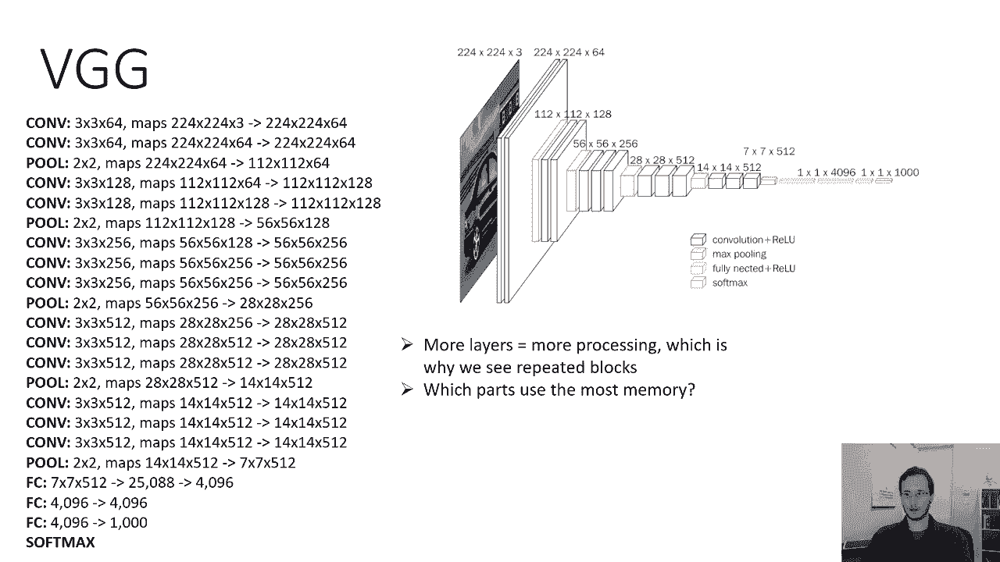

## ResNet：残差学习与极深网络 🚀

VGGNet 将网络深度推向了十几层，但人们发现，简单地堆叠更多层数，网络性能反而会下降。这被称为**退化问题**。ResNet 通过引入“残差块”巧妙地解决了这个问题，使得训练数百甚至上千层的网络成为可能。

ResNet 的核心创新是**残差连接**。在传统的层叠中，每一层直接学习一个目标映射 `H(x)`。而在残差块中，让层学习**残差映射** `F(x) = H(x) - x`，那么原始映射就变成了 `H(x) = F(x) + x`。

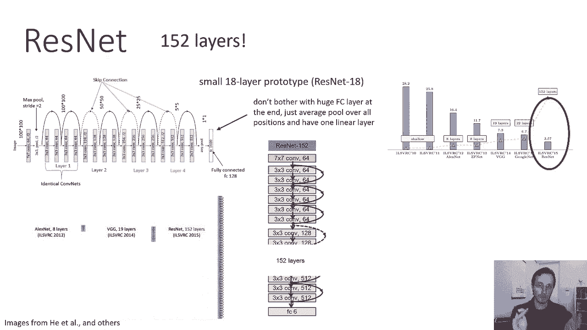

一个基本的残差块结构如下（以两个3x3卷积层为例）：
```python
# 伪代码表示一个残差块
def residual_block(x):
    identity = x  # 保留输入
    out = Conv3x3(x)
    out = ReLU(out)
    out = Conv3x3(out)
    out = out + identity  # 关键步骤：添加跳跃连接
    out = ReLU(out)
    return out
```
**跳跃连接**（即公式中的 `+ x`）使得梯度在反向传播时可以直接流过，缓解了梯度消失或爆炸问题，让超深网络的训练变得可行。

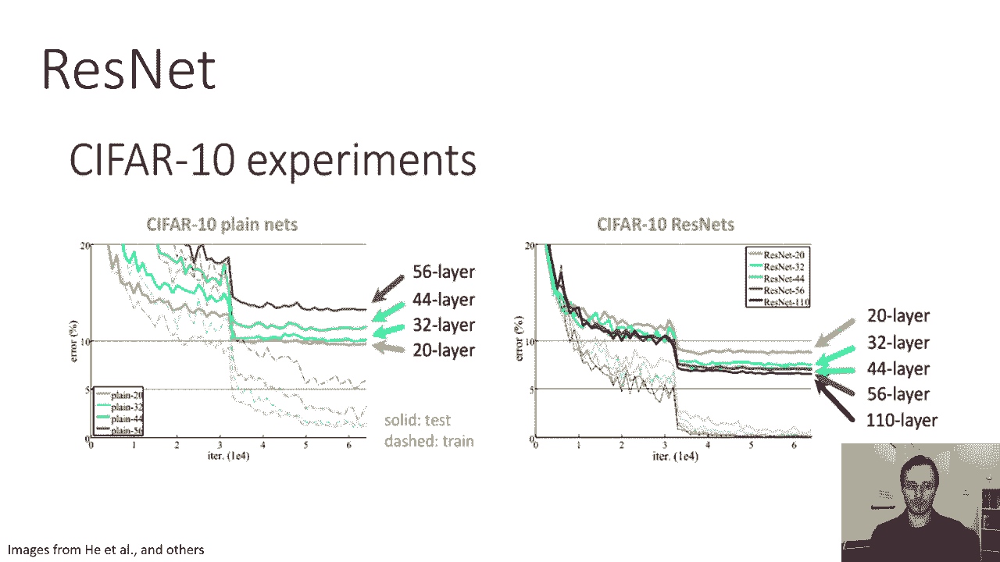

ResNet 的整体架构也做了优化：
*   **末端使用全局平均池化**：取代 VGG 中巨大的全连接层，ResNet 在最后一个卷积层后直接进行**全局平均池化**，将每个特征通道的所有值平均，得到一个固定长度的向量。这大幅减少了参数数量。
*   **下采样**：通过卷积步幅为2或专门的池化层来降低分辨率，同时通过1x1卷积来增加通道数。

通过堆叠大量残差块，ResNet 可以轻松扩展到152层（ResNet-152）甚至更深，并在 ImageNet 上取得了超越人类水平的识别精度。残差学习的思想已成为构建现代深度神经网络的基石。

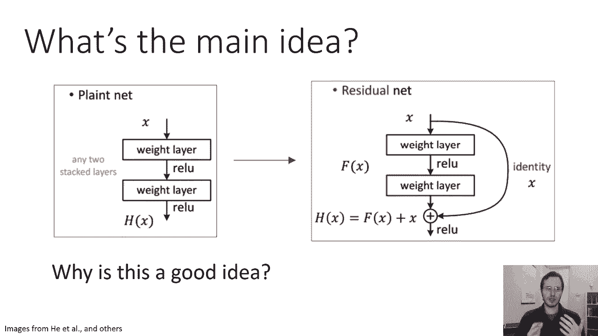

***

## 总结 📝

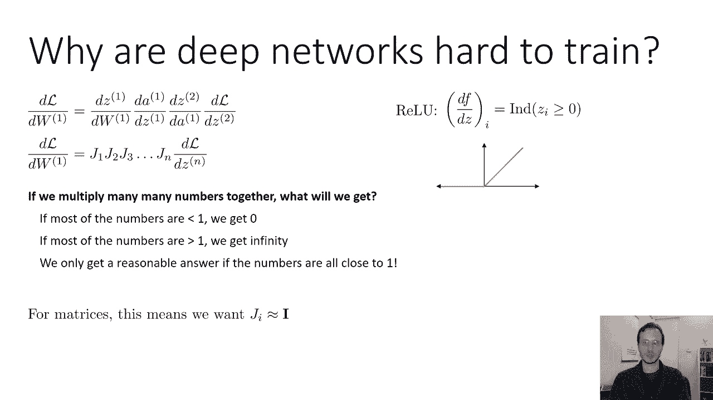

本节课我们一起学习了卷积神经网络发展史上的三个关键模型：
1.  **AlexNet**：证明了深度CNN在复杂视觉任务上的强大能力，奠定了现代CNN的基本结构。
2.  **VGGNet**：通过堆叠小卷积核和模块化设计，使网络构建更规整，深度进一步增加。
3.  **ResNet**：引入残差学习和跳跃连接，从根本上解决了超深网络的训练难题，将网络深度和性能提升到了新的高度。

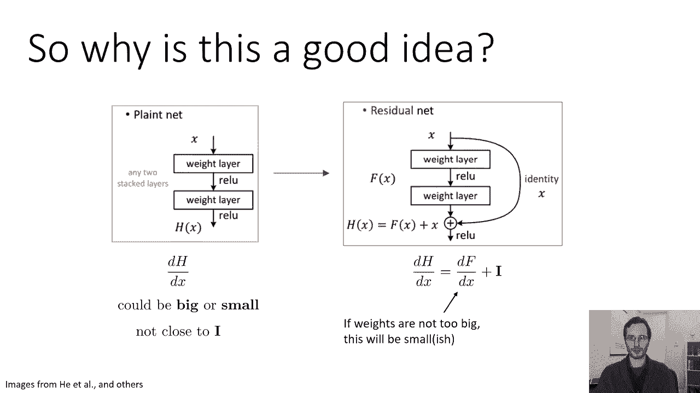

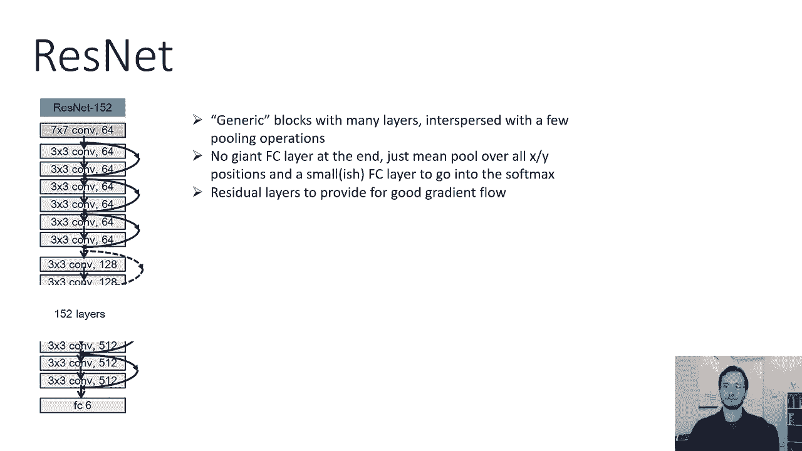

从 AlexNet 的特设化设计，到 VGGNet 的模块化，再到 ResNet 的残差连接，我们看到网络架构设计越来越注重**梯度流动的稳定性**和**参数计算的效率**。这些核心思想至今仍在深刻地影响着深度学习模型的设计。