# 20：CS 182 第七讲 第一部分 - 初始化与批归一化 🧠

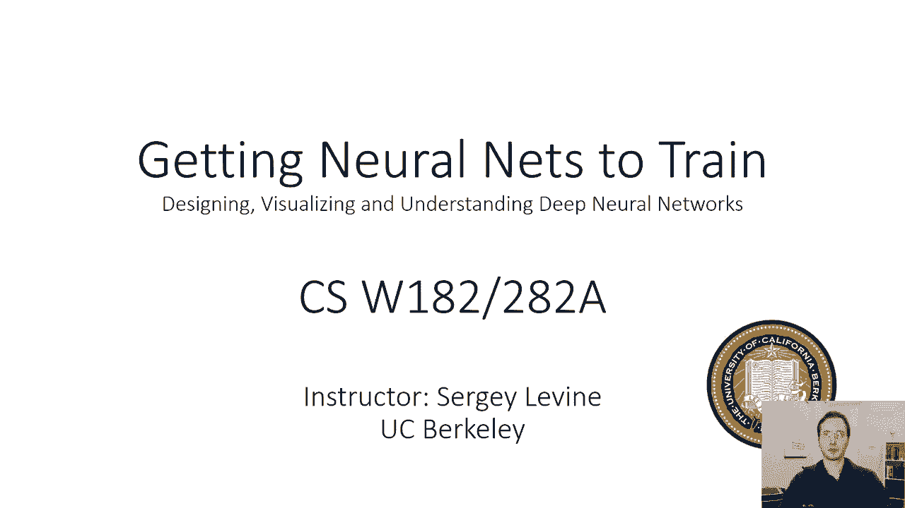

在本节课中，我们将学习如何让神经网络更好地训练。我们将讨论输入/输出标准化、激活归一化、批归一化技术、权重初始化方法，以及如何获得表现良好的梯度。这些技巧对于成功训练神经网络至关重要。

---

## 为什么训练神经网络会遇到困难？🤔

上一节我们介绍了神经网络训练的基本流程。本节中我们来看看为什么即使正确实现了所有步骤，训练过程也可能不顺利。

神经网络优化过程本身存在问题，其优化空间复杂且充满挑战。神经网络训练需要大量技巧，了解这些技巧与理解理论细节同等重要。

---

## 输入标准化：解决尺度差异问题 📏

如果我们的输入数据在不同维度上具有非常不同的尺度，这会给神经网络优化带来巨大困难。让我们通过一个例子来理解这个问题。

假设我们有一个二维输入的神经网络。在某些情况下，第一个维度的数值范围和大小可能远大于第二个维度。这种尺度差异在现实数据中很常见，例如将距离（公里）和速度（米/秒）组合在一起时。

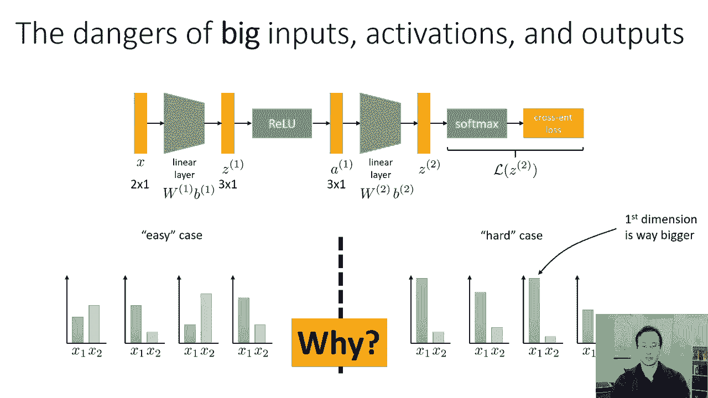

### 尺度差异如何影响梯度？

为了理解为什么尺度差异会造成困难，让我们考虑第一线性层权重 `W1` 的梯度。根据链式法则和反向传播，损失 `L` 对 `W1` 的导数可以表示为：

`dL/dW1 = δ * x^T`

其中 `δ` 是反向传播的向量，`x` 是该层的输入。当 `x` 的不同维度尺度差异很大时，导数 `δ * x^T` 中不同项的大小也会差异巨大。这意味着权重矩阵不同维度的梯度大小不一。

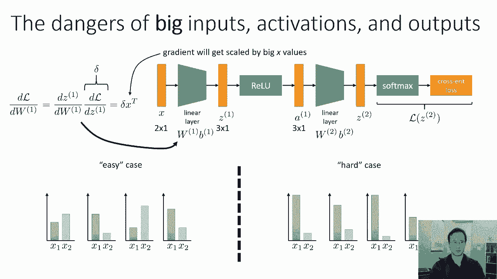

*   **在简单情况下**：`x` 各维度尺度相近，梯度方向大致指向局部最优。
*   **在困难情况下**：梯度方向可能并不指向最优解，导致优化过程需要很多小步，效率低下。

因此，我们希望输入中的所有条目都大致处于相同的比例。

### 何时需要标准化？

*   **图像数据**：像素值通常在固定范围（如0-1或0-255），尺度一致，通常无需担心。
*   **离散输入（如NLP）**：使用 one-hot 向量，值为0或1，尺度一致，不是问题。
*   **实值输入**：当不同特征（如温度、湿度百分比）尺度差异巨大时，标准化至关重要。

### 如何进行标准化？

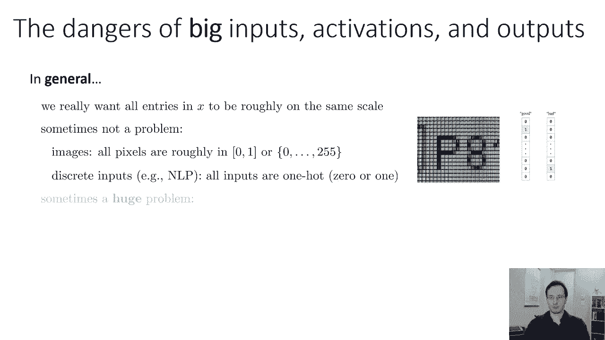

标准化（或归一化）是指将输入数据转换为均值为0、标准差为1的分布。这种转换不改变数据包含的信息。

对于数据集中的每个数据点 `x_i`，我们进行如下转换：

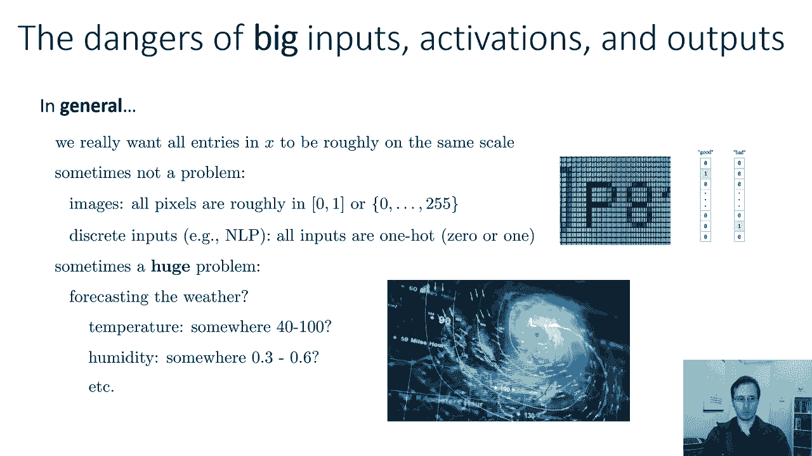

`x_i' = (x_i - E[x]) / sqrt(E[(x_i - E[x])^2])`

其中 `E[x]` 是数据集中 `x` 的均值，分母是 `x` 的标准差。此操作按维度独立进行。

标准化可以防止因尺度差异导致的梯度条件恶劣问题，并使网络平等对待所有输入特征。对于回归问题，对输出进行标准化也是一个好主意。

---

## 批归一化：标准化中间层激活 🔄

上一节我们讨论了输入标准化。本节中我们来看看如何将标准化的思想应用到网络中间层的激活上。

即使输入尺度一致，网络中间层的激活也可能出现尺度差异。我们可以尝试标准化这些激活。但问题是，激活的均值和标准差会在训练过程中随着网络参数的变化而改变。

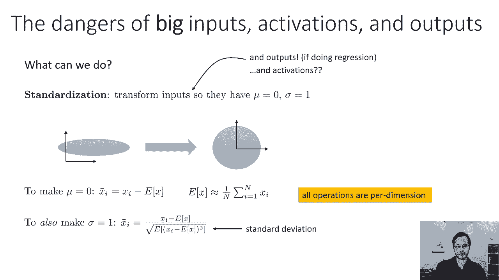

### 批归一化的基本思想

基本思想很直接：在每一层（例如线性变换和ReLU之后）计算该层激活的均值和标准差，然后用它们来标准化激活。

假设第一层激活为 `z = ReLU(W1 * x + b1)`。我们计算该批次数据激活的均值 `μ` 和标准差 `σ`，然后对每个数据点的激活进行转换：

`z'_i = (z_i - μ) / σ`

### 从“朴素版本”到“批”归一化

“朴素版本”的问题是，每次网络参数更新后，都需要在整个数据集上重新计算 `μ` 和 `σ`，这非常昂贵。

**批归一化**的关键改进是：**仅使用当前小批量（mini-batch）的数据来估计 `μ` 和 `σ`**。这就是它名称的由来。

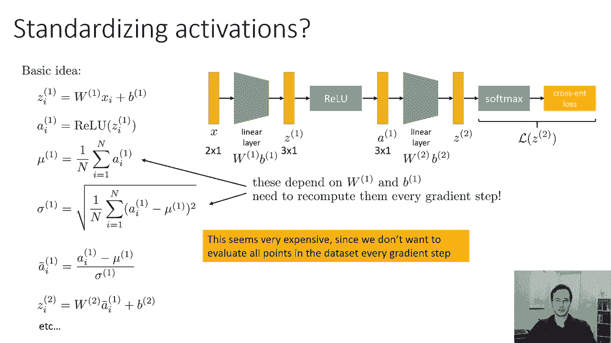

假设一个批次有 `B` 个样本，索引为 `i1` 到 `iB`，则批次均值 `μ_B` 和批次标准差 `σ_B` 计算如下：

`μ_B = (1/B) * Σ_{k=i1}^{iB} z_k`
`σ_B = sqrt((1/B) * Σ_{k=i1}^{iB} (z_k - μ_B)^2)`

### 批归一化层的完整形式

在实际实现中，批归一化层通常还会引入两个可学习的参数：缩放参数 `γ` 和偏移参数 `β`。标准化后的输出会经过一个仿射变换：

`output = γ * z' + β`

这样，网络可以学习是否以及如何恢复原始的激活分布。`γ` 和 `β` 是与激活维度相同的向量。

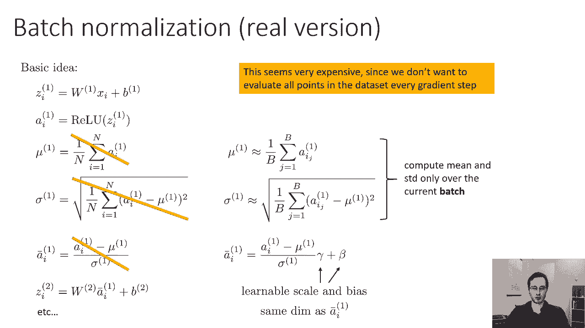

简而言之，批归一化层接收输入激活，计算当前批次的 `μ` 和 `σ` 进行标准化，然后应用可学习的缩放和偏移。

### 如何训练带有批归一化的网络？

像训练普通网络一样使用反向传播。你需要为批归一化层计算关于其输入 `z` 以及参数 `γ` 和 `β` 的梯度。这些计算涉及一些微积分，但原理是直接的。

---

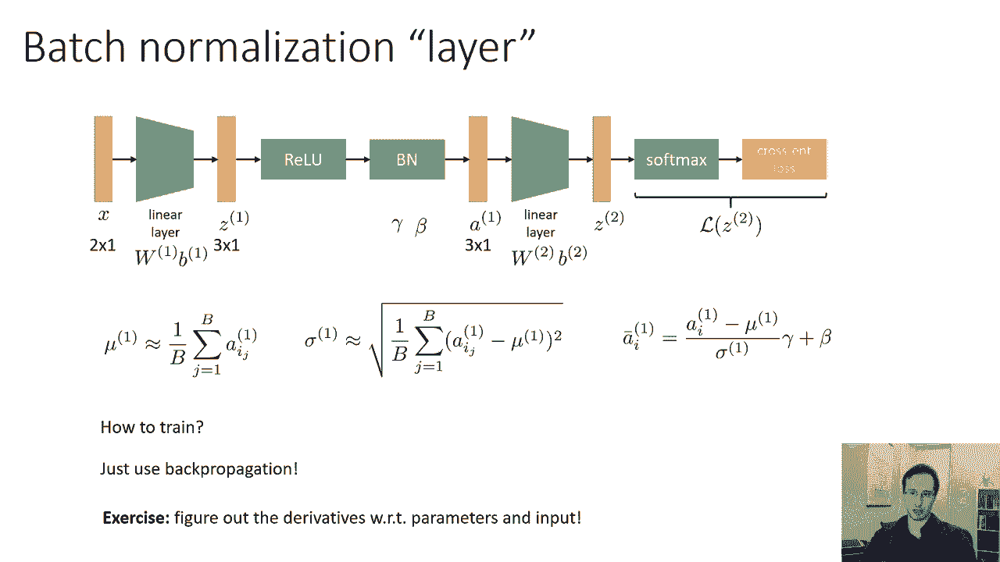

## 批归一化的实践细节与放置位置 ⚙️

现在我们已经理解了批归一化的原理。本节中我们来看看在实践中如何使用它，特别是应该把它放在网络的什么位置。

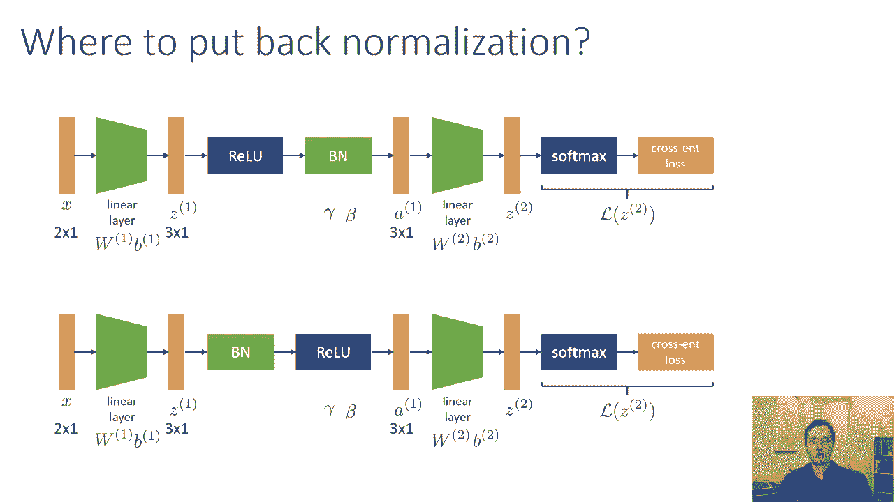

### 批归一化层应该放在哪里？

通常，我们在每个线性层（或卷积层）之后都放置一个批归一化层。但一个关键的选择是：**放在非线性激活函数之前还是之后？**

以下是两种常见选择：
1.  **线性层 -> 非线性激活（如ReLU）-> 批归一化**
2.  **线性层 -> 批归一化 -> 非线性激活（如ReLU）**

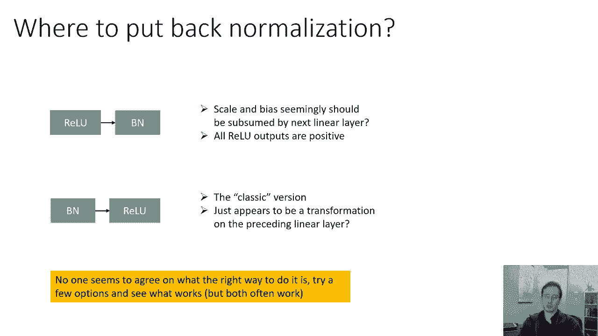

原版批归一化论文建议放在非线性激活之前。但两种方式在实践中都有使用且效果良好。最好的方法是进行实验，看看哪种在你的任务上表现更好。

### 使用批归一化的好处

以下是使用批归一化的一些主要优势：
*   **允许使用更大的学习率**：因为它改善了梯度的条件数，使优化景观更平滑。
*   **加速训练**：模型通常能更快地达到更高的精度。
*   **减少对某些正则化技术的依赖**：例如，使用批归一化后，可能不需要那么强的 Dropout。

### 训练与部署时的注意事项

*   **训练时**：使用当前小批次的统计数据 `μ_B` 和 `σ_B`。
*   **部署/测试时**：我们不再有“批次”。标准的做法是：在训练完成后，**在整个训练集上计算每个批归一化层固定的 `μ` 和 `σ`**（通常是运行均值和方差），并在测试时使用这些固定值。
*   **参数折叠**：在部署时，理论上可以将批归一化层（及其固定的 `μ`, `σ`, `γ`, `β`）的参数“折叠”进前一个线性层，从而移除批归一化层，简化网络结构。

---

## 总结 📝

本节课中我们一起学习了改善神经网络训练效果的关键技巧。

我们首先探讨了**输入标准化**的重要性，它解决了不同特征尺度差异导致的梯度问题。接着，我们深入学习了**批归一化**这一强大技术，它通过标准化每一层的激活，使中间层的梯度也保持良好的行为，从而允许使用更大的学习率、加速训练并提升模型稳定性。我们还讨论了批归一化的不同放置位置及其在训练与部署时的实践细节。

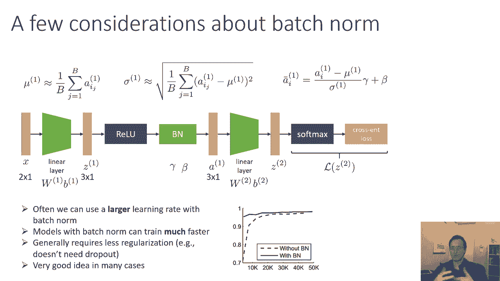

掌握这些初始化与归一化技术，是成功训练深度神经网络的重要基础。在接下来的课程中，我们将继续探讨其他优化技巧和最佳实践。