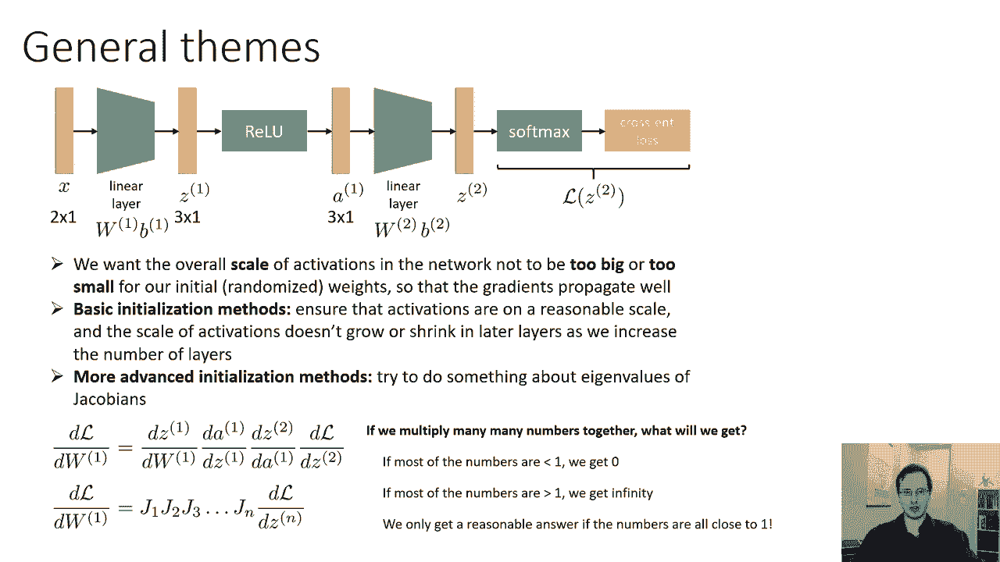
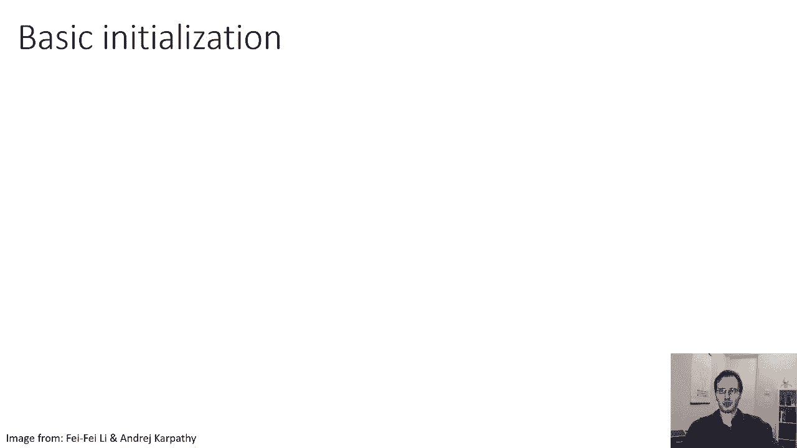
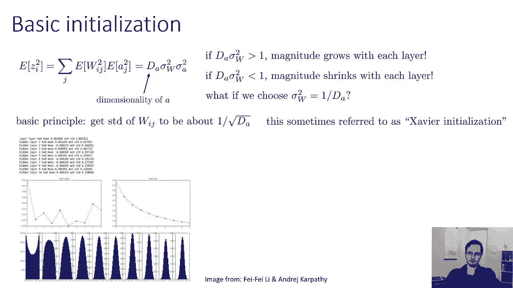
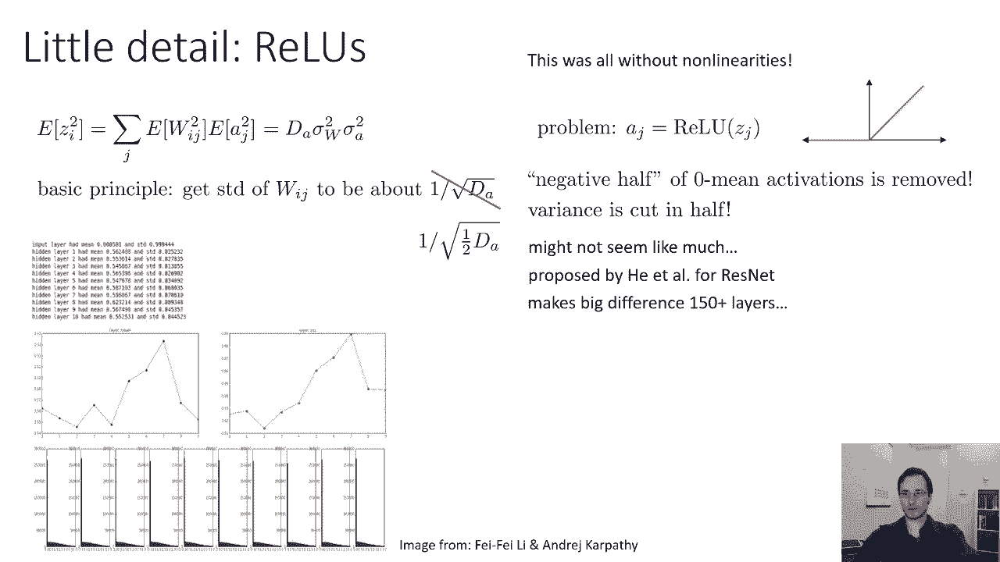
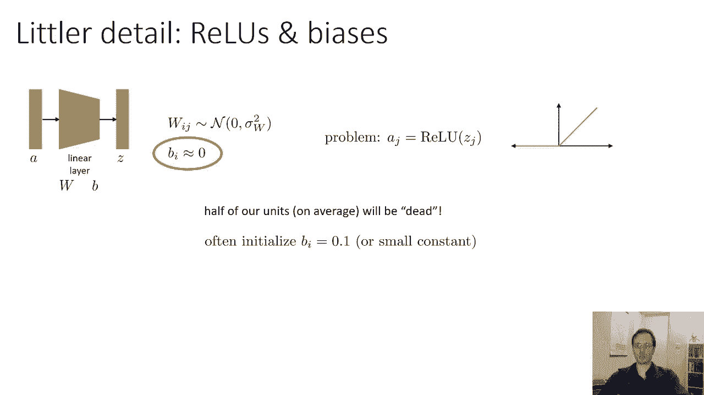
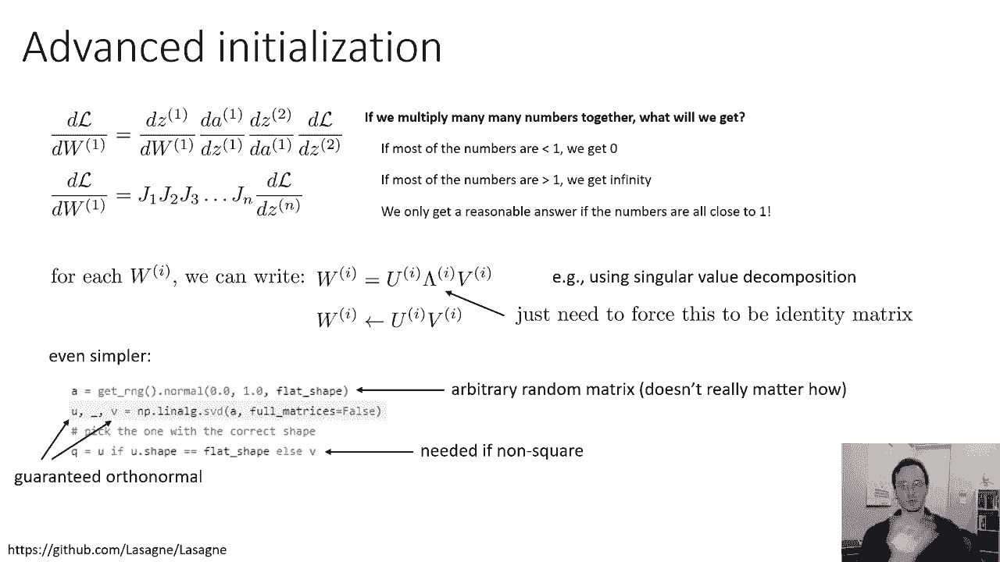
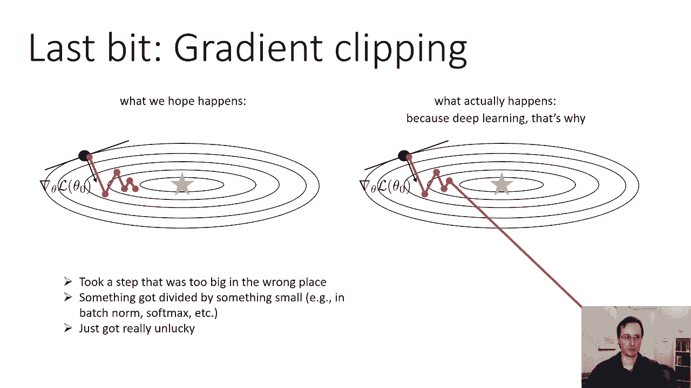
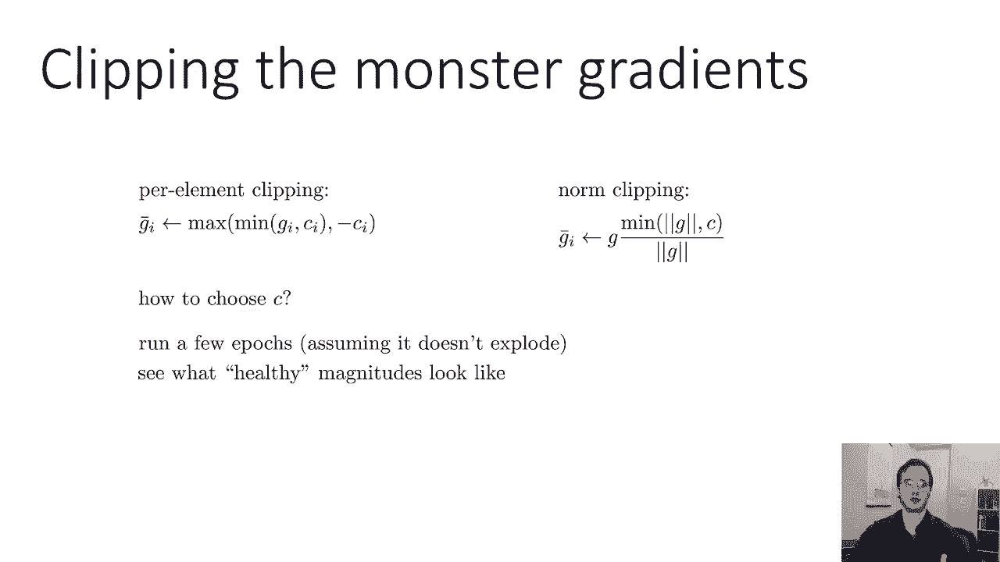

# 21：CS 182 第7讲 第2部分 - 初始化与批归一化 🧠


在本节课中，我们将学习神经网络训练中的两个关键主题：权重初始化和批归一化。我们将首先探讨为什么初始化至关重要，并介绍几种确保网络激活值规模稳定的方法。接着，我们会讨论更高级的初始化技术，并了解当训练出现问题时，如何通过梯度裁剪进行补救。

---

## 权重初始化的重要性

上一节我们讨论了网络架构，本节中我们来看看如何为网络设置合适的初始权重。选择初始化方案的主要目标是确保网络中的梯度行为合理，这可以通过确保各层激活值保持大致相同的规模来实现。

我们希望网络中激活的整体规模不会随着层数的增加而变得过大或过小。因此，我们将讨论一些基本的初始化方法，以确保激活值处于合理范围，并且其规模不会随网络加深而增长或收缩。



### 梯度与雅可比矩阵



提醒一下，我们可以将某一层权重关于损失的导数，表示为该层与损失之间所有函数雅可比矩阵的乘积。具体公式如下：

\[
\frac{\partial L}{\partial W^{(l)}} = J_1 \cdot J_2 \cdot ... \cdot J_k
\]

这里我们并不太关心每个雅可比矩阵 \( J \) 的具体形式，可以将其视为一系列矩阵相乘。正如我们之前讨论的，如果将许多小于1的数相乘，其乘积会趋近于零；如果大于1，则会趋向无穷大。只有当它们都接近1时，乘积才会保持在一个合理的范围内。对于矩阵而言，这意味着其特征值应接近1。

因此，更高级的初始化方法会尝试初始化网络，使得这些雅可比矩阵的特征值接近1。但首先，我们将讨论基本的初始化方法，这些方法仅试图保持各层激活值的规模大致相同。在大多数情况下，这已经足够好了。

---

## 简单的初始化及其问题

如果我们有一个“精灵”能直接为我们初始化到全局最优解，那将是最理想的情况。但我们并不知道最优解在哪里。因此，在没有“精灵”的情况下，我们不会试图将权重初始化为接近某个好的解，而是尝试在初始化时，让神经网络的梯度质量较高，这意味着梯度实际上指向一个优化的方向。

一个非常简单的选择是将权重初始化为小的随机数，例如从均值为0、标准差为0.01的正态分布中采样。您**不**应将所有权重初始化为0，因为那样所有梯度都将为零。

对于小型网络，这种小随机数初始化确实有效。但随着网络加深，这会很快导致问题。想象一下，您的输入大致在尺度1上，将其乘以标准差为0.01的权重，您会得到尺度约为0.01的数字。经过非线性激活函数后，可能保持相似尺度。进入下一层时，再次乘以约0.01的权重，最终得到尺度约为0.0001的数字。如此，您的激活值将呈指数级下降。

下图实验展示了一个10层网络的初始化情况：
*   **蓝色曲线**：每层激活值的平均值。虽然平均值很快归零（这没问题），但...
*   **红色曲线**：每层激活值的标准差。输入的标准差约为1，但随着层数增加，标准差急剧下降至接近零。
*   **底部直方图**：每层的激活值分布。第一层具有健康的分布，但到了第四、五层之后，激活值几乎没有变化，基本都变成了零。


为什么这很糟糕？回顾线性层的梯度公式：`梯度 = δ * (该层激活值的转置)`。如果激活值为零，那么梯度也为零。梯度为零意味着无法进行任何学习更新。这对应于优化地形中的一个巨大“高原”，是我们最不希望网络初始化的地方。

---

## 设计更好的初始化方案

下面我们考虑如何设计一个更好的初始化方案。假设我们将初始化网络中的某个线性层权重 \( W \)。我们将权重矩阵中的每个元素 \( W_{i,j} \) 初始化为均值为0、方差为 \( \sigma_w^2 \) 的高斯分布。我们的目标是找出应该将 \( \sigma_w \) 设置为何值。

我们可以问的一个问题是：给定 \( \sigma_w \) 的值，经过这个线性层后，输出 \( z \) 的大小大致是多少？\( z \) 中第 \( i \) 项的公式为：

\[
z_i = \sum_j W_{i,j} \cdot a_j + b_i
\]

我们假设偏置 \( b \) 初始化为0（这通常没问题），并且前一层的激活值 \( a_j \) 本身大致服从均值为0、方差为 \( \sigma_a^2 \) 的高斯分布（这是一个合理的粗略模型，尤其当输入被标准化后）。

如果均值都为零，那么 \( z \) 的大小基本上是其标准差的平方根。计算 \( z_i \) 的方差（因为均值为0，方差即 \( E[z_i^2] \)）：

\[
\text{Var}(z_i) = \sum_j \text{Var}(W_{i,j}) \cdot \text{Var}(a_j) = d_a \cdot \sigma_w^2 \cdot \sigma_a^2
\]

其中 \( d_a \) 是输入向量的维度（即对 \( j \) 求和的数量）。因此，\( z \) 中每个元素的方差大致为 \( d_a \sigma_w^2 \sigma_a^2 \)。

由此，我们得到了关键洞察：如果前一层的激活方差为 \( \sigma_a^2 \)，那么下一层的激活方差将为 \( d_a \sigma_w^2 \sigma_a^2 \)。因此：
*   如果 \( d_a \sigma_w^2 > 1 \)，幅度将随每一层增加。
*   如果 \( d_a \sigma_w^2 < 1 \)，幅度将随每一层收缩。


为了让激活的幅度在层与层之间保持不变，我们需要确保 \( d_a \sigma_w^2 \approx 1 \)。我们可以做的一件事是选择权重的方差 \( \sigma_w^2 = 1 / d_a \)，或者说，选择权重的标准差为 \( 1 / \sqrt{d_a} \)。


---

## Xavier 初始化



这个基本原则——将权重的标准差设为 \( 1 / \sqrt{\text{输入维度}} \)——有时被称为 **Xavier 初始化**。它效果很好。

使用 Xavier 初始化后，之前实验中标准差下降的速度大大减缓。对于一个中等深度的网络，这实际上会工作得很好，并且在实践中被广泛使用。

但为什么标准差仍在缓慢下降？我们遗漏了一个小细节：非线性激活函数。

---

## 修正非线性效应：以 ReLU 为例

我们忘记了在线性层之后会应用非线性函数，而非线性函数会改变值的尺度。深层网络几乎总是使用 **ReLU**，因为它比 Sigmoid 表现好得多。

问题是，ReLU 会将许多激活值置零。如果激活值真的呈均值为0的正态分布（通常不是，但作为粗略模型），那么大约一半会是负数，从而被 ReLU 置零。这将减少方差。



如果 \( z \) 的原始方差是 \( \sigma_z^2 \)，将一半数字置零后，总体方差会降低（大约减半）。虽然“减半”看起来不多，但在非常深的网络中（如150层），它会累积起来产生显著影响。

解决方法很简单：认识到大约一半的数字会被归零，我们可以简单地将方差放大两倍，或者等效地将标准差放大 \( \sqrt{2} \) 倍。这意味着不是将标准差设为 \( 1 / \sqrt{d_a} \)，而是设为 \( \sqrt{2 / d_a} \)。

这个“一半因子”实际上是在 ResNet 论文中提出的。对于残差网络，它最终产生了相当大的影响。使用这个修正因子后，各层的标准差基本上能保持在同一范围内。



### 关于偏置初始化的细节

之前我们说将偏置向量初始化为零。但 ReLU 再次带来了一点问题：如果我们将偏置初始化为零左右，平均仍会有一半的单元输出为零（“死亡”），这可能导致零梯度。

因此，将偏置初始化为一个小的正常数（如 0.1）也很常见，这可以避免有过多的负值被 ReLU 置零。通常不会同时使用“一半因子”和正偏置初始化，因为它们可能不会很好地协同工作。

---

## 高级初始化：正交初始化

Xavier 初始化对于大多数前馈、卷积或全连接网络来说是一个不错的选择。但有时，基于正交矩阵的更高级技术效果很好，并且能帮助我们理解网络初始化的原理。

回想一下，损失关于某一层权重的导数是由许多雅可比矩阵的乘积给出的。只有当所有这些雅可比矩阵都接近单位矩阵时，乘积才会合理。“矩阵接近1”意味着其特征值接近1。

对于任何一个雅可比矩阵 \( J \)，我们可以通过奇异值分解将其写为三个矩阵的乘积：\( J = U \Lambda V^T \)。其中 \( U \) 和 \( V \) 是正交矩阵（它们旋转向量但不改变其长度），\( \Lambda \) 是对角矩阵，其对角线元素是 \( J \) 的奇异值（对于非方阵）或特征值的体现。

粗略地说，\( \Lambda \) 捕获了矩阵所做的所有缩放，而 \( U \) 和 \( V \) 捕获了所有旋转。如果我们能迫使 \( \Lambda \) 成为单位矩阵（即每个维度上的缩放因子为1），那么就能确保这一大串雅可比矩阵的乘积不会产生巨大或微小的数字。

我们并不直接设置雅可比矩阵，但请记住，线性层的雅可比矩阵就是其权重矩阵的转置。因此，如果我们想让这些雅可比矩阵的特征值在1左右，我们需要对权重矩阵 \( W \) 进行奇异值分解，并迫使 \( \Lambda \) 成为单位矩阵。

实现正交初始化的一种方法是：
1.  构造一个随机矩阵（例如，从标准正态分布采样）。
2.  对其进行奇异值分解，得到 \( U, \Lambda, V \)。
3.  丢弃 \( \Lambda \)，仅使用正交矩阵 \( U \) 或 \( V \)（选择形状合适的那个）作为初始化后的权重矩阵。

以下是正交初始化的示例代码（概念上）：
```python
# 假设我们想要一个 m x n 的权重矩阵
m, n = ...
# 1. 构造随机矩阵
a = np.random.randn(m, n)
# 2. 进行奇异值分解
u, s, vh = np.linalg.svd(a, full_matrices=False)
# 3. 使用正交矩阵进行初始化（选择形状合适的那个）
if m > n:
    w_init = u
else:
    w_init = vh
```
这提供了一种更有原则的方法来确保雅可比矩阵行为良好，尽管它本身没有解释 ReLU 的影响，需要额外修正。

---

## 最后的补救措施：梯度裁剪

最后，我们讨论一个与初始化相关但属于“最后手段”的话题：当一切出错时怎么办？即使我们正确初始化、使用批归一化、标准化输入，由于深度学习优化非常复杂，有时仍可能遇到“梯度爆炸”的问题。



您可能初始化网络，沿着最陡下降方向前进，一切良好。然后突然，一个巨大的梯度出现，完全扰乱了网络，将参数弹射到一个糟糕的区域（如大高原），导致优化停滞。这可能是因为在损失函数的某个尖锐区域步长太大，或是因为某些运算（如除以一个很小的数）产生了巨大值。

当这种情况发生时，您可能会看到损失突然变得非常大或变成 `NaN`，然后训练失败。通常这会形成一个正反馈循环：一个异常大的梯度导致参数进入更糟的区域，进而产生更大的梯度。

### 解决方案：梯度裁剪

一个非常简单且能很大程度上缓解这些问题的解决方案是 **梯度裁剪**。当然，您首先应确保这不是由代码错误引起的。

梯度裁剪主要有两种方式：
1.  **按值裁剪**：将梯度中的每个元素裁剪到区间 `[-C, C]`，确保其绝对值不大于某个常数 `C`。
2.  **按范数裁剪**：如果梯度的范数（长度）超过某个阈值 `C`，则将整个梯度向量按比例缩放，使其范数等于 `C`。这保持了梯度的方向，只改变了其大小。

两种选择都是合理的，取决于偏好。剩下的关键选择是如何设定 `C`。

有时您可以根据问题直觉手动选择 `C`。如果没有，您可以：
1.  先进行几个周期的正常训练（假设训练没有爆炸）。
2.  观察这几个周期内“健康”梯度的幅度（例如，梯度范数的平均值或每个维度的平均大小）。
3.  根据观察到的值来设定 `C`（例如，设定为观察值的两倍）。



请记住，梯度裁剪是万不得已的补救措施。如果您遵循了其他所有良好实践（如使用批归一化），不应该频繁遇到梯度爆炸，除非存在错误。因此，启发式地选择 `C` 是可以接受的。

---

## 总结

在本节课中，我们一起学习了神经网络训练中权重初始化和应对训练问题的关键策略：

1.  **初始化的重要性**：糟糕的初始化会导致激活值消失或爆炸，使得梯度为零或无穷大，训练无法进行。
2.  **Xavier 初始化**：通过将权重标准差设为 \( 1 / \sqrt{\text{输入维度}} \) 来保持激活方差稳定，这是一个强大且广泛使用的基础方法。
3.  **针对 ReLU 的修正**：由于 ReLU 会将一半激活置零，需要将方差放大两倍，即使用 \( \sqrt{2 / \text{输入维度}} \) 的标准差。
4.  **高级初始化**：正交初始化通过迫使权重矩阵正交，来确保反向传播中雅可比矩阵的乘积行为良好，这是一种更有原则的方法。
5.  **梯度裁剪**：当遇到罕见的梯度爆炸问题时，按值或按范数裁剪梯度是一个简单有效的补救措施，可以作为训练稳定器的最后一道防线。



正确的初始化是成功训练深度网络的基石，而梯度裁剪则提供了应对意外情况的宝贵安全网。