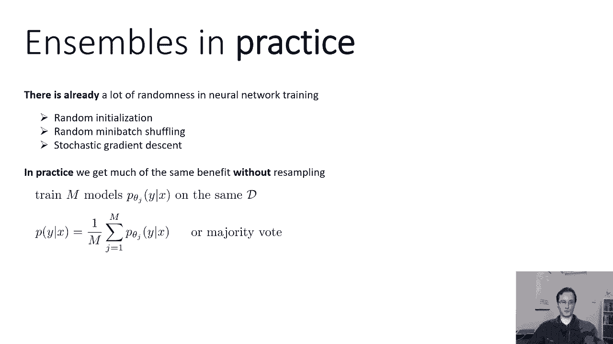
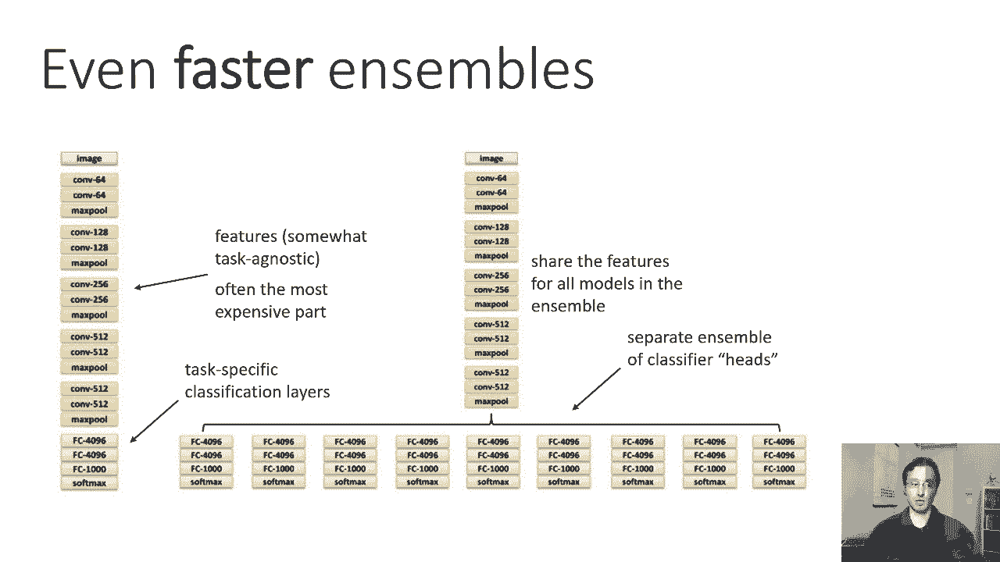
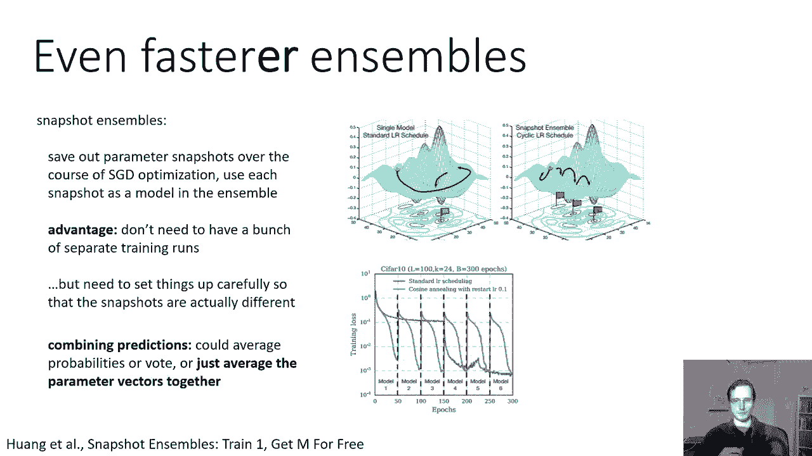
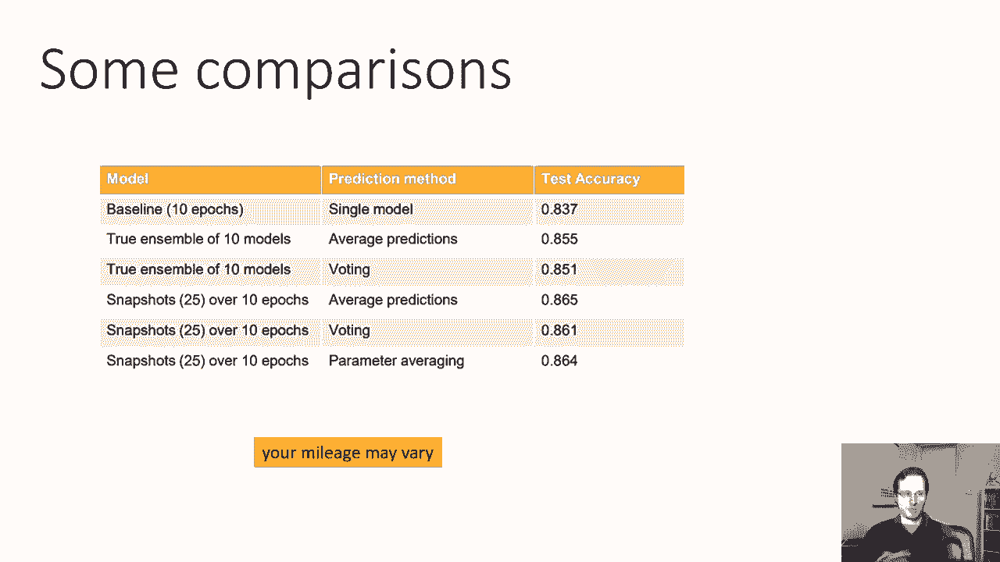
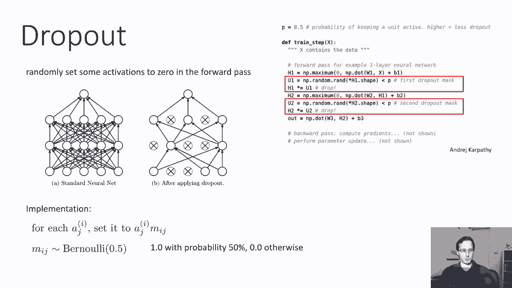
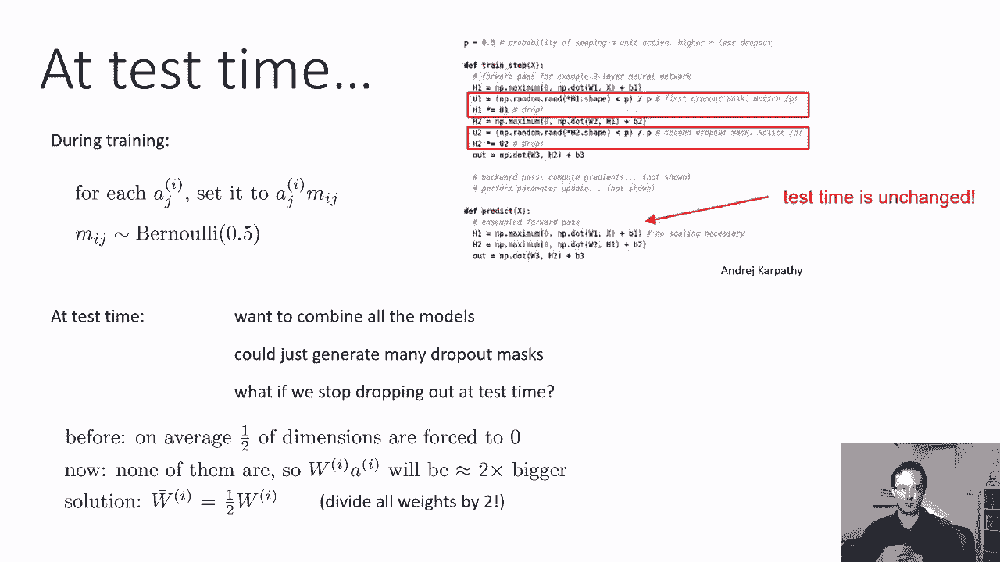
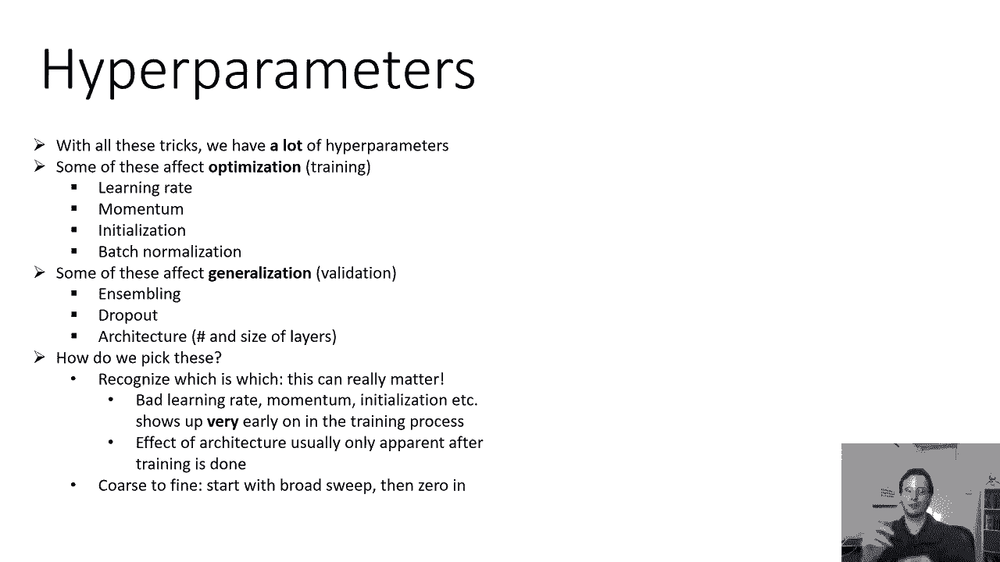
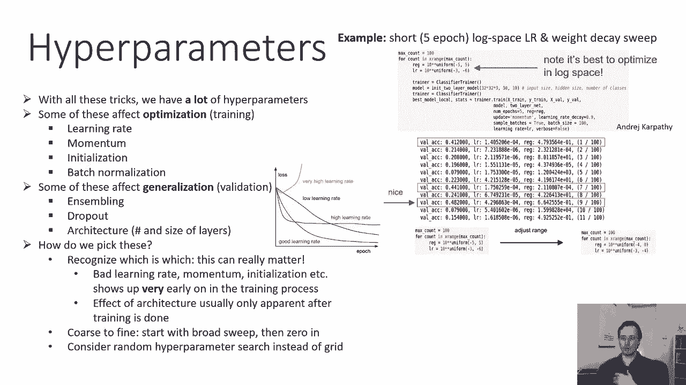

# 22：CS 182 第7讲 第3部分 - 初始化与批归一化 🧠

在本节课中，我们将学习如何通过优化和正则化技术来提升神经网络的性能。我们将重点讨论集成学习与Dropout方法，并简要介绍如何选择超参数。


## 集成学习：组合多个模型以提升性能

上一节我们讨论了优化神经网络的方法。本节中，我们来看看如何通过组合多个模型来减少方差，提升泛化能力。

神经网络通常包含大量参数，有时甚至超过数据点的数量，这可能导致高方差。这意味着在不同数据集上训练会得到差异很大的模型。集成学习的基本思想是：训练多个高方差的模型，它们可能在正确答案上达成一致，但在错误答案上各有不同。通过组合这些模型的预测，我们可以得到一个更稳健的解决方案。


以下是集成学习的基本步骤：

1.  训练多个独立的模型。
2.  组合这些模型的预测（例如，平均概率或多数投票）。

### 自助法集成

理论上，我们可以通过自助法来生成多个独立的数据集。具体方法是：从原始数据集中有放回地随机抽取N个样本，构成一个新的、大小相同的数据集。重复此过程M次，得到M个不同的数据集，并在每个数据集上独立训练一个模型。

### 实践中的简化集成



在实践中，由于深度学习的训练过程本身具有随机性（如随机初始化、小批量随机采样），即使在相同数据集上训练，也会得到不同的模型。因此，通常只需在同一训练集上训练多个独立初始化的模型，然后组合它们的预测，即可获得集成学习的好处。


### 高效集成策略



为了降低计算成本，可以采用以下策略：

*   **共享主干网络**：让多个模型共享底层的特征提取层（如卷积层），仅让顶部的分类层（全连接层）独立训练和集成。
*   **快照集成**：在单个模型的训练过程中，定期保存模型参数快照。将这些来自不同训练阶段的快照视为集成中的不同模型。
*   **参数平均**：一种更简单的技巧是直接平均多个模型的参数，这在实际中也能产生不错的效果。



## Dropout：一种高效的近似集成方法 🎯



上一节我们介绍了如何构建显式的模型集成。本节中，我们来看看一种能在一个网络内隐式实现巨大集成的技术——Dropout。


Dropout的核心思想是：在训练阶段，随机将神经网络中一部分隐藏层节点的输出激活值设置为零（即“丢弃”）。这可以迫使网络学习更鲁棒、冗余的特征表示，因为任何特征都可能随时被“丢弃”。



在代码中，Dropout可以这样实现（以某一层为例）：
```python
# 前向传播计算激活
h1 = np.maximum(0, np.dot(W1, X) + b1)
# 生成Dropout掩码（以50%概率丢弃）
mask = (np.random.rand(*h1.shape) < p) / p  # 注意除以p是为了缩放
# 应用Dropout
h1 *= mask
```

### Dropout在测试时的处理


在测试阶段，我们不再随机丢弃神经元。为了近似训练时巨大集成的平均效果，常见的做法是：
1.  **权重缩放**：在测试时，将所有前一层到应用了Dropout的层的权重乘以保留概率 `p`（训练时未丢弃的概率）。
2.  **激活缩放**：另一种等价做法是，在训练时，对未丢弃的神经元的激活值乘以 `1/p`，而在测试时正常前向传播。

这两种方法都是为了确保测试时神经元的期望输入尺度与训练时保持一致。

## 超参数调优指南 ⚙️



我们已介绍了多种影响模型优化和泛化的技术。本节最后，我们简要讨论如何系统地调整这些方法引入的超参数。

超参数主要分为两类：
1.  **影响优化的参数**：如学习率、动量、初始化参数。这些参数选择不当会直接影响训练过程的收敛，通常可以通过观察训练初期的损失曲线来调整。
2.  **影响泛化的参数**：如网络层数、隐层大小、Dropout率、集成模型数量。这些参数主要影响模型在验证集上的性能，需要在训练一定程度后，根据验证误差来调整。



### 超参数搜索策略

以下是进行超参数搜索的实用建议：



*   **粗调后精调**：首先在较宽的范围（通常在对数尺度上）进行随机搜索，运行少量训练周期，快速筛选出表现较好的参数区域。然后在该区域缩小范围，进行更密集的搜索。
*   **优先使用随机搜索**：与网格搜索相比，随机搜索在超参数重要性不均等时更高效，因为它能确保对每个超参数进行更多独立的探索。
*   **观察学习曲线**：学习曲线能提供丰富信息。例如，训练损失先下降后上升可能表明学习率过高。

**本节课中我们一起学习了**：如何通过集成学习组合多个模型来降低方差、提升性能；Dropout作为一种高效的内部正则化与近似集成方法的工作原理与实现；以及系统化进行超参数调优的基本策略。这些技术是构建强大、稳定神经网络模型的重要组成部分。