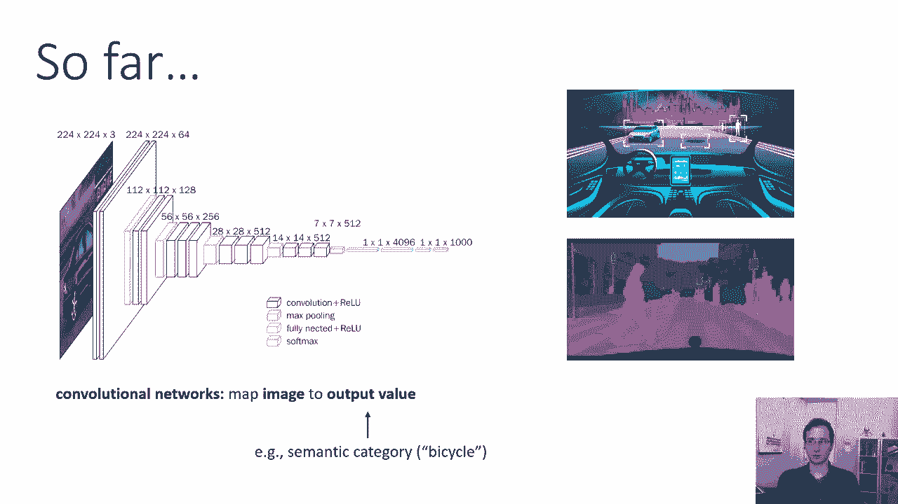
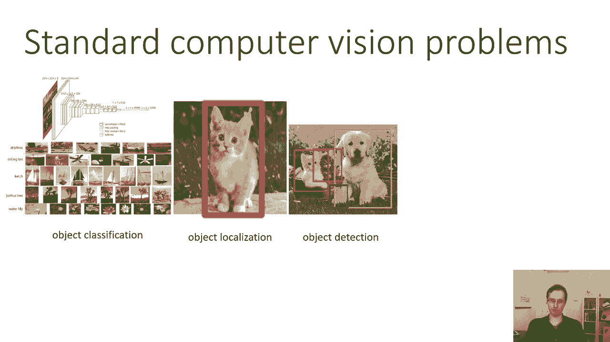
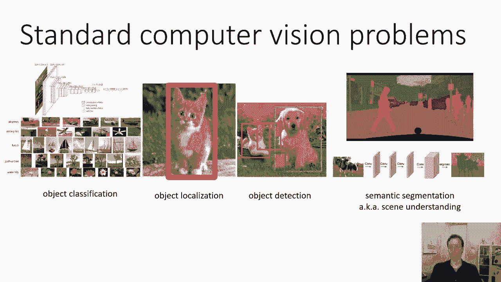
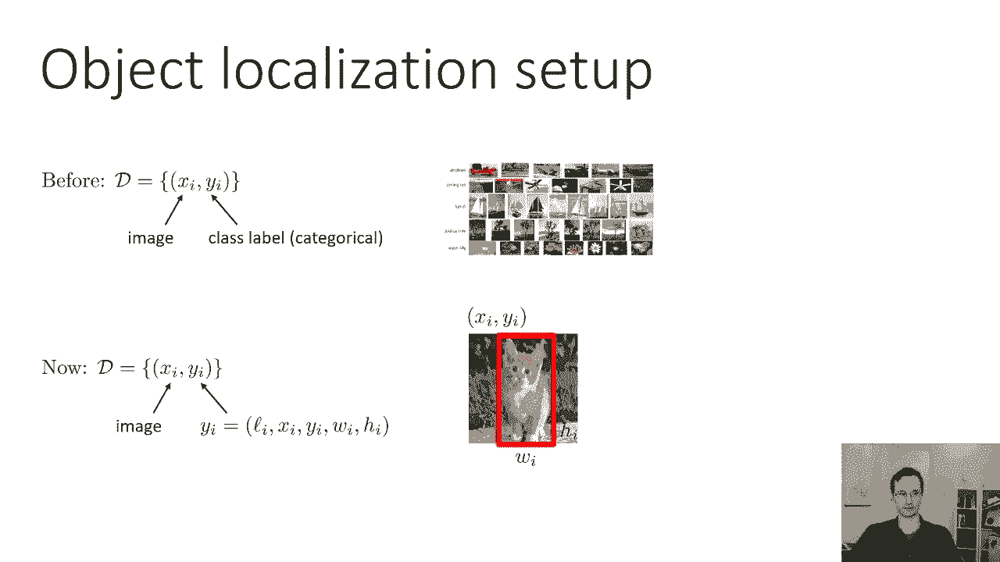
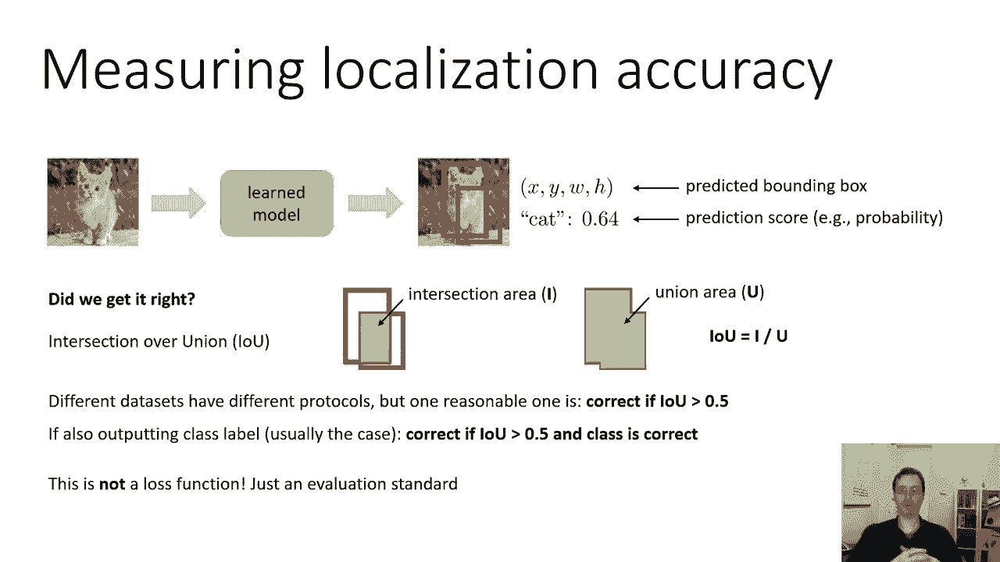

# 23：CS 182 第8讲 第1部分 - 计算机视觉 🖼️

在本节课中，我们将要学习深度学习在计算机视觉领域的应用。我们将从回顾分类问题开始，逐步深入到更复杂的任务，包括目标定位、目标检测和语义分割。我们将了解这些任务的基本概念、评估方法以及它们如何扩展了传统的分类范式。

## 从分类到定位 🔍

上一讲我们讨论了卷积神经网络如何将图像映射到单个分类标签。本节中我们来看看计算机视觉中更广泛的问题设置。

在分类问题中，网络输出一个离散变量，指示图像中存在的对象类型。这个设置有时显得局限，因为它不考虑对象在图像中的位置。

一个更细致的问题是**目标定位**，或同步分类与定位。在这个设置中，模型需要同时输出对象的类别及其位置。位置通常用一个**边界框**来表示，这是一个轴对齐的矩形，由其在图像中的 `(x, y)` 坐标、宽度 `w` 和高度 `h` 定义。

一个更复杂的问题是**目标检测**。与定位不同，目标检测需要处理图像中可能存在的多个对象。模型的目标是为图像中识别出的每一个对象输出一个边界框和类别标签。

我们可以将这个想法更进一步，发展出**语义分割**或场景理解。其目标是为图像中的每一个像素分配一个语义类别标签，从而精确地勾勒出每个对象的形状。

在今天的课程中，我们将按从简到繁的顺序，依次讨论目标定位、目标检测和语义分割。

## 目标定位与评估 📏

目标定位是目标检测的基础。本节中我们来看看如何形式化这个问题以及如何评估定位的准确性。

在常规分类中，我们的数据集由元组 `(x_i, y_i)` 组成，其中 `x_i` 是图像，`y_i` 是分类标签。对于目标定位，标签 `y_i` 变得更复杂，它是一个包含五部分信息的列表：语义类别 `L_i`、边界框的 `x` 和 `y` 坐标、以及边界框的宽度 `w` 和高度 `h`。这些坐标和尺寸通常以像素为单位表示。

在讨论具体方法之前，我们需要定义如何衡量定位的准确性。分类准确率很容易计算，但定位需要同时考虑类别正确性和边界框的位置。

一个常见的评估指标是**交并比**。其核心思想是量化预测边界框与真实边界框之间的重叠程度，同时控制它们自身的绝对大小。

交并比的计算公式如下：
`IoU = Area_of_Intersection / Area_of_Union`

其中，`Area_of_Intersection` 是两个边界框重叠区域的面积，`Area_of_Union` 是两个边界框覆盖的总面积。

交并比的值在0到1之间。值越接近1，表示重叠度越高，定位越准确。通常，在评估时，我们会设定一个阈值（例如0.5）。如果模型预测的类别正确，并且其预测边界框与真实边界框的IoU大于该阈值，我们就认为这次定位是正确的。

以下是评估定位准确性的关键点：
*   **交并比**是衡量边界框重叠度的标准指标。
*   它是一个**评估指标**，而非训练时使用的损失函数，因为IoU的优化较为困难。
*   具体的评估协议（如IoU阈值）取决于所使用的数据集和基准测试。

---

本节课中我们一起学习了计算机视觉中超越简单分类的几种核心任务：目标定位、目标检测和语义分割。我们重点介绍了目标定位的问题定义，并学习了使用**交并比**来评估定位准确性的方法。理解这些基础概念是后续学习更复杂检测与分割模型的关键。