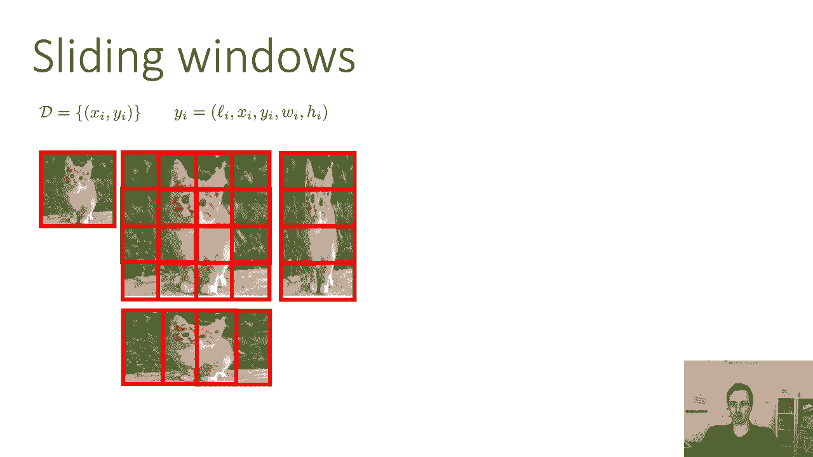
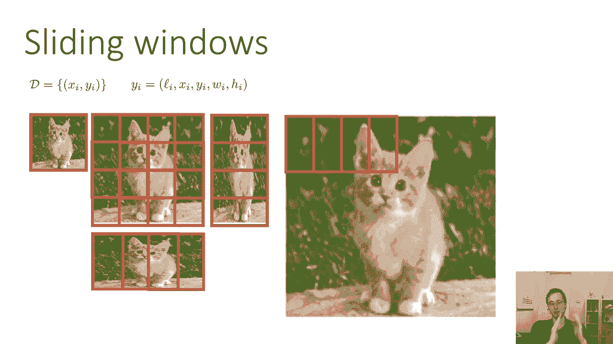
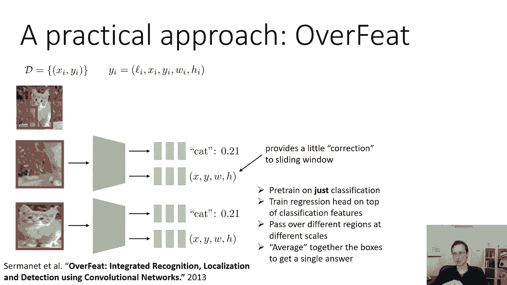

# 24：CS 182 - 第8讲 - 第2部分 - 计算机视觉 🖼️

在本节课中，我们将要学习**对象定位**的核心概念与方法。我们将探讨如何让计算机视觉模型不仅识别图像中的物体是什么，还能精确地找到它在图像中的位置。

---

## 🎯 对象定位的问题定义

对象定位的目标是预测图像中单个主要对象的边界框。边界框通常由四个坐标表示：中心点的 x 和 y 坐标，以及框的宽度 w 和高度 h。

---

## 🔧 方法一：回归方法

上一节我们介绍了对象定位的基本概念，本节中我们来看看第一种实现方法：将其视为回归问题。

我们可以从一个传统的图像分类器开始。具体做法是，在其卷积层之后，添加另一组全连接层。这组新层的工作不是输出语义类别，而是输出边界框的四个坐标值：`x`、`y`、`w` 和 `h`。

以下是训练这种网络的一种方式：

*   联合训练整个网络，计算一个综合的损失函数。
*   这个损失函数是**分类损失**（例如交叉熵损失）和**回归损失**（针对边界框坐标）的加权和。
*   回归损失可以是**均方误差**或基于高斯分布的**对数似然**。
*   通过反向传播将两个损失同时传播到网络中。

关于如何正确设置这种多任务目标存在一些细节，本节课没有时间深入讨论。如果你想了解更多，可以查阅后续会提到的 YOLO 等论文，它们在这方面是很好的例子。

另一种常用的设置是分两步训练：

1.  首先，像上一节课那样训练分类器。
2.  然后，固定训练好的卷积层权重，仅在其之上训练新的回归头。

这两种都是合理的选择，具体取决于系统的设计细节。

这是一个非常简单的设计，可以作为对象定位系统的快速起点。然而，它通常不是效果最好的方法，我们接下来会讨论原因。

---

## 🔍 方法二：滑动窗口方法

除了直接回归坐标，另一种思路是使用**滑动窗口**。

我们可以这样思考：不是对整个图像分类，而是对图像中的每一个可能的小块（补丁）进行分类。我们遍历所有可能的裁剪区域，将每个区域输入分类器。分类器预测“是猫”概率最高的那个区域，就可以作为边界框。

需要注意的是，分类器通常需要固定尺寸的输入。因此，无论裁剪出什么形状的补丁，都必须调整到分类器期望的大小，这可能导致图像被拉伸或压扁。只要分类器在训练时见过各种长宽比的图像，这通常不是问题。

现在，关键问题是我们应该选择哪些裁剪区域？一个简单的解决方案是：在一定范围内，尝试**所有可能**的裁剪。

以下是实现步骤：

1.  **考虑不同尺度**：从整个图像开始，然后以不同比例（如2的幂次，或更细粒度的20%、50%等）放大图像。在每个缩放后的图像上，用固定大小的窗口进行平铺扫描。
2.  **考虑不同宽高比**：除了均匀缩放，还可以对图像进行各向异性缩放（如垂直拉伸或水平拉伸）。在拉伸后的图像上平铺窗口，这些窗口对应原始图像中不同形状（如又宽又矮或又高又瘦）的边界框。
3.  **密集平铺**：在实践中，平铺会非常密集，窗口之间可能只偏移一个像素，从而产生大量候选框。

一旦我们获得了所有候选窗口的分类概率，就可以选择概率最高的窗口作为最终边界框。更复杂的方法会使用**非极大值抑制**等技术，但对于单对象定位，选择最大值是一个不错的启发式方法。

---

## 🤝 方法三：结合回归与滑动窗口（OverFeat）

为什么要把两种方法结合起来？因为它们可以互补彼此的弱点。

*   **滑动窗口**简单，但为了覆盖每个像素可能非常昂贵，且边界框可能不够精确。
*   **回归方法**可以直接输出连续坐标，但单独使用可能不够鲁棒。

结合两者的思路是：对于滑动窗口产生的每个图像补丁，网络不仅输出该补丁包含对象的概率，还输出一个**相对于该补丁的边界框坐标偏移量**。这样，回归头可以对初始的滑动窗口位置进行精细调整，无需枚举所有可能的缩放和长宽比。

**OverFeat** 论文是这种方法的经典实现。其训练方式是：
1.  首先对网络进行标准的图像分类预训练。
2.  然后在分类网络提取的特征之上，训练回归头。
3.  在推理时，将图像以多种尺度输入网络，对于每个位置（滑动窗口），同时得到类别概率和精修的边界框坐标。

最后，需要融合来自不同位置和尺度的预测。一种简单的方法是选择概率最高的窗口。OverFeat 论文则采用了一种更复杂的加权平均策略，按概率对来自不同窗口的边界框预测进行融合，从而得到最终结果。

这种方法在计算上可以利用卷积网络的特性进行大幅优化。

---

## ⚡ 高效计算：全卷积网络

滑动窗口方法的一个明显问题是计算成本高。如果有数百个窗口，计算成本会成百倍增加。

幸运的是，我们可以利用卷积网络的特性来**大幅减少计算量**。关键在于：相邻的滑动窗口在图像上有大量重叠区域，因此它们在卷积层中计算出的激活值也是高度重叠的。我们不需要为每个窗口从头计算卷积。

我们可以将网络末端的**全连接层重新解释为卷积层**。具体来说：
*   最后一个全连接层可以看作是一个 `1x1` 的卷积。
*   这样，整个网络就变成了一个**全卷积网络**。
*   我们可以将任意大小的图像一次性输入这个全卷积网络。
*   网络的输出将是一个**空间特征图**，其中每个位置上的值就对应原始图像中该位置滑动窗口的分类结果。

这种转变允许我们在一次前向传播中，高效地得到图像所有位置上的预测，实现了计算的高度复用。这是一个非常强大的思想，在物体检测和图像分割等领域也会反复出现。

---

## 📝 本节总结

本节课中我们一起学习了对象定位的几种核心方法：

1.  **回归方法**：在分类网络基础上添加回归头，直接预测边界框坐标 `(x, y, w, h)`。
2.  **滑动窗口方法**：对图像所有可能的区域进行分类，选择概率最高的区域作为边界框。
3.  **结合方法**：如 OverFeat，为每个滑动窗口同时预测类别和边界框偏移，兼具两者的优点。
4.  **高效实现**：通过将网络转换为**全卷积网络**，可以一次性计算所有滑动窗口的预测，极大提升效率。

这些构建块是理解现代物体检测系统的基础。