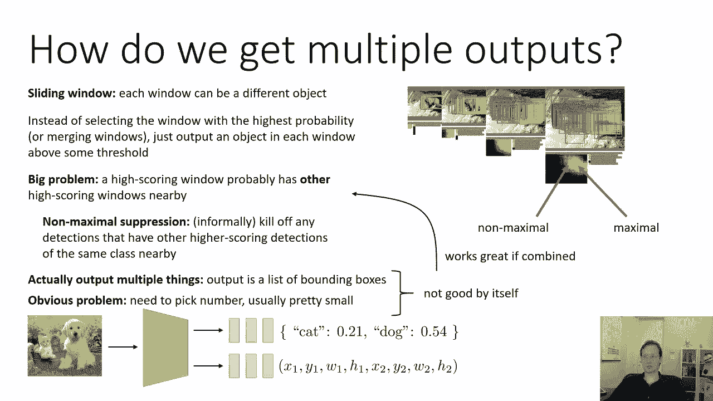
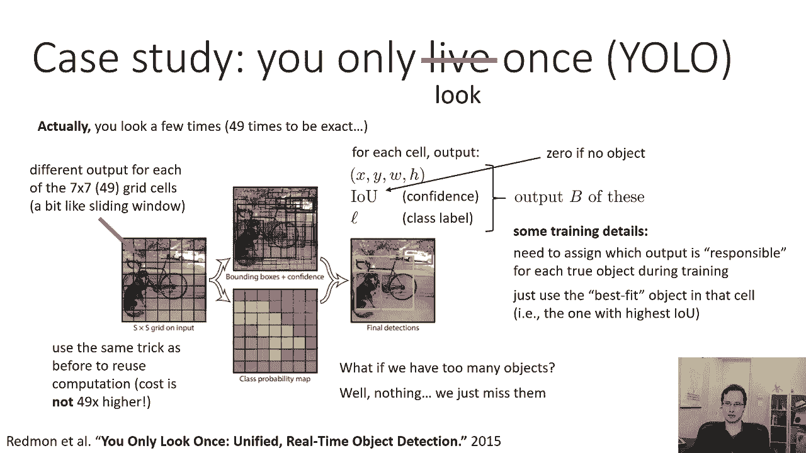
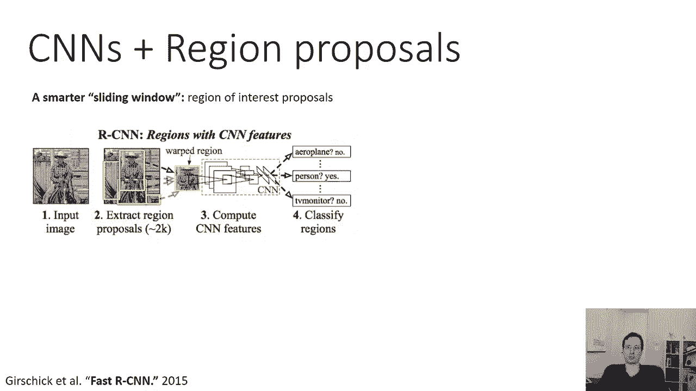
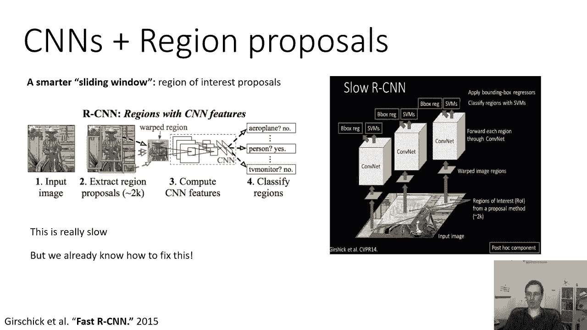
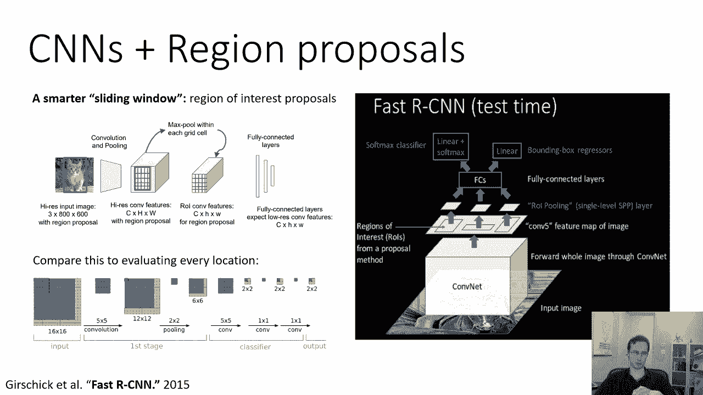
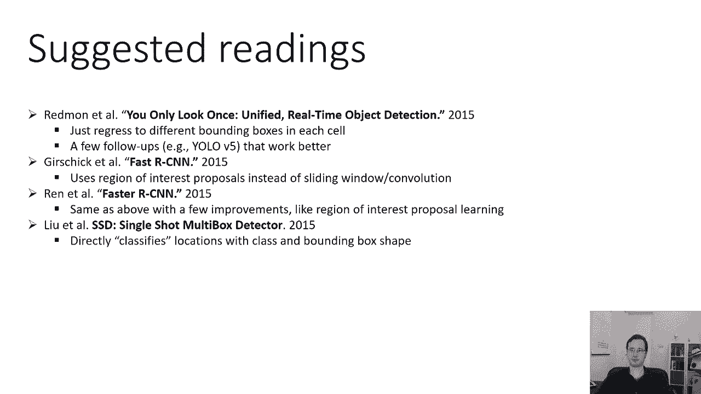

# 25：CS 182 - 第8讲 - 第3部分 - 计算机视觉 🖼️

在本节课中，我们将学习计算机视觉中的一个核心任务：**目标检测**。我们将探讨如何让模型识别图像中的多个物体，并为每个物体输出其类别和边界框。我们将介绍几种主流方法，包括滑动窗口、YOLO和R-CNN系列，并理解它们背后的核心思想。

---

## 🎯 目标检测问题定义

上一节我们讨论了单目标定位。本节中，我们来看看更一般的情况：**多目标检测**。

在目标检测任务中，我们有一张输入图像，图像中可能包含数量不定的多个物体。对于每个物体，模型需要输出其类别（例如“猫”、“狗”）以及一个边界框。边界框通常由四个参数定义：中心点坐标 **(x, y)**、宽度 **w** 和高度 **h**。

因此，对于一张图像，模型的理想输出是一个列表：
*   第一个物体的类别 **c_i1** 和边界框 **(x_i1, y_i1, w_i1, h_i1)**
*   第二个物体的类别 **c_i2** 和边界框 **(x_i2, y_i2, w_i2, h_i2)**
*   … 以此类推，直到第 **n** 个物体。

这立即带来一个挑战：模型需要输出**可变数量**的预测结果。

---

## 🔍 方法一：滑动窗口与朴素思路

一个直观的想法是沿用滑动窗口的方法。模型在图像的每个可能位置（窗口）上，都输出一个类别预测和一个边界框预测。

以下是具体步骤：
1.  模型在图像上滑动一个窗口。
2.  对于每个窗口位置，模型预测该窗口内包含某类物体的概率。
3.  我们设定一个**概率阈值**。只有当某个窗口对某类别的预测概率高于此阈值时，我们才认为该窗口检测到了一个物体，并输出其类别和边界框。

然而，这种方法存在一个明显问题：**重叠检测**。一个物体可能被多个高分窗口同时覆盖，导致对同一个物体输出大量重叠的边界框。

为了解决重叠问题，我们可以引入 **非极大值抑制**。其核心思想是：对于一组相互重叠的检测框，只保留置信度（概率）最高的那一个，抑制掉其他所有框。即使某个位置有很高的概率（如98%），如果其邻近位置有一个概率更高的检测（如99%），那么它就不会被输出。NMS的细节实现（如如何定义“重叠”）属于传统计算机视觉范畴，此处不深入展开。

---

## 📦 方法二：固定数量输出与YOLO

另一种思路是让模型直接输出一个固定长度的列表，例如包含 **B** 个预测（每个预测包含类别和边界框）。在推理时，我们只输出列表中置信度高于阈值的预测。

但这种方法本身也有局限：我们需要预先设定 **B** 的值。如果 **B** 设得太小，模型可能无法检测图像中所有的物体；如果 **B** 设得太大，训练会变得困难。

有趣的是，当我们将**滑动窗口**的思想与**固定输出**的思想结合起来时，就得到了非常有效的现代目标检测方法，例如 **YOLO**。

YOLO（You Only Look Once）的核心思想如下：
1.  将输入图像划分为一个 **S × S** 的网格（例如 7×7）。
2.  每个网格单元负责预测以该单元为中心的物体。
3.  每个网格单元会输出 **B** 个边界框（通常 B=2），每个边界框包含：
    *   框的位置参数 **(x, y, w, h)**
    *   一个**置信度分数**，表示该框包含物体的可能性以及预测框与真实框的重合度（IoU）。
    *   **C** 个类别的条件概率。
4.  在最终输出时，我们根据置信度分数进行阈值过滤，并使用非极大值抑制来去除冗余框。

在训练时，需要将图像中的每个真实边界框**分配**给一个网格单元。分配规则是：选择那个其预测的边界框与真实框IoU最高的网格单元。如果一个网格单元没有被分配任何真实框，则其置信度目标被设置为0。

YOLO的优势在于速度快，它是“单阶段”检测器的代表。其输出物体数量受网格数 **S×S×B** 限制，但在实际场景中通常够用。

---

## 🧩 方法三：区域提议与R-CNN系列

另一类重要的方法是 **R-CNN** 系列，其核心是 **区域提议**。这类方法通常分为两个阶段。

以下是R-CNN的基本流程：
1.  **区域提议**：首先使用一种算法（在深度学习时代之前就已存在）从图像中提取出可能包含物体的区域（称为“提议”或“感兴趣区域”）。这相当于一个更智能的“滑动窗口”，只关注可能有物体的区域。
2.  **分类与精修**：将每个提议区域裁剪出来，缩放成统一大小，然后送入一个卷积神经网络进行分类，并回归出更精确的边界框。

原始的R-CNN效率很低，因为每个区域都要独立通过CNN。后续的 **Fast R-CNN** 对其进行了重大改进。

Fast R-CNN 的工作流程如下：
1.  将整张图像输入一个卷积网络，生成一个**卷积特征图**。
2.  将第一步得到的区域提议，映射到这个特征图上。
3.  对每个映射到特征图上的区域，通过 **RoI Pooling** 层提取出一个固定大小的特征向量。
4.  将这个特征向量输入全连接层，同时完成物体分类和边界框回归。

这种方法的关键在于，卷积计算在整张图像上**只进行一次**，然后在共享的特征图上处理所有区域，大大提升了效率。整个网络可以端到端地进行训练。

更进一步的 **Faster R-CNN** 甚至用神经网络（区域提议网络，RPN）替代了传统的区域提议算法，使得提议生成也融入了深度学习框架。

R-CNN系列是“两阶段”检测器的代表，通常精度较高，但速度相对YOLO这类单阶段检测器慢一些。在实际应用中，YOLO和Faster R-CNN的性能在不同时期和不同数据集上互有胜负。

---

## 📚 延伸阅读与总结

本节课中，我们一起学习了目标检测的基本概念和几种主流方法。

以下是核心方法的总结与推荐阅读：
*   **YOLO（单阶段代表）**：思路直接，将检测视为回归问题。推荐阅读原始论文《You Only Look Once: Unified, Real-Time Object Detection》，并了解其后续版本（v2, v3, v4等）的改进。
*   **R-CNN系列（两阶段代表）**：通过区域提议和分类两个阶段完成检测。推荐阅读三部曲：R-CNN, Fast R-CNN, Faster R-CNN 的原始论文。
*   **其他单阶段方法**：**SSD（Single Shot MultiBox Detector）** 是另一个高效的单阶段检测器，设计上也很有借鉴意义。

目标检测是计算机视觉的基石任务之一。理解YOLO和R-CNN这两类设计哲学，将为学习更复杂的视觉任务打下坚实基础。你可以根据对速度或精度的不同需求，选择适合的模型架构。

