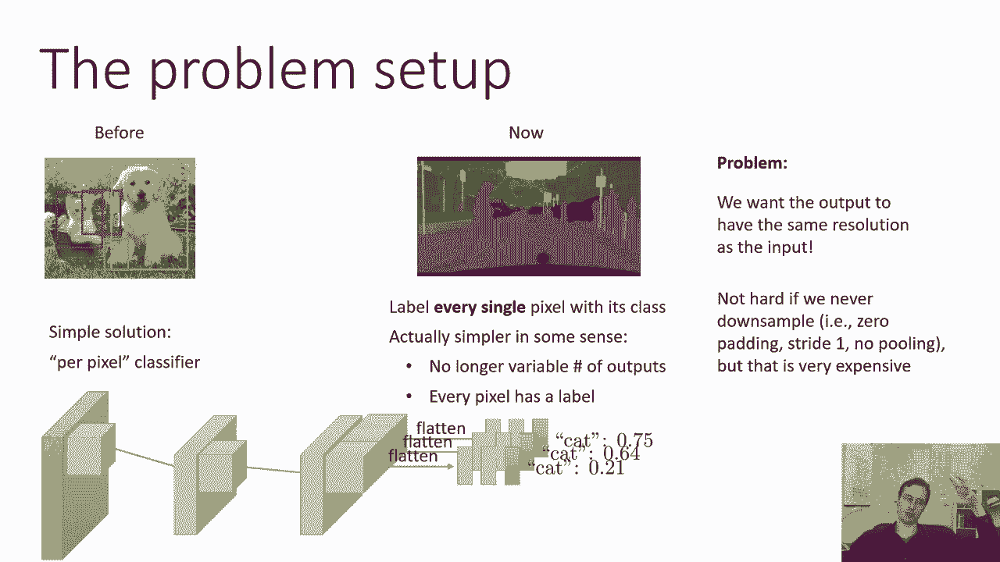
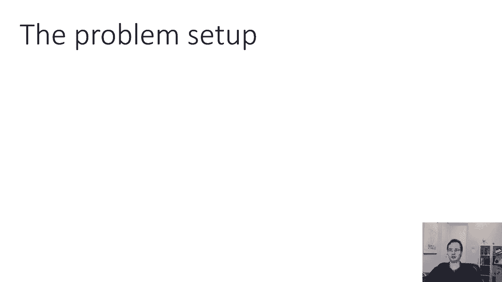
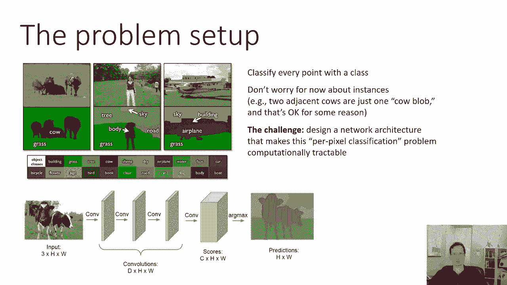
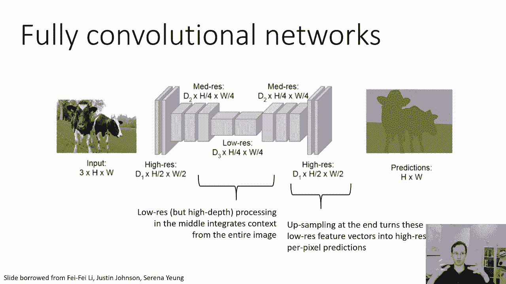
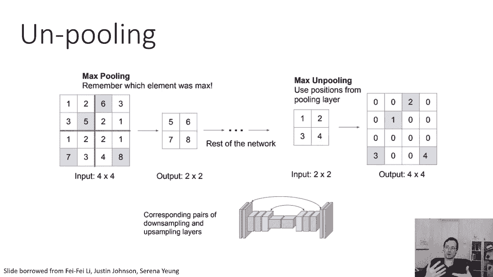
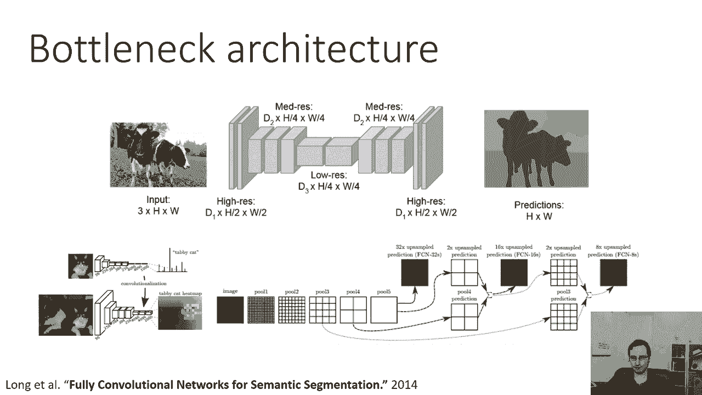
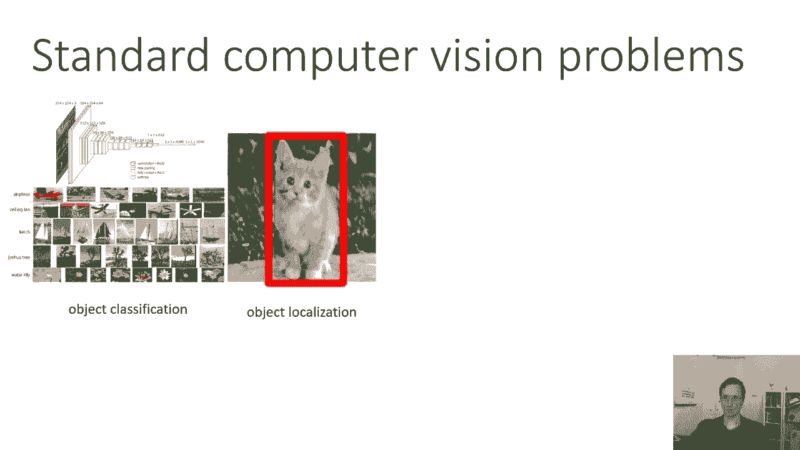
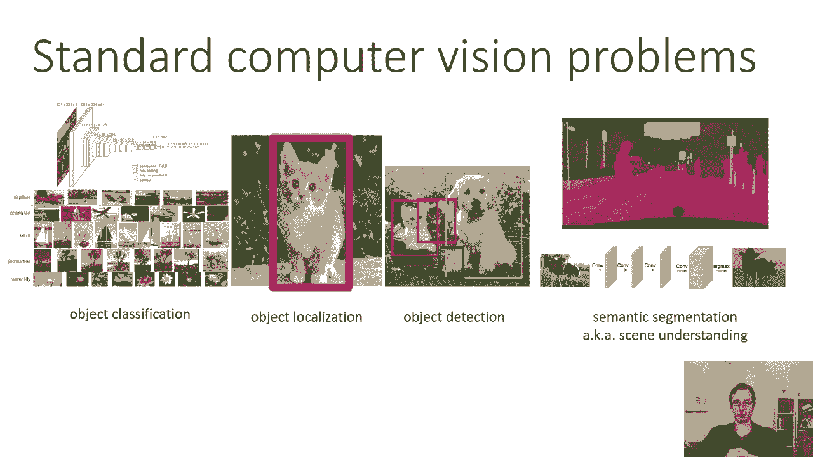

# 26：CS 182 第8讲 第4部分 - 计算机视觉 🖼️

## 概述

在本节课中，我们将要学习计算机视觉中的一个重要任务：**语义分割**。我们将了解它的基本概念、面临的挑战以及如何通过特定的网络架构（如全卷积网络和U-Net）来实现它。

---

## 什么是语义分割？

到目前为止，我们已经讨论了输出类别标签和边界框的方法。现在，我们要讨论的方法试图为图像中的**每一个像素**分配一个语义类别标签。如果你想精确地知道物体在图像中的位置和形状，这种方法会很有帮助。

在某些方面，语义分割实际上更简单一点。与物体检测不同，你不再需要处理可变数量的输出，因为每个像素都有一个独立的输出标签。从这个意义上说，你不必担心物体是否存在或存在多少个物体。

但它也更复杂一点，因为现在的输出规模要大得多。你的输出分辨率与原始图像相同。



---



## 核心思想：逐像素分类

一个非常简单的、思考语义分割的概念起点，就是把它看作一个**逐像素分类的分类器**。

你可以想象使用一个完整的卷积神经网络分类器，将其“聚焦”在图像中的每个像素上（通常通过零填充等方式处理边缘）。这或多或少就是语义分割方法试图做的事情。

---



## 技术挑战与解决方案

然而，直接应用上述观点存在技术挑战。当我们考虑在每个位置使用一个不同的分类器时，这仍然适用于位置数量远小于图像像素数的情况。传统的神经网络架构通过卷积层降低了分辨率。

但现在的问题是，我们希望输出具有与输入相同的分辨率。我们真的希望每个像素都有一个类别，而不仅仅是每个滑动窗口位置。

如果我们不进行下采样（例如，始终使用零填充、步长为1的卷积且没有池化层），那么所有的卷积响应图都将与原始图像具有相同的分辨率。最后，我们可以为图像中的每个位置输出一个类别标签。

你绝对可以这样做，但这在计算上非常昂贵，因为你会有巨大的卷积响应图，并且需要相当多的层来获取广泛的上下文信息。这意味着你需要巨大的过滤器或很多层，这两种方式都非常昂贵。



```python
# 概念性伪代码：一个保持分辨率的卷积堆栈（计算昂贵）
# 输入: 图像 (H, W, C_in)
# 输出: 分割图 (H, W, C_out)
for pixel in all_pixels:
    patch = extract_patch_around_pixel(image, pixel)
    label = classifier(patch) # 一个深度卷积网络
    segmentation_map[pixel] = label
```

---

## 瓶颈架构：下采样与上采样

在实践中，实现语义分割的主流方法是设计一个网络架构，使得逐像素分类在计算上易于处理。

我们能想象的一个概念性架构是：首先有一个卷积堆栈（类似于VGG或ResNet用于分类的部分），它会**降低分辨率**。一旦我们降低了分辨率，我们就需要在中间进行一些低分辨率但高深度的处理，这基本上整合了整个图像的信息。然后，我们需要**上采样**以恢复到图像的原始分辨率，最后为每个像素输出一个标签。

所以，从概念上来说，这里的一切都很简单。问题在于：**我们如何进行上采样？**

我们学习过的卷积操作要么保持分辨率，要么降低分辨率。现在我们需要了解一种能提高分辨率的操作，可以称之为**上采样**或**转置卷积**（有时也被不准确地称为反卷积）。

---

## 转置卷积（上采样）

让我们先谈谈常规卷积如何降低分辨率。如果你有一个步长为2的常规卷积（不做填充），一个5x5的图像会变成一个2x2的图像。

转置卷积基本上与此相反。一种思考方式是，它是一个“步长小于1”的卷积。例如，步长为1/2意味着你在输入上移动“半个像素”（实际上通过插值实现）。另一种简单的方法是，你可以简单地在输出特征图的多个位置写入值。

从数学上看，对于一个2x2的输入和一个5x5的输出，过滤器是一个四维张量。它对输出块中的每个位置、每个通道和输入中的每个通道都有一个权重值。它会将输入通道乘以某个数字，并写入输出块的对应位置。

这里的一个小陷阱是，不同过滤器输出的区域会重叠。一个非常简单的处理重叠的方法是**对重叠位置的值进行平均**。例如，中心像素可能会从四个独立的过滤器得到预测值，然后将它们平均起来。

---

## 解池化操作

我们最初的网络还有池化层，这是另一种降低分辨率的方式。这意味着如果我们之后想上采样，必须以某种方式“撤销”池化。你可以进行**解池化**操作。

一个简单的方法是复制值。例如，将2x2的输入通过复制变成4x4的输出。

另一个更聪明、效果也很好的技巧是：在执行池化操作（如最大池化）时，**保存最大值所在位置的索引**。之后在执行解池化时，将低分辨率特征图中的值写入高分辨率特征图中对应的索引位置，其他位置填充零。



当然，这要求你的网络结构是**对称的**：在编码器部分的每个池化层，在解码器部分都需要有一个对应的解池化层。

---

## 全卷积网络



一种非常简单的架构是**瓶颈架构**。你通常使用传统的卷积网络（如VGG或ResNet）作为第一部分（编码器），将图像压缩到一个低维的“瓶颈”表示中。然后，你将其翻转过来，使用转置卷积和解池化操作（解码器）使其恢复到原始分辨率。

这就是论文《Fully Convolutional Networks for Semantic Segmentation》中使用的基本设计。他们取一个标准的现有网络（如VGG），将其最后的全连接层替换为卷积层，并将所有的池化层在解码器中变为解池化层，将卷积层变为转置卷积层。

---

## 提升细节：U-Net与跳跃连接

你可能会想到这种方法的一个问题：一些空间信息可能在池化过程中丢失了。虽然之后的解池化和转置卷积能让分辨率恢复，但它们可能无法恢复精细的空间细节。

因此，一个想法是：也许可以将多种分辨率的信息在**上采样过程中结合起来**。具体来说，可以将低分辨率特征图上采样的结果，与编码器阶段通过**跳跃连接**保存的、相同分辨率的更高层特征图结合起来。

跳跃连接很像残差连接。这就是**U-Net**设计背后的核心思想。U-Net已被广泛应用于语义分割以及生成对抗网络等许多领域。

在U-Net架构中，每次上采样时，激活由两部分组成：
1.  前一个较低分辨率层的上采样结果。
2.  编码器中间阶段、具有相同分辨率的原始层的激活。

这两部分被连接（Concatenate）在一起。这样，更高分辨率的特征图（可能编码了边缘、边界等有用的高频细节）可以直接传递到解码器，帮助生成与物体实际边缘完美对齐的分割结果。

```python
# U-Net 跳跃连接的概念性表示
# encoder_activations: 编码器各层的特征图
# x: 解码器当前层的特征图
upsampled = transpose_conv(previous_decoder_layer)
skip_data = encoder_activations[corresponding_level]
combined = concatenate([upsampled, skip_data])
current_output = conv_layer(combined)
```

---

## 总结：计算机视觉四大任务



在这一点上，我们已经讨论了四个标准的计算机视觉问题：

1.  **图像分类** 🏷️：识别图像中存在的主要物体类别。（上节课内容）
2.  **目标定位** 📍：在图像中定位一个物体，输出其边界框。
3.  **目标检测** 🔍：在图像中检测多个物体，输出每个物体的类别和边界框。
4.  **语义分割** 🖼️：为图像中的每个像素输出一个语义类别标签。

你可以看到这些任务有很多共同的主题，例如共享的卷积神经网络骨干，以及滑动窗口（或类似思想）的应用。但它们之间也有区别，例如回归边界框的需求等。

希望本节课能为你提供一些计算机视觉的背景知识，特别是如果你想在最终项目中尝试类似的任务。如果你想了解更多，强烈建议阅读相关的论文（如Fully Convolutional Networks, U-Net等）。



---
**本节课中，我们一起学习了：**
*   语义分割的目标是为图像中每个像素分配类别标签。
*   直接进行逐像素分类计算成本高昂，因此常用**编码器-解码器**架构。
*   **转置卷积**和**解池化**是用于上采样的关键技术。
*   **跳跃连接**（如U-Net中使用的）能有效结合不同分辨率的特征，提升分割细节。
*   语义分割是图像分类、目标定位、目标检测这一系列视觉任务的自然延伸。