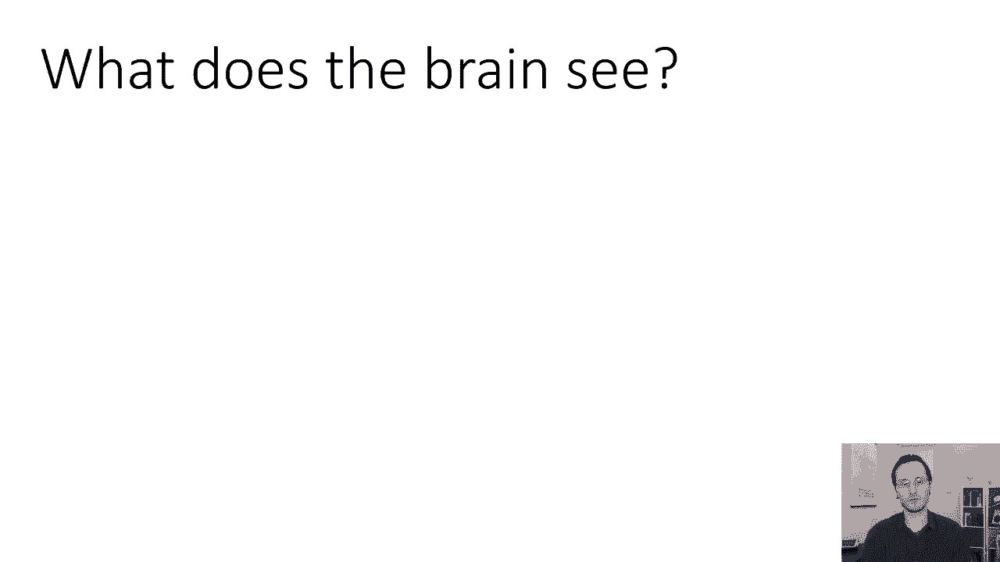
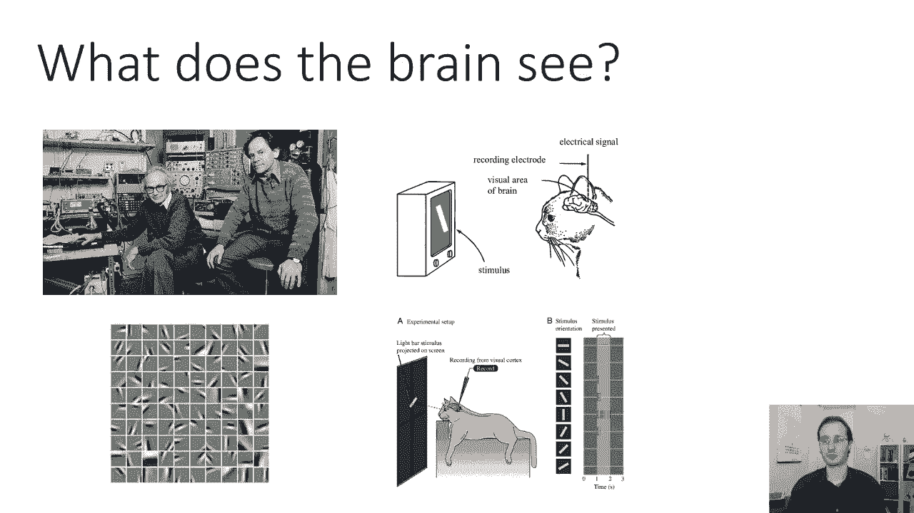
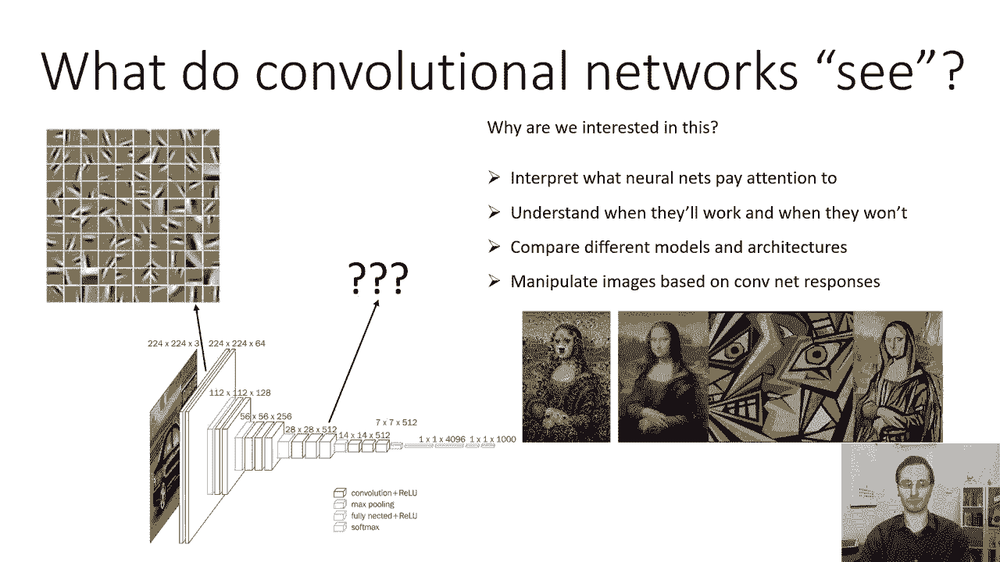
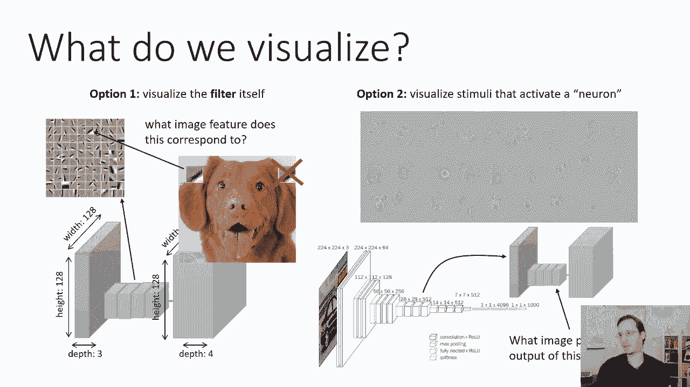
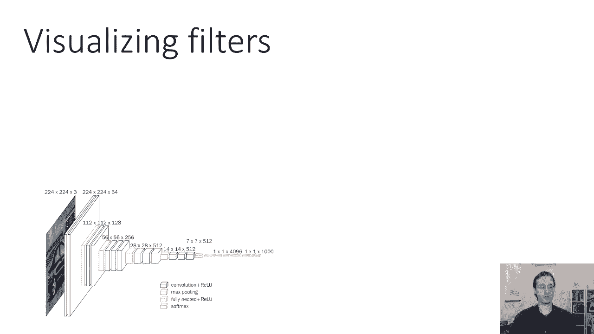
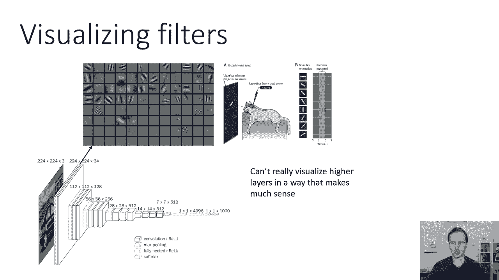
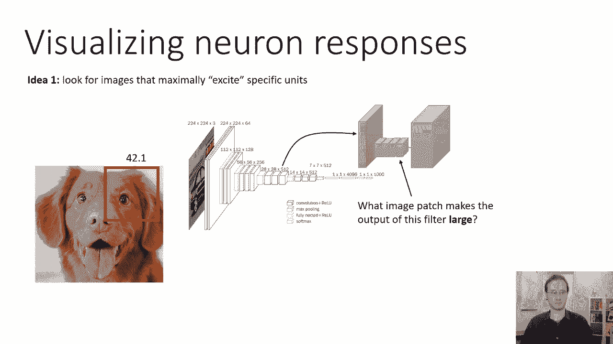
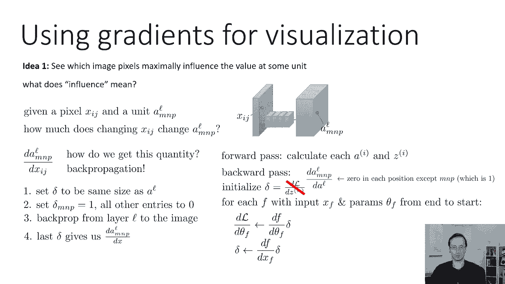
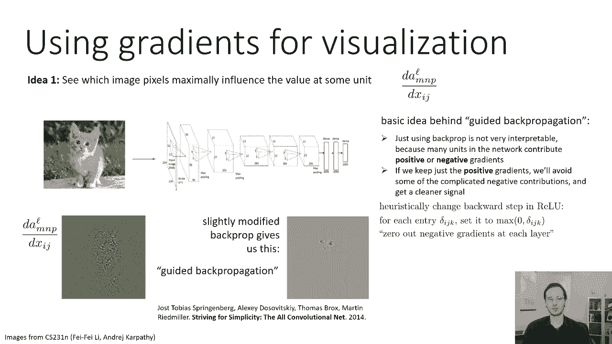
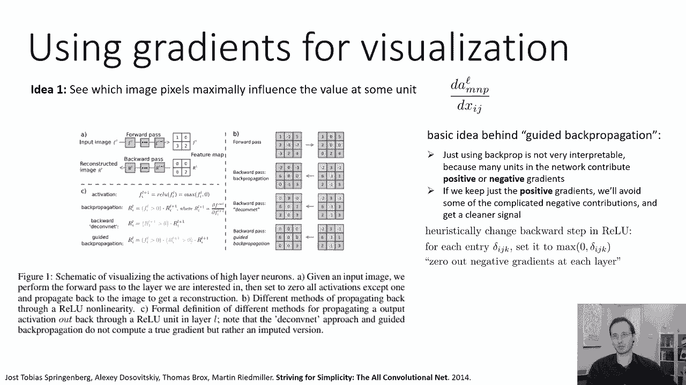

# 27：CS 182 - 第九讲 - 第一部分：可视化与风格迁移 🎨🧠

在本节课中，我们将学习如何理解卷积神经网络（CNN）在做什么，以及如何利用它们来生成图像。我们将从分析CNN的激活模式开始，探讨其与哺乳动物视觉系统的相似之处，并学习如何可视化网络内部的特征。最后，我们将了解如何利用这些技术进行创造性的图像修改。

## 从神经科学到卷积网络 🧬➡️🤖

在深入卷积网络的细节之前，让我们先回顾一些神经科学领域的著名实验。胡贝尔和威塞尔对哺乳动物大脑视觉处理的研究非常著名。他们向猫展示不同方向的视觉刺激，并记录其大脑神经元的激活情况。

他们发现，猫脑中的单个神经细胞负责识别不同方向的边缘。下图展示了他们实验的示意图，屏幕上显示了猫不同方向的边缘。

通过这个实验，他们得以重建猫大脑中不同神经元对不同方向边缘的反应模式。这很有道理，因为视觉世界中的物体是由边缘勾勒出来的。因此，如果能有效检测不同位置、不同方向的边缘，就能实现良好的视觉处理。

事实上，这些实验被广泛复现。我们知道，哺乳动物大脑的早期视觉处理倾向于识别定向边缘。这些神经元的感受野（即它们最积极响应的模式）看起来像是一个小边缘，一边明亮，另一边黑暗。

这种模式表明那里存在一个边缘。那么，我们也可以问：卷积神经网络“看到”的是什么？它们是否也以类似于大脑的方式看待事物？

事实上，卷积神经网络的早期层倾向于学习非常类似于胡贝尔-威塞尔实验中观察到的定向边缘检测器。当然，我们更感兴趣的是：后面的层发生了什么？我们为什么关心这个问题？因为这能让我们解释神经网络实际关注的是什么，判断它们识别图像是否出于“正确”的原因。这有助于我们理解模型何时有效、何时可能失效，并允许我们比较不同的模型和架构。

非常相似的概念也可以帮助我们基于卷积神经网络的响应来操纵图像，夸大图像的某些特征。例如，你可以问一个网络在《蒙娜丽莎》中看到了哪些种类的动物，然后夸大那些特征。或者，你甚至可以让它产生幻觉：如果《蒙娜丽莎》是由不同视觉风格的艺术家绘制的，会是什么样子？我们将看到，用于分析网络响应的相同技术，实际上可以用于以这些创造性和艺术性的方式修改图像。

## 可视化卷积神经网络的滤波器与激活 🔍

首先，我们来谈谈如何可视化卷积神经网络的响应和滤波器。我们需要明确：我们应该可视化什么？我们有两个选择。

**第一个选择是可视化滤波器本身。** 也就是说，我们不关心激活或图像，而是直接查看滤波器，看看它是否能给我们一些关于其功能的直觉。对于第一个卷积层，这相对简单，因为滤波器直接作用于图像像素。

我们可以这样思考：下图展示了一组不同的滤波器。我们可以问：每个滤波器对应什么图像特征？假设我们有一张狗的图片，然后取一个滤波器，想象把它覆盖在图像的一个小块（补丁）上。现在问自己：如果你计算这个滤波器与图像像素的点积（即对应元素相乘后求和），这个点积会是一个很大的正数、很大的负数，还是接近零？

如果它是一个很大的正数或负数，意味着滤波器对该补丁的响应非常强烈。如果是一个接近零的小数字，则意味着它对那个补丁没有反应。例如，在狗耳朵的边缘，一边是一种颜色，另一边是另一种颜色，那么其中一个定向边缘滤波器可能会对此产生非常强烈的响应。在这种情况下，因为背景比狗的颜色浅，滤波器指向另一个方向，它实际上会产生很大的负响应。但你可以想象，在网络的其他地方，可能存在这个滤波器的“负片”，或者在其他位置产生很大的正响应。

如果把这个滤波器覆盖在边缘没有对齐的地方，例如这里的边缘是从左下到右下，但狗的轮廓是从左上到右下，因为它们没有对齐，点积就不会很大，因此滤波器不会在此位置“激活”。这就是你如何获得滤波器真正代表什么的直觉。

不幸的是，这真的只适用于第一层滤波器。因为第二层滤波器不是用图像像素表示的，它们是用第一层滤波器的激活来表示的，这些对我们来说几乎是不可解释的。

**第二个选择是尝试可视化激活特定神经元的刺激。** 卷积网络中的神经元是特定滤波器的特征图。通常，当我们对“什么刺激激活了特定神经元”这个问题感兴趣时，我们实际上是在问所有图像位置的问题。我们可以问是什么激活了第`l`层、第`p`个滤波器在坐标`(m, n)`处的单元，但通常我们不太关心具体坐标，所以我们更关心的问题是：什么激活了第`l`层、第`p`个滤波器在所有位置的平均值？

因此，对于我们的卷积网络，我们可以取中间某一层，要求某个滤波器：什么样的图像补丁会使这个滤波器的输出变大？下图中的文字（虽然视频中被剪掉）说明了这一点：是什么图像补丁使这个滤波器的输出变大？

我们实际上可以尝试生成能使特定层中特定滤波器输出很大的图像补丁。然后我们可以看看那个补丁是什么样子的。我们会发现一些能响应人脸的滤波器，一些能响应狗的滤波器，以及一些能响应更抽象事物（如圆形形状）的滤波器。

这种探测卷积网络的方式在概念上与我前面提到的胡贝尔和威塞尔的实验非常相似。就像他们在猫的大脑里放置电极，测量哪些视觉刺激能最大程度地激活哪个神经元。我们正在对我们的网络进行探测，试图理解哪些视觉刺激能最大程度地激活那个滤波器。

## 可视化滤波器与激活的实践方法 🛠️

上一节我们介绍了可视化网络内部表示的两种思路。本节中，我们来看看具体的实践方法。

### 直接可视化第一层滤波器

这很简单，你只需直接打印出滤波器中的数值。例如，假设在VGG网络的第一层有64个滤波器，你可以把它们排列在一个有64个单元格的网格中，每个单元格对应一个不同的滤波器。你可以猜测其中一些是在检测边缘，一些在检测不同的频率。这几乎是你所期望的。

事实上，这有点引人注目。我们看到的、在大多数卷积网络第一层学到的滤波器，看起来与在哺乳动物大脑中观察到的感受野极其相似。这其实并非偶然。事实上，虽然最初这对计算机视觉研究人员来说有些震惊，但现在我们知道，几乎任何合理的学习算法，当应用于真实的图像补丁时，实际上都会发现这些定向边缘滤波器，包括独立分量分析、K均值、稀疏编码等。原因并不是所有这些算法的工作方式与大脑相同，而是因为这些是自然图像中的主要特征。自然图像不仅仅是像素的随机排列，它们向我们呈现的物体和场景主要由边缘组成。所以这些网络学习边缘作为第一层滤波器是非常有意义的，并且非常一致。

但同样，我们很不幸不能以一种有意义的方式可视化更高层的滤波器。

### 可视化高层神经元的响应

对于更高的层，我们必须使用选项二：可视化激活神经元的刺激。那么，我们如何可视化神经元的响应呢？

一个想法是寻找能最大程度激发特定单元的**现有图像**。具体做法是：收集大量图像，评估每个图像在每个层、每个滤波器上的激活值，然后为每个滤波器根据激活程度对这些图像进行排序。最后，我们可以看到最能激发该滤波器的图像。

让我给你们举一个小例子。假设我在看第`l`层中的第`p`个滤波器。红框代表该滤波器的感受野，它覆盖了图像的大约四分之一。我在图像上滑动这个感受野，数字表示滤波器的激活值。例如，这里是12.3，这里是3.7，这里是17.1，这里是2.1，这里是42.1。

基于这些数字，你认为这个滤波器实际上在关注什么？它在图像中寻找什么？注意，滤波器的反应往往更强烈，当感受野覆盖在狗的**眼睛**上时（无论是左眼还是右眼）。因此，你可能会得出结论：这个滤波器正在寻找类似“狗眼”的特征。

事实上，如果我们真的做这个实验，用一个真实的网络查看特定单元的顶部激活区域（下图来自R-CNN的原始论文，针对VGG或AlexNet网络的第5层池化层单元），你会发现有些滤波器显然对特定、通常有语义意义的事物有反应。

以下是观察到的模式：
*   第一个滤波器似乎对人的脸和上半身有反应。
*   第二个滤波器似乎主要对狗有反应，虽然它也能捕捉到有圆圈的东西（可能因为它真的在寻找像两只眼睛和一个鼻子这样的特征）。
*   第三个滤波器似乎对玫瑰和有红色斑点的排列有反应。
*   第四个滤波器似乎对文本有反应。
*   第五个滤波器对房屋有反应。
*   第六个滤波器对圆形闪亮的形状有反应，包括秃顶男人闪亮的额头和抛光木制家具的尖端。

并非所有特征在语义上都超级有意义（例如，将闪亮的额头和抛光的木头聚集在一起），但从视觉上看，它们是相似的。所以，这可能是网络中的一个中等层次特征。

### 通过梯度分析可视化像素级影响

我们可以做一件不同的事情：不是仅仅寻找已经存在的、能激发网络特定滤波器的图像，而是尝试找出**哪些特定的像素**对某个单元的值影响最大。这可能会让我们更清楚地了解这个单元到底在做什么。

（注：单位、神经元或滤波器在CNN上下文中通常是同义词。“神经元”是一个更古老的术语，指神经网络激活中的特定数值；“单位”是最近的术语；在CNN中，它们也被称为“滤波器”。）

我们想找到对某个滤波器值影响最大的像素。“影响”意味着什么？它意味着如果你改变某个像素`x_{i,j}`，第`l`层、位置`(m,n)`、滤波器`p`的激活`a^l_{m,n,p}`会发生重大变化。什么量化了这种变化程度？这正是**导数**所做的。

如果我们取某个像素`x_{i,j}`和某个激活`a^l_{m,n,p}`，那么该激活相对于该像素的偏导数`∂a^l_{m,n,p} / ∂x_{i,j}`直接量化了该像素对该单元的影响有多大。

通常，我们不关心滤波器在特定位置的激活，而更关心滤波器在所有位置的平均激活。在这种情况下，我们会在特征图的所有位置上求和，然后观察通道。但为了简单起见，这里我们不这样做。

那么我们如何得到这个偏导数呢？事实证明，我们可以用计算参数导数的**完全相同的方法**——反向传播——来计算这些偏导数。这其实并不难。

这是我们之前看到的反向传播伪代码：
1.  前向传播：计算神经网络中的所有激活。
2.  反向传播：初始化`delta`作为损失相对于最后一层激活的导数。
3.  对于从最后一层到第一层的每一层：
    *   计算损失相对于该层参数的导数（这里我们不关心这个）。
    *   计算前一层的`delta`：将旧的`delta`乘以该层的雅可比矩阵。

当你到达第一层（即输入图像）时，`delta`最终会成为你的损失相对于原始输入的导数。

我们要做的就是运行反向传播，但以稍微不同的方式初始化`delta`。我们不在最后一层放置一个损失函数，而是在第`l`层初始化`delta`，作为我们想要的单位相对于该层值的导数。初始化有一个非常特殊的结构：除了我们想要的单位`(m,n,p)`处为1，其他地方全为0。因为`∂a^l_{m,n,p} / ∂a^l_{m,n,p} = 1`。

所以，你只需将`delta`初始化为与第`l`层的激活图相同的大小，除了你想探测的位置设为1，其他地方都设为0。这就像在猫的大脑里放置一个电极。如果你想探测某个滤波器在所有位置上的激活和，那么就在该滤波器的所有位置都放1，其他滤波器的所有位置放0。

然后，从第`l`层运行反向传播，一直运行回图像。最后读出的梯度图大小与输入图像相同，其中的数值代表了图像中每个像素对你关心的单元的影响有多大。

在实际实现方面，这其实很简单。你可以使用与训练神经网络时完全相同的反向传播实现，只是现在，你要用它来计算这些激活关于图像的导数。

让我们看看这在实践中是如何工作的。假设你有一个类似AlexNet的网络，你输入一张猫的图片。如果你真的去计算中间层激活相对于输入图像中每个像素的导数，你会得到类似左上图的结果。效果不是很好，你可以看出它大致是猫的形状，但到处都是噪音，我们真的不知道发生了什么。

但是，如果你稍微修改反向传播过程，你实际上可以得到右上图。这张修改后的图片清晰多了。你可以看到这个单位在寻找什么：背景中的大部分草都没有出现，这个单元主要强调猫的脸（大眼睛、大鼻子等），而不太关注其他部分。事实上，即使是眼睛，特定的颜色通道本身实际上是有意义的。在这张梯度图像中，眼睛其实是蓝色的，这意味着如果你把这只猫的眼睛弄得更蓝，会更激活那个单元。所以，这是一个寻找蓝色大眼睛的单元。这也许是合理的，如果你想在照片中找到可爱的小猫。

## 引导反向传播：一种改进的可视化技巧 🧭

那么，这个修改是什么？这里的修改叫做**引导反向传播**。这是《Striving for Simplicity: The All Convolutional Net》论文中介绍的一个技巧。它有点像“黑客”行为，没有一个完美的理论解释，但它似乎大大提高了通过分析这些梯度得到的图像质量。

引导反向传播背后的想法是：普通的反向传播不容易解释，因为网络中的许多其他单元会为给定单元贡献正梯度和负梯度。所以，单元`a^l_{m,n,p}`可能会受到前面层其他单元的积极影响，也可能会受到抑制（负面影响）。这些消极的抑制往往非常复杂，而积极的贡献往往更简单一点。不完全清楚为什么是这样，但似乎就是这样。

所以，也许如果我们只保持正的梯度，我们将避免一些复杂的负面贡献，并获得一个更干净的信号。因此，引导反向传播在每次反向通过ReLU激活函数时，引入了一个启发式的变化。

通常，当你通过ReLU反向传播时：
*   如果ReLU之前的激活为正，那么你只需将你的`delta`乘以1。
*   如果为负（意味着激活被抑制了），你乘以0。

在引导反向传播中，你**额外**做了一件事：如果**输入的梯度**（即`delta`）为负，你也将其设为零。也就是说，当梯度反向穿过一个ReLU时，如果该梯度是负值，就将其置零。这在常规的反向传播中不应该发生，因为在常规反向传播中，如果前向传播时输入为正，那么ReLU的雅可比矩阵是1，所以即使反向传播回来的梯度是负的，该梯度也应该通过ReLU传播回来。而引导反向传播的方法只是说“不，不要那样做，把它设为零”。

这几乎就像在反向传播时也加上一个ReLU。那么为什么这能起作用呢？这并不完全明显。直觉是它消除了这些负梯度（抑制性梯度），而抑制性梯度往往比支持特定单元的梯度更复杂。所以，通过只保留正梯度（即那些让单元激活更强的梯度），去掉那些让它激活更弱的梯度，我们似乎能恢复更多关于特定单元正在寻找的东西的可解释的印象。但这有点启发式。

如果引导反向传播的工作方式还不完全清楚，也许论文中的这张图片会有助于说明它。

这里，`f_i`是第`l+1`层ReLU之前的激活，`δ_i`是那一层的梯度（delta）。你可以看到：
*   常规的反向传播只是将第`l`层的导数设置为下一层的导数乘以一个指示函数（该指示函数在输入为正时为1，为负时为0）。这是因为ReLU的导数在输入为正时为1，为负时为0。
*   引导反向传播（最下面一行）**还**在导数本身为负时将其归零。所以，只有正导数会被传播回去。这有点启发式，但这就是它的工作原理。

因此，事情是这样的：论文的作者和我们一起想出了第6层和第9层不同单元的一些可视化（可能是针对VGG网络）。他们生成这些可视化的方式是：首先找到能最大程度激活不同单元的图像补丁，然后他们用这种梯度方法来计算在这些补丁中，哪些特定的像素负责激活。

你可以看到，在`CONV6`（一些较低级别的特征）中，激活它们的补丁似乎是……例如，第一排主要代表狗鼻子的圆圈，但负责激活的特定像素并不总是鼻子本身。在`CONV9`（网络中更高，感受野更大，特征更复杂），你可以开始看到一些更有趣的模式。你可以看到对第二排人的脸有明显的偏好，对第三行圆圈的明显偏好。你也会注意到在每个图像中，有些东西实际上被“删除”了（即梯度很低）。例如，在最下面一行的左图中，这是一个似乎偏好圆形东西的单元。对于左边的牛仔，牛仔帽被非常强调，而衬衫相对不那么强调，尤其是在图像的底部。所以，这真的是在研究这些补丁的特殊性质。

## 总结 📝

在本节课中，我们一起学习了如何可视化和理解卷积神经网络。
*   我们首先回顾了神经科学的背景，了解了哺乳动物视觉系统如何检测边缘，并发现CNN的早期层学习了非常相似的特征。
*   我们探讨了可视化CNN的两种主要方法：直接可视化第一层滤波器，以及通过寻找最大激活刺激或计算梯度来可视化高层神经元的响应。
*   我们详细介绍了**引导反向传播**这一技巧，它通过只传播正梯度，得到了更清晰、更可解释的、关于特定神经元关注哪些像素的可视化结果。
*   这些可视化技术不仅帮助我们理解网络内部的工作机制、诊断模型，也为后续进行创造性的图像操作（如风格迁移）奠定了基础。

理解网络“看到”什么，是信任、改进和创造性使用这些强大模型的关键一步。在下一部分，我们将看到如何利用这些原理进行风格迁移和图像生成。