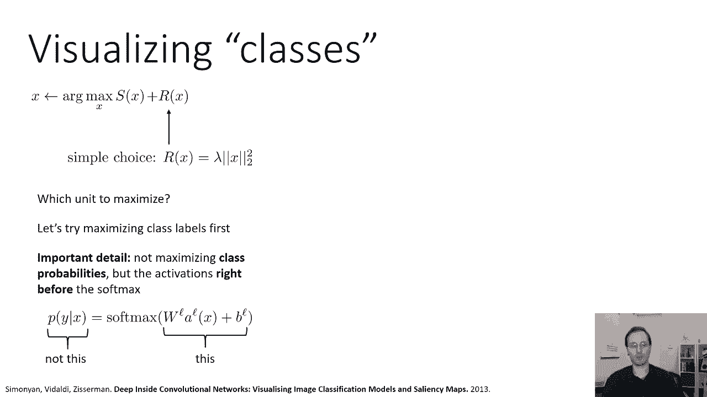
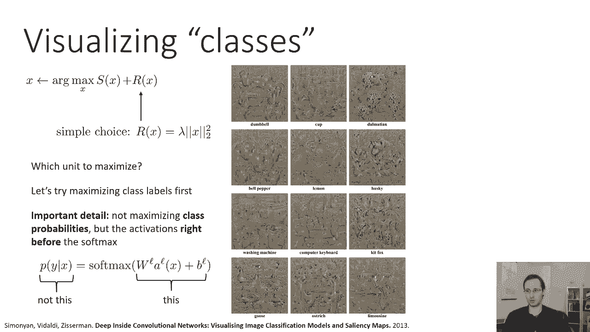
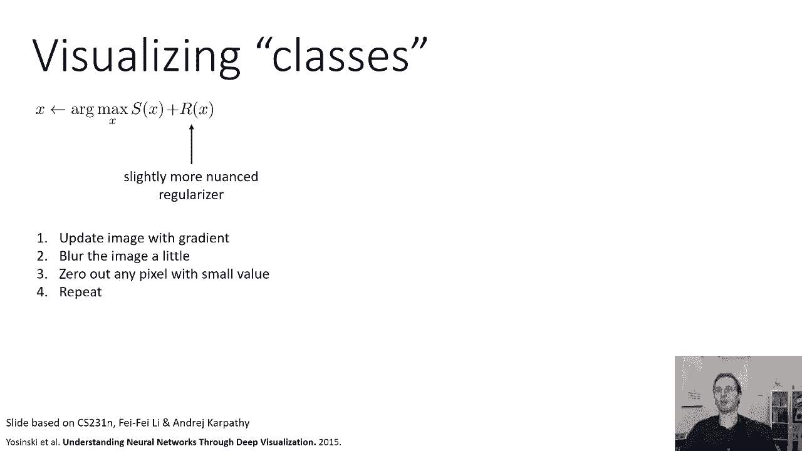
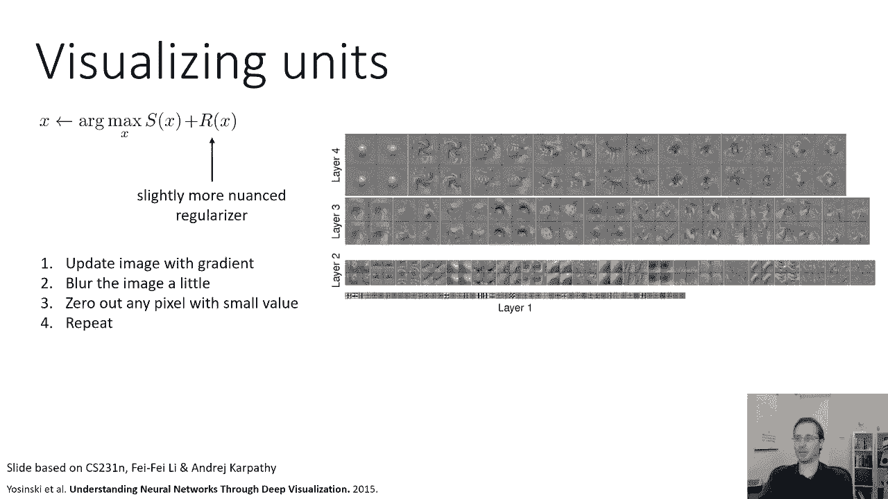

# CS 182 课程笔记：第9讲 - 第2部分：可视化与风格迁移 🎨

在本节课中，我们将学习如何通过反向传播来可视化神经网络的特征，并探索如何通过优化图像来最大化特定神经元或类别的激活。我们将讨论如何生成能够代表网络“想法”的图像，并了解如何通过正则化技术使这些生成的图像更符合人类的感知。

---

上一节我们讨论了如何可视化梯度。本节中，我们来看看如何通过优化图像本身来最大化特定单元的激活。

我们之前尝试找到激活某个单元的图像区域，并分析哪些像素负责激活。现在，我们将尝试生成整个图像区域，甚至是从网络中完全生成的图像。

之前我们计算了给定图像中哪些像素会影响特定单元。现在我们要做的是计算特定单元相对于图像的导数，然后修改图像以激活该单元。这种方法很好，因为我们实际上不需要任何特定的初始图像。我们可以从一个完全随机的图像（如随机噪声）开始，然后迭代修改以优化它，使其最大限度地激活特定单元。这可能更好，因为它提供了对单元功能的更公正的调查，而不是在现有图像中寻找激活。

如果我们只是简单地使用这个程序，它可能不会很好地工作。那么，这个优化问题具体是什么呢？它是试图找到图像 `x`，使得激活 `a(x)` 最大化。更一般地，我们可以将其视为找到一个 `x`，以最大化某个目标函数 `S(x)`，其中 `S(x)` 可以指单元或类别标签的任何组合。例如，我们可能希望在所有图像位置最大化特定过滤器的激活，或者最大化特定类别的概率，试图找到网络认为的该类别的原型图像。

这个方法本身效果不佳的原因是，它太容易产生真正疯狂的图像。回想一下猫神经衍生物的图片，如果我们想优化图像以更好地激活这个单元，我们可以看到该单元在猫眼睛变得更蓝时有正导数。因此，如果我们把蓝色通道设置为一个非常大的值，它会创造出拥有巨大、无限明亮蓝眼睛的“超级猫”。单元会对此印象深刻，但这不是我们想要的。我们不想要疯狂的图像，我们希望以某种方式限制这个过程，使产生的图像更符合感知。

因此，我们需要某种正则化器来防止生成疯狂的图像。对这些可视化技术的大量研究实际上处理了不同的方法来正则化图像，以防止这些非常极端的解决方案。

一个非常简单且通常有效的选择是简单地正则化像素激活的平方和，本质上是我们之前看到的L2范数正则化器。这是有道理的，因为如果我们有可能产生一只拥有无限明亮蓝眼睛的超级猫，这将有一个非常大的范数，正则化器会对此非常不满意，从而阻止这个解决方案。虽然它不能阻止所有极端情况，但总体而言，它是一个明智的正则化器。

因此，如果我们加上这个正则化器，然后进行优化，我们需要决定最大化哪个单元。让我们从选择 `S(x)` 作为类别标签开始，这样更容易理解。这意味着我们试图找到最大化网络对“火烈鸟”类别置信度的图像。

使其工作的一个重要细节是：不是最大化类别的概率，而是希望在Softmax函数之前最大化激活值。这意味着在最后一层，有一个线性层输出值，然后输入到Softmax。我们希望最大化这个线性输出值，而不是Softmax后的概率。原因在于Softmax函数会除以所有其他类别的激活值。如果你最大化概率，你可能会得到一个非常疯狂的图像，它不太可能是其他类别，因此更有可能是目标类别。但如果你在Softmax之前最大化激活值，你实际上是在优化与特定类别最相似的东西。

以下是论文《深度卷积网络的可视化：图像分类模型和显著性图》中的一些结果。当然，这些图像不太逼真，因为它们不是从任何真实的照片开始的。它们从一些基本噪声开始，然后运行梯度下降过程并加上正则化器，生成在网络中最大限度地激活该类别的图像。

但是如果你仔细观察这些照片，你可以看到有一些合理的模式出现。例如，左上角的“哑铃”图像绝对不像真实的哑铃，但它看起来确实像两个重物中间夹着一根棍子。斑点狗的图片绝对不像真实的狗，但里面肯定有一些斑点。这表明，当模型试图将某物归类为斑点狗时，它寻找的是斑点。电脑键盘的图像中有一些看起来像按钮的矩形网格。基特狐狸的图像有狐狸脸部的形状。左下角的鹅也明显有一些鹅的轮廓。

这可能会让我们对这些网络寻找的东西有一点了解。例如，它暗示如果图片中有一只鹅，你要把那只鹅复制二十倍，会更像鹅。所以，鹅越多，越像鹅。这也表明这个网络不太关心形状的特定轮廓，就网络而言，斑点狗真的就是关于斑点纹理。

因此，这可以让我们了解网络可能擅长什么，以及它可能不太擅长什么。

以下是另一篇论文《通过深度可视化理解神经网络》中的一些可视化结果。它采用了相似的原则，但使用了一个更细致的正则化器。他们使用的正则化器有点难以表达为一个简单的函数，但程序如下：使用梯度更新图像，然后对图像进行轻微模糊处理。直觉上，这样做可以防止优化器产生真正疯狂的、愚弄分类器的高频细节。模糊处理倾向于强调低频信息的重要性，从而产生更连贯的形状。这可以防止微小的噪声扰乱网络。然后重复这个过程：用梯度更新、模糊、将非常小的激活值降至零，并重复。

这是他们为特定类别生成的图像。这些可视化现在开始看起来更容易解释。例如，火烈鸟的图像实际上有看起来像火烈鸟的轮廓。对于“心兽”（可能是某种长着鹿角的动物），图像中反复出现长着大鹿角的鹿一样的头。台球桌的图像中肯定有桌子的形状。旅行车的图像中，你几乎可以看到一些窗户和一两个轮子。所以，一些合理的模式正在发生。

利用同样的方法，也可以分析哪些图像区域能最大限度地激活特定层。在这里，他们选择了一个类别，然后在该类别的特定层最大化激活。你可以看到，在“海盗船”类别的第八层，它往往有一个更全面的视图，你实际上可以看出有一些带桅杆的帆船。而在第七层，它看到了一些更精细的细节，类似于温莎领带。当我们进入较低的层时，事情变得更抽象，因为这些层的感受野更小。例如，在第四层，它实际上是在看基本的几何基元，如圆圈和旋转的物体，而不是整个物体。在第二层或第一层，模式则更加基础。

---

本节课中，我们一起学习了如何通过优化和正则化技术来可视化神经网络内部的特征表示。我们看到了如何生成能最大化特定类别或神经元激活的图像，并了解了正则化（如L2范数和模糊处理）对于生成可感知图像的重要性。这些技术帮助我们更好地理解神经网络“看到”和“思考”世界的方式。