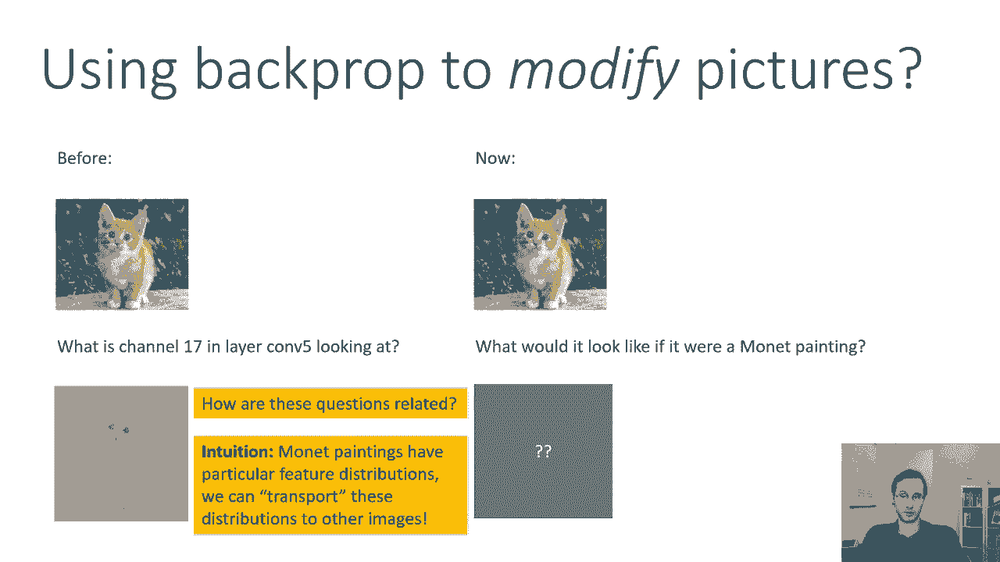
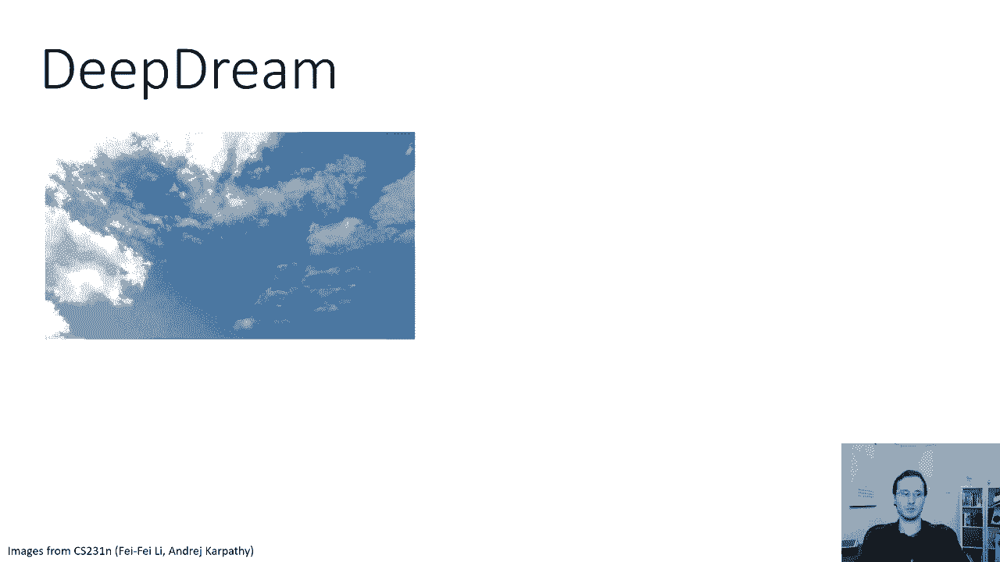
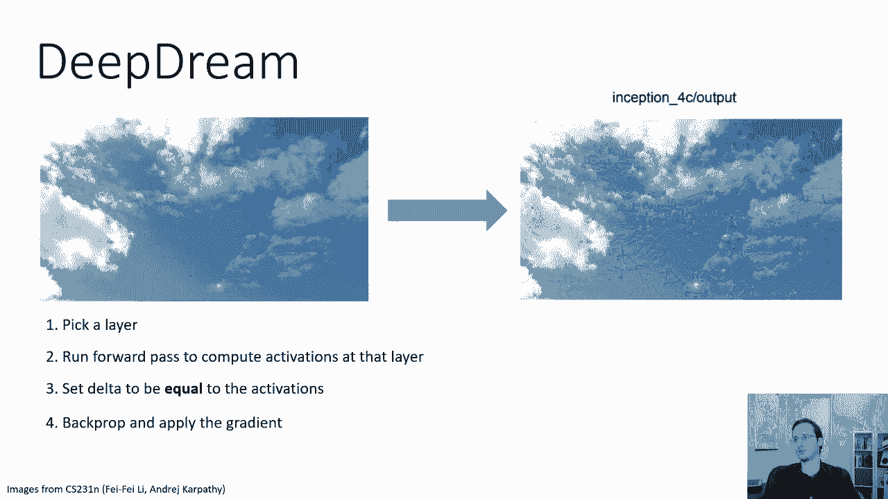
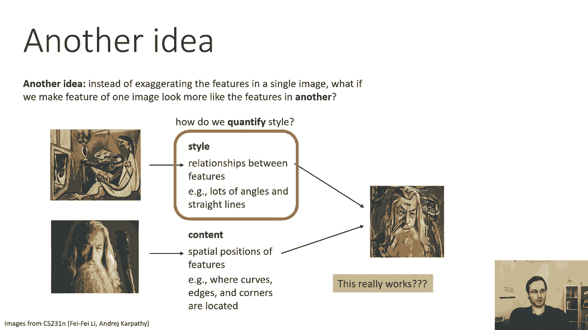
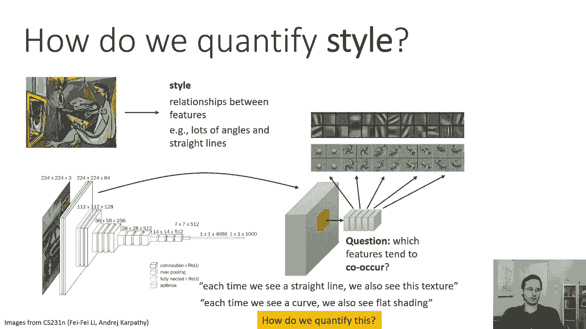
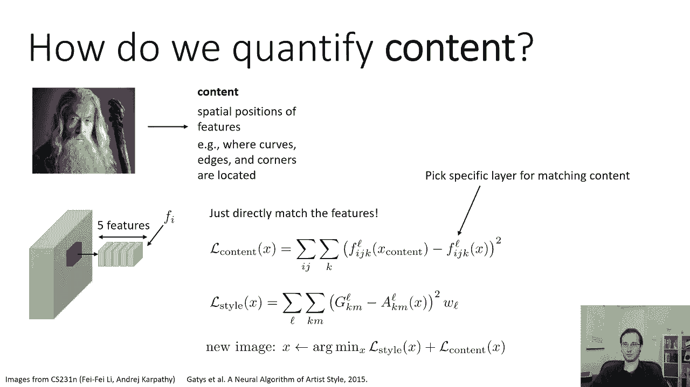
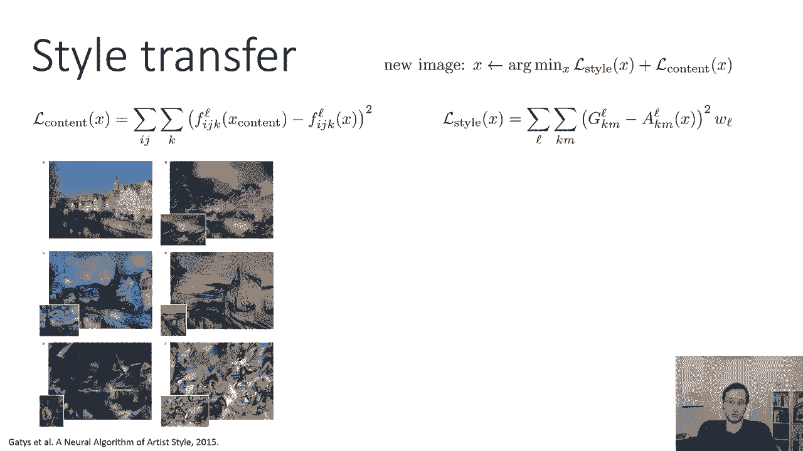

# 29：CS 182 讲座 9 - 第 3 部分：可视化与风格迁移 🎨

在本节课中，我们将学习如何利用卷积神经网络（CNN）的特征表示来修改图像。我们将探讨两种技术：**DeepDream** 和**神经风格迁移**。前者用于放大图像中网络“看到”的模式，后者则用于将一幅图像的风格应用到另一幅图像的内容上。



---

## 🧠 DeepDream：放大网络“幻觉”



上一节我们介绍了如何可视化CNN的过滤器。本节中，我们来看看如何利用类似的技术来主动修改图像，使其更符合网络对特定特征的“认知”。这种技术被称为 **DeepDream**。

其核心思想是：给定一张输入图像，我们选择CNN的某一层，计算其激活值，然后通过梯度上升（而非下降）来修改输入图像，以**增大该层激活值的总和**。这会使网络在该图像中“看到”的特征变得更加明显。



以下是实现DeepDream的关键步骤：

1.  **选择目标层**：在预训练CNN（如VGG）中选择一个中间层。
2.  **前向传播**：将输入图像通过网络，计算目标层的激活值 `A`。
3.  **设置梯度**：将损失函数 `L` 定义为该层激活值的总和，即 `L = sum(A)`。反向传播时，目标层激活的梯度被设置为 `1`。
4.  **梯度上升**：计算损失相对于输入图像的梯度，并使用该梯度来**增加**（而非减少）激活值总和，从而修改输入图像。
5.  **加入抖动**：在每次迭代中对图像施加微小的随机平移（抖动），以防止优化过程陷入局部极值并产生不自然的像素级 artifacts。

以下是一段简化的伪代码，描述了核心循环：

```python
# 假设：model是预训练CNN，layer是目标层，image是输入图像
for i in range(num_iterations):
    # 1. 加入微小抖动
    image = jitter(image)
    # 2. 前向传播，获取目标层激活
    activations = model.forward_up_to_layer(image, layer)
    # 3. 损失即为激活值之和
    loss = activations.sum()
    # 4. 计算损失相对于输入图像的梯度
    gradient = model.backward_from_layer(loss, layer)
    # 5. 梯度上升：沿梯度方向更新图像以增大激活
    image = image + learning_rate * gradient
```

从一张普通的云朵图片开始，经过DeepDream处理，网络可能会强化其中类似动物或物体的微弱模式，从而生成充满奇幻细节的图像。

---

## 🖼️ 神经风格迁移：融合内容与风格

DeepDream关注于单张图像内部的模式放大。现在，我们提出一个更复杂的问题：如何将一幅图像（如名画）的**风格**，与另一幅图像（如照片）的**内容**结合起来？这就是**神经风格迁移**。



直觉是：图像的“风格”可以由CNN特征之间的统计关系（如协方差）来刻画，而“内容”则由特征在空间上的具体位置来体现。

### 如何量化风格：Gram矩阵

我们使用 **Gram矩阵** 来量化风格。对于CNN的某一层，其激活图尺寸为 `[height, width, num_channels]`。我们忽略空间位置信息，计算不同通道（即不同特征过滤器）激活值之间的相关性。



Gram矩阵 `G` 的计算公式如下：
`G[l]_{k, m} = Σ_i Σ_j F[l]_{i, j, k} * F[l]_{i, j, m} / N`
其中：
*   `l` 表示第 `l` 层。
*   `F[l]` 是该层的激活。
*   `i, j` 遍历所有空间位置。
*   `k, m` 遍历所有通道（特征过滤器）。
*   `N` 是归一化常数（如总像素数 `height * width`）。

**Gram矩阵的物理意义**：其元素 `G_{k, m}` 代表了特征 `k` 和特征 `m` 在整个图像中同时出现的程度。它捕捉了纹理、笔触等风格信息，但丢弃了物体的空间布局信息。

### 如何量化内容：特征激活匹配

内容则相对直接。我们选择CNN中较高的一层（能捕捉物体整体形状而非细节），并直接最小化生成图像与内容图像在该层激活值之间的差异。

内容损失 `L_content` 通常使用均方误差（MSE）：
`L_content = Σ_i, j, k (F[l]_gen_{i, j, k} - F[l]_content_{i, j, k})^2`
这里我们**保留空间位置 `(i, j)`**，强调物体形状和布局的匹配。

### 总损失与优化

风格迁移的目标是生成一张新图像 `X`，它同时匹配内容图像的内容和风格图像的风格。因此，总损失函数是内容损失和风格损失的加权和：
`L_total = α * L_content + β * L_style`
其中：
*   `L_style = Σ_l w_l * || G[l]_gen - G[l]_style ||^2`，即各层Gram矩阵的差异之和，`w_l` 是各层的权重。
*   `α` 和 `β` 是超参数，用于控制内容与风格的相对重要性。

优化过程从一张随机噪声图像（或内容图像的副本）开始，通过梯度下降不断调整像素值，以最小化 `L_total`。

通过精心选择网络层和超参数，该算法能生成令人惊叹的结果，例如将照片转换为具有梵高《星夜》风格或毕加索立体派风格的画作。



---

## 📝 总结

本节课中，我们一起学习了两种基于CNN特征操作的高级图像处理技术：



1.  **DeepDream**：通过梯度上升最大化CNN特定层的激活，来放大和“幻觉化”输入图像中存在的模式。其核心是**修改图像以增强网络已检测到的特征**。
2.  **神经风格迁移**：通过分离和重组图像的“内容”与“风格”，将一幅画的风格应用到另一幅图的内容上。其核心工具是：
    *   **Gram矩阵**：用于量化风格（特征间的统计关系）。
    *   **特征激活匹配**：用于保留内容（特征的空间布局）。

这两种技术展示了深度神经网络特征表示的力量，不仅可用于理解模型，还能直接用于创造性的图像生成和艺术创作。