# 30：CS 182 - 第10讲 - 第1部分：循环神经网络 📚

在本节课中，我们将要学习循环神经网络的基本概念。循环神经网络是一种能够处理可变长度序列数据的神经网络结构，广泛应用于自然语言处理、语音识别和视频分析等领域。

## 🧠 概述：处理可变长度输入

到目前为止，我们讨论的神经网络通常处理固定尺寸的输入，例如一张由固定像素组成的图像。然而，在许多实际应用中，输入是可变长度的序列，例如英语句子、音频片段或视频帧序列。

一个简单的处理方法是填充所有序列至最大长度，例如用零填充短序列。这种方法对于短序列效果尚可，但无法很好地扩展到非常长的序列，因为填充会导致输入变得非常大且难以处理。

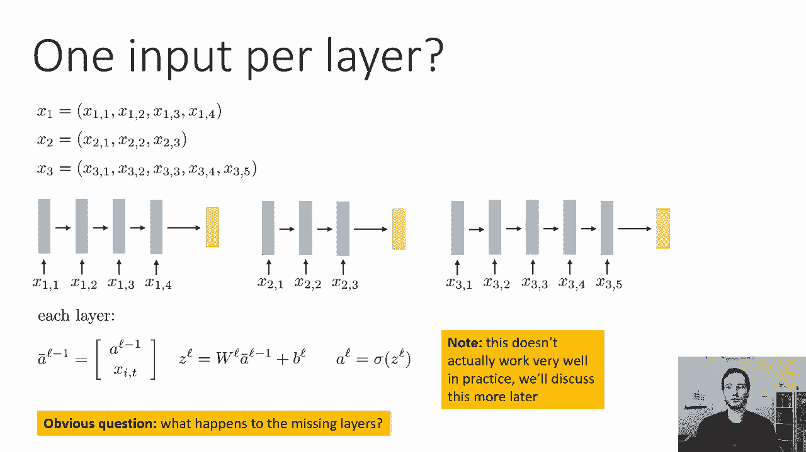

## 🔄 循环神经网络的基本设计

上一节我们介绍了处理可变长度输入的挑战，本节中我们来看看循环神经网络的核心设计思想。

循环神经网络采用了一种不同的方法。其基本思想是：网络的层数等于输入序列的长度。每一层接收两个输入：前一层的激活值和当前时间步的输入值。第一层之前的激活值被设为零向量。

以下是每一层的核心计算步骤：
1.  将前一层的激活值 `a_{l-1}` 与当前输入 `x_t` 连接（concatenate）起来，形成一个新向量。
2.  对这个连接后的向量进行线性变换：`z_l = W_l * [a_{l-1}; x_t] + b_l`。
3.  对 `z_l` 应用非线性激活函数（如 ReLU），得到当前层的激活值 `a_l = σ(z_l)`。

在这个设计中，每一层似乎都有自己独立的权重矩阵 `W_l` 和偏置 `b_l`。然而，这会导致一个问题：对于很长的序列，我们需要非常多的权重矩阵，且序列前部的权重可能因训练数据不足而得不到充分训练。

## 🤝 权重共享：从可变深度到循环

为了解决上述问题，循环神经网络引入了**权重共享**的关键概念。这意味着，在所有时间步（或网络层）中，我们都使用**相同的**权重矩阵 `W` 和偏置 `b`。

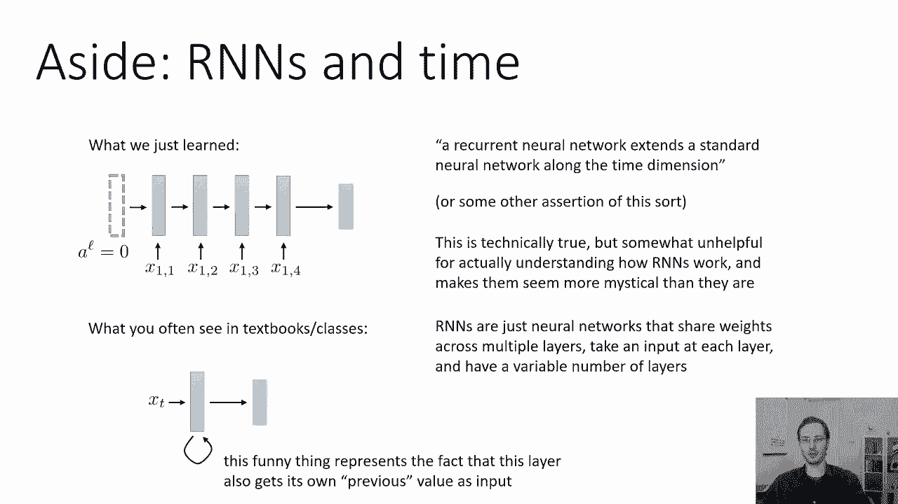

因此，核心公式变为：
`z_t = W * [a_{t-1}; x_t] + b`
`a_t = σ(z_t)`

其中，`t` 代表时间步。权重共享带来了巨大优势：
*   **参数效率**：无论序列多长，我们只需要学习一组参数 `(W, b)`。
*   **泛化能力**：模型在处理序列中任何位置的数据时，都使用相同的知识（参数）。
*   **处理任意长度**：理论上，训练好的模型可以处理比训练时所见更长的序列。

这种设计也常被描绘成一个随时间展开的网络，其中同一层（同一组参数）在每一个时间步被重复使用，并接收上一个时间步的输出作为输入，从而形成了“循环”的结构。

## 🧮 训练循环神经网络：反向传播的调整

我们已经了解了RNN的前向传播过程。接下来，我们看看如何训练它，这需要对标准的反向传播算法进行一些调整。

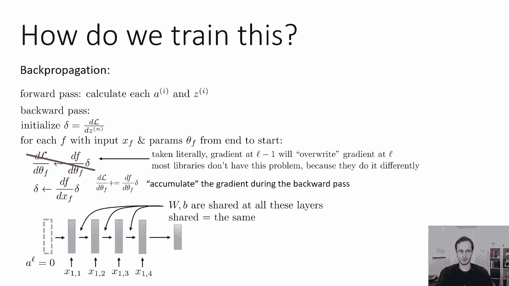

主要挑战在于参数是跨时间步共享的。在标准反向传播中，我们计算每一层参数的梯度并直接更新。但在RNN中，共享参数 `W` 和 `b` 对序列中每一个时间步的损失都有贡献。

因此，计算损失 `L` 对参数 `θ`（即 `W` 或 `b`）的梯度时，我们需要将所有时间步的贡献**累加**起来。

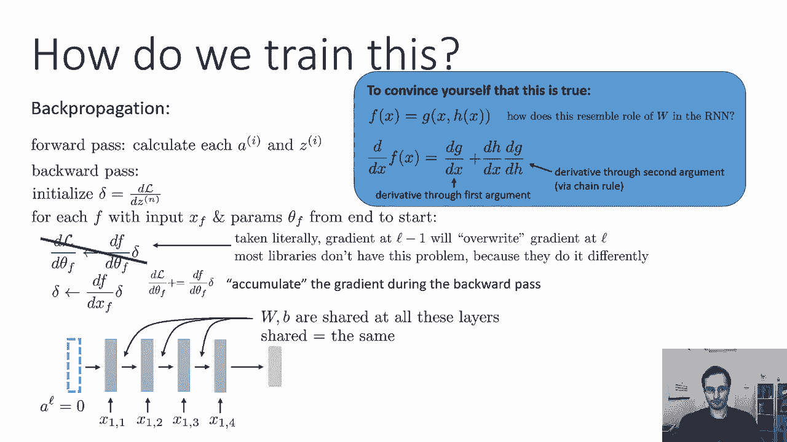

具体调整如下：
1.  初始化参数梯度 `dL/dθ` 为0。
2.  在反向传播过程中，当计算到第 `t` 时间步时，我们会得到该时间步的局部梯度 `(dL/dθ)_t`。
3.  我们不覆盖全局梯度，而是将其累加：`dL/dθ += (dL/dθ)_t`。
4.  最终，使用这个累积的梯度来更新参数。

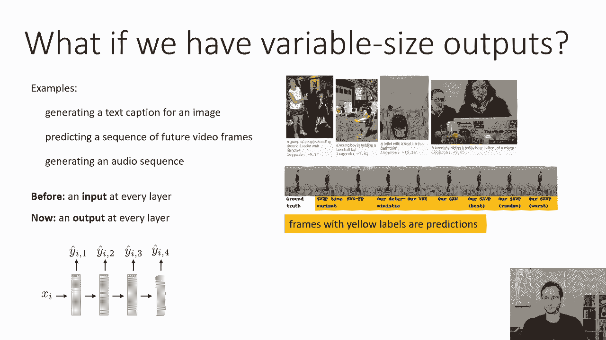

这确保了参数更新考虑了其在所有时间步上的总影响。

## 📊 处理多输出序列：序列到序列模型

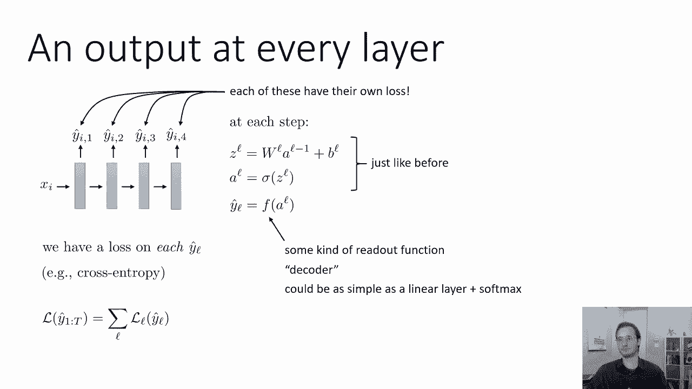

上一节我们介绍了如何处理多输入，本节中我们来看看当模型需要在每个时间步都产生输出时该怎么办。这在序列生成任务中很常见，例如为图像生成文本描述（图像是单一输入，文本是序列输出），或者预测视频的未来帧。

以下是基本的多输出RNN设计：
*   在每个时间步 `t`，网络像之前一样计算隐藏状态 `a_t`。
*   然后，`a_t` 会通过一个额外的“读出”或“解码器”函数 `f` 来生成该时间步的输出 `ŷ_t`。`f` 可以是一个简单的线性层加Softmax（用于分类），也可以是更复杂的网络。
*   每个输出 `ŷ_t` 都会与一个真实标签 `y_t` 比较，并计算一个损失 `L_t`（例如交叉熵损失）。
*   序列的总损失是各个时间步损失之和：`L_total = Σ L_t`。

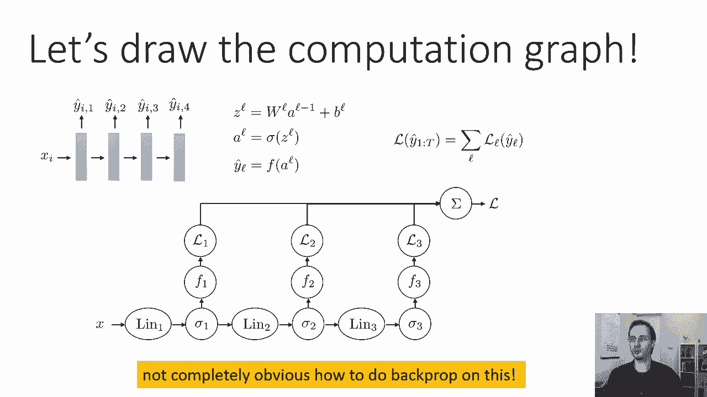

训练这种网络需要处理计算图中的分支问题，因为每个隐藏状态 `a_t` 同时贡献给当前输出 `ŷ_t` 和下一个时间步的隐藏状态 `a_{t+1}`。

## 🕸️ 广义反向传播：处理计算图分支

为了训练具有多输出的RNN，我们需要使用广义的反向传播算法（或称反向模式自动微分）。其核心规则是处理节点有多个下游节点的情况。

规则很简单：在反向传播时，如果一个节点的输出被多个后续节点使用，那么传播回该节点的梯度（δ）应该是从所有后续节点传来的梯度之和。

以下是计算步骤：
1.  从最终损失 `L_total` 开始反向传播。
2.  对于计算图中的每个节点（代表一个操作，如线性层或激活函数），它会收到来自其所有直接后继节点的梯度 `δ_in`。
3.  如果该节点有多个后继，则将接收到的所有 `δ_in` 相加。
4.  然后，该节点计算其关于输入的梯度 `δ_out`（用于继续反向传播）和关于其参数的梯度（用于更新），计算方式与标准链式法则相同。

通过这种方式，梯度可以正确地通过具有分支的计算图（如多输出RNN）进行反向传播，确保所有参数都根据其对总损失的整体贡献进行更新。

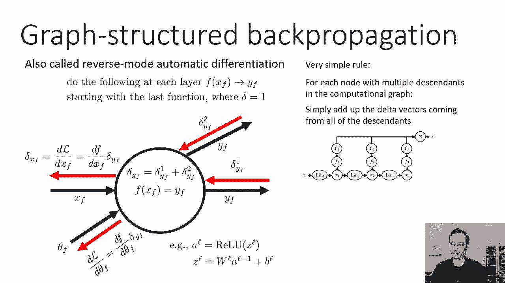

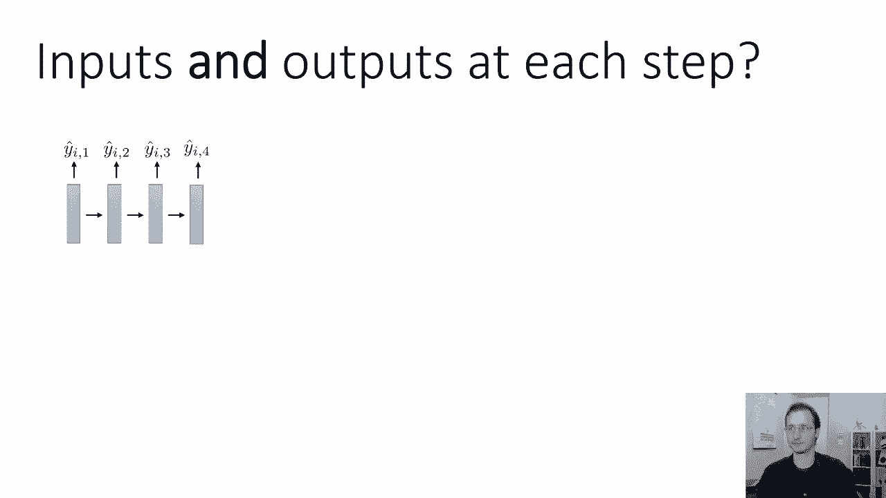

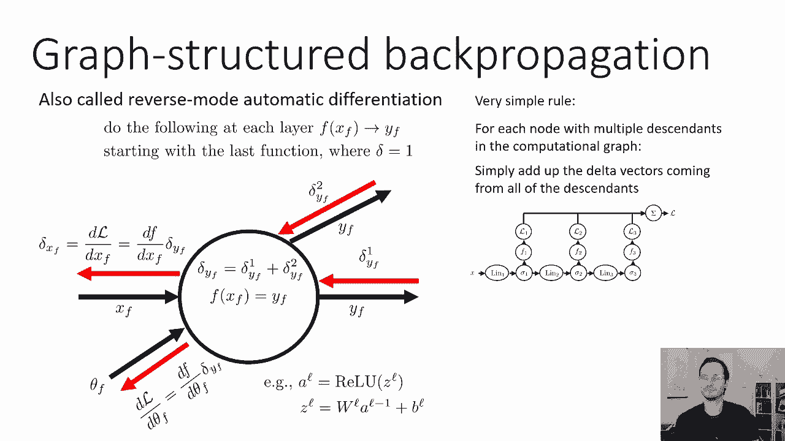

## 🎯 总结

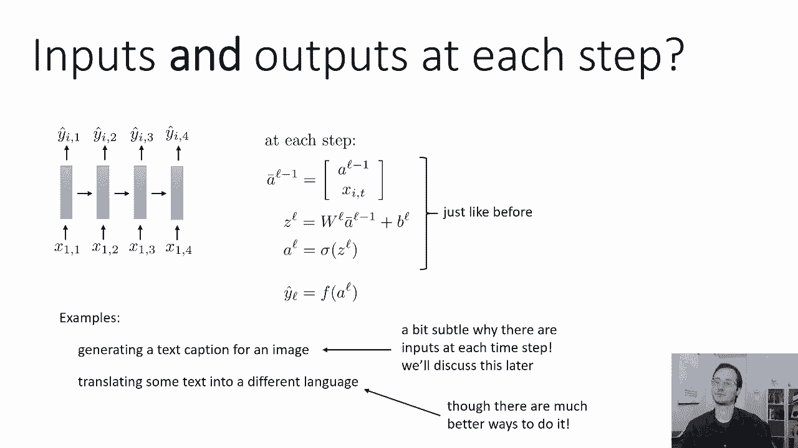

本节课中我们一起学习了循环神经网络的基础知识。我们首先了解了处理可变长度输入的必要性，然后探讨了RNN的核心设计：通过权重共享的“可变深度”网络来处理序列。我们详细介绍了其前向传播过程，并学习了如何通过调整反向传播（梯度累加和广义反向传播）来训练这种网络。最后，我们将其扩展到多输出场景，构成了强大的序列到序列模型的基础。理解这些概念是掌握更高级RNN变体（如LSTM、GRU）和序列建模任务的关键。