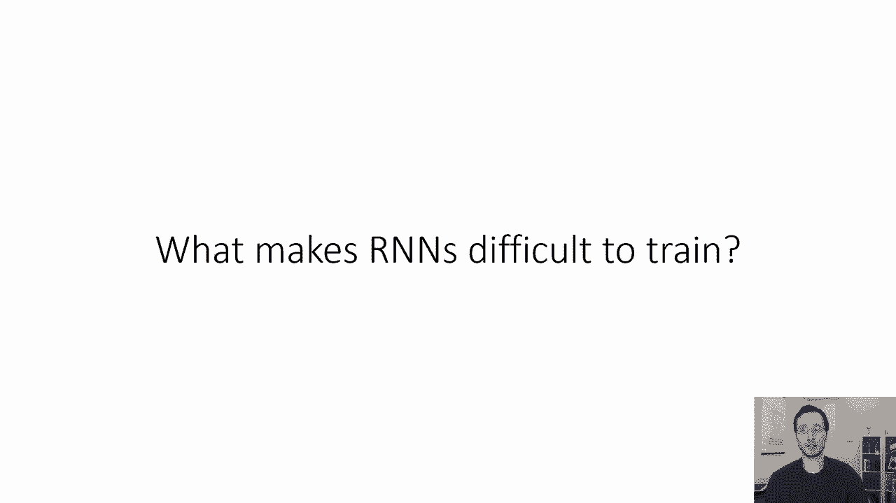
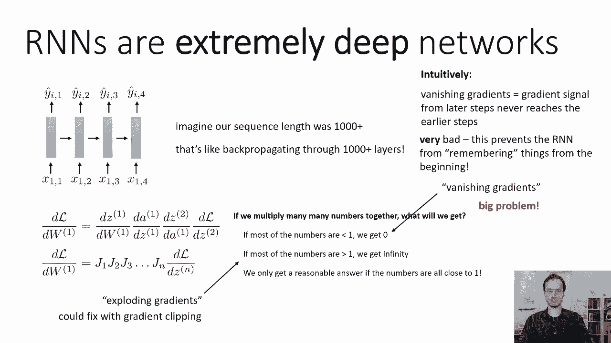
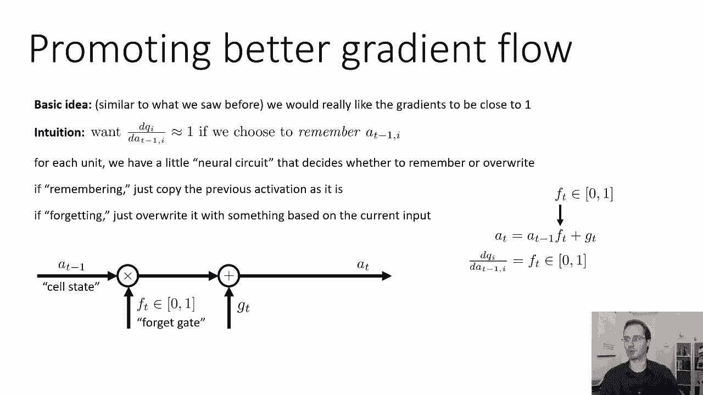
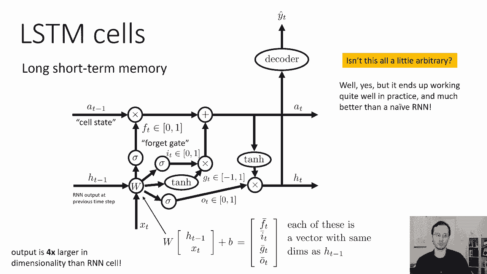
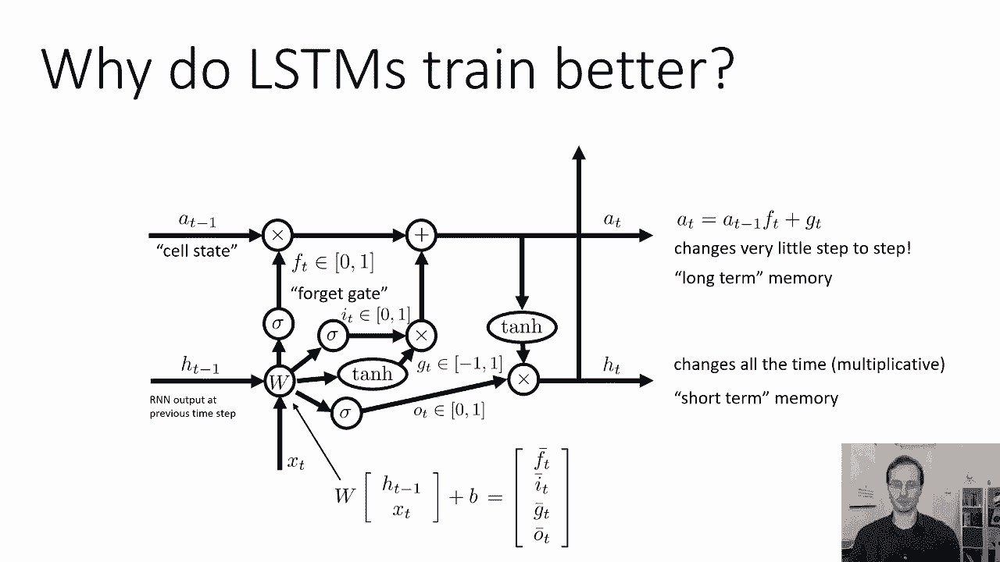
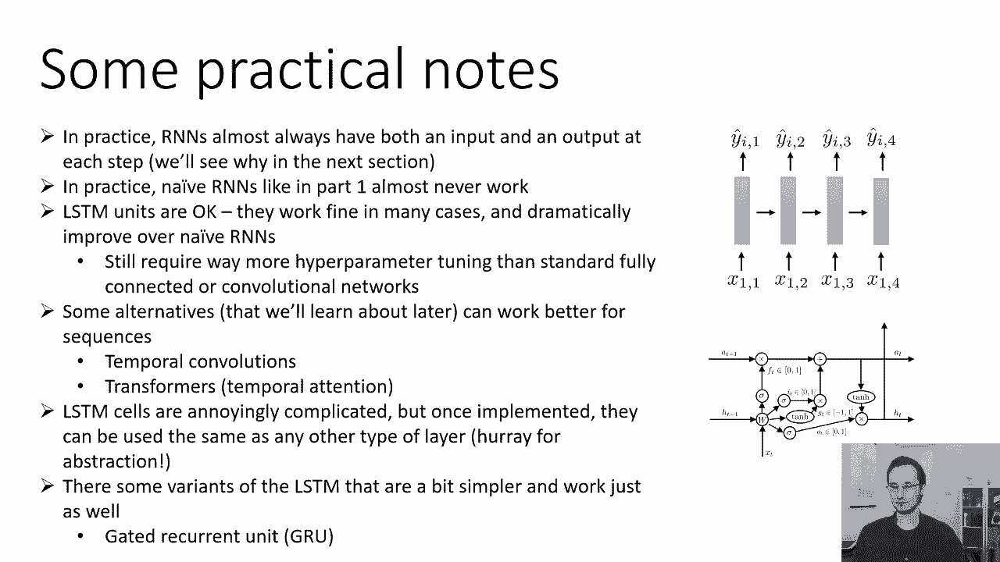

# 31：CS 182 第10讲 第2部分 - 循环神经网络 🧠

在本节课中，我们将学习如何有效地训练循环神经网络。我们将探讨训练RNN时遇到的核心挑战——梯度消失与爆炸问题，并介绍一种强大的解决方案：长短期记忆网络。

---

## 训练RNN的挑战 🧗

上一节我们介绍了RNN的基本工作原理，本节中我们来看看如何训练它们。

RNN在最基本的层面上是非常深的网络。在实践中，我们可以使用序列长度为100甚至1000的RNN。因此，它们变成了非常非常深的网络。参数在不同层之间共享的事实也使计算更具挑战性。你可以把它看作是一个参数：第一步的参数对下游的步骤有巨大的影响，因为这些影响会叠加在一起。而最后一步的参数可能影响相对较低。这就产生了一些数值问题。

想象一下我们的序列长度是一千，这就像反向传播需要通过一千多层。我们之前看到，如果应用链式法则，这和将一大堆不同的矩阵相乘是一样的。如果我们把许多数字乘在一起，如果有足够多的数字，我们只会得到两种情况：
*   如果数字都小于1，那么结果趋近于零。
*   如果数字都大于1，那么结果趋近于无穷大。

所以，我们只有在相乘的所有数字都接近1时，才能得到合理的答案。我们在乘什么呢？是所有这些层的雅可比矩阵。因此，我们希望这些雅可比矩阵的特征值接近1。如果它们不接近1，那我们就有麻烦了。
*   如果它们小于1，我们会遇到所谓的**梯度消失**，这意味着梯度的大小随着层数呈指数下降。
*   如果它们大于1，我们会遇到所谓的**梯度爆炸**，这意味着梯度的大小随着层数呈指数增长。

为什么是指数级的？因为我们将所有这些数字相乘在一起。如果我们有五层，每层的特征值数量级为 `C`，那么总的系数就是 `C^5`，所以它是指数级的步数。因此，我们真的希望这些雅可比矩阵的特征值接近1。

爆炸梯度并不太难处理，因为我们总是可以**裁剪梯度**来防止它们爆炸。RNN最大的挑战来自**梯度消失**。

---

## 梯度消失的直观解释 🤔

RNN中的梯度消失有一个相当简单直观的解释。如果你的梯度消失了，这意味着来自后面时间步的梯度信号永远无法到达前面的时间步。因此，你在某个时间步产生的损失，对网络在更早时间步的行为几乎没有影响。

当这种情况发生时，你的神经网络变得无法维持长期记忆。也许你在第3步看到了一些信息，这对于在第900步得到正确答案至关重要。但如果第900步的梯度信号永远无法传回第3步，那么网络就永远不会知道它需要在第3步记住那个信息，以便在第900步使用它。这非常糟糕，它阻止了RNN记住长期信息。因此，我们真的非常想解决这个问题。

---

## 促进梯度流动的方法 🛠️

那么，我们可以做些什么来促进RNN中更好的梯度流动呢？基本思想与我们之前看到的相似：我们真的希望当前时间步的梯度接近1。

我们具体关心的是哪个梯度？在每一层，我们执行一个操作：我们将先前的激活 `a_{t-1}` 与当前输入 `x_t` 连接起来，应用线性运算，然后应用非线性激活函数。我们可以称之为RNN动态函数，用字母 `Q` 表示。所以这个运算是：
`a_t = Q(a_{t-1}, x_t)`

当我们谈论梯度消失时，我们关心的特殊导数是RNN动态函数的雅可比矩阵，即 `dQ / da_{t-1}`（`Q` 相对于先前激活的导数）。如果我们只关心良好的梯度流动，我们真的希望这个导数接近单位矩阵，或者至少其特征值接近1。因为如果是这样，那么梯度既不会消失也不会爆炸。

当然，我们并不想总是强迫这个导数正好是单位矩阵，因为有时我们确实想忘记信息，有时我们想以各种有趣的方式改变它们。所以仅仅强迫它是单位矩阵是行不通的。你只想在需要记住信息时让它接近单位矩阵。

所以，在某些时候，你只是想：至少对于激活向量中的某些坐标，我们只需要记住它们，让它们保持不变。也许对于其他坐标，你希望合并新的输入。但你并不总是希望这样，有时你确实想修改甚至丢弃这些激活中的信息。所以，我们需要一个设计，让网络可以决定它想记住什么。当它决定要记住时，导数应该接近单位矩阵；当它想忘记时，导数可能接近零。

---

## LSTM：长短期记忆网络 🏰

这里有一个有趣的RNN设计，或多或少地完成了这个目标。直觉是，对于向量 `a_{t-1}` 中的第 `i` 个条目：
*   如果你想记住它，那么 `da_t[i] / da_{t-1}[i]` 应该接近 `1`。
*   如果你想忘记它，那么 `da_t[i] / da_{t-1}[i]` 应该接近 `0`。

我们要做的是，为每个单元设计一个小型神经回路，来决定是记住还是忘记。我们将有一个称为**细胞状态**的东西（用 `a_{t-1}` 表示，有时人们用 `C` 表示）。我们要将细胞状态 `a_{t-1}` 乘以一个介于0到1之间的数字 `f_t`（称为**遗忘门**）。直觉上，如果它被设置为0，那你就忘了之前的内容；如果设置为1，那你就记住了它。然后，我们要通过添加一些东西 `g_t` 来修改它。

所以新的细胞状态 `a_t` 是：
`a_t = a_{t-1} * f_t + g_t`

直觉上可以这样理解：
*   如果 `f_t` 接近0，那么就用 `g_t` 替换细胞状态。
*   如果 `f_t` 接近1且 `g_t` 接近0，那么就保持细胞状态不变。
*   如果 `f_t` 接近1且 `g_t` 不为0，那么就以附加的方式修改细胞状态。

现在，关键是我们从哪里得到 `f_t` 和 `g_t`？这就是LSTM设计中更复杂的部分。

---

### LSTM单元详解

以下是LSTM单元的完整设计。它可能看起来有点复杂，但每个部分都有其理由。

在时间步 `t`，我们从前一步得到两个状态：细胞状态 `a_{t-1}` 和隐藏状态 `h_{t-1}`。我们还有当前输入 `x_t`。

我们要做的第一件事是形成一个新向量，将 `h_{t-1}` 和 `x_t` 连接起来：`[h_{t-1}, x_t]`。然后，我们对其应用一个线性层。这个线性层的输出维度是普通RNN的**四倍**。我们将这个四倍的输出分成四个部分，每个部分都是一个向量，维度与 `h_{t-1}` 相同：
1.  `f_t_bar` -> 遗忘门候选
2.  `i_t_bar` -> 输入门候选
3.  `g_t_bar` -> 细胞状态修改候选
4.  `o_t_bar` -> 输出门候选

以下是每个部分的处理流程：

1.  **遗忘门 (`f_t`)**：将第一部分 `f_t_bar` 通过 `sigmoid` 函数，使其范围在0到1之间。这就成了遗忘门 `f_t`。它逐点乘以先前的细胞状态 `a_{t-1}`。
    `f_t = sigmoid(W_f * [h_{t-1}, x_t] + b_f)`

2.  **输入门 (`i_t`) 和候选值 (`~g_t`)**：
    *   将第二部分 `i_t_bar` 通过 `sigmoid` 函数，得到输入门 `i_t`，范围在0到1之间。
    *   将第三部分 `g_t_bar` 通过一个非线性函数（传统上用 `tanh`，范围在-1到1之间），得到候选细胞状态 `~g_t`。
    `i_t = sigmoid(W_i * [h_{t-1}, x_t] + b_i)`
    `~g_t = tanh(W_g * [h_{t-1}, x_t] + b_g)`

3.  **更新细胞状态 (`a_t`)**：新的细胞状态 `a_t` 由遗忘门控制的旧状态和输入门控制的新候选值组合而成。
    `a_t = f_t * a_{t-1} + i_t * ~g_t`

4.  **输出门 (`o_t`) 和隐藏状态 (`h_t`)**：
    *   将第四部分 `o_t_bar` 通过 `sigmoid` 函数，得到输出门 `o_t`。
    *   将新的细胞状态 `a_t` 通过 `tanh` 函数（将其值规范到-1到1之间）。
    *   将规范后的 `a_t` 逐点乘以输出门 `o_t`，得到新的隐藏状态 `h_t`。这个 `h_t` 也用作该时间步的输出（如果需要）。
    `o_t = sigmoid(W_o * [h_{t-1}, x_t] + b_o)`
    `h_t = o_t * tanh(a_t)`

这个设计可能看起来很复杂，但有一种方法可以让你对正在发生的事情有一些直觉：我们试图让细胞状态 `a_t` 充当一个主要的线性信号通道。实际上，我们没有对 `a_t` 直接应用非线性函数。应用于 `a_t` 的所有操作都是线性的（乘以0到1之间的数，或添加向量）。所有的非线性都应用于隐藏状态 `h_t`。

结果，`a_t` 对 `a_{t-1}` 的导数变得非常简单：`da_t / da_{t-1} = f_t`（遗忘门直接决定了它）。因此，没有任何复杂的非线性函数影响 `a_t` 的导数，这使得梯度流动表现得更好。同时，通过 `g_t` 和非线性读出来进行信息修改。

---

## 为什么LSTM效果更好？🚀

LSTM单元实际上工作得更好的最简单原因是，细胞状态 `a_t` 在每一步都以非常简单、受控的方式被修改。它的变化很小，变化的大小完全由遗忘门 `f_t` 决定。

你可以把 `a_t` 看作是**长期记忆**。循环状态的另一部分 `h_t` 一直在变化，你可以把 `h_t` 看作是**短期记忆**，它执行更复杂的非线性处理，但很难长时间保留信息。`a_t` 有一个相对简单得多的线性处理流程，但它能在很长一段时间内保留信息。

---

## 实践要点与总结 📝

关于RNN在实践中应用的一些实用笔记：

*   RNN几乎总是在每个时间步都有一个输入和一个输出。
*   像第一部分中那样朴素的RNN在实践中几乎不起作用。
*   如果你想要一个RNN，现在你可能会使用类似LSTM单元的东西。LSTM单元工作得很好，它们虽然有点复杂和武断，但比朴素的RNN要好得多。
*   它们仍然比标准的全连接或卷积网络需要更多的超参数调优（如梯度裁剪、学习率等）。
*   也有一些处理序列的RNN替代方案，在实践中可能工作得更好，例如时间卷积网络和Transformer（基于注意力机制的模型），我们将在以后学习它们。
*   LSTM单元虽然复杂，但一旦实现，它们可以像任何其他类型的层一样使用。通常，为了封装LSTM单元中的所有复杂性，你只需编写一段代码将其抽象出来，然后像使用卷积层或线性层一样使用它。
*   如果你觉得LSTM细胞的任意性和复杂性很困扰，有一些更简单的变体工作得也一样好。一种非常流行的变体叫做**门控循环单元**。GRU基本上像LSTM，但没有输出门，`h_t` 总是设置为对 `a_t` 应用某个非线性（如 `tanh`）。这也很有效。LSTM真正重要的部分基本上是遗忘门。

---

**本节课总结**：在本节课中，我们一起学习了训练循环神经网络的核心挑战——梯度消失与爆炸问题。我们深入探讨了长短期记忆网络的设计原理，了解了其通过细胞状态和门控机制（遗忘门、输入门、输出门）来维持长期记忆、促进梯度流动的巧妙方式。最后，我们了解了LSTM在实践中的应用及其一些变体。掌握LSTM是理解现代序列建模的重要一步。