# 32：CS 182 讲座 10 - 第 3 部分 - 循环神经网络 🧠

在本节课中，我们将学习如何利用循环神经网络构建解决实际问题的实用模型。我们将重点讨论自回归模型、结构化预测以及训练RNN时遇到的关键挑战和解决方案。

---

## 自回归模型与结构化预测 📝

上一节我们介绍了RNN的基本概念，本节中我们来看看如何将其应用于实际问题。在实践中，我们使用的大多数RNN具有多个输入和多个输出。这初看可能令人困惑，因为许多问题要么是单输入多输出，要么是多输入单输出。我们通常使用多输入多输出RNN的原因是，大多数需要多个输出的问题中，输出之间存在很强的依赖关系。

这类问题有时被称为**结构化预测**。之所以称为结构化预测，是因为预测的输出序列（如文本）具有内部结构，这与没有结构的单个离散标签不同。例如，一个句子是否有效，取决于其内部单词之间的关系，而不仅仅是其内容是否正确。

### 结构化预测示例

假设我们有一个简单的文本生成任务，训练集包含三个句子：
1. I think therefore I am.
2. I like machine learning.
3. I am a neural network.

我们将单词视为范畴变量。网络在第一步接收提示词“I”，然后需要预测下一个词。如果网络在每个时间步独立地从Softmax分布中采样，即使它学到了正确的概率分布，也可能生成无意义的序列（如“I think machine am”），因为它不知道上一步实际采样了哪个词。

**核心问题**：过去的输出应该影响未来的输出。
**解决方案**：将上一步的输出作为当前步的输入。这样，网络在生成“think”后，就知道下一步是在预测“I think”之后的词，而不是任意句子中的第三个词。

这种基本设计被广泛应用于需要输出结构化序列的任务，如图像描述、视频预测等。

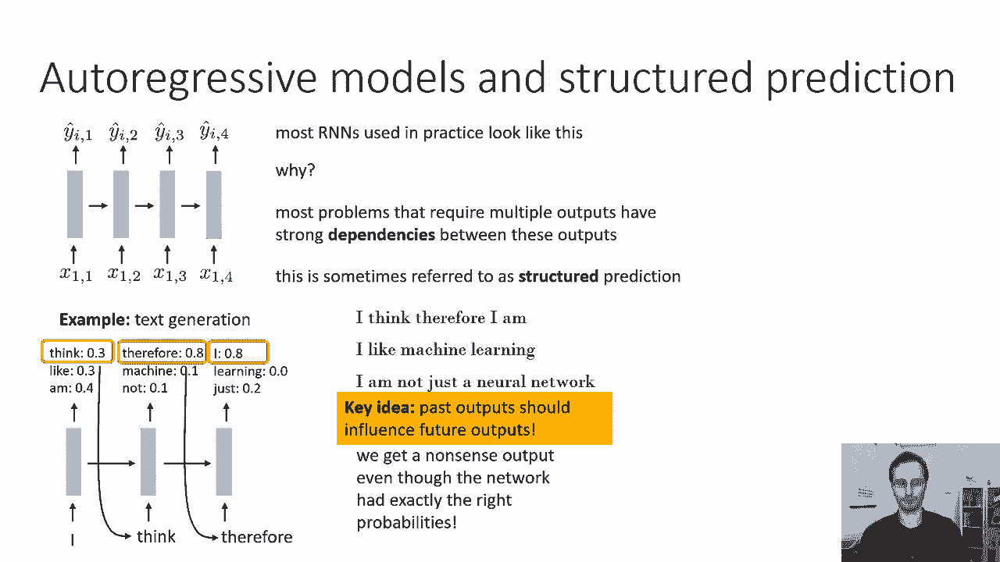

---

## 训练自回归模型 🏋️

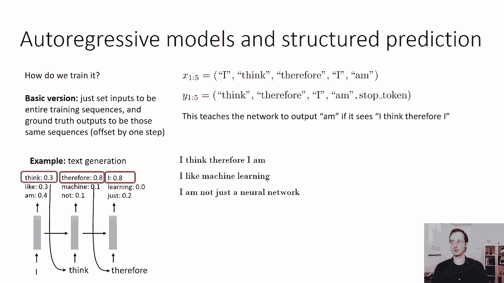

现在我们来探讨如何有效地训练这种模型。

### 基础训练方法

最直接的训练方法是：将输入设置为整个训练序列，将真实输出设置为相同的序列，但**偏移一步**。

**公式表示**：
- 输入 `X`：句子中除最后一个词外的所有词元。
- 真实输出 `Y`：所有词元向后移动一位，最后一个位置用停止符替换。

例如，对于句子“I think therefore I am”：
- 输入 `X` = [I, think, therefore, I]
- 输出 `Y` = [think, therefore, I, am, `<STOP>`]

这样，网络被训练为：看到“I”应输出“think”，看到“I think”应输出“therefore”，以此类推。在测试时，网络生成一个词元，将其作为下一步的输入，直到生成停止符。

### 分布转移问题

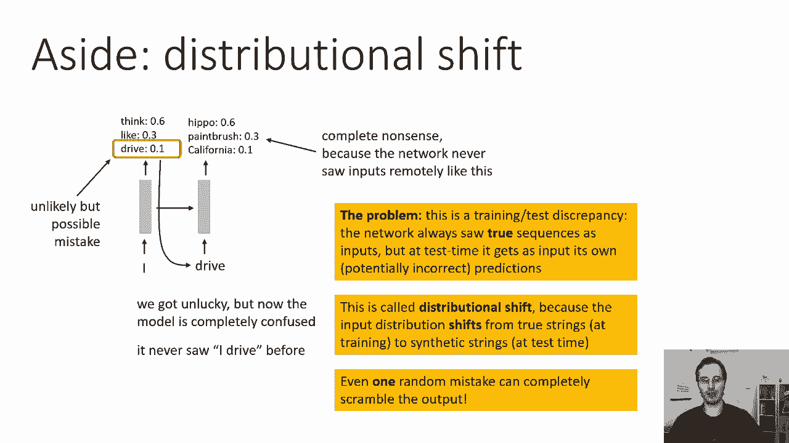

然而，上述方法存在一个潜在问题：**分布转移**。

**问题描述**：在训练时，网络总是以真实的序列作为输入。但在测试（生成）时，它接收的是自己上一步的（可能错误的）输出作为输入。即使网络在第一步只犯了一个小错误（例如，以10%的低概率采样了一个不常见的词“drive”），这个“陌生”的输入也可能导致网络在后续步骤中完全混乱，因为它从未在训练中见过这样的上下文组合，从而生成无意义的垃圾输出。

**核心矛盾**：训练分布（真实字符串）与测试分布（模型生成的字符串）不同。

---

## 解决方案：计划采样 📅

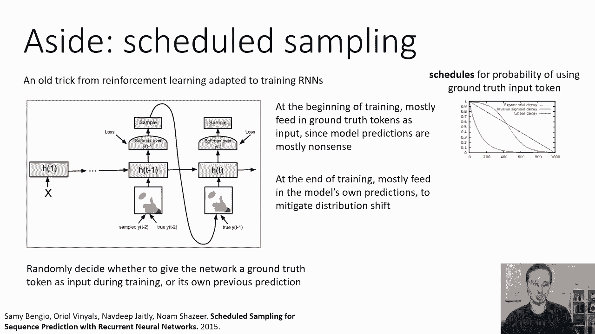

为了解决分布转移问题，我们可以采用一种称为**计划采样**的技术。

**基本思想**：在训练过程中，我们并不总是将真实的上一词元作为输入。相反，我们以一定的概率 `p` 使用真实词元，以概率 `1-p` 使用模型自己在上一步生成的输出作为当前步的输入。

**关键点**：模型无法区分输入是来自真实数据还是自己的生成，因此它必须学会处理这两种情况。

### 采样概率计划

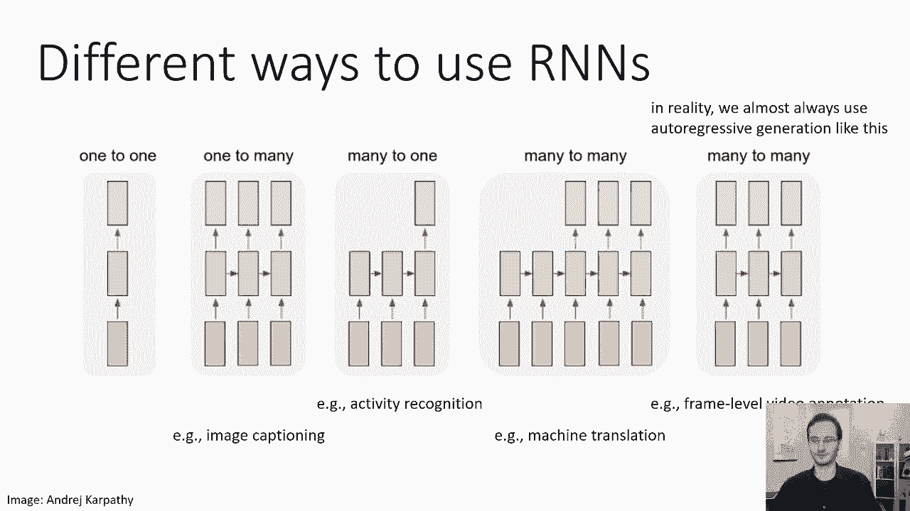

如何选择概率 `p`？
- 如果总是使用模型自己的输出（`p=0`），在训练初期模型输出质量很差，会导致训练困难。
- 如果总是使用真实输入（`p=1`），则无法缓解测试时的分布转移。

**推荐策略**：使用一个**随时间衰减的计划**。
- 训练初期：`p` 较高（例如0.9），主要使用真实输入，稳定学习。
- 训练后期：`p` 逐渐降低至0，主要使用模型自身的输出，使其适应测试时的条件。

计划可以是线性的或指数的。这确保了模型在最终训练阶段，主要学习如何根据自己过去的（已改善的）输出来生成后续内容。

---

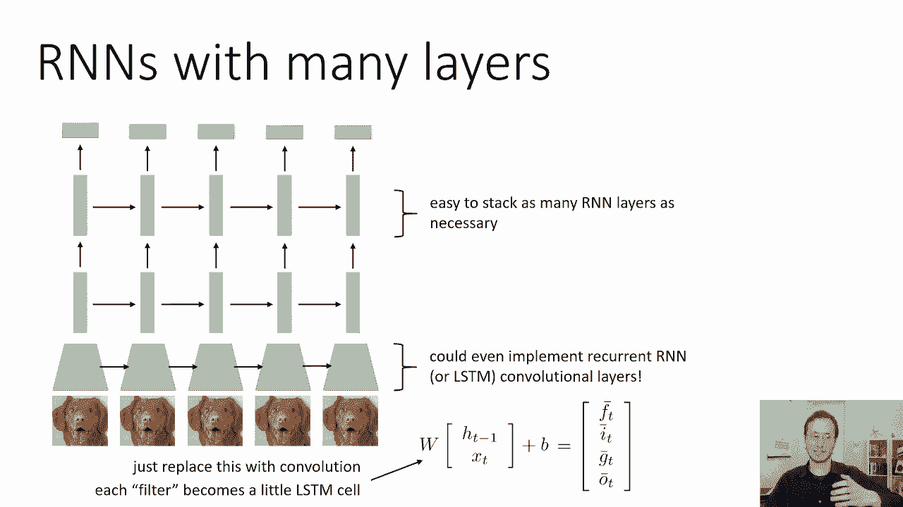

## RNN的架构变体与实现 🏗️

RNN提供了极大的灵活性，可以适配多种输入输出模式。以下是常见的几种架构：

### 1. 输入输出模式
- **一对多**：单一输入，序列输出。适用于**图像描述**（输入图像，输出文本）。
- **多对一**：序列输入，单一输出。适用于**活动识别**（输入视频帧序列，输出活动分类标签）。
- **多对多（编码器-解码器）**：先读取整个输入序列，再生成整个输出序列。适用于**机器翻译**。
- **多对多（逐帧）**：每个时间步都有输入和输出。适用于**视频逐帧标注**。

在实践中，即使是“一对多”任务，也常通过**自回归**方式实现为“多对多”，即将上一步的输出作为下一步的输入，以捕获输出间的依赖关系。

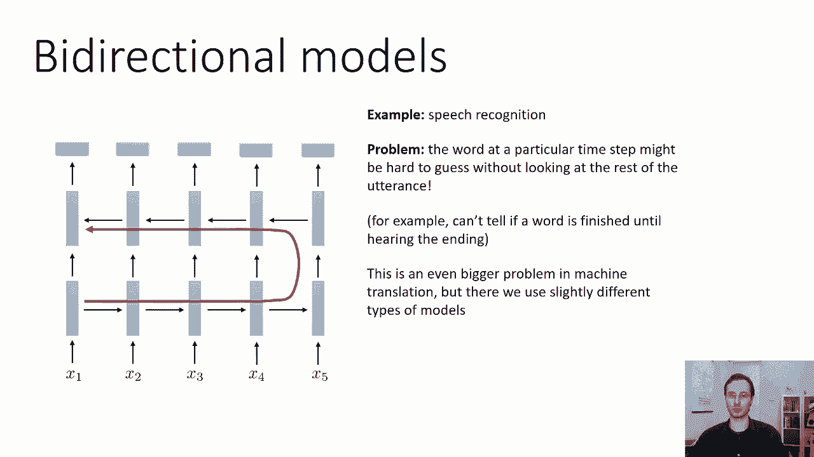

### 2. 网络结构细节
- **编码器-解码器组合**：常见的是使用CNN作为编码器处理图像，然后将特征序列输入RNN解码器生成文本。
- **堆叠RNN层**：可以将一个RNN层的输出作为另一个RNN层的输入，以增加模型容量。
- **双向RNN**：包含两层RNN，一层正向处理序列，一层反向处理序列。这样每个时间步的决策都能融合过去和未来的信息。适用于如**语音识别**等任务，其中当前时刻的标签可能受后续声音影响。
    ```python
    # 概念性伪代码
    forward_output = RNN_forward(input_sequence)
    backward_output = RNN_backward(reverse(input_sequence))
    combined_output = concatenate(forward_output, backward_output)
    ```

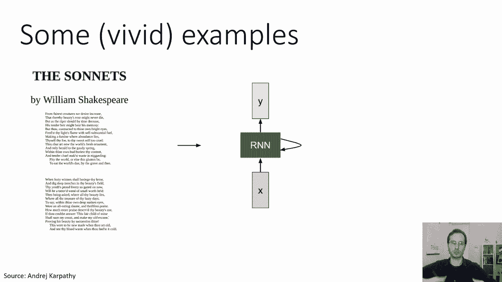

### 3. 循环卷积层
理论上，可以将LSTM中的矩阵乘法替换为卷积操作，形成循环卷积层，使网络在空间和时间维度上都具备循环特性，但计算成本较高。

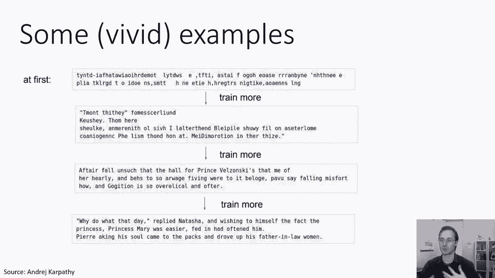

---

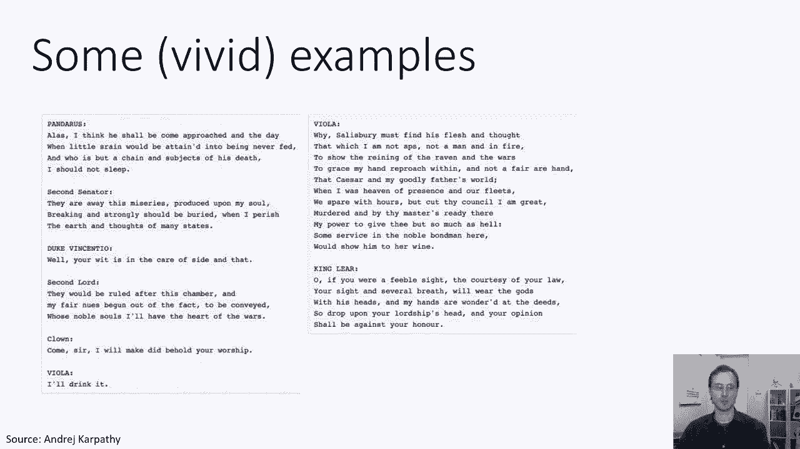

## RNN的生动应用示例 ✨

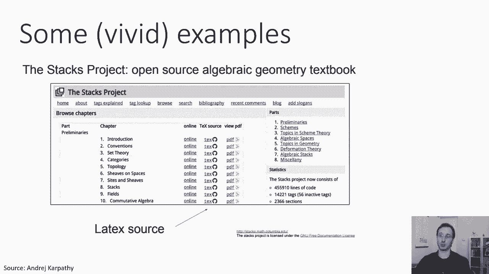

RNN在生成任务上表现出强大的能力：

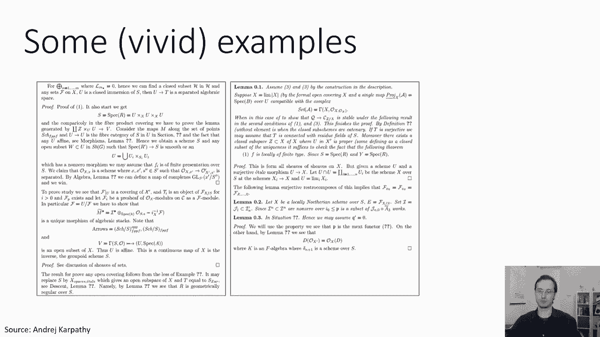

1.  **文本生成**：使用莎士比亚文集训练RNN，模型可以生成语法和风格相似的伪莎士比亚文本。
2.  **代码生成**：使用LaTeX源代码训练RNN，模型能生成可以编译的伪代码片段，包含看似合理的定理和引理结构。
3.  **现代语言模型**：如GPT-2等模型，在给定提示后，能生成连贯、合理且包含微妙语义细节的长篇文本。

这些示例展示了RNN及其变体在理解和生成复杂序列数据方面的潜力。

---

## 总结 📚

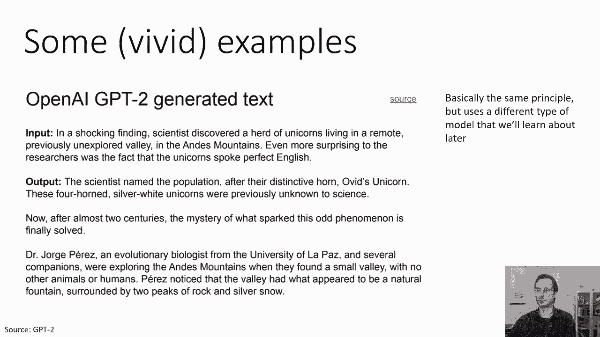

本节课我们一起学习了循环神经网络在实际应用中的关键知识：

1.  **结构化预测与自回归模型**：为了生成具有内部结构的序列（如文本），我们采用自回归方式，将上一步的输出作为当前步的输入。
2.  **训练挑战**：直接使用“教师强制”训练会导致**分布转移**问题，即训练（真实数据输入）与测试（模型自身输出输入）的分布不匹配。
3.  **解决方案**：**计划采样**通过在训练中随机混合真实输入和模型自身输出，并让混合概率随时间衰减，有效缓解了分布转移。
4.  **架构灵活性**：RNN支持一对多、多对一、多对多等多种模式，并可通过堆叠层、双向设计和结合其他网络（如CNN）来增强功能。
5.  **强大应用**：RNN是序列生成任务的基础，能够创作文本、代码等，展示了其捕获数据中长期依赖关系和复杂模式的能力。

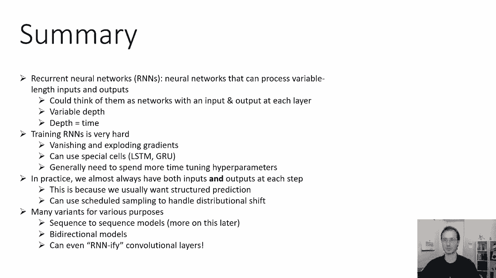

RNN及其改进型（如LSTM、GRU）为处理可变长度输入输出序列提供了强大而灵活的框架，是深度学习序列建模的基石。