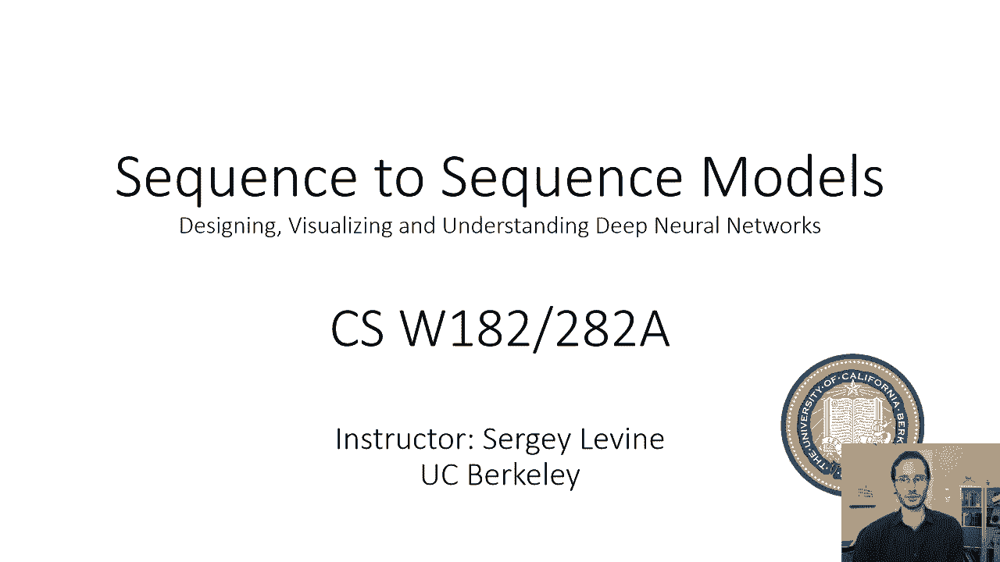
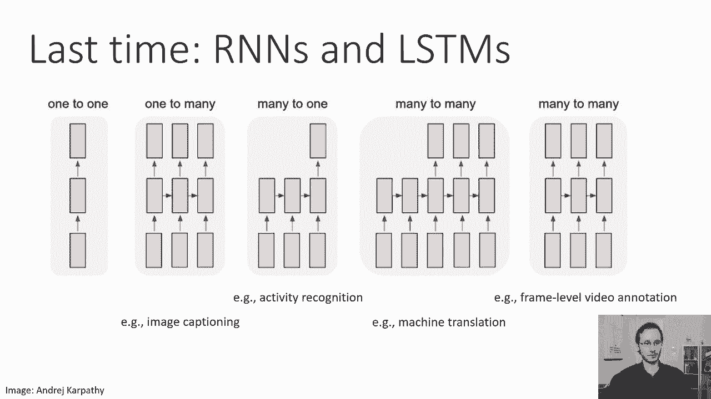
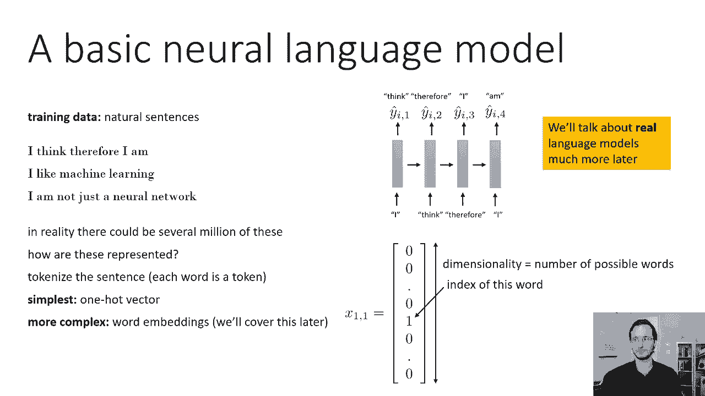
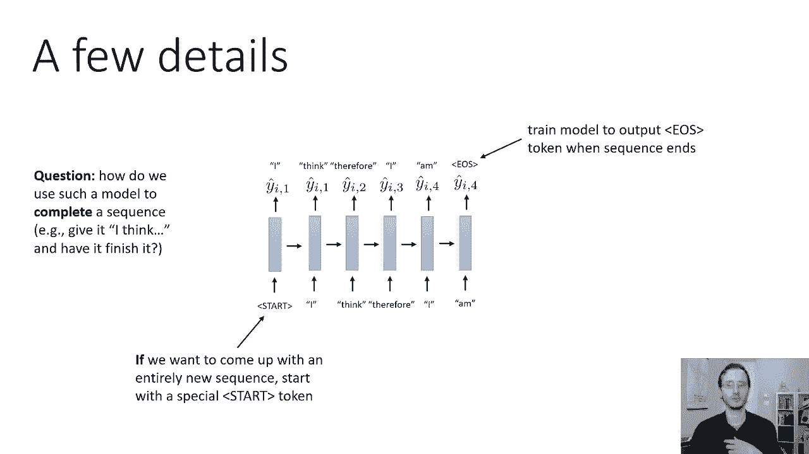
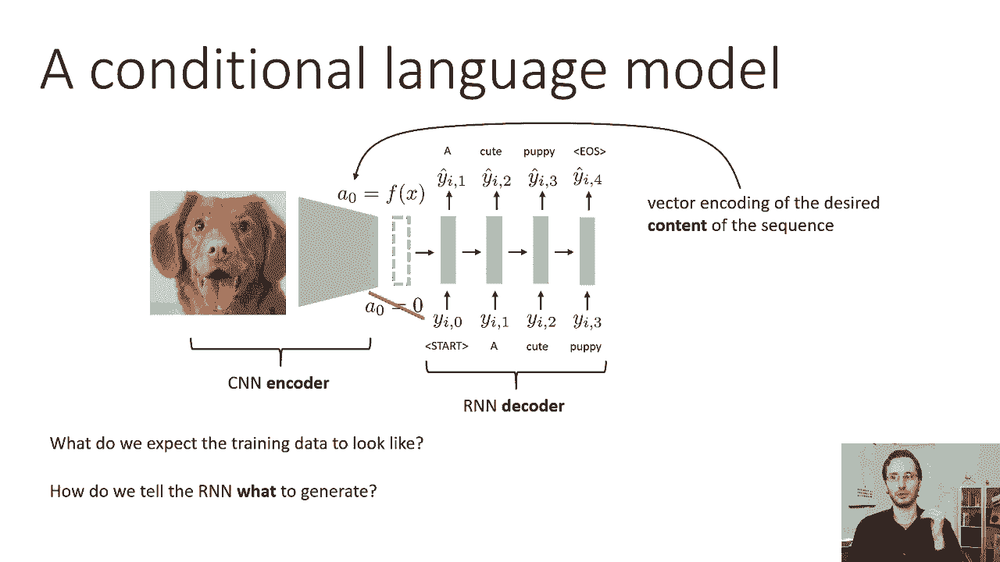
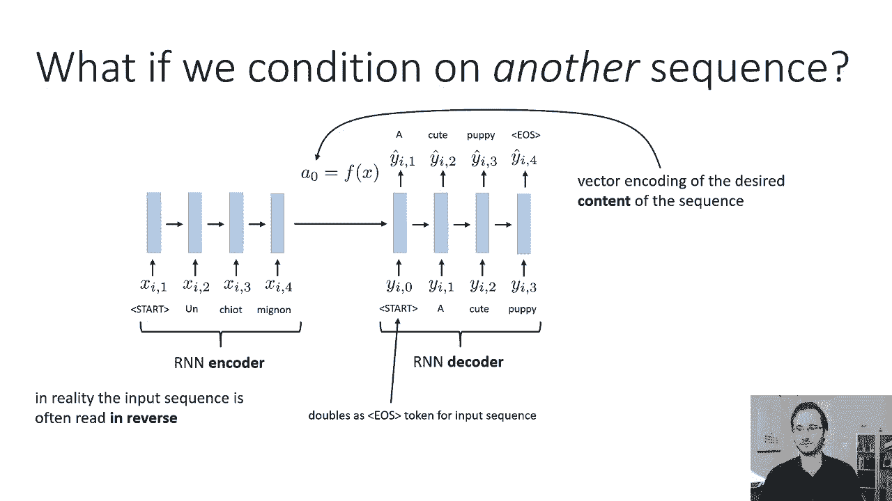
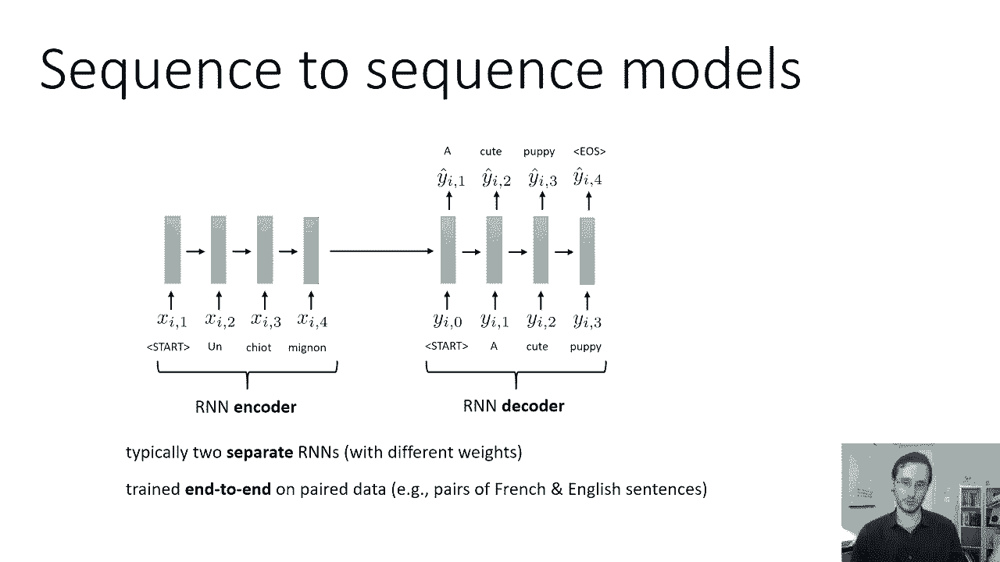
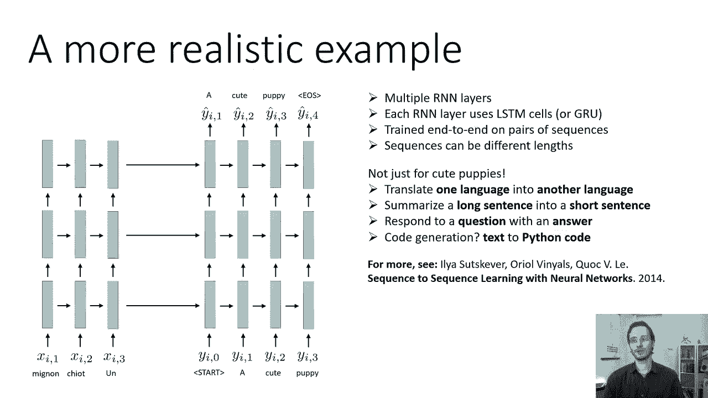

# 33：CS 182 第 11 讲 - 第 1 部分：序列到序列模型 🧠➡️📝

在本节课中，我们将学习如何使用递归神经网络（RNN）来解决序列到序列的转换问题。我们将从构建基本的语言模型开始，逐步引入条件语言模型，最终构建出强大的序列到序列模型，并将其应用于机器翻译、图像描述等任务。

---

## 1. 引言：从 RNN 到序列转换 🔄

上一节我们介绍了递归神经网络（RNN）及其在序列处理问题上的灵活性。本节中，我们来看看如何利用 RNN 构建序列到序列模型。

RNN 可以处理多种序列问题：
*   **单个输入到序列**：例如图像描述，输入是图像，输出是描述文本的序列。
*   **序列到单个输出**：例如活动识别，输入是视频帧序列，输出是活动标签。
*   **序列到序列**：例如机器翻译，输入是一种语言的文本序列，输出是另一种语言的文本序列。

在今天的课程中，我们将主要关注最后一类问题，即序列到序列的转换模型。

---

## 2. 构建基础神经语言模型 📖

在深入序列到序列模型之前，让我们首先讨论如何建立一个基本的神经语言模型。

语言模型是为表示文本的序列分配概率的模型。它们不仅能分配概率，还能生成文本。训练数据是大量自然语言句子的集合。

以下是构建语言模型的关键步骤：

### 2.1 文本表示
首先需要将文本表示为模型可以处理的形式。一个简单的方法是使用 **独热编码**。

**独热向量** 是一个长度等于字典大小的向量。向量中除对应单词索引的位置为 1 外，其余位置均为 0。

例如，句子 “I think therefore I am” 有 5 个单词，每个时间步将用一个高维向量表示。

更复杂的方法是使用 **词嵌入**，它是一个连续的向量，旨在反映单词的语义相似性。相似的词在向量空间中的距离更近。我们将在后续课程中详细讨论词嵌入。

### 2.2 处理句子边界
为了让模型知道何时开始和结束一个句子，我们需要引入特殊标记。

*   **序列结束标记**：在训练数据中所有句子的末尾添加一个特殊标记（如 `<EOS>`）。模型将学会在生成句子结束时输出此标记。
*   **序列开始标记**：在生成全新句子时，可以在第一个时间步之前添加一个额外的开始标记（如 `<SOS>`）。模型会基于此标记生成第一个词。

### 2.3 让模型完成句子
如果我们想让模型完成一个以特定片段开头的句子（例如 “I think therefore…”），方法很简单：在生成时，我们强制将前几个输入设置为该片段，而忽略模型在这几步的输出预测。之后，再让模型基于其自身的预测继续生成。

---

## 3. 构建条件语言模型 🖼️➡️🗣️

基础语言模型是无条件的。现在，我们将讨论如何构建条件语言模型，即模型的输出文本基于某些输入条件。

例如，在图像描述任务中，输入是一张图片，模型需要生成描述图片内容的文本。

以下是构建条件语言模型的方法：

### 3.1 模型架构
模型由两部分组成：
1.  **编码器**：一个卷积神经网络，用于处理输入（如图片），并输出一个向量 `h0`。这个向量 `h0` 包含了输入的所有相关信息，并作为解码器的初始状态。
2.  **解码器**：一个 RNN（如 LSTM），其初始隐藏状态被设置为编码器输出的 `h0`。解码器的工作是将 `h0` 中包含的“思想”解码成有效的文本序列。

直观理解：编码器将图片编码为“有一只可爱的小狗”这样的向量表示，解码器则负责将这个想法转化为“图片里有一只可爱的小狗”这样的英文句子。

### 3.2 训练数据
训练数据是成对的，例如（图片，描述文本）。整个模型（编码器+解码器）是端到端联合训练的，目标是让解码器生成正确的描述文本。

---

## 4. 序列到序列模型 🔤➡️🔠

条件语言模型的概念可以自然延伸到序列到序列的转换，例如机器翻译。

### 4.1 模型架构
对于将法语翻译成英语的任务：
*   **编码器**：一个 RNN，读取法语句子，并生成一个上下文向量（通常是其最终隐藏状态）。
*   **解码器**：另一个 RNN，以上下文向量作为初始状态，生成英语句子。

编码器和解码器通常是两个独立的 RNN，拥有不同的权重，但它们是端到端联合训练的。

### 4.2 一个实用技巧：反转输入序列
在实践中，一个常见且有效的技巧是：**将输入序列（源语言）反转后再输入编码器**。

**原因**：在翻译中，目标语言句子的开头通常与源语言句子的开头更相关。通过反转输入，源语言的开头在编码的最后时刻被处理，这使得它在时间上更接近解码器开始生成目标语句的时刻，从而缩短了依赖路径，有时能提升模型性能。

### 4.3 更现实的模型设计
一个更现实的序列到序列模型可能包含以下设计：
*   **使用 LSTM 或 GRU 单元**：以更好地捕捉长期依赖。
*   **堆叠多层 RNN**：通常堆叠 2 到 4 层，以增加模型的表示能力。层数通常少于卷积网络。
*   **处理变长序列**：输入和输出序列可以具有不同的长度。

---

## 5. 序列到序列模型的应用 🌐

序列到序列模型非常灵活，可用于多种任务，只要任务可以表述为序列对。以下是一些应用示例：

以下是序列到序列模型的一些典型应用：
*   **机器翻译**：将一种语言的句子翻译成另一种语言。
*   **文本摘要**：将长文本压缩为短摘要。
*   **问答系统**：输入是问题文本，输出是答案文本。
*   **代码生成**：输入是自然语言描述，输出是实现该描述的代码（如 Python）。

---

## 总结 📚

本节课中我们一起学习了序列到序列模型的核心思想与构建方法。

1.  我们从基础的神经语言模型出发，学习了如何使用 RNN 生成文本，并引入了开始和结束标记来处理句子边界。
2.  接着，我们引入了条件语言模型，通过编码器-解码器架构，使模型能够根据输入（如图片）生成条件文本。
3.  最后，我们将此框架扩展到序列到序列任务，构建了用于机器翻译等任务的模型，并讨论了反转输入序列、使用堆叠 LSTM 等实用技巧。

序列到序列模型是自然语言处理领域的强大工具，为许多复杂的序列转换问题提供了统一的解决方案。