# 34：第2部分：序列到序列模型与解码策略 🧠

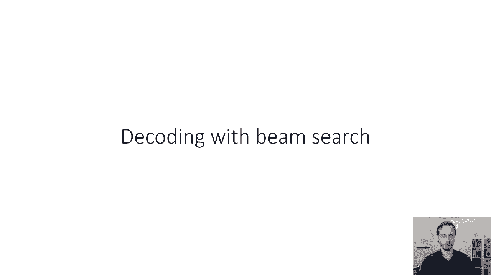

在本节课中，我们将要学习序列到序列模型中的一个核心环节：如何从训练好的模型中生成（解码）输出序列。我们将重点探讨为什么简单的“贪婪解码”策略可能效果不佳，并详细介绍一种更强大的近似搜索算法——**波束搜索**。

---

## 🔍 解码问题与贪婪解码的局限性

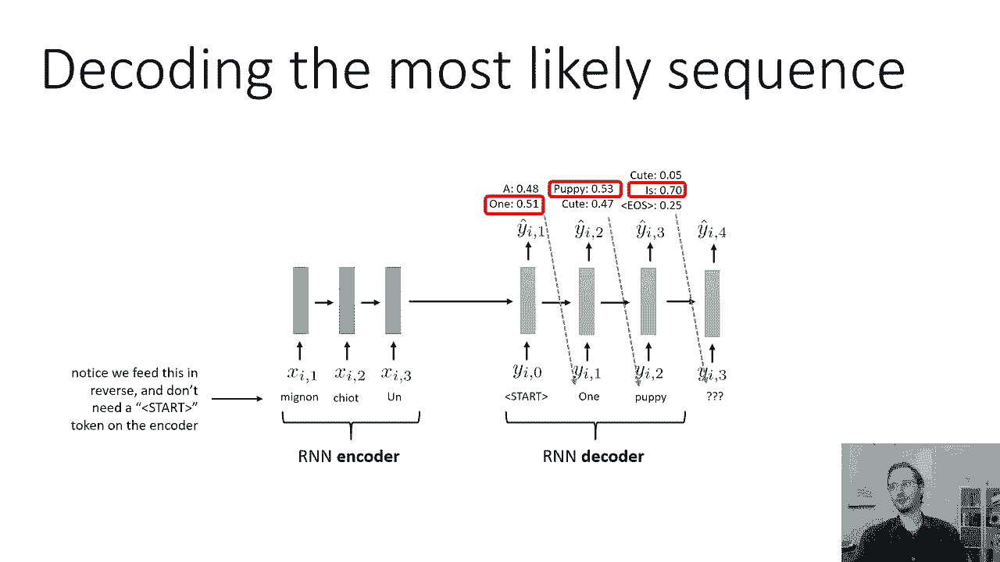

上一节我们介绍了序列到序列模型的基本架构。本节中我们来看看模型在实际生成句子时是如何工作的。

一个直观的方法是**贪婪解码**：在解码的每一步，模型都会输出一个词汇表上的概率分布（通过SoftMax得到）。最直接的做法是每一步都选择概率最高的那个词，并将其作为下一步的输入。

**代码示例：贪婪解码的一步**
```python
# 假设 `output_distribution` 是当前步的SoftMax概率分布
next_word_index = np.argmax(output_distribution)
next_word = vocabulary[next_word_index]
```

然而，这种方法存在一个根本问题：**早期的局部最优选择可能导致整体序列质量低下**。例如，第一步选择了一个概率稍高的错误词汇，即使后续步骤的词汇选择概率很高，整个句子也可能语法不通或语义错误，因为模型已经“偏离了轨道”。

问题的核心在于，我们的目标不是最大化**每一步**的概率，而是最大化**整个输出序列**的联合概率。

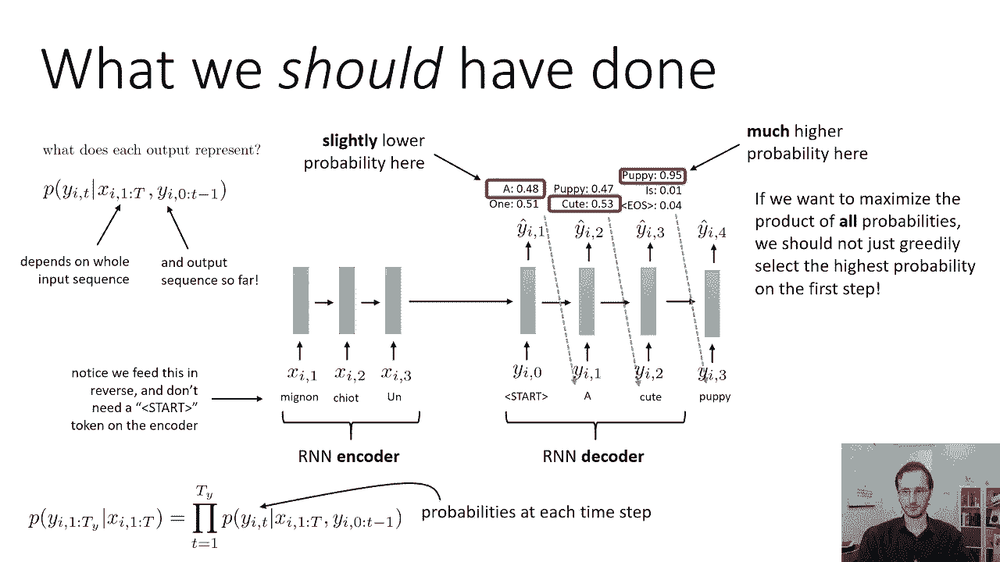

---

## 📐 解码的数学目标：最大化序列概率

让我们从数学上理解解码的目标。在RNN解码器中，每一步输出的概率分布 `P(y_t | x_1...x_T, y_0...y_{t-1})` 表示：在给定全部输入 `x` 和已生成的所有之前输出 `y` 的条件下，当前词 `y_t` 的概率。

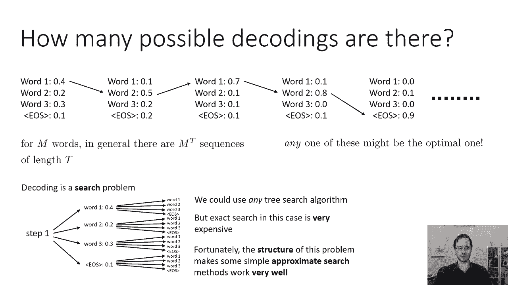

我们最终想要的是**最有可能的输出序列** `y_1...y_T`。根据概率的链式法则，整个序列的概率可以分解为每一步条件概率的乘积：

**公式：序列概率分解**
```
P(y_1...y_T | x_1...x_T) = ∏_{t=1}^{T} P(y_t | x_1...x_T, y_1...y_{t-1})
```

因此，解码的目标是找到使这个乘积最大化的序列。取对数后，等价于最大化对数概率之和：
```
max ∑_{t=1}^{T} log P(y_t | ...)
```

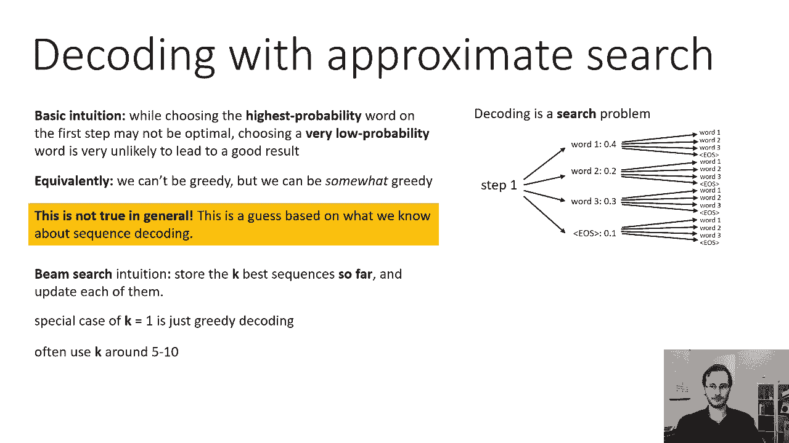

贪婪解码的缺陷在于，它每一步都最大化 `P(y_t | ...)`，但这并不能保证最终 `∏ P(y_t | ...)` 是最大的。有时，在早期选择一个概率稍低的词，可能会为后续带来概率高得多的词，从而提升整体序列的概率。

---

## 🌳 解码作为树搜索问题

从搜索的角度看，解码是一个**树搜索问题**。树的根节点是序列开始符，每个节点代表一个已生成的词序列，分支代表下一个可能生成的词。词典大小为 `V`，序列长度为 `T`，那么可能的路径总数是 `V^T`，这是一个巨大的数字。

以下是解决此类搜索问题的关键点：
*   **问题规模**：穷举搜索所有路径在计算上是不可行的。
*   **启发式信息**：每一步的SoftMax概率分布提供了很好的启发式信息，概率极低的路径几乎不可能是最优解的一部分。
*   **近似策略**：我们需要高效的近似算法，在可接受的计算成本内找到高质量的解。

---

## 💡 波束搜索算法

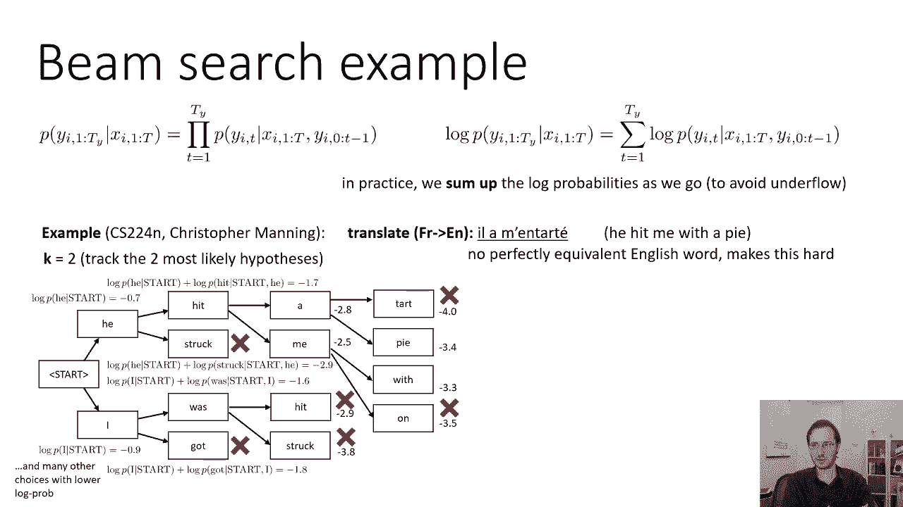

基于上述分析，我们引入**波束搜索**算法。它不是完全贪婪（只保留1个最优），也不是完全搜索（探索所有可能），而是一种折中的启发式搜索。

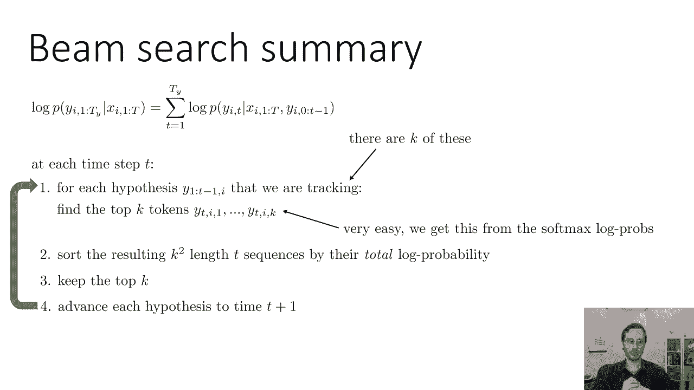

**核心思想**：在解码的每一步，我们只保留 `k` 个最有可能的部分序列假设（称为“波束宽度”）。在下一步，仅从这 `k` 个假设出发进行扩展，并再次从中选出新的 top `k` 个假设。当 `k=1` 时，波束搜索退化为贪婪解码。

以下是波束搜索的关键步骤说明：

1.  **初始化**：从开始符 `<SOS>` 开始，将其作为唯一的初始假设。
2.  **扩展与评分**：对于当前步保留的 `k` 个假设，分别用RNN计算下一个词的概率分布。每个假设可以扩展出 `V` 个可能的新假设（即加上一个新词）。
3.  **排序与剪枝**：现在我们有 `k * V` 个候选序列。计算每个候选序列的**累计对数概率**（即到当前步为止所有词的对数概率之和）。只保留总分数最高的 `k` 个候选序列，其余被“剪枝”掉。
4.  **终止判断**：如果一个假设生成了序列结束符 `<EOS>`，则将其视为一个**完整序列**，记录下来并从活跃假设列表中移除。算法继续扩展其他未完成的假设。
5.  **循环**：重复步骤2-4，直到所有活跃假设都达到最大长度或我们收集到了足够多的完整序列。
6.  **最终选择**：从所有记录下来的完整序列中，选择分数最高的一个作为最终输出。为了公平比较不同长度的序列，通常使用**长度归一化**的分数：`分数 = (总对数概率) / (序列长度)`。

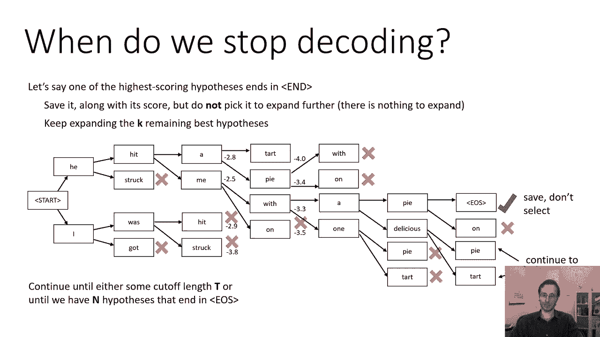

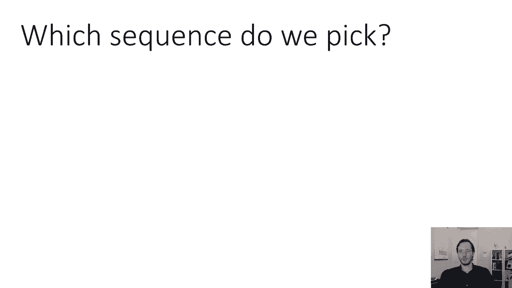

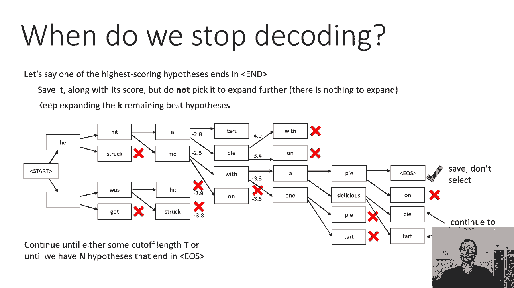

**算法总结**：波束搜索通过动态维护一个固定大小的“候选集”，在探索更多可能性和控制计算成本之间取得了平衡。实践中，`k` 值通常设为5到10就能取得很好的效果。

---

## ✅ 课程总结

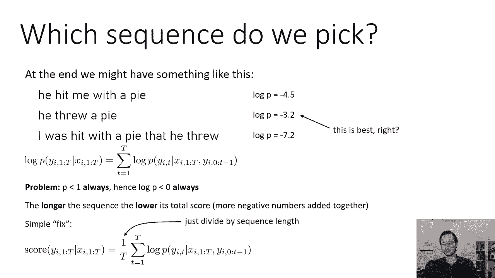

本节课中我们一起学习了序列到序列模型中的解码策略。
*   我们首先指出了**贪婪解码**的局限性，它可能因早期的局部最优选择而错过全局更优的序列。
*   我们从数学上明确了解码的目标是**最大化整个输出序列的联合概率**。
*   我们将解码问题形式化为一个**树搜索问题**，并指出精确搜索的计算代价过高。
*   最后，我们详细介绍了**波束搜索**这一高效且有效的近似解码算法，包括其核心思想、具体步骤和实现细节（如长度归一化）。


波束搜索是机器翻译、文本摘要、对话生成等序列生成任务中不可或缺的核心技术。理解其原理，有助于你更好地调优生成模型并获得更高质量的输出。