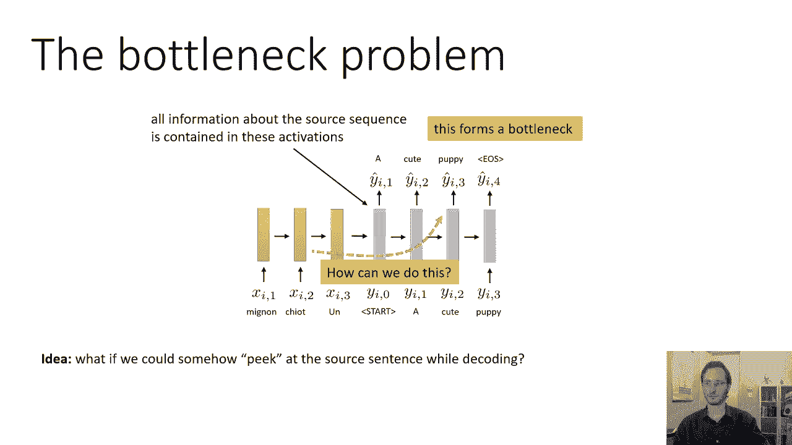
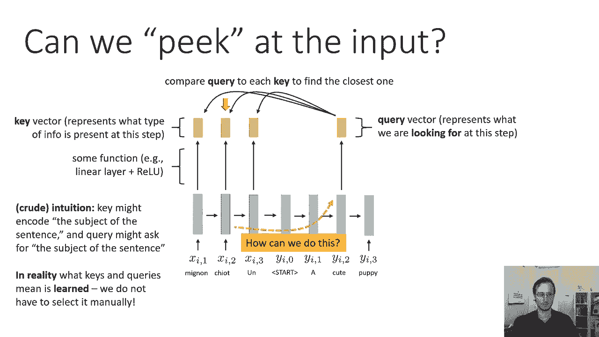
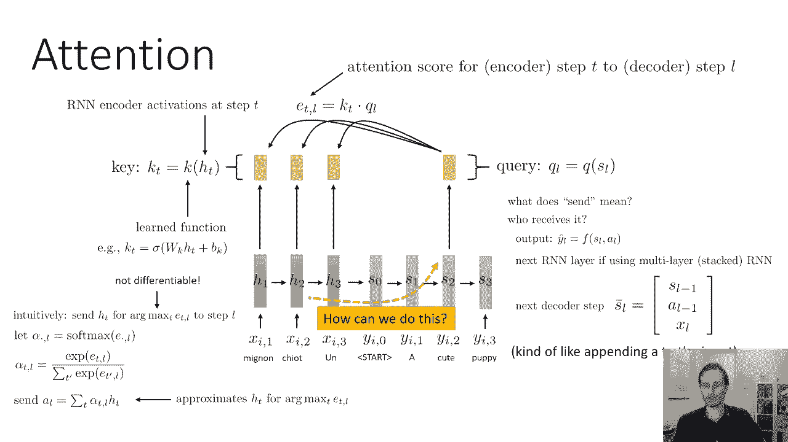
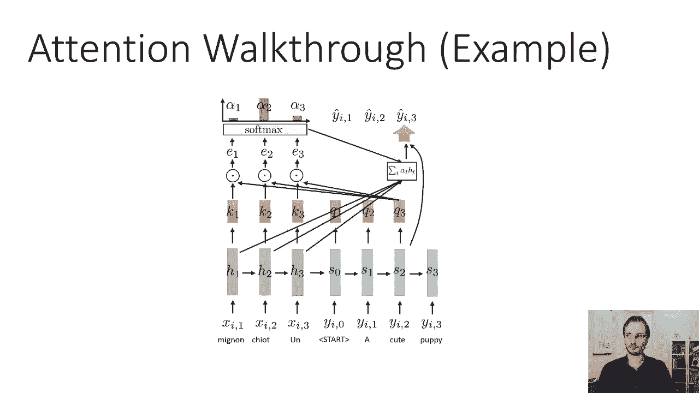
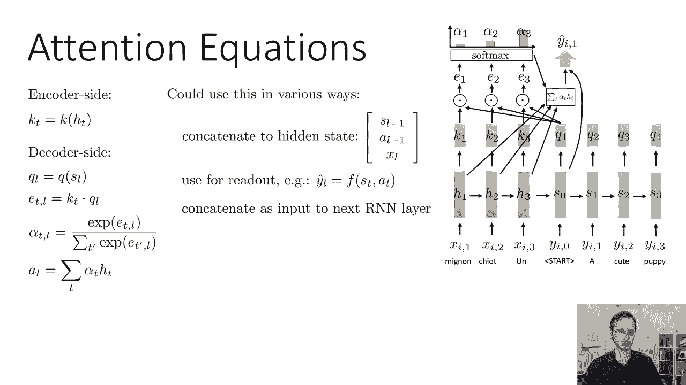
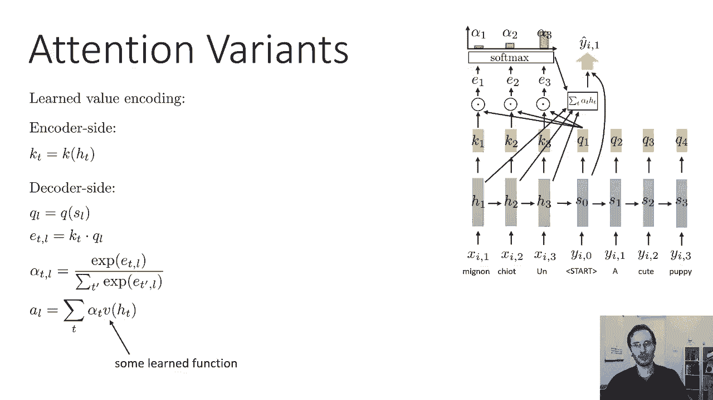
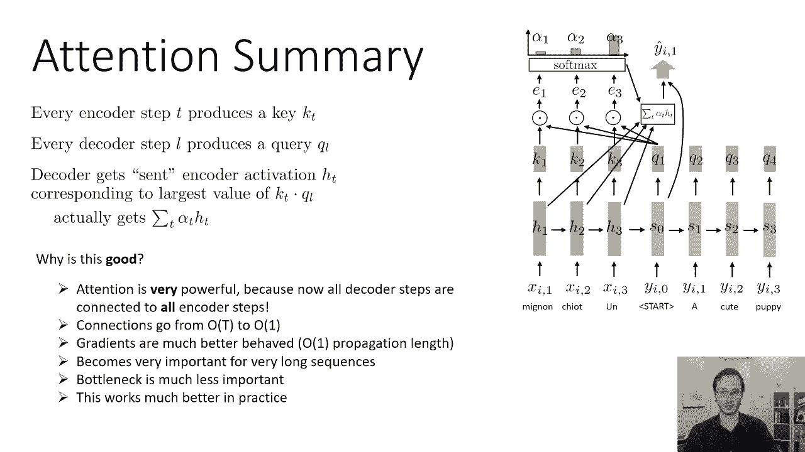

# 35：CS 182 第11讲 第3部分 - 序列到序列模型与注意力机制 🧠

在本节课中，我们将要学习序列到序列模型中的一个核心改进概念：**注意力机制**。我们将了解传统序列到序列模型的瓶颈问题，以及注意力机制如何通过允许解码器在生成每个词时“查看”编码器的不同部分来解决这个问题，从而显著提升模型处理长序列的能力。

---

## 传统序列到序列模型的瓶颈问题 🔍

上一节我们介绍了基础的序列到序列模型。本节中我们来看看该模型存在的一个关键限制。

序列到序列模型存在一个问题，它限制了模型可以处理的输入序列的最大长度。这个问题可以称为**瓶颈问题**。本质上，所有关于源序列的信息都必须被压缩到编码器的最后一个隐藏状态中。在解码开始时，解码器对源序列一无所知，它唯一的信息来源就是编码器放入第一个解码器隐藏状态的内容。

当输入序列很长时，这可能是一个大问题。这形成了一个瓶颈：编码器需要非常小心地将所有正确的信息塞进解码器的第一个隐藏状态，解码器才能生成正确的内容。

---

## 注意力机制的核心思想 💡

上一节我们介绍了瓶颈问题，本节中我们来看看如何通过注意力机制来缓解这个问题。

也许我们可以放松对编码器的要求，如果我们以某种方式允许解码器在解码时“窥视”输入序列的更多部分。这样可能会更好。本质上，编码器只需将输入序列的**一般摘要**放入隐藏状态，而解码器在生成每个词时，仍然可以**引用输入序列**来获取具体的细节。

例如，当输入是一个包含历史事件的段落时，编码器可以编码段落的大意和结构，但不必存储具体的年份。当解码器需要生成年份时，它可以“回头看”输入序列，取出对应的信息。这就像在解码时有一条“捷径”：如果你忘了句子的主语是什么，你可以回头看编码后的句子，把主语信息“拉”到当前解码步骤的输入中。

如果我们能做到这一点，将大大降低瓶颈的重要性，编码器的压力会变小，处理长序列也会变得容易得多。

---

## 注意力机制如何工作 ⚙️

上一节我们提出了注意力机制的想法，本节中我们来看看它在数学和流程上是如何具体实现的。

以下是注意力机制的基本工作流程：

1.  **编码阶段**：编码器RNN的每一步都会生成一小段信息，我们称之为**键**。键是一个向量，直观上表示该时间步存在什么类型的信息。键是由编码器的隐藏状态通过一个学习到的函数（如线性层）生成的。
    *   **公式**：`k_t = f_k(h_t)`

2.  **解码阶段**：解码器RNN的每一步也会生成一个向量，我们称之为**查询**。查询向量直观上表示在当前解码步骤，我们**想要**什么类型的信息。
    *   **公式**：`q_l = f_q(s_l)`

3.  **计算相关性**：我们将当前解码步骤的查询向量 `q_l` 与编码器所有时间步的键 `k_t` 进行比较（通常计算点积），得到一个**注意力分数**。这个分数表示每个编码器时间步的信息与当前解码步骤的相关性。
    *   **公式**：`e_{t,l} = k_t^T · q_l`

4.  **生成注意力权重**：对所有编码器时间步的注意力分数 `e_{t,l}` 应用 **Softmax** 函数，将其转化为和为1的**注意力权重** `α_{t,l}`。权重最大的编码器时间步，其信息被认为与当前解码步骤最相关。
    *   **公式**：`α_{t,l} = softmax(e_{t,l})`

5.  **生成上下文向量**：使用注意力权重 `α_{t,l}` 对编码器的所有隐藏状态 `h_t` 进行加权求和，得到一个**上下文向量** `a_l`。这个向量融合了编码器所有步骤的信息，但由最相关的步骤主导。
    *   **公式**：`a_l = Σ_{t} (α_{t,l} * h_t)`

6.  **使用上下文向量**：将生成的上下文向量 `a_l` 提供给解码器，帮助它生成当前步骤的输出 `ŷ_l`。上下文向量可以以不同方式整合：
    *   作为生成输出函数的额外输入：`ŷ_l = f(s_l, a_l)`
    *   作为下一个解码器RNN步骤的额外输入：`s_{l+1} = RNN(s_l, [y_l, a_l])`
    *   作为堆叠RNN中下一层的输入。

关键在于，键和查询函数 `f_k` 和 `f_q` 的具体含义是模型在训练过程中**自动学习**的，我们无需手动指定。整个网络是端到端训练的。

---

## 注意力机制的工作示例 📝

上一节我们介绍了抽象的数学公式，本节中我们通过一个具体例子来直观理解注意力机制的工作流程。

假设我们要将英文句子“A puppy is cute”翻译成中文。以下是注意力机制在解码过程中的步骤：

1.  **编码器**处理输入序列“A”、“puppy”、“is”、“cute”，为每个词生成隐藏状态 `h_1`, `h_2`, `h_3`, `h_4` 和对应的键 `k_1`, `k_2`, `k_3`, `k_4`。

2.  **解码第一步**（生成“一只”）：
    *   解码器初始状态生成查询 `q_1`。
    *   计算 `q_1` 与所有键 `k_1...k_4` 的点积，得到分数 `e_{1,1}`, `e_{2,1}`, `e_{3,1}`, `e_{4,1}`。
    *   对分数进行Softmax，得到权重 `α_{1,1}`, `α_{2,1}`, `α_{3,1}`, `α_{4,1}`。假设 `α_{2,1}` 最大（对应“puppy”）。
    *   用权重对隐藏状态加权求和，得到上下文向量 `a_1`（主要包含 `h_2` 的信息）。
    *   解码器结合自身状态 `s_1` 和上下文向量 `a_1`，生成输出“一只”。

3.  **解码第二步**（生成“小狗”）：
    *   解码器新状态生成查询 `q_2`。
    *   重新计算 `q_2` 与所有键的点积，得到新的分数和权重。此时权重分布可能变化。
    *   生成新的上下文向量 `a_2`。
    *   解码器结合 `s_2` 和 `a_2`，生成输出“小狗”。

这个过程在解码的每一步重复进行，使得模型能动态地关注输入序列的不同部分。

---

## 注意力机制的常见变体 🔄

上一节我们看了基础的注意力机制，本节中我们来看看几种常见且重要的变体。

以下是几种值得了解的注意力机制变体：

*   **点积注意力**：这是最简单的一种。直接使用编码器和解码器的隐藏状态作为键和查询，即 `k_t = h_t`, `q_l = s_l`。注意力分数就是 `h_t` 和 `s_l` 的点积。实现简单，但表达能力可能有限。
*   **乘法注意力**：这是最常用的形式之一。键和查询是隐藏状态的线性变换：`k_t = W_k * h_t`, `q_l = W_q * s_l`。由于RNN隐藏状态本身已是非线性的产物，线性变换足以提供强大的表达能力。计算注意力分数 `e_{t,l} = (W_k * h_t)^T * (W_q * s_l) = h_t^T * (W_k^T W_q) * s_l`，可以合并矩阵 `W_k^T W_q` 为一个矩阵 `W_e` 来学习，提高效率。
*   **加性注意力**：比基础注意力稍复杂。它不仅对隐藏状态 `h_t` 应用键函数 `k`，还应用一个独立的**值函数** `v`。在计算上下文向量时，不是对 `h_t` 加权求和，而是对转换后的值 `v_t = f_v(h_t)` 加权求和。这提供了更大的灵活性，形成了“键-值对”的直观解释：用键来匹配查询，用值来传递信息。

---

## 注意力机制的优势与总结 🏆

在本节课中，我们一起学习了注意力机制的原理、实现和变体。现在我们来总结一下为什么注意力机制如此强大。

注意力机制的核心优势在于，它**为解码器的每一步与编码器的每一步建立了直接连接**。

*   **缓解梯度传播问题**：在普通RNN中，连接两个相距 `n` 步的时间点需要经过 `O(n)` 步，梯度需要沿这条长路径传播，容易导致梯度消失或爆炸。而通过注意力机制，这条路径的长度总是 **O(1)**，因为上下文向量 `a_l` 是直接基于所有编码器状态计算出来的。这为梯度提供了更短、更稳定的传播路径，使得模型训练更加容易和高效。
*   **突破信息瓶颈**：解码器不再依赖于编码器最后一个隐藏状态所压缩的全部信息，而是可以在每个时间点动态地访问编码器序列中最相关的部分。这极大地缓解了信息瓶颈问题，使模型能够更有效地处理长序列。
*   **提升模型表现**：注意力权重 `α_{t,l}` 本身具有可解释性，我们可以通过可视化这些权重来理解模型在生成每个输出词时“关注”了输入序列的哪些部分。

注意力机制是一个极其强大的概念，它不仅是改进序列到序列模型的关键，更是现代Transformer架构的基石。在下一节课中，我们将在此基础上进一步深入，探讨如何构建**完全基于注意力**的模型。

---

**本节课总结**：我们一起学习了序列到序列模型中的**注意力机制**。我们首先分析了传统模型存在的**信息瓶颈问题**，然后详细介绍了注意力机制如何通过让解码器动态“查看”编码器不同部分来解决这个问题。我们学习了其核心工作流程，包括**键、查询、注意力分数、权重和上下文向量**的计算，并通过示例和变体加深了理解。最后，我们总结了注意力机制在**改善梯度流动、处理长序列和提升模型可解释性**方面的巨大优势。