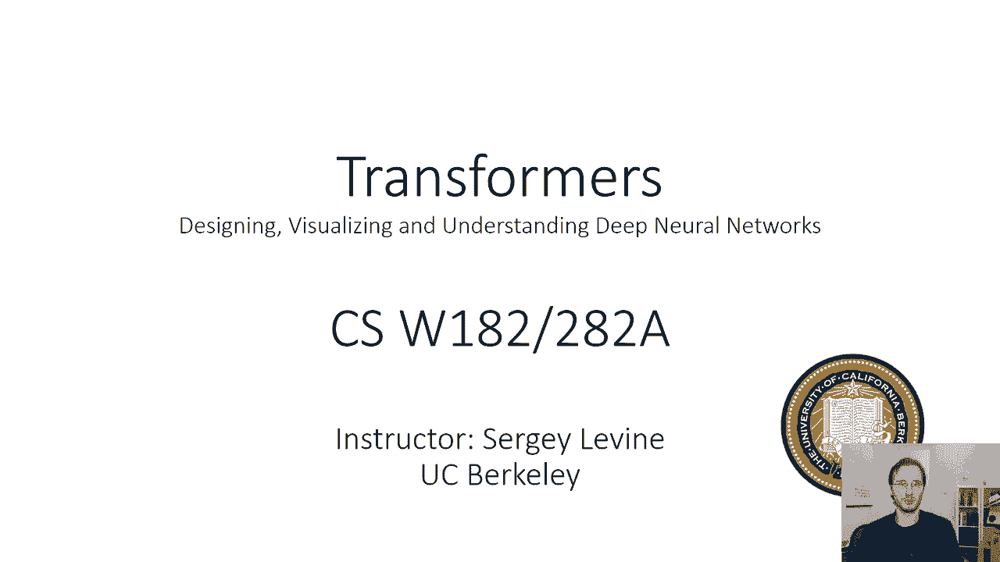
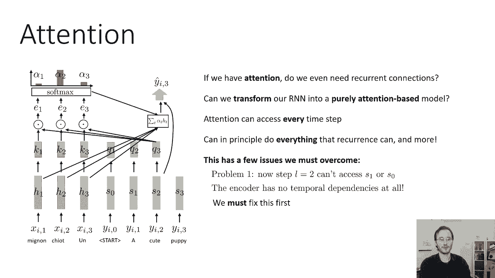
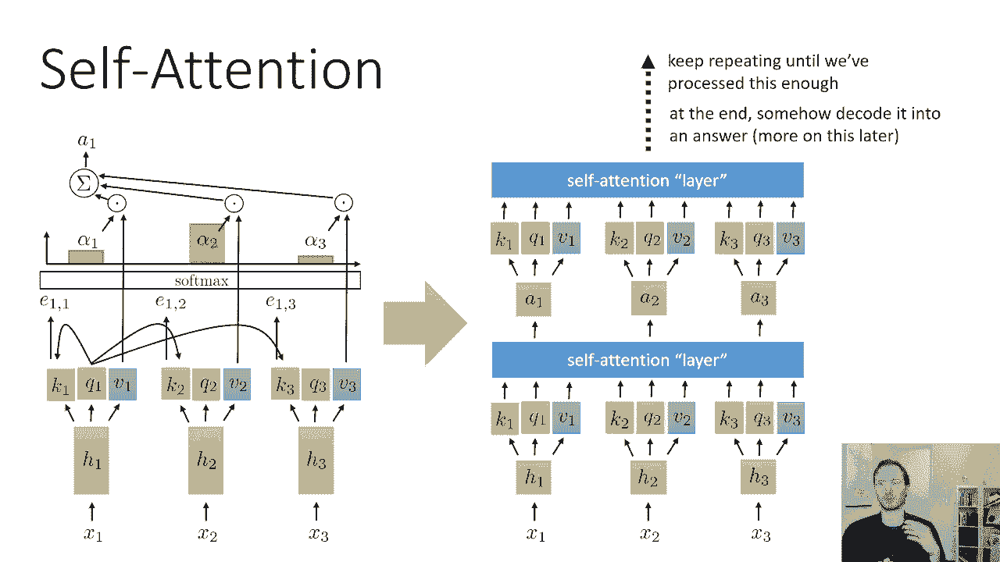
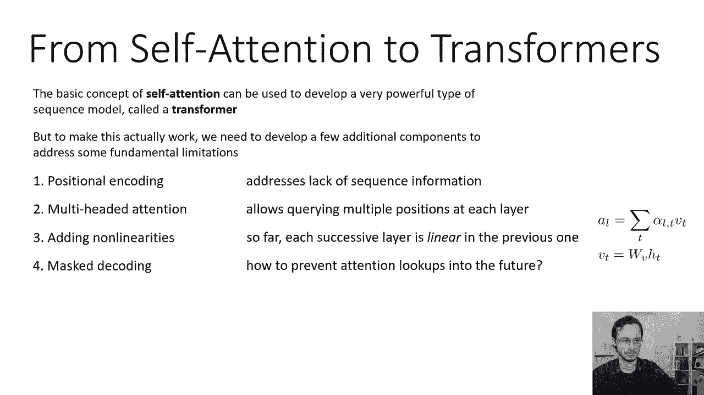

# 36：CS 182 - 第12讲 - 第1部分 - Transformer 🧠

在本节课中，我们将学习一种全新的序列处理模型——Transformer。我们将从回顾注意力机制开始，探讨如何完全摒弃循环连接，仅依靠注意力来构建强大的序列模型。课程将涵盖自注意力、位置编码、多头注意力等核心概念，并解释如何将它们组合成一个完整的Transformer架构。



---

## 从注意力到自注意力 🔄

上一节我们讨论了如何利用注意力机制增强序列到序列模型处理长期依赖的能力。注意力机制允许解码过程的每一步直接“关注”输入序列中的任意位置。

本节中，我们来看看如何完全摆脱循环连接，构建一个纯粹基于注意力的模型。

### 注意力机制回顾

在序列到序列模型中，编码器（绿色部分）的每一步会输出一个**键**（Key，例如 k1, k2, k3）。解码器（蓝色部分）的每一步会基于其当前的RNN隐藏状态输出一个**查询**（Query，例如 q2, q3）。

注意力计算步骤如下：
1.  计算当前查询与所有编码器步骤的键之间的点积。
2.  将点积结果通过 softmax 函数，得到一组权重（注意力分布）。
3.  使用这些权重对编码器的隐藏状态（或对应的**值** Value）进行加权求和。

这为解码的当前步骤提供了一条从编码器获取信息的快捷路径。

### 迈向纯注意力模型

一个自然的问题是：既然注意力原则上可以从输入序列的任何位置获取信息，我们是否还需要循环连接？

理论上，如果注意力机制不仅能访问输入序列，还能访问输出序列中已生成的部分，那么它就能完成循环神经网络（RNN）的所有功能，甚至更多。



然而，直接应用原有的注意力机制会遇到问题：
*   **解码器状态不可见**：在解码步骤 `l=2` 时，我们无法访问解码器之前的状态（如 `s1` 和 `s0`），因此无法知道之前生成了什么内容。
*   **编码器缺乏时序依赖**：编码器的每一步完全独立，忽略了单词之间的依赖关系。

为了解决这些问题，我们需要引入**自注意力**（Self-Attention）。

---

## 自注意力机制详解 🧩

自注意力是Transformer的核心。它不区分编码器和解码器，而是让序列中的**每一个元素**都能直接关注到序列中的**所有其他元素**（包括其自身）。

### 基本计算过程

假设我们有一个输入序列 `X = [x1, x2, x3]`。

1.  **生成表示**：首先，通过一个共享权重的线性变换（或小型前馈网络）为每个输入 `xt` 生成一个初始隐藏表示 `ht`。
    *   公式：`ht = f(xt)`，其中 `f` 是共享的函数。

2.  **计算键、值、查询**：对每个 `ht`，我们使用三个不同的、可学习的权重矩阵（`W_K`, `W_V`, `W_Q`）来生成对应的键（`kt`）、值（`vt`）和查询（`qt`）。
    *   公式：
        *   `kt = W_K * ht`
        *   `vt = W_V * ht`
        *   `qt = W_Q * ht`

3.  **计算注意力分数**：对于序列中的每一个位置 `i`（其查询为 `qi`），我们计算它与所有位置 `j`（其键为 `kj`）的相似度（通常用点积）。
    *   公式：`score_ij = qi · kj`

4.  **计算注意力权重**：对每个位置 `i` 的所有 `score_ij` 应用 softmax 函数，得到归一化的注意力权重 `α_ij`。这表示位置 `i` 对位置 `j` 的关注程度。
    *   公式：`α_ij = softmax(score_ij)`

5.  **加权求和输出**：位置 `i` 的最终输出 `output_i` 是所有位置的值 `vj` 按其对应权重 `α_ij` 的加权和。
    *   公式：`output_i = Σ_j (α_ij * vj)`

通过这种方式，自注意力层整合了序列中所有位置的信息，为每个位置生成了一个新的、融合了全局上下文信息的表示。

我们可以将多个这样的自注意力层堆叠起来，构建一个深度网络，从而对序列进行越来越复杂的处理。

---

## 构建Transformer的关键组件 ⚙️

自注意力的基本概念虽然强大，但要构建一个实际可用的Transformer模型，还需要解决几个关键限制。以下是需要处理的核心问题：

### 1. 位置编码

**问题**：自注意力机制本身是**排列不变**的。打乱输入序列的顺序，自注意力层会产生完全相同的输出（仅顺序改变）。这对于自然语言等顺序至关重要的任务是不可接受的。

**解决方案**：我们需要为输入序列注入位置信息。具体做法是为序列中每个位置的输入向量添加一个**位置编码向量**。这个编码向量通常使用正弦和余弦函数生成，使其具有固定的模式并能处理比训练时更长的序列。
*   公式（原始Transformer使用）：
    *   `PE(pos, 2i) = sin(pos / 10000^(2i/d_model))`
    *   `PE(pos, 2i+1) = cos(pos / 10000^(2i/d_model))`
    *   其中 `pos` 是位置，`i` 是维度索引，`d_model` 是模型维度。

### 2. 多头注意力

**问题**：单一一组键、值、查询（一个“头”）可能只能捕捉到一种类型的依赖关系（例如语法依赖），这限制了模型的表达能力。



**解决方案**：使用**多头注意力**。我们并行地使用多组不同的 `W_K`, `W_V`, `W_Q` 矩阵，从而让模型能够同时关注来自不同表示子空间的信息。
*   过程：将输入线性投影到 `h`（头数）个不同的子空间，在每个子空间独立进行自注意力计算，然后将所有头的输出拼接起来，再经过一次线性投影。
*   代码概念：
    ```python
    # 伪代码示意
    head_outputs = []
    for i in range(num_heads):
        K_i = linear_projection_i_K(input)
        V_i = linear_projection_i_V(input)
        Q_i = linear_projection_i_Q(input)
        head_i = self_attention(K_i, V_i, Q_i)
        head_outputs.append(head_i)
    multi_head_output = concat(head_outputs)
    final_output = linear_projection(multi_head_output)
    ```

### 3. 引入非线性

**问题**：到目前为止描述的自注意力计算本质上是线性的（除了softmax）。`output_i` 是值 `vj` 的线性组合，而 `vj` 本身又是 `hj` 的线性变换。纯粹的线性堆叠表达能力有限。

**解决方案**：在自注意力层之后和层与层之间，引入**前馈神经网络**（Feed-Forward Network, FFN）。这是一个简单的两层网络，通常包含一个非线性激活函数（如ReLU）。
*   公式：`FFN(x) = max(0, x * W1 + b1) * W2 + b2`
*   在Transformer中，每个编码器和解码器层都包含一个自注意力子层和一个前馈神经网络子层。

### 4. 掩码注意力（用于解码）

**问题**：标准的自注意力在计算当前位置输出时，会“看到”序列的所有位置，包括未来的位置。这在训练语言模型或进行序列生成（解码）时是不允许的，因为模型不应该利用未来的信息来预测当前词。

**解决方案**：在解码器的自注意力层中使用**掩码注意力**。具体做法是在计算注意力分数后、应用softmax之前，将未来位置对应的分数设置为一个极大的负数（如 `-1e9`）。这样，经过softmax后，未来位置的权重就几乎为0。
*   代码概念：
    ```python
    # scores 是注意力分数矩阵， shape: [seq_len, seq_len]
    mask = torch.triu(torch.ones(seq_len, seq_len), diagonal=1).bool() # 生成上三角掩码（不包括对角线）
    scores.masked_fill_(mask, -1e9) # 将未来位置分数掩掉
    attention_weights = softmax(scores, dim=-1)
    ```

---

## 总结 📝

本节课中，我们一起学习了Transformer模型的基础构建块。

1.  我们从**注意力机制**出发，探讨了构建纯注意力模型的可能性。
2.  我们深入讲解了**自注意力**的核心计算过程，它允许序列中的每个元素直接关注所有其他元素。
3.  我们分析了自注意力的几个关键限制，并介绍了解决这些问题的核心组件：
    *   **位置编码**：为模型注入序列的顺序信息。
    *   **多头注意力**：让模型能够并行关注不同方面的信息，增强表达能力。
    *   **前馈神经网络**：在注意力层之间引入非线性变换。
    *   **掩码注意力**：确保解码器在生成时不会“偷看”未来的信息。



这些组件共同构成了Transformer编码器和解码器层的基础。在接下来的课程中，我们将看到如何将这些层堆叠起来，并加入残差连接和层归一化等技巧，最终构建出完整的Transformer模型，用于处理机器翻译等序列到序列的任务。