# 37：CS 182 第12讲 第2部分 - Transformer 详解 🧠

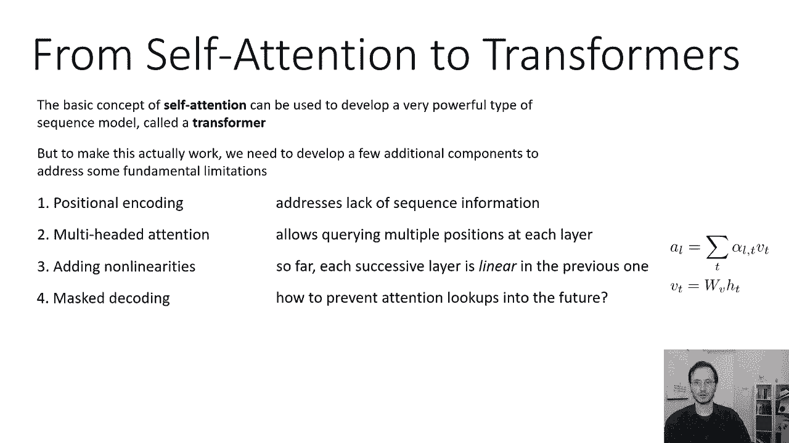

在本节课中，我们将学习如何将基本的自注意力机制构建成一个实用的序列模型。我们将探讨位置编码、多头注意力、非线性层以及掩码注意力等关键概念，这些是构成现代Transformer架构的核心组件。

---

## 位置编码：让模型感知顺序 📍

上一节我们介绍了自注意力机制。本节中我们来看看如何让模型理解序列中单词的顺序。

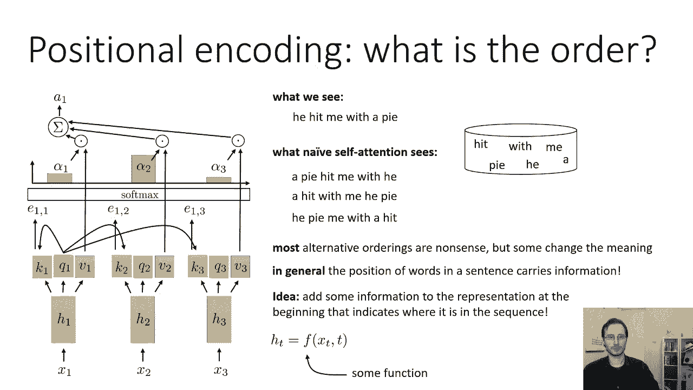

自注意力中的所有操作都是置换不变的。这意味着如果你打乱单词的顺序，你会得到完全相同的注意力向量，只是排列方式相同。这与循环模型非常不同，因为循环模型一次看一个单词，并记住以前见过的单词的顺序。因此，一个天真的自注意力模型看到的只是一袋无序的单词，无法理解“他用圆周率打我”和“我用圆周率打他”之间的区别。

单词在句子中的位置承载着重要的信息。为了保留这些信息，我们在模型的输入表示中添加位置编码。位置编码意味着第一个隐藏状态 `h_t` 是输入 `x_t` 和时间步 `t` 的函数，而不仅仅是 `x_t` 的函数。

### 绝对位置 vs. 相对位置

开发位置编码的一种简单方法是将时间索引 `t` 直接拼接到输入 `x_t` 上。但这并不是一个好主意，因为在大多数应用中，相对位置往往比绝对位置更重要。例如，在句子“我每天都遛狗”和“我遛狗”中，“我”和“狗”的绝对索引不同，但“狗”出现在“我”之后的相对位置是相似的，这才是关键信息。

我们希望位置编码能更多地关注相对位置。实现这一点的一种方法是使用频域表示。

### 正弦/余弦位置编码

这是原始Transformer论文中使用的方法。位置编码 `P_t` 是一个与输入嵌入 `x_t` 维度相同的向量（维度为 `d`）。向量中的每个元素是时间步 `t` 的正弦或余弦函数，其频率随维度变化。

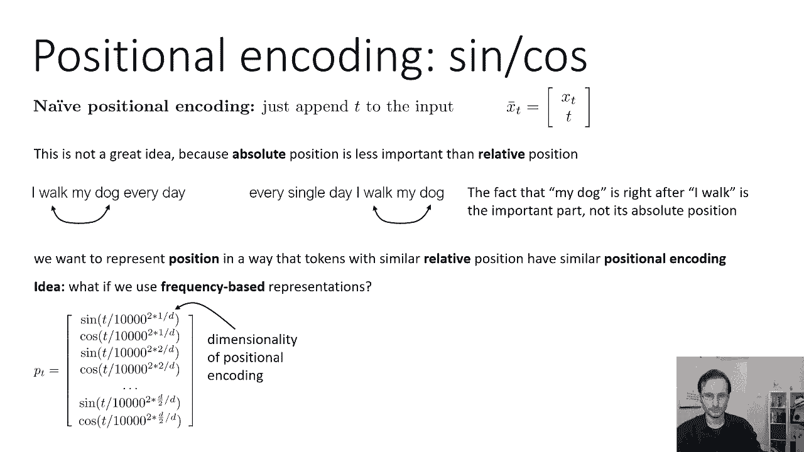

**公式**：
对于位置 `pos` 和维度 `i`：
*   `PE(pos, 2i) = sin(pos / 10000^(2i/d))`
*   `PE(pos, 2i+1) = cos(pos / 10000^(2i/d))`

这里的频率是 `10000^(2i/d)`。这意味着向量的前半部分（`i` 较小）频率较高，振荡较快，可以捕捉细粒度的位置信息（如奇偶性）；后半部分频率较低，振荡较慢，可以捕捉粗粒度的位置信息（如句子前半部分或后半部分）。这种编码能很好地获取相对位置感。

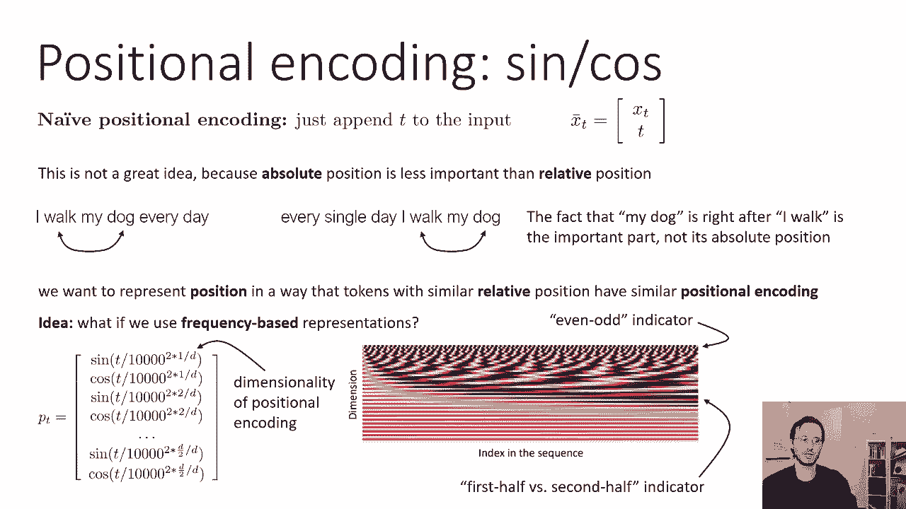

### 可学习的位置编码

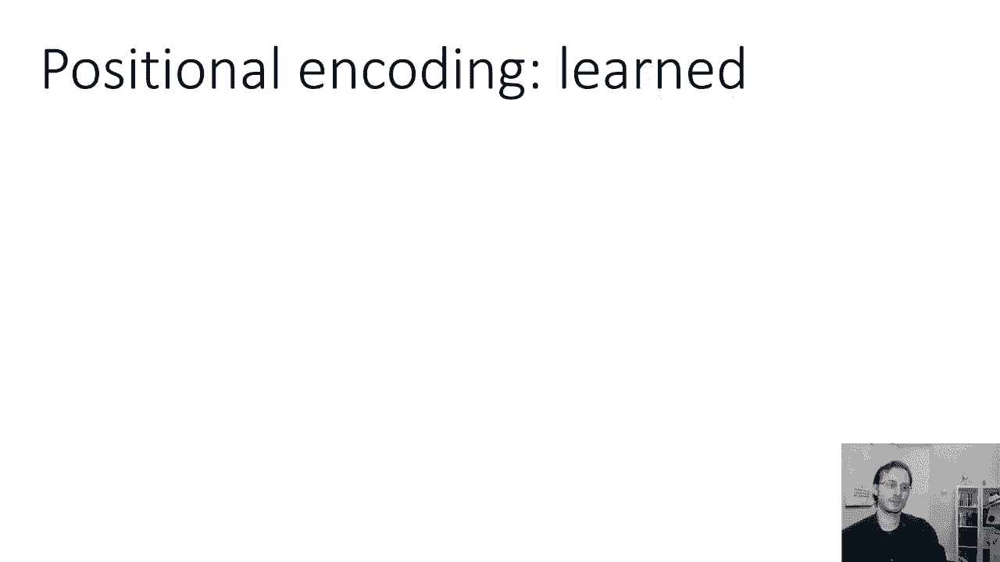

我们也可以将位置编码矩阵 `P`（形状为 `[最大序列长度, d]`）作为模型的可学习参数。在每个时间步，我们将学习到的向量 `p_t` 与输入嵌入 `x_t` 结合。

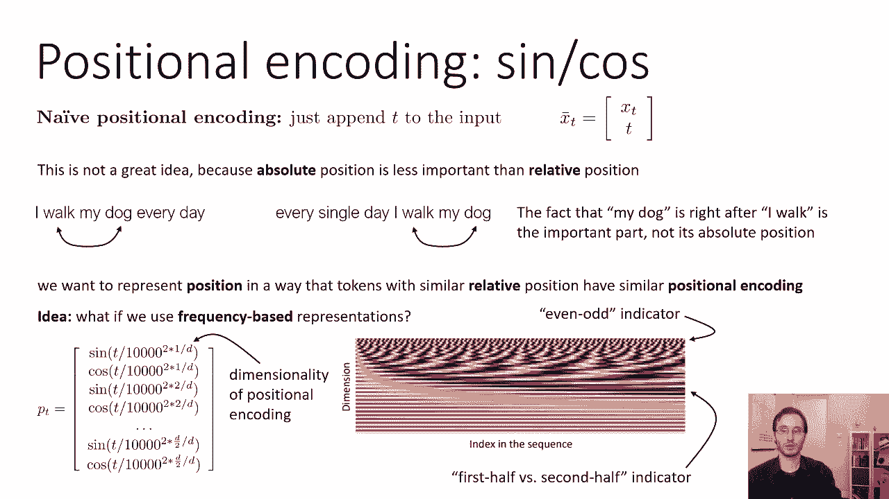

**优点**：更灵活，可能通过优化找到对任务最有效的位置表示。
**缺点**：需要预设最大序列长度，且无法泛化到比训练时更长的序列。

### 如何整合位置编码

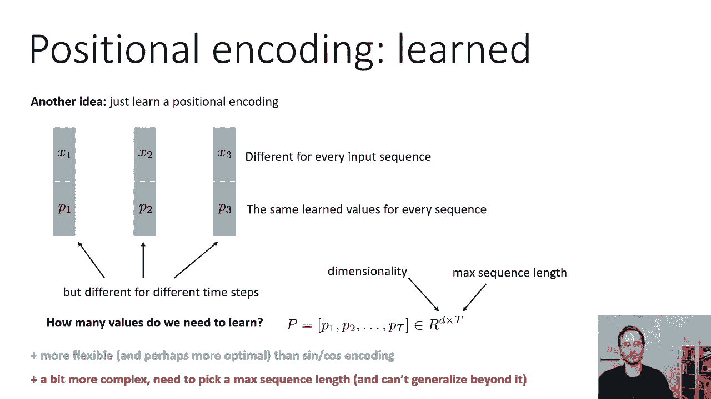

常见且有效的方法是先将输入 `x_t` 通过一个嵌入层（如线性层加非线性激活函数），然后将位置编码 `p_t` 直接加到嵌入结果上，作为第一个隐藏状态。

**公式**：
`h_t^0 = Embedding(x_t) + p_t`

---

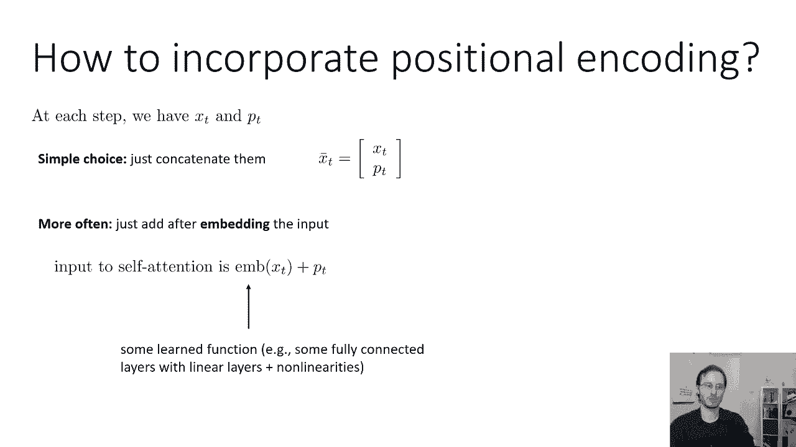

## 多头注意力：捕捉多种关系 👥

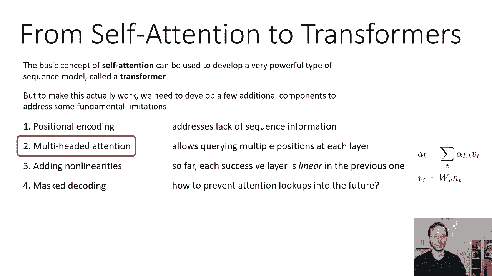

既然我们完全依赖注意力机制，那么让模型能够同时关注序列中多种不同类型的信息就非常可取。例如，在处理一个句子时，我们可能希望同时关注主语和动词。

基本的单头注意力机制通过Softmax操作，倾向于主要关注一个时间步的信息。很难让一个注意力头同时有效地拉取主语和动词这两个在不同位置的信息。

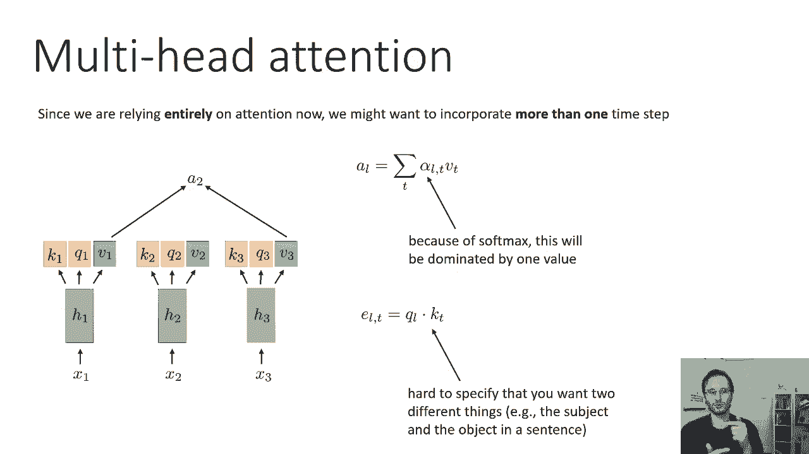

解决方法就是使用**多头注意力**。我们不是为每个时间步生成一组（键、查询、值），而是生成多组。每组对应一个独立的“头”，每个头有自己的键、查询、值权重矩阵。

以下是多头注意力的计算步骤：
1.  对于每个头 `i`，独立计算其注意力分数和权重。
    *   `Q_i = h * W_Q^i`, `K_i = h * W_K^i`, `V_i = h * W_V^i`
    *   注意力分数：`e_{t,l}^i = Q_t^i · K_l^i`
    *   对每个头 `i` 在时间步 `t` 上独立应用Softmax，得到注意力权重 `α_{t,l}^i`。
2.  每个头计算其输出：`head_i = Σ_l α_{t,l}^i * V_l^i`。
3.  将所有头的输出在特征维度上拼接起来，形成该时间步的完整注意力输出。
    *   `MultiHead(h)_t = Concat(head_1, head_2, ..., head_h) * W_O` （`W_O` 是输出投影矩阵）

这样，不同的头可以学习关注不同的信息模式（例如，一个头关注主语，另一个头关注动词），然后将这些信息组合起来，供下一层使用。在经典Transformer中，通常使用8个头。

---

## 引入非线性：进行复杂计算 🔄

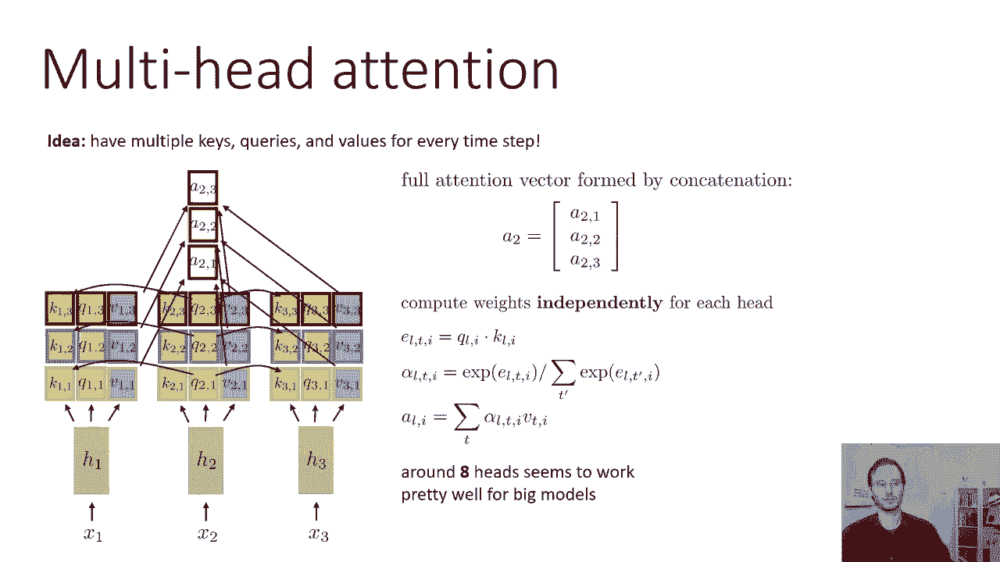

到目前为止，自注意力本质上是线性的。注意力权重 `α` 是通过Softmax（非线性）计算得到的，但最终的注意力输出是值 `V` 的线性组合（`V` 本身是 `h` 的线性变换）。这意味着自注意力层擅长从其他时间步“提取”信息，但不擅长对这些信息进行复杂的非线性处理。

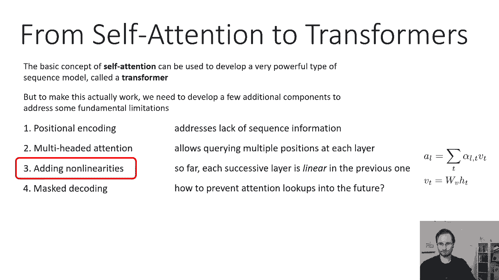

为了让模型能够执行更复杂的操作（例如，根据主语类型和动词组合决定输出），我们需要在过程中插入非线性变换。

### 位置前馈网络

标准做法是在每个自注意力层之后，交替使用一个**位置前馈网络**。这个网络在每个时间步上独立地应用相同的非线性函数。

**结构**：
1.  自注意力层：在时间步之间交换信息（“内存提取”）。
2.  位置前馈网络：在每个时间步独立处理信息（“实际计算”）。

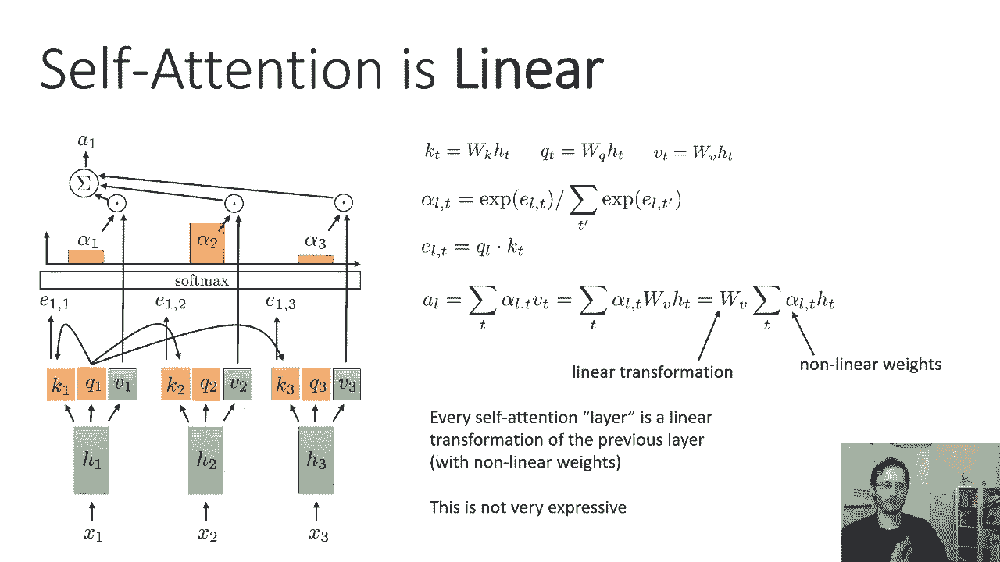

这个位置前馈网络通常是一个简单的两层全连接网络，中间有一个非线性激活函数（如ReLU或GELU）。

**公式**：
`FFN(x) = max(0, x * W_1 + b_1) * W_2 + b_2`

通过这种“提取-处理-再提取”的交替结构，模型能够进行更深入和复杂的计算。

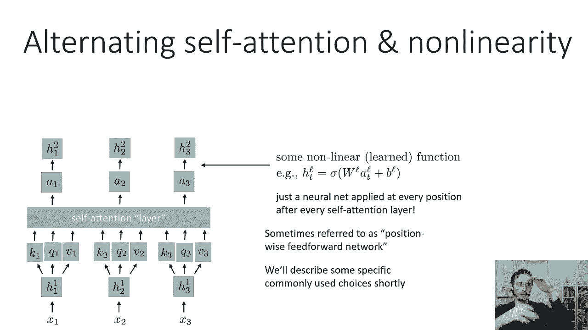

---

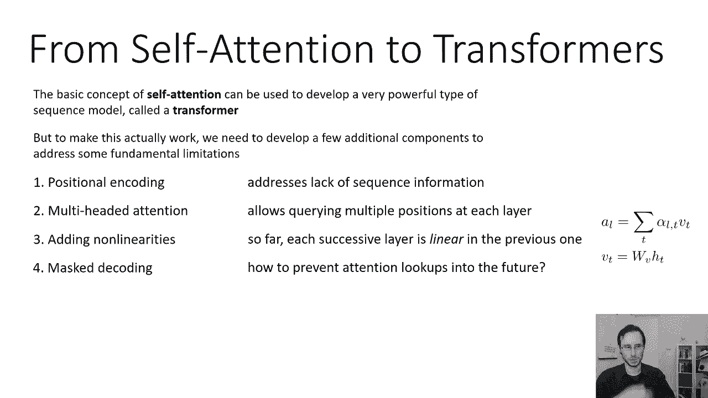

## 掩码注意力：用于序列生成 🎭

自注意力机制的一个问题是它无法区分过去和未来。在训练时，处理一个完整的输入序列（如翻译任务中的源语言句子）时，这没有问题。但在**序列生成**（如解码或语言模型预测下一个词）时，这会导致严重问题。

在生成模式下，我们一次生成一个词。在生成第 `t` 个词时，模型只能依赖于已经生成的 `1` 到 `t-1` 个词。如果自注意力机制可以“看到”未来的时间步（第 `t+1`, `t+2`, ... 步），就会造成**信息泄漏**和循环依赖，使得模型无法进行自回归生成。

解决方案是使用**掩码注意力**（或因果注意力）。其核心思想是：在计算时间步 `t` 的注意力时，只允许它关注时间步 `1` 到 `t`（包括 `t` 自身），禁止关注任何 `t+1` 之后的未来时间步。

**实现方法**：
在计算注意力分数矩阵 `e` 后，在应用Softmax之前，将一个**掩码矩阵**加到 `e` 上。这个掩码矩阵在 `l > t`（即查询位置早于键位置）的位置上设置为一个极大的负数（如 `-1e9`），在其他位置上设置为0。

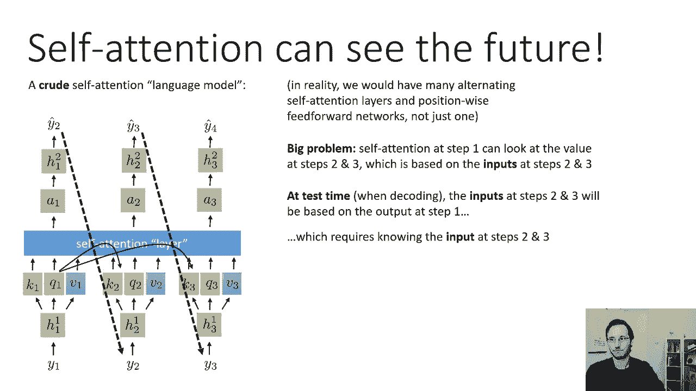

**公式**：
`masked_e_{t,l} = e_{t,l} + M_{t,l}`, 其中 `M_{t,l} = 0 if l <= t else -inf`
然后对 `masked_e_t` 应用Softmax。由于 `e^{-inf} = 0`，未来位置的注意力权重被强制为0。

这样，模型在生成每个词时，都只能基于已生成的上下文，从而可以用于自回归解码。

---

## 总结 📝

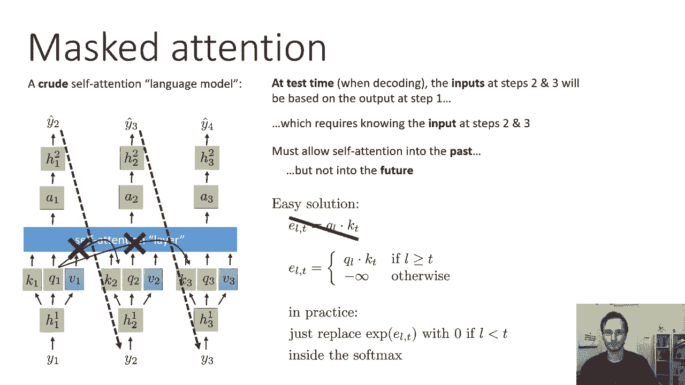

本节课中我们一起学习了将基础自注意力机制转化为强大、实用的Transformer模型所需的四个关键修改：

1.  **位置编码**：通过正弦/余弦函数或可学习参数，为模型注入序列顺序信息，使其能理解单词的相对位置。
2.  **多头注意力**：使用多个独立的注意力头并行工作，使模型能够同时关注输入序列中不同方面或关系的信息。
3.  **非线性层（位置前馈网络）**：在自注意力层之间交替插入非线性变换，使模型不仅能聚合信息，还能进行复杂的计算和处理。
4.  **掩码注意力**：在生成任务中，通过屏蔽未来信息，使自注意力模型能够用于自回归序列生成，避免信息泄漏。

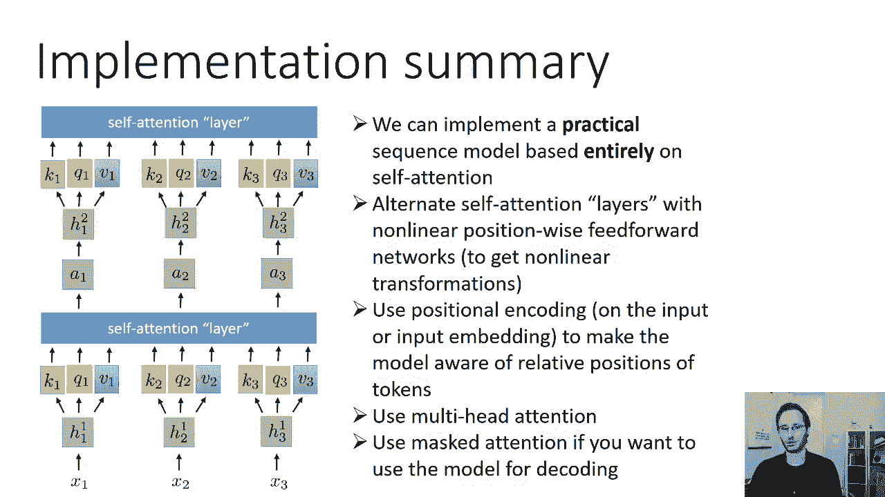

将这些构建块组合起来，就构成了Transformer编码器和解码器的基础。在接下来的部分，我们将看到如何利用这些组件构建完整的、仅基于自注意力的序列到序列模型。