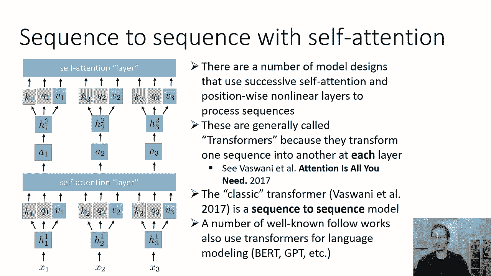
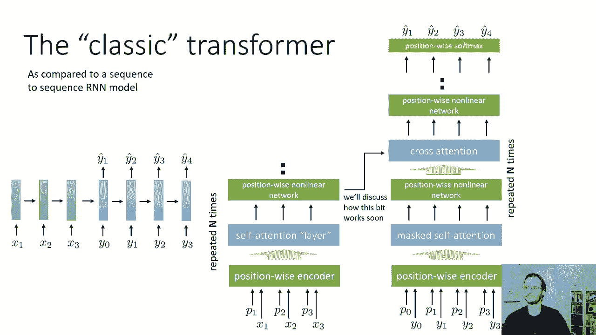
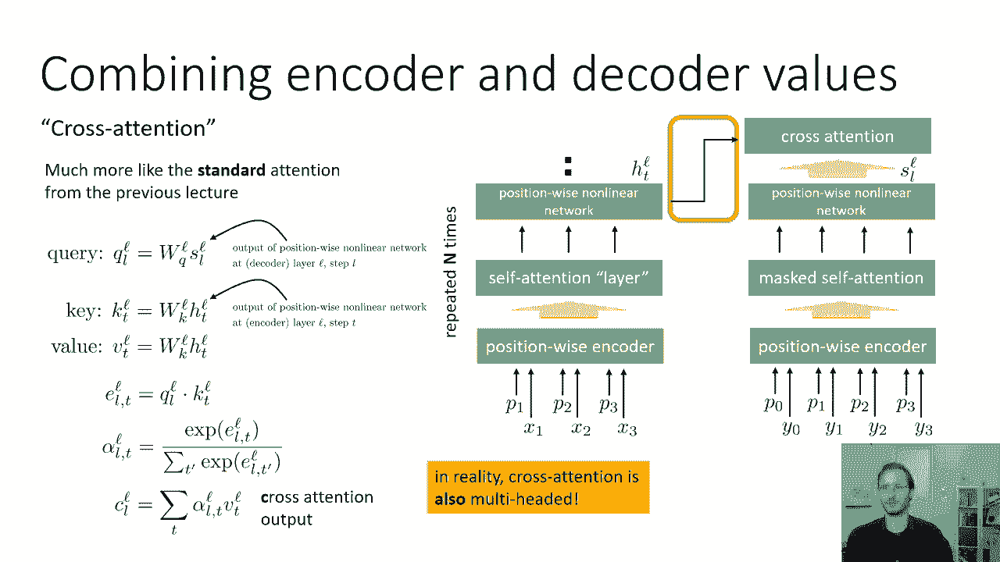
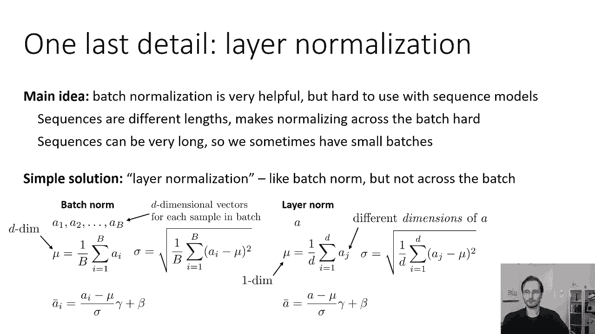
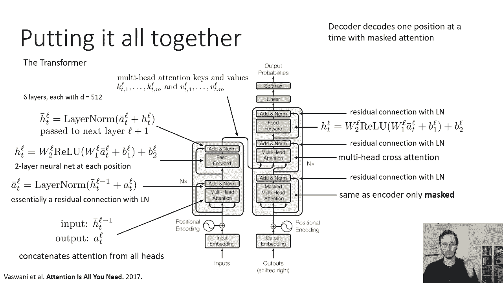
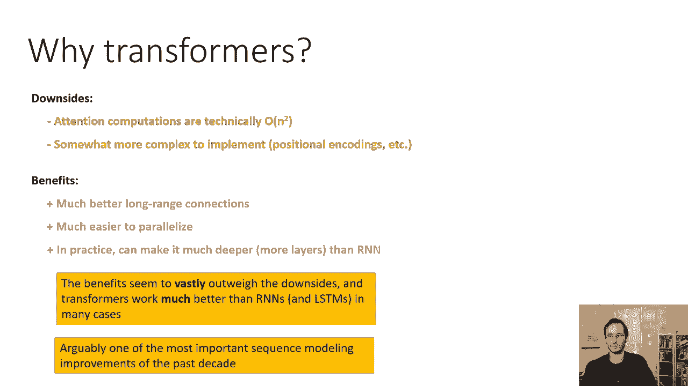
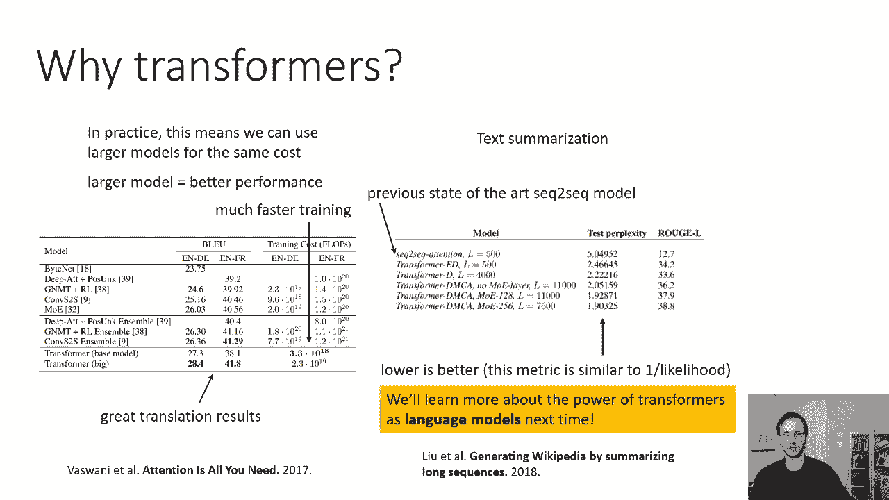

# 38：CS 182- 第12讲 - 第3部分 - Transformer模型 🧠


在本节课中，我们将把之前学到的知识整合起来，深入探讨经典的Transformer模型。我们将了解其核心架构、工作原理，以及它如何通过自注意力机制处理序列数据。

---



## 概述

Transformer是一种利用连续的自注意力和位置前馈网络来处理序列的模型。它最初被设计为序列到序列（Seq2Seq）模型，但后来也被广泛用于语言建模等任务。本节课我们将详细拆解其结构，并与传统的RNN Seq2Seq模型进行对比。

---

## Transformer与RNN Seq2Seq模型的对比

上一节我们介绍了注意力机制，本节中我们来看看如何用Transformer构建一个完整的序列到序列模型。传统的RNN Seq2Seq模型包含一个RNN编码器和一个RNN解码器，它们可以是多层的。


为了将其转换为Transformer，我们需要将编码器和解码器替换为连续的自注意力层，并与位置前馈网络交替堆叠。

以下是Transformer编码器和解码器的核心结构对比：



*   **编码器**：接收输入序列 `X` 及其位置编码 `P`。数据首先经过一个多头自注意力层（无掩码），然后通过一个位置前馈网络（一个非线性函数）。这个过程会重复 `N` 次（例如6次）。
*   **解码器**：接收输出序列的位置嵌入。首先使用**掩码多头自注意力**（确保当前位置只能关注之前的位置），然后经过位置前馈网络。接着，解码器会进行**交叉注意力**操作，即利用编码器产生的所有隐藏向量。交叉注意力之后是另一个位置前馈网络。解码器的每个块也重复 `N` 次。最后，在每个位置应用Softmax函数来生成输出。

解码过程是逐步进行的，因为使用了掩码注意力。类似于RNN，我们将上一步的预测输出作为下一步的输入。

---

## 交叉注意力机制详解



交叉注意力是Transformer解码器的关键组件，其工作原理与上节课介绍的标准注意力机制非常相似。

我们定义：
*   `h_t^l`：编码器第 `l` 层的隐藏状态（位置前馈网络的输出）。
*   `s_t^l`：解码器第 `l` 层的隐藏状态。

交叉注意力的计算步骤如下：

1.  **查询（Query）**：通过对解码器状态 `s_t^l` 应用线性变换 `W_Q^l` 得到：`q_t^l = W_Q^l * s_t^l`
2.  **键（Key）**：通过对编码器状态 `h_t^l` 应用线性变换 `W_K^l` 得到：`k_t^l = W_K^l * h_t^l`
3.  **值（Value）**：通过对编码器状态 `h_t^l` 应用线性变换 `W_V^l` 得到：`v_t^l = W_V^l * h_t^l`
4.  **注意力分数与输出**：计算查询与所有键的点积，应用Softmax得到注意力权重 `α`，然后对值进行加权求和，得到交叉注意力输出 `c^l`。

**公式表示如下：**
```
注意力分数: e_{t,l} = q_l^T * k_t / sqrt(d_k)
注意力权重: α_{t,l} = softmax(e_{t,l})
交叉注意力输出: c^l = Σ_t (α_{t,l} * v_t)
```

在实际的Transformer模型中，交叉注意力也是多头的，通常与自注意力使用相同数量的头（例如8个）。

---

## 层归一化

在深入完整模型之前，我们需要了解一个重要的技术细节：**层归一化**。它对Transformer的稳定训练至关重要。



批归一化（Batch Norm）在序列模型中应用困难，因为序列长度可变且批次可能很小。层归一化（Layer Norm）提供了一个解决方案。

以下是批归一化与层归一化的核心区别：

*   **批归一化**：在**一批数据的所有样本**上，计算每个特征维度（共 `D` 维）的均值和标准差（得到 `D` 维的 `μ` 和 `σ`），然后对每个样本进行归一化。
*   **层归一化**：在**单个数据样本的所有特征**上，计算标量均值 `μ` 和标量标准差 `σ`，然后用这个标量对样本的所有特征进行归一化。

**层归一化公式如下（对于单个样本的激活向量 `a`，维度为 `D`）：**
```
μ = (1/D) * Σ_{j=1 to D} a_j
σ = sqrt( (1/D) * Σ_{j=1 to D} (a_j - μ)^2 )
a'_j = γ_j * ( (a_j - μ) / σ ) + β_j
```
其中 `γ` 和 `β` 是可学习的每维缩放和偏移参数。

层归一化不依赖批次信息，因此非常适合序列模型。

---

## 完整Transformer模型架构

现在，我们可以将所有部分组合起来，形成完整的Transformer模型。以下架构基于论文《Attention Is All You Need》。


以下是编码器和解码器的详细工作流程：

### 编码器
1.  **输入嵌入与位置编码**：将输入词元转换为向量并加上位置编码，得到 `h_bar_t^0`。
2.  **编码器块（重复N次）**：
    *   **多头自注意力**：输入为 `h_bar_t^{l-1}`，输出为 `a_t^l`。
    *   **残差连接与层归一化（Add & Norm）**：`a_bar_t^l = LayerNorm( h_bar_t^{l-1} + a_t^l )`。这是一个残差连接。
    *   **位置前馈网络**：一个两层神经网络（线性层 -> ReLU -> 线性层），作用于 `a_bar_t^l`，输出 `h_t^l`。
    *   **另一个Add & Norm**：`h_bar_t^l = LayerNorm( a_bar_t^l + h_t^l )`。结果传递给下一个块。
3.  **编码器输出**：运行完所有N个块后，得到最终的 `h_bar_t^l`。这些状态将用于为解码器生成键（K）和值（V）。

### 解码器
1.  **输出嵌入与位置编码**：类似编码器，但用于目标序列。
2.  **解码器块（重复N次，与编码器块对应）**：
    *   **掩码多头自注意力**：确保当前位置只能关注之前的位置。后接Add & Norm。
    *   **交叉注意力**：查询（Q）来自上一步的解码器状态，键（K）和值（V）来自**对应层**的编码器输出 `h_bar_t^l`。后接Add & Norm。
    *   **位置前馈网络**：结构与编码器相同，但参数独立。后接Add & Norm。
3.  **输出层**：在最后一个解码器块之后，应用一个线性层和Softmax函数，生成每个位置上词元的概率分布。

解码过程是自回归的：生成第一个词元后，将其作为输入，再生成下一个词元，依此类推。

---

## Transformer的优缺点



Transformer架构具有一些显著的优点和缺点。

**缺点：**
*   **计算复杂度**：自注意力的计算复杂度是序列长度 `N` 的平方 `O(N^2)`。但对于长序列，大部分计算实际上消耗在前馈网络部分，因此实际训练成本可能低于RNN。
*   **实现复杂性**：涉及位置编码、层归一化等设计，需要仔细的超参数调优。

**优点：**
*   **远程依赖**：每个输出位置通过注意力直接连接到所有输入和输出位置，路径长度仅为1，能更好地捕捉长程依赖。
*   **并行化**：编码器完全可并行计算，解码器在训练时也可并行（使用掩码），能充分利用GPU等硬件。
*   **可扩展性**：可以堆叠更多层（例如6层或更多），而深层RNN则难以训练。
*   **性能卓越**：在许多任务上，尤其是自然语言处理领域，Transformer的表现显著优于RNN和CNN模型。

可以说，Transformer是过去十年中序列建模最重要的进展之一。

---

## Transformer的应用成果



Transformer在多个任务上取得了突破性成果。


*   **机器翻译**：在英德和英法翻译任务上，Transformer模型（包括“Base”和“Big”版本）在取得更高BLEU分数的同时，所需的训练计算量（FLOPs）却低于其他基于卷积或循环神经网络的模型（包括集成模型）。这表明Transformer效率更高，扩展性更好。
*   **文本摘要**：在文本摘要任务上，Transformer模型相比带有注意力的Seq2Seq RNN模型，在困惑度（Perplexity）指标上取得了显著提升，困惑度越低表示模型对序列的概率分布建模越好。

此外，Transformer作为语言模型（如GPT、BERT）更是产生了革命性影响，这将在后续课程中讨论。

---

## 总结



本节课我们一起学习了Transformer模型的核心内容。我们从对比传统的RNN Seq2Seq模型入手，详细剖析了Transformer编码器和解码器的结构，重点讲解了**自注意力**、**交叉注意力**和**层归一化**等关键组件。我们了解了完整Transformer的工作流程，并分析了其优缺点。最后，我们看到了Transformer在机器翻译和文本摘要等任务上取得的卓越成果。Transformer通过其强大的并行能力和对长程依赖的有效建模，已成为现代自然语言处理的基石架构。