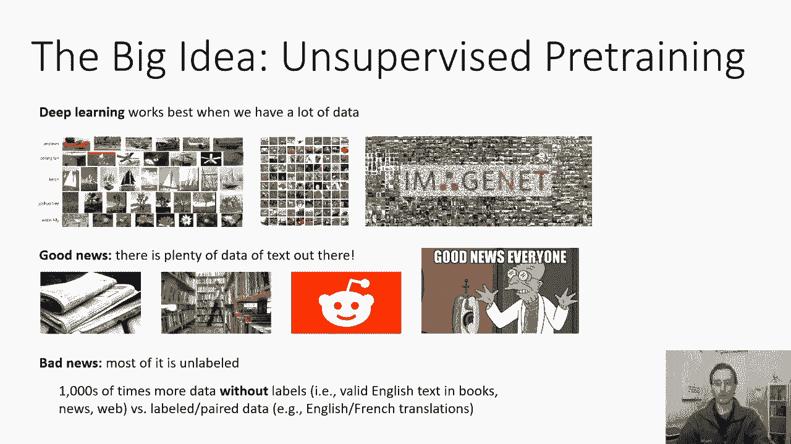
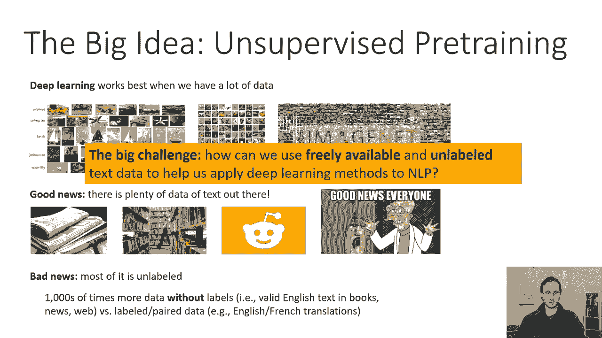
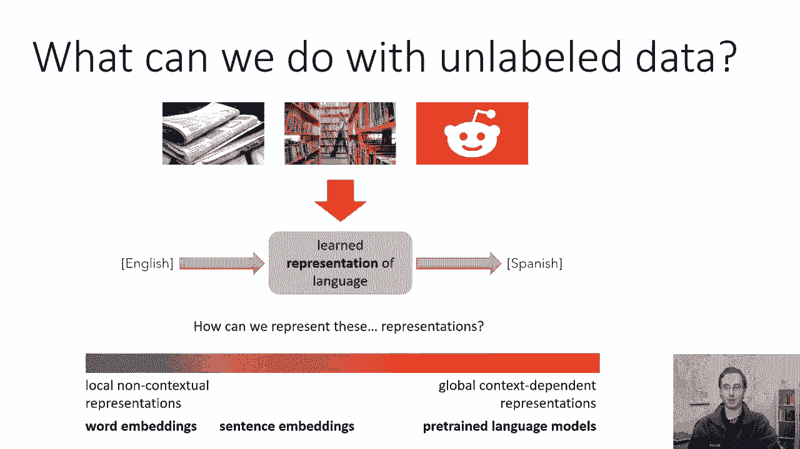
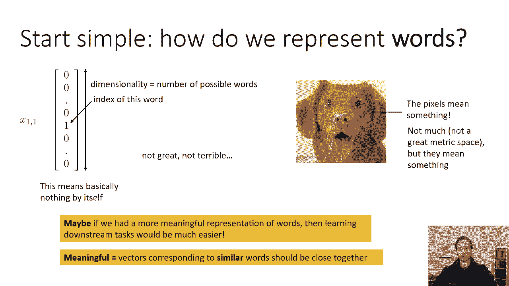
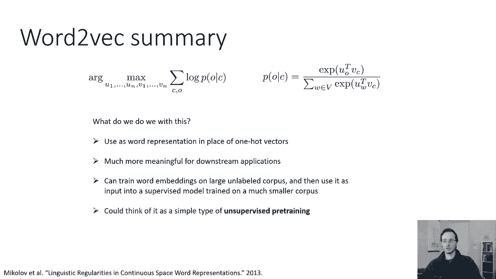

# 39：CS 182 第十三讲 第一部分 - NLP 🧠

在本节课中，我们将学习如何利用深度学习处理自然语言。我们将从简单的单词表示方法开始，逐步深入到更复杂的、能够理解上下文信息的模型。核心目标是理解如何利用海量的无标签文本数据，来提升自然语言处理任务的性能。

---

## 概述：无监督预训练的力量

在之前的课程中，我们讨论了循环神经网络和序列到序列模型。本节课，我们将在此基础上，探讨如何将这些思想应用于自然语言处理领域。



自然语言处理是深度学习的一个重要应用领域。然而，设计本节课时，我必须在众多NLP主题中选择一个来重点讲解。我选择深入探讨的主题是**无监督预训练**。我认为，这是深度学习影响NLP最重要、最根本的方式之一，它甚至超越了NLP本身，体现了深度学习算法的基本优势。



深度学习模型通常在拥有大量数据时表现最佳。随着模型规模的增大，数据集的规模也在同步增加。在许多情况下，数据集本身对于方法的成功至关重要，其重要性不亚于模型架构和训练方法的创新。

对于NLP来说，好消息是：世界上存在海量的文本数据。理论上，NLP应该是深度学习大展身手的绝佳领域。但坏消息是：这些数据大多**没有标签**。例如，我们无法直接从报纸文章学习如何将英语翻译成法语。我们拥有的无标签数据（如书籍、新闻、网页文本）数量，远超有标签数据（如英法翻译对）。

因此，我们面临的核心挑战是：**如何利用免费、海量的无标签文本数据，来帮助我们将深度学习方法更好地应用于NLP？** 这就是本节课的主题。

---



## 我们可以用无标签数据做什么？

虽然不能直接用无标签文章学习翻译，但我们可以用它来学习良好的**语言表示**。例如，学习让语义相似的单词在表示空间中彼此靠近。这样，当我们基于这种表示去学习下游任务（如翻译）时，就会更容易。

我们可以想象一种表示学习的“光谱”：
*   在光谱的一端，是**局部或非上下文相关的表示**。例如，传统的词嵌入，每个词有一个固定的向量，不考虑它在句子中的具体用法。
*   在光谱的另一端，是**全局上下文相关的表示**。例如，预训练的语言模型，它会读取整个句子甚至段落，然后为句子中的每个词生成一个定制化的、考虑其上下文的表示。

在本节课中，我们将讨论这个光谱的两个极端。首先从词嵌入开始，然后花较多时间讨论预训练语言模型，以及它们如何为NLP提供更强大、更优越的表示。



---

## 从简单开始：如何表示单词？🔤

在讨论RNN和序列到序列模型时，我们见过**独热编码**表示法。一个词的独热向量维度等于词典大小，只有对应词索引的位置为1，其余全为0。

**公式**：对于一个词 `w`，其独热向量 `v` 满足 `v[i] = 1` 当且仅当 `i` 是 `w` 在词典中的索引。

这种表示法简单，包含了“这个词是什么”的信息，但无法体现词与词之间的关系和相似性。两个近义词的独热向量看起来和任意两个不相关的词一样不同。

我们希望获得一种更有意义的词表示，使得语义相似的词在表示空间中也彼此接近。那么，如何构建这种词表示呢？

---

## Word2Vec：让相似的词靠近

我们追求的是类似 **Word2Vec** 这样的方法。它将单词嵌入到一个向量空间中，使得语义相似的词靠得很近。此外，在这个潜在空间中的向量运算也具有语义意义（例如，“国王”-“男人”+“女人”≈“女王”）。

其基本思想是：**一个词的含义很大程度上由其上下文（即它附近出现的词）决定**。两个词越能在相似语境中互换使用，它们就越相似。

具体来说，我们定义一个**中心词**和其**上下文词**（例如，中心词前后5个单词范围内的词）。核心问题是：**我们能否从一个词的嵌入预测其邻居？**

我们可以将其构建为一个预测问题：给定中心词 `c`，预测其上下文词 `o` 的概率。我们使用逻辑回归（Softmax）框架，但参数不是权重，而是每个词的向量表示。

**公式**：`P(o|c) = softmax(u_o^T * v_c)`，其中 `u_o` 是词 `o` 作为上下文时的向量，`v_c` 是词 `c` 作为中心词时的向量。

训练时，我们最大化语料库中所有 `(c, o)` 配对的对数似然。优化参数是所有词的 `u` 和 `v` 向量。最终，一个词的表示可以取其 `u` 和 `v` 向量的平均值。

然而，直接使用Softmax计算成本高昂，因为分母需要对整个词典求和。因此，实践中常采用一种更高效的方法。

---

## 负采样：一种高效的训练技巧

为了规避对整个词典求和的问题，Word2Vec 采用了一种称为**负采样**的技术。它将问题转化为一个二分类问题：给定一对词 `(c, o)`，判断 `o` 是否是 `c` 的真实上下文词。

**公式**：对于正样本（真实上下文对），概率为 `P(D=1|c,o) = σ(u_o^T * v_c)`，其中 `σ` 是Sigmoid函数。
对于负样本（随机采样的非上下文词 `w`），概率为 `P(D=0|c,w) = 1 - σ(u_w^T * v_c) = σ(-u_w^T * v_c)`。

训练目标是最大化正样本的对数概率，同时最小化（即最大化负样本的负对数概率）随机采样的负样本的对数概率。

**代码逻辑示意**：
```python
# 对于每个训练样本 (center_word, context_word)
# 1. 计算正样本得分
pos_score = sigmoid(dot(u[context_word], v[center_word]))
loss = -log(pos_score) # 最小化负对数似然

# 2. 采样 k 个负样本词
for negative_word in k_negative_samples:
    neg_score = sigmoid(dot(u[negative_word], v[center_word]))
    loss -= log(1 - neg_score) # 同样最小化负样本的概率
```

通过这种方式，模型学习将中心词的向量 `v_c` 拉向真实上下文词的向量 `u_o`，同时推离随机负样本词的向量 `u_w`。

训练得到的词向量可以用于下游任务，替代独热编码，因为它们包含了从海量无标签数据中学到的语义和语法关系。

---

## 总结

本节课我们一起学习了自然语言处理中利用无标签数据的核心思想——无监督预训练。

我们首先指出了NLP领域数据丰富但标签稀缺的现状，从而引出了学习通用语言表示的重要性。接着，我们从最简单的词表示出发，介绍了**Word2Vec**模型。该模型基于“词的上下文定义其含义”的分布式假设，通过预测上下文词来学习词向量。为了高效训练，我们详细讲解了**负采样**技术，它将复杂的Softmax分类问题转化为一系列二分类问题。

最终，我们获得了一种稠密的词向量表示，语义相似的词在向量空间中彼此靠近。这种表示可以作为下游监督任务（如文本分类、机器翻译）的强大特征输入，使得模型即使在较少的有标签数据上也能取得良好性能。



在下一节中，我们将沿着表示学习的“光谱”继续向右移动，探讨更强大的、能够理解完整上下文的**预训练语言模型**，例如BERT和GPT系列模型。