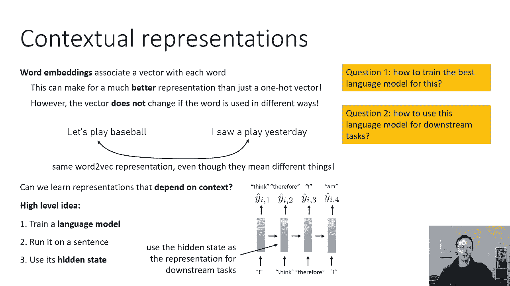
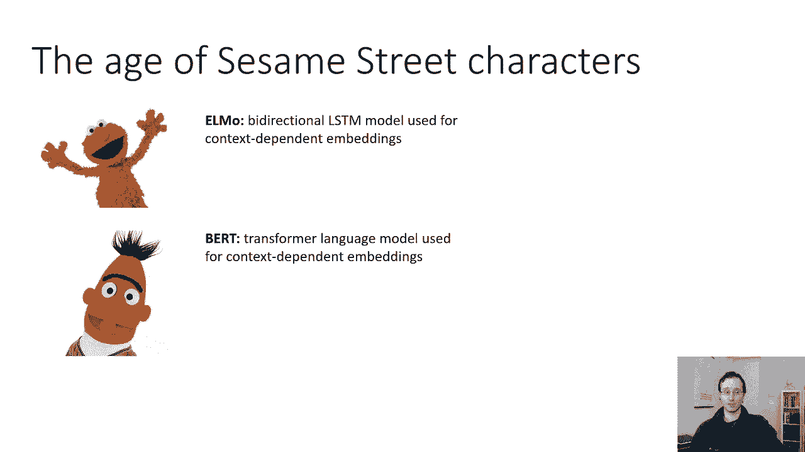
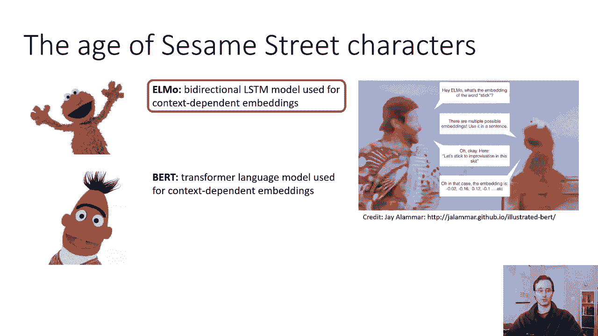
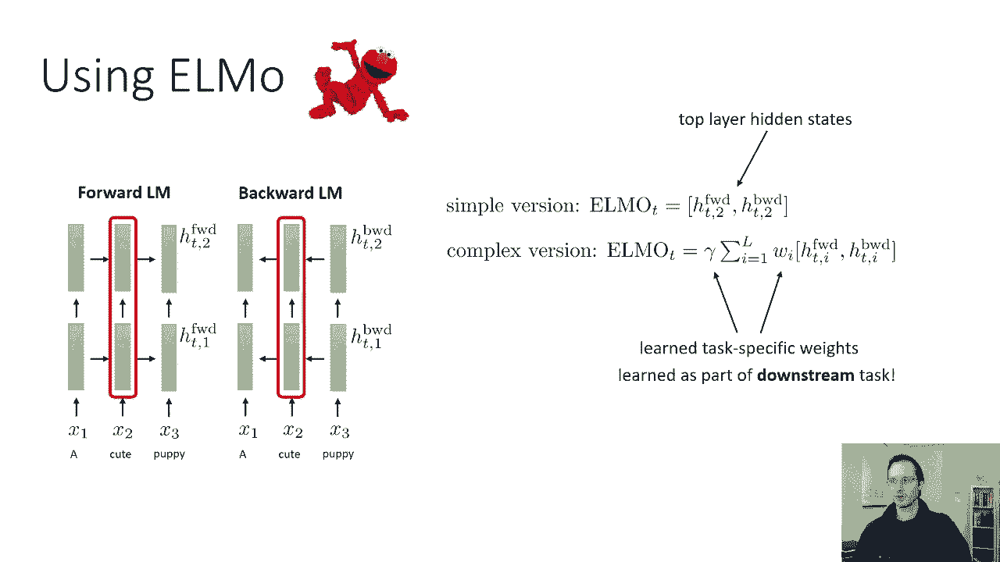
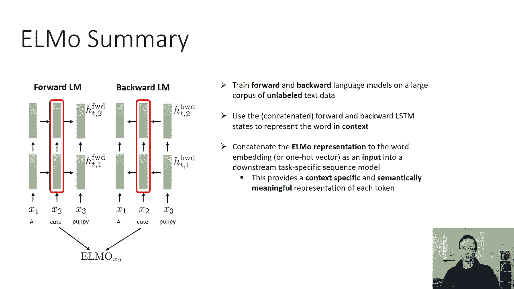

# 40：CS 182 第十三讲 第二部分 - NLP 🧠

在本节课中，我们将要学习预训练语言模型。我们将从上下文无关的词嵌入（如 Word2Vec）的局限性出发，探讨如何通过训练语言模型来获得依赖于上下文的词表示。我们将重点介绍两个重要的模型：ELMo 和 BERT，并理解它们如何为下游 NLP 任务提供更强大的语义表示。

---

## 预训练语言模型概述

上一节我们介绍了基础的词嵌入方法。本节中，我们来看看预训练语言模型。其核心目标是获得**上下文表示**。传统的词嵌入（如 Word2Vec）为词典中的每个单词关联一个固定的向量。然而，同一个词在不同语境下可能有不同含义，固定向量无法捕捉这种差异。

例如，在以下两个句子中：
*   “我们去打棒球吧。”
*   “我昨天看了一场比赛。”

“打”这个词在两句中含义不同（动词 vs. 名词），但 Word2Vec 会赋予它相同的向量表示。

因此，我们需要一种能**依赖于上下文**的表示方法。高级思路是：训练一个语言模型来预测给定上文后的下一个词。然后，在特定句子（如“我们去打棒球吧”）上运行该模型，并使用模型在特定词处的**隐藏状态**作为该词的表示。

这种隐藏状态应能代表该词在句子中的角色，因为它包含了预测后续词所需的信息。与 Word2Vec 不同，这种表示依赖于句子中的其他词（至少是上文）。

要实现这一点，需要解决两个问题：
1.  如何训练最佳的语言模型？
2.  如何将该语言模型用于下游任务？

---

## ELMo：基于双向LSTM的上下文表示 🎭

首先，我们来谈谈 ELMo。ELMo 是“Embeddings from Language Models”的缩写，它是一个基于双向 LSTM 的语言模型。

### 核心思想与架构

基本 LSTM 语言模型的问题是：一个词（如句子中的第二个词）的表示只依赖于它**之前**的词，而无法利用其**之后**的上下文信息。这并不理想，因为一个词的完整含义通常需要整个句子来推断。

ELMo 采用了一种更简单的方法：它训练**两个独立**的 LSTM 语言模型。
*   **前向语言模型**：像常规 LSTM 一样，根据上文预测下一个词。
*   **后向语言模型**：将句子顺序反转，根据“下文”（即原句的后文）预测“前一个”词。

这两个模型都是多层堆叠的 LSTM。对于时间步 `t`，我们有以下隐藏状态：
*   前向模型：`h_{t}^{forward,1}`, `h_{t}^{forward,2}`, ...
*   后向模型：`h_{t}^{backward,1}`, `h_{t}^{backward,2}`, ...

这些隐藏状态共同构成了该词的上下文表示。

### 如何使用 ELMo 表示

以下是使用 ELMo 表示的主要步骤：

1.  **获取表示**：将整个目标句子分别输入前向和后向 LSTM 模型。
2.  **组合表示**：对于句子中的每个词，组合其在两个方向、各层的隐藏状态。
    *   **简单版本**：直接连接顶层的前向和后向隐藏状态。`ELMo_t^{simple} = [h_{t}^{forward, top}; h_{t}^{backward, top}]`
    *   **复杂/常用版本**：对所有层的隐藏状态进行加权平均。公式如下：
        `ELMo_t^{task} = \gamma^{task} \sum_{l=0}^{L} s_l^{task} h_{t,l}`
        其中，`h_{t,l}` 是第 `l` 层的双向隐藏状态组合，`s_l` 和 `\gamma` 是可学习的权重参数，可以在下游任务中通过反向传播进行优化。
3.  **用于下游任务**：将得到的 ELMo 表示与基础的词嵌入（或 one-hot 向量）连接起来，作为下游模型（如用于问答、文本蕴含的模型）的输入。

### ELMo 总结

本节课我们一起学习了 ELMo 模型。总结其流程：
1.  在大型无标注文本语料库上，分别独立训练一个前向和一个后向 LSTM 语言模型。
2.  对于给定句子，使用这两个模型的隐藏状态（通常组合各层）来生成每个词的上下文相关表示。
3.  将该 ELMo 表示与基础词向量拼接，作为下游特定任务模型的输入。

这比 Word2Vec 更复杂，因为需要在测试时运行整个语言模型来获取嵌入，但其提供的上下文敏感表示能显著提升各种 NLP 任务的性能。

---

## 迈向更强大的模型：BERT 的引入 🤖

虽然 ELMo 效果很好，但更强大且如今几乎普遍用于实际 NLP 应用的模型是基于 Transformer 架构的 BERT。

BERT 是“Bidirectional Encoder Representations from Transformers”的缩写。与 ELMo 使用双向 LSTM 不同，BERT 使用了 Transformer 的编码器部分，能够更高效、更深入地捕捉上下文信息。

BERT 及其后续变体（如 RoBERTa, ALBERT 等）的核心原则是**掩码语言模型**预训练。它通过随机遮盖输入句子中的一些词，并训练模型来预测这些被遮盖的词，从而学习双向的上下文表示。这比 ELMo 的两个单向模型更直接地整合了上下文。

在接下来的课程中，我们将深入探讨 BERT 的架构、预训练任务以及如何将其应用于各种下游任务。BERT 的出现标志着 NLP 领域进入了预训练微调的新范式，极大地推动了自然语言理解的发展。

---

**本节课中我们一起学习了**：从上下文无关词嵌入的局限性出发，引入了预训练语言模型的概念。我们详细探讨了基于双向 LSTM 的 ELMo 模型，了解了它如何通过组合前向和后向语言模型的隐藏状态来生成上下文相关的词表示，并如何将其用于下游任务。最后，我们引出了更强大的基于 Transformer 的 BERT 模型，为后续学习奠定了基础。