# 41：CS 182 讲座 13 第 3 部分 - NLP 中的 BERT 🧠

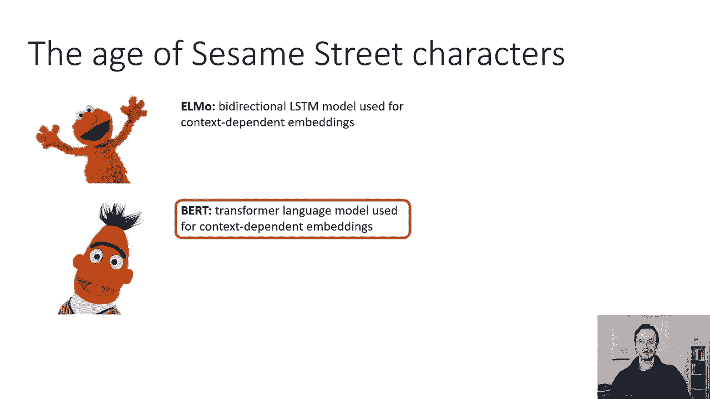

在本节课中，我们将要学习 BERT（Bidirectional Encoder Representations from Transformers），这是当今 NLP 任务中最常用的语言模型之一。我们将探讨 BERT 的核心思想、它与之前模型（如 ELMo）的区别、其独特的训练方法，以及如何将其应用于各种下游任务。

---

## BERT 的基本思想

上一节我们介绍了 ELMo 等基于 LSTM 的双向语言模型。本节中我们来看看 BERT 是如何工作的。

BERT 在很高层面上使用了与 ELMO 相同的原理，但它不使用两个 LSTM 模型，而是使用一个 Transformer 模型。

如果我们想简单地用 Transformer 替换之前的 LSTM，可以尝试将 Transformer 训练成一个语言模型。在序列到序列模型中，编码器按顺序读取输入，而解码器本质上是一个条件语言模型。经典 Transformer 的解码器已经是一个条件语言模型。

要得到一个无条件的语言模型，只需使用相同的解码器，但去掉条件作用的部分（即交叉注意力）。如果我们去掉常规 Transformer 解码器上的交叉注意力，它就变成了一个基本的语言模型。

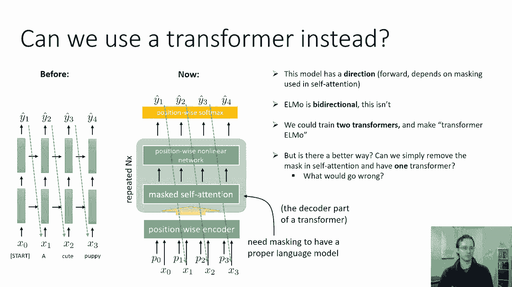

以下是其工作原理的简化描述：
1.  输入句子中的所有标记及其位置编码。
2.  通过 **掩码自注意力** 传递它们（在解码器中，这防止了未来的标记影响过去）。
3.  经过一个重复 N 次的块（包含位置前馈网络）。
4.  最后通过一个 softmax 层来预测下一个单词。

这是最直接的方法，用 Transformer 替换 ELMo 中的 LSTM。然而，这个模型是单向的（因为使用了掩码自注意力），而 ELMo 是双向的。原则上，可以像 ELMo 一样训练两个 Transformer（一个前向，一个后向）。

---

## 从单向到双向的挑战

我们能否简单地移除自注意力中的掩码，让 Transformer 同时携带向前和向后的信息，从而得到一个双向模型，而无需训练两个独立的模型呢？

这可能会出问题。考虑一下，如果我们要训练一个语言模型，其任务是在每个时间步预测下一个标记。完整的输出序列只是输入序列向右移动了一位。

如果我们移除自注意力中的掩码（即使用完整的自注意力，就像 Transformer 的编码器一样），会发生什么？第一步的输出实际上可能与第一步的输入相同（只是复制并输出下一个词）。这意味着 Transformer 可能不需要做很多工作来理解句子的含义，它只需学会“查找”并复制下一个词。对于长句子，除了最后一个词，模型几乎不需要理解任何内容。

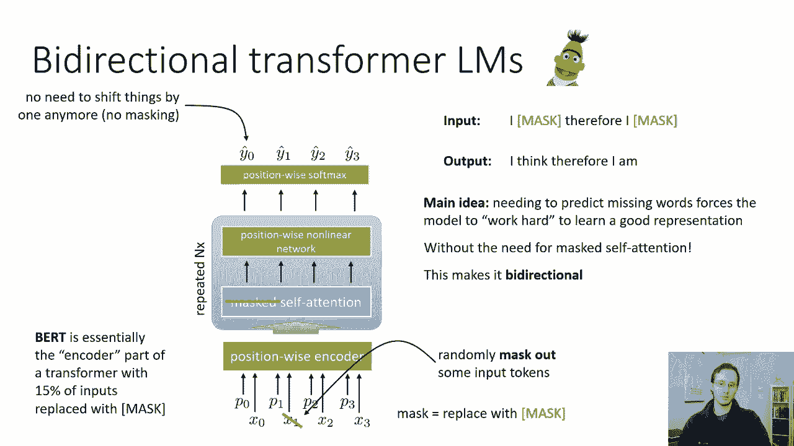

因此，移除自注意力的掩蔽不是一个好主意，因为任务变得太容易了，模型可能无法学到有意义的表示。

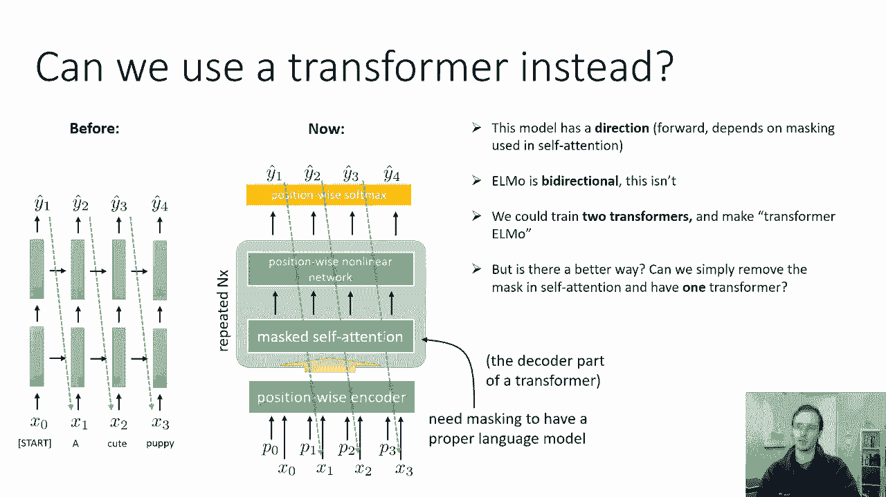

---

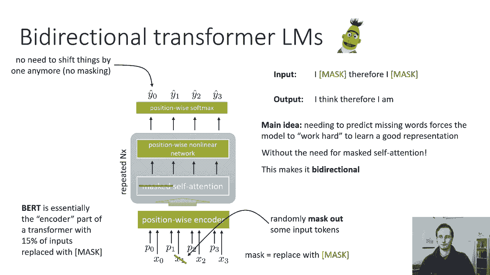

## BERT 的解决方案：掩码语言模型

BERT 通过修改训练程序来避免上述问题。它不会尝试预测序列的下一个词，而是对输入进行修改，使任务变得更困难。

BERT 的做法是随机掩码输入中的标记。对于输入中的每个标记，有 15% 的概率，它会被一个特殊的 **`[MASK]`** 标记替换。所有 `[MASK]` 标记的向量表示是相同的（例如，一个全零向量）。然而，输出端的目标保持不变（即预测原始的、未被掩码的词）。

这迫使 Transformer 解决一个“填空”任务。例如：
*   **输入**：`我 [MASK] 了`
*   **输出目标**：`我 吃 了`

直觉是，如果 Transformer 能学会填上被掩码的词，它就必须真正理解单词在上下文中的含义。这与词嵌入的直觉类似：如果你能从上下文中预测一个词，你就能学到关于其意义的东西。

BERT 本质上使用了 Transformer 的编码器部分（没有掩码的自注意力），其中 15% 的输入被掩码替换，损失函数是预测那些被掩码的原始输入。

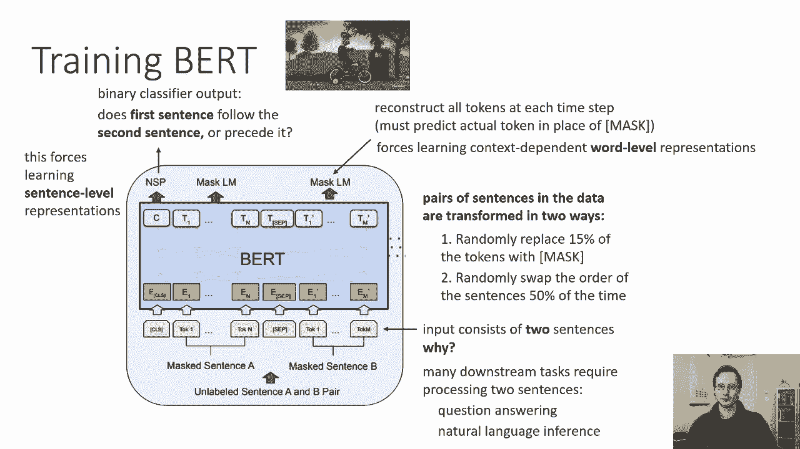

---

## BERT 的实际训练细节

在实际训练 BERT 时，会做一些小的调整来提升效果。

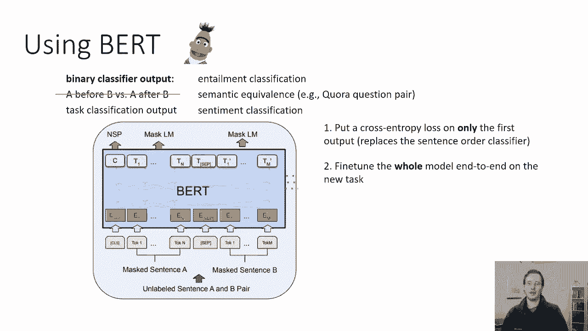

BERT 在成对的句子上进行训练。我们从大量文本语料库（如维基百科）中取句子对。训练时：
1.  输入以特殊的 **`[CLS]`** 标记开始。
2.  对于每一对输入句子，我们随机用 `[MASK]` 替换 15% 的标记（每个标记独立处理）。
3.  我们还会随机交换两个句子的顺序（50% 的概率）。
4.  在第一个标记（`[CLS]`）的输出位置，我们训练一个二元分类器，来预测第二句是否真的紧跟在第一句之后（即句子顺序预测任务）。
5.  在所有其他标记位置，我们预测该位置原本应该是什么词（掩码语言模型任务）。

这样做的直觉是：我们希望 `[CLS]` 位置的表示能捕获整个句子或句子对的语义信息。对于需要词级表示的任务，我们使用每个位置的输出特征；对于需要句子级表示的任务，我们使用第一个位置（`[CLS]`）的输出。

---

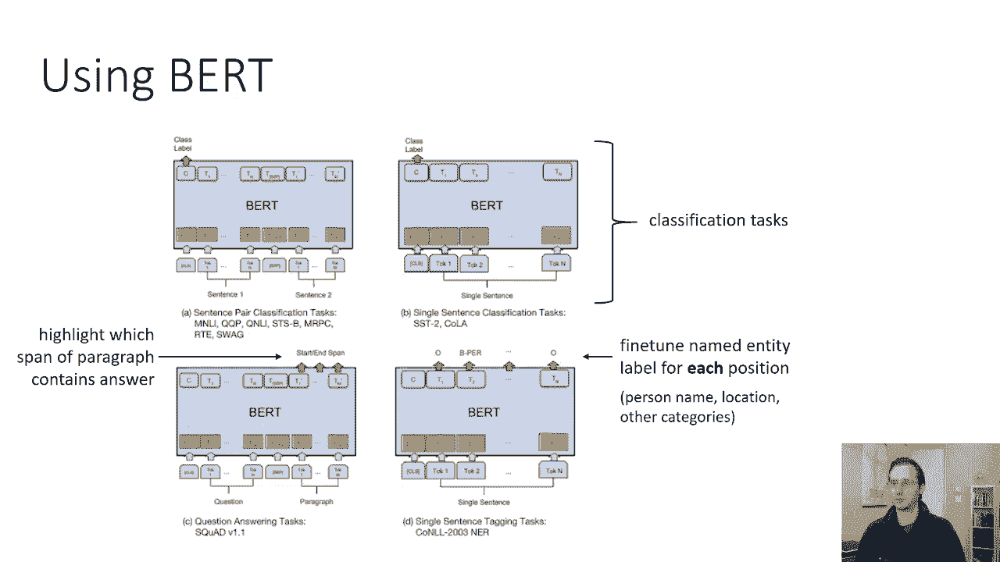

## 如何使用 BERT

BERT 提供了多种使用方式，主要分为微调和特征提取两种。

### 1. 微调 BERT 用于下游任务

以下是常见的下游任务类型及对应的微调方法：

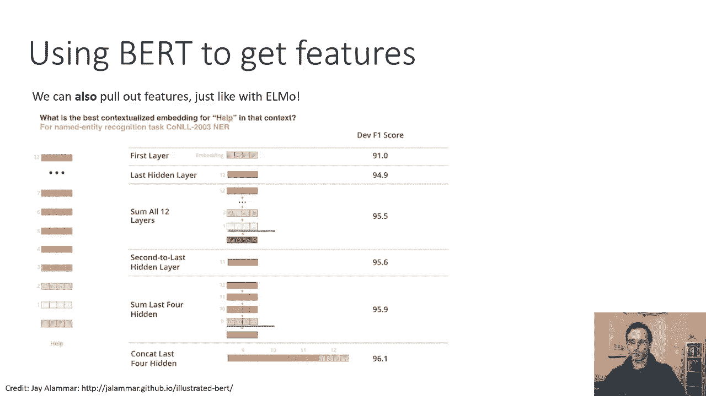

*   **句子/句子对分类任务**（如情感分析、语义等价判断、文本蕴含）：
    你可以直接使用 BERT 第一个位置（`[CLS]`）的输出向量。具体做法是：在一个大型未标记语料库上预训练 BERT 后，去掉其原有的输出层（语言模型损失和句子顺序预测损失），在 `[CLS]` 向量后接一个新的分类器（如一个全连接层加 softmax），然后使用新任务的数据对整个模型（包括 BERT 的权重）进行微调。

*   **词级标注任务**（如命名实体识别、问答）：
    对于需要为每个输入标记输出标签的任务，你可以使用 BERT 每个位置的输出向量。具体做法是：将预训练 BERT 在每个位置的语言模型损失替换为你任务所需的损失（例如，每个位置的交叉熵损失），然后对整个模型进行微调。

### 2. 从 BERT 提取特征

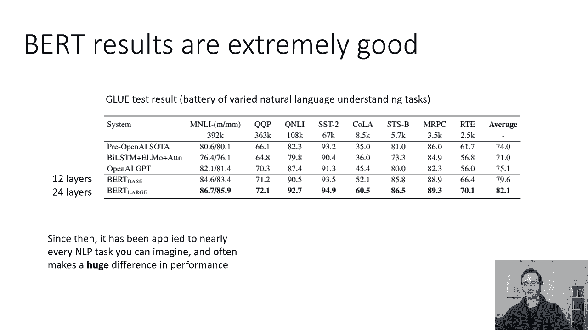

你也可以像使用 ELMo 一样，将 BERT 用作静态特征提取器。具体做法是：取 BERT 模型（一个包含多个 Transformer 块的大模型）中某一层或某几层的隐藏状态作为你下游模型的输入特征。

关于使用哪一层，经验表明：
*   仅使用第一层效果不佳。
*   使用最后一层效果较好。
*   将最后几层连接（concatenate）起来通常能获得最好的效果。

---

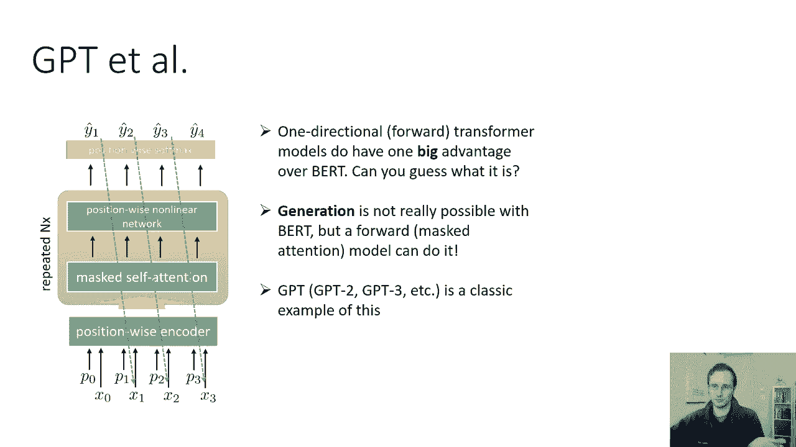

## BERT 与其他模型的比较

BERT 在众多 NLP 任务上取得了显著提升。例如，在 GLUE 基准测试（一系列自然语言理解任务）上，BERT 的表现远超之前的模型，如 ELMo 和 GPT（一个单向 Transformer 语言模型）。

BERT 的主要优势在于其双向性，这使其能更好地理解上下文。然而，这种双向性也带来了一个限制：**BERT 不擅长文本生成**，因为它训练时是同时看到整个（掩码后的）句子的，而不是按顺序生成。

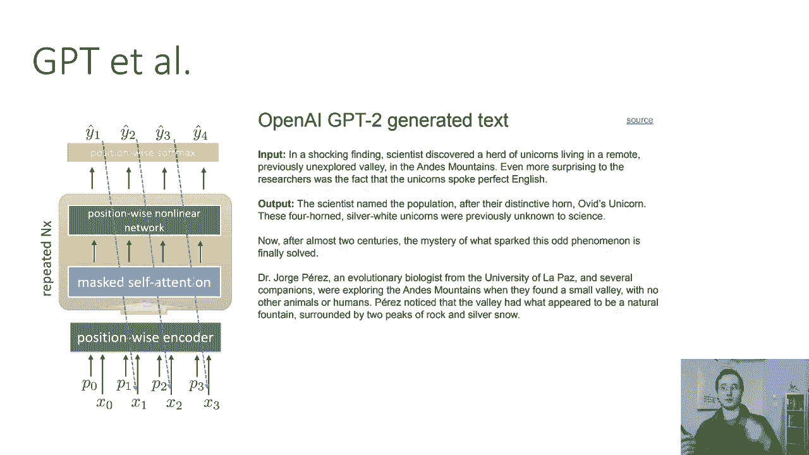

相比之下，像 GPT 这样的单向 Transformer 模型，虽然在下游任务上的表现可能不如 BERT，但它们非常擅长**生成连贯的文本**，因为它们被训练来根据前面的词预测下一个词。

---

## 总结

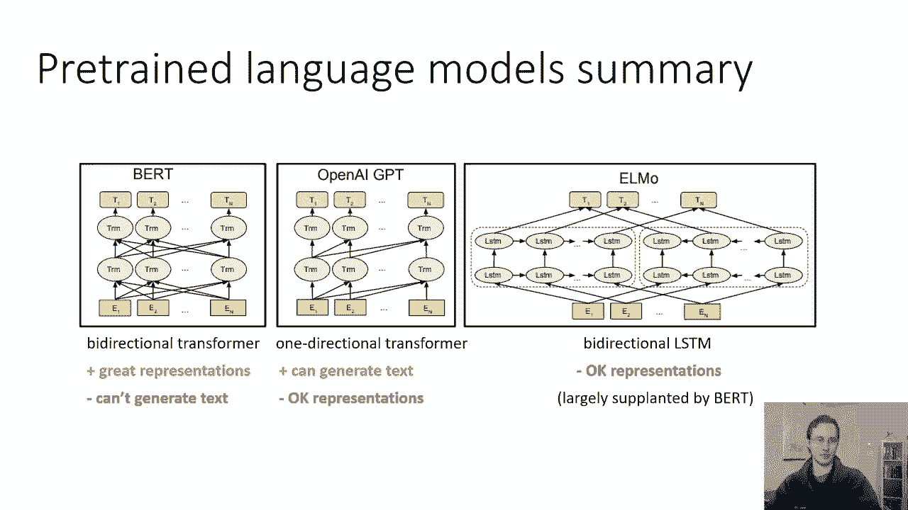

本节课中我们一起学习了 BERT 模型。

*   **BERT 是什么**：它是一个基于 Transformer 编码器的**双向**语言模型。
*   **核心训练方法**：通过**掩码语言模型**（随机遮盖单词并预测它）和**下一句预测**任务进行预训练，迫使模型学习深层的上下文表示。
*   **如何使用**：
    *   **微调**：在预训练模型基础上，针对特定任务（如分类、标注）调整所有参数，通常能获得最佳性能。
    *   **特征提取**：直接使用 BERT 中间层的隐藏状态作为下游模型的输入特征。
*   **关键优势**：BERT 的双向上下文理解能力使其在大多数 NLP 理解任务上表现卓越。
*   **重要启示**：在大规模未标记文本上预训练的语言模型，其学习到的上下文相关表示，对于现代 NLP 至关重要，通常是获得先进结果的基础。

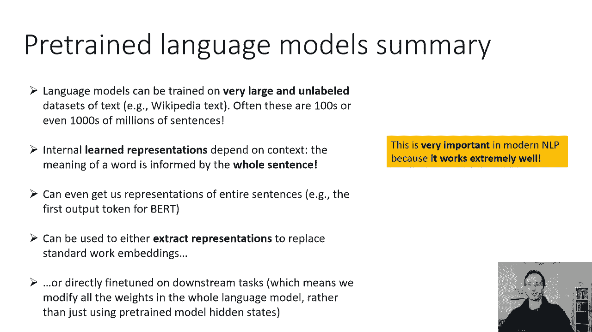

BERT 的出现标志着 NLP 从使用静态词向量（如 Word2Vec）或浅层上下文表示（如 ELMo），进入了使用深度预训练 Transformer 模型的新时代。