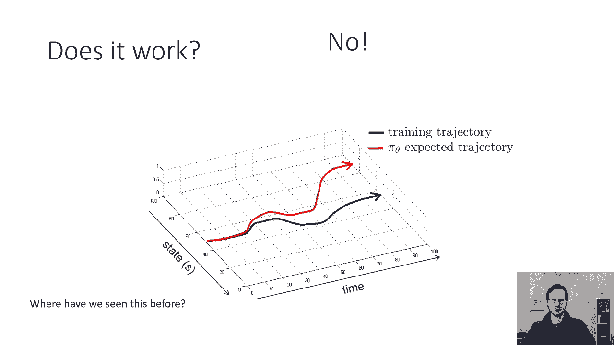
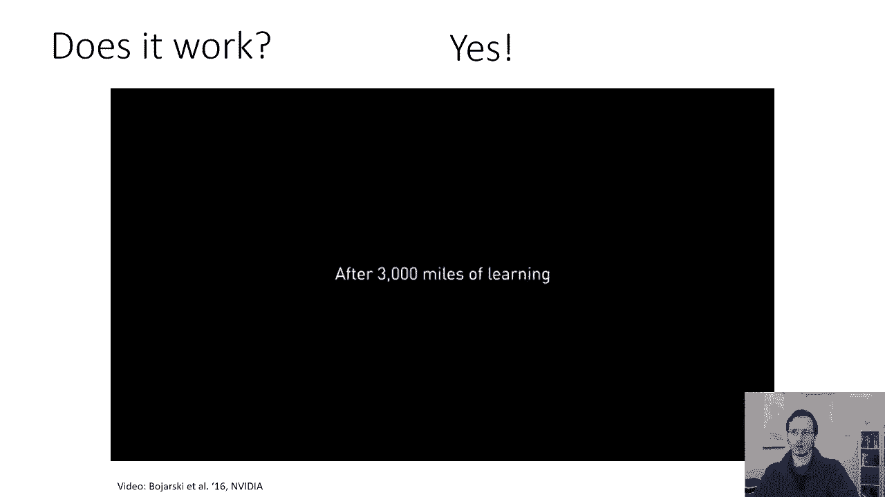
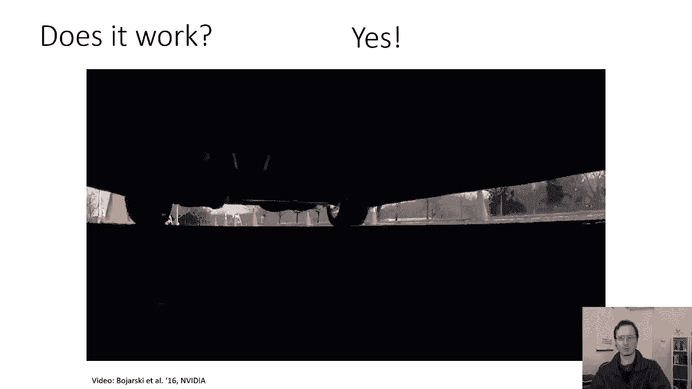
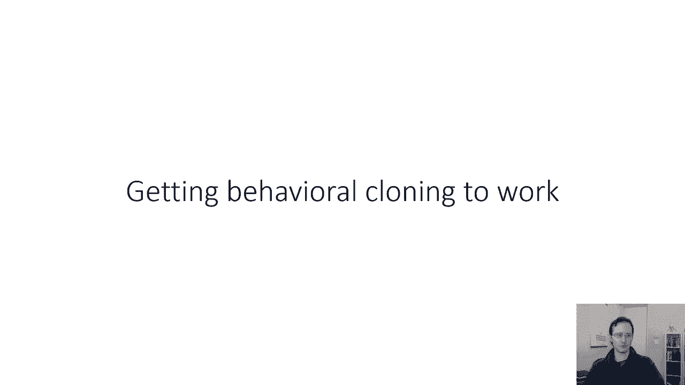

# 42：CS 182 第14课 - 模仿学习 🧠

在本节课中，我们将学习一种基于学习的控制方法——模仿学习。我们将从预测问题与控制问题的区别开始，逐步引入模仿学习的基本概念、术语、核心思想，并探讨其理论局限性与实际应用中的挑战。

---

## 从预测到控制 🔄

上一节我们介绍了深度学习方法主要聚焦于预测问题。本节中，我们来看看控制问题与预测问题的关键区别。

在预测问题中，我们通常假设数据是独立同分布的。这意味着每个数据点的标签不会影响其他数据点。例如，将第一张图片中的豹子错误分类为老虎，并不会改变第二张图片的内容。

然而，在控制问题中，情况并非如此。例如，在多风的山路上驾驶，第一步的错误选择可能会影响第二步的输入，导致后续决策更加困难。控制问题中的输入并非相互独立，且目标通常更为抽象（如“开车去杂货店”而非直接输出转向命令）。

总结来说：
*   **预测问题**：数据独立同分布，目标是预测正确的标签。
*   **控制问题**：决策影响未来输入，目标是完成高级任务。

许多现实世界中的机器学习系统部署，即使是预测系统，也可能因反馈循环而演变为控制问题。

---

## 控制问题术语 📖

为了讨论控制问题，我们需要引入一些标准术语。我们将从一个熟悉的图像分类模型开始，并逐步将其转化为控制模型。

*   **观察 (Observation, O)**：模型的输入，例如图像。我们用 `O_t` 表示在时间 `t` 的观察。
*   **动作 (Action, A)**：模型的输出，例如转向命令。我们用 `A_t` 表示在时间 `t` 的动作。
*   **策略 (Policy, π)**：一个模型，它根据观察 `O_t` 来输出动作 `A_t`。我们将其表示为 `π_θ(A_t | O_t)`，其中 `θ` 是模型参数。策略可以是一个神经网络。

我们还需要区分**状态 (State, S)** 和**观察 (Observation, O)**：
*   **状态 (S_t)**：描述世界潜在真实情况的变量（如物体的精确位置、速度）。状态具有**马尔可夫性质**，即未来状态仅依赖于当前状态。
*   **观察 (O_t)**：传感器获取的信息（如图像像素）。观察可能不具备马尔可夫性质，因为当前观察可能不足以完全预测未来。

在今天的模仿学习中，我们将主要处理基于观察的策略。

---

## 模仿学习：行为克隆 🚗

模仿学习是一种简单的基于学习的控制方法。其核心思想是使用监督学习工具来解决控制问题。

我们将以驾驶汽车为例：
*   **观察**：汽车摄像头的图像。
*   **动作**：方向盘的转向命令。

**行为克隆**是模仿学习最基本的形式。其步骤如下：

以下是行为克隆的步骤：
1.  **收集数据**：人类专家司机驾驶汽车，记录下观察（图像）和对应的动作（转向命令）。
2.  **训练策略**：使用这些数据训练一个监督学习模型（如神经网络），使其学会从观察 `O_t` 预测动作 `A_t`。
3.  **部署策略**：将训练好的策略模型部署到汽车上，让它根据实时图像自主驾驶。

这本质上与训练一个图像分类器完全相同。

---

## 理论挑战：复合错误 ⚠️

上一节我们介绍了行为克隆的简单流程。本节中，我们来看看这种方法在理论上存在的一个严重问题。

理论上，行为克隆存在**复合错误**问题。原因如下：
1.  训练好的策略在部署时难免会犯小错误。
2.  这个小错误会导致下一个时间步的观察 `O_{t+1}` 偏离训练数据中常见的分布。
3.  面对不熟悉的观察，策略更容易犯更大的错误。
4.  错误会随着时间步长**累积和放大**，最终可能导致灾难性后果（如驶出道路）。

这类似于我们在课程早期讨论过的序列生成模型中的错误累积问题。

---

## 实践中的表现 🤔

尽管理论上存在复合错误问题，但实践中，行为克隆有时却能表现得相当好。

例如，英伟达在2016年的研究中：
*   最初使用有限数据训练的行为克隆模型表现不佳。
*   在收集了**更多数据**（例如，额外3000英里的驾驶数据）并重新训练后，模型的表现得到了显著改善，能够进行合理的驾驶。

这表明，**大规模、高质量的数据**可以在一定程度上缓解分布偏移和复合错误问题，使简单的行为克隆方法在实际中变得可行。

---

## 总结 📝

本节课中我们一起学习了：
1.  **预测与控制**：理解了控制问题中决策相互依赖、目标抽象的特点。
2.  **核心术语**：掌握了状态、观察、动作和策略的定义与区别。
3.  **模仿学习**：学习了行为克隆这一最简单的模仿学习方法，即用监督学习拟合专家数据。
4.  **核心挑战**：认识了行为克隆的理论缺陷——复合错误，即小错误会在时间序列中累积放大。
5.  **实践洞察**：了解到尽管有理论缺陷，但通过收集大量数据，行为克隆在实践中仍可能取得不错的效果。

在接下来的课程中，我们将探讨如何设计更鲁棒的算法来正式解决这些分布偏移和复合错误问题。