# 43：CS 182 第14讲 第2部分 - 模仿学习 🚗🤖

在本节课中，我们将学习如何使行为克隆在实践中有效工作。我们将探讨行为克隆失败的核心原因——分布偏移问题，并介绍几种缓解该问题的技术，包括处理非马尔可夫行为和多模态行为的方法。最后，我们会了解一个在实践中成功应用的行为克隆“技巧”。

---

## 概述：行为克隆的挑战

行为克隆是一种简单的模仿学习方法，它通过监督学习来训练策略，使其模仿专家的行为。然而，在实践中直接应用行为克隆常常会失败，因为一个被称为**分布偏移**的根本问题。

上一节我们介绍了行为克隆的基本概念，本节中我们来看看为什么它会失败，以及如何解决。

---

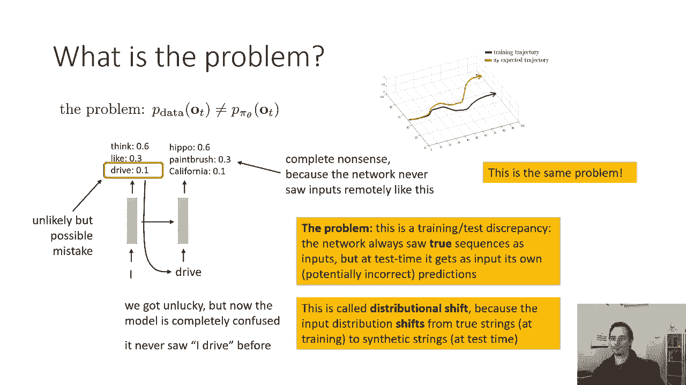

## 分布偏移问题 🔄

行为克隆的核心问题是复合误差，这可以形式化为一个分布偏移问题。

我们的策略 **π_θ(a_t | o_t)** 定义了在给定观测 **o_t** 时动作的分布。如果一切是独立同分布的，并且 **o_t** 实际上不影响 **o_{t+1}**，那就没有问题。但是，因为 **o_{t+1}** 依赖于 **a_t**，如果我们的策略 **π_θ** 与收集数据时专家策略的动作分布不完全相同，问题就会出现。

具体来说，我们在专家观测分布 **p_data(o_t)** 上训练策略。但当我们实际运行自己的策略时，我们的行动会影响未来的观测，导致我们开始从策略自身的观测分布 **p_{π_θ}(o_t)** 中获取观测。这两个分布 **p_data(o_t)** 和 **p_{π_θ}(o_t)** 是不同的，这就是分布偏移。

### 与循环神经网络的类比

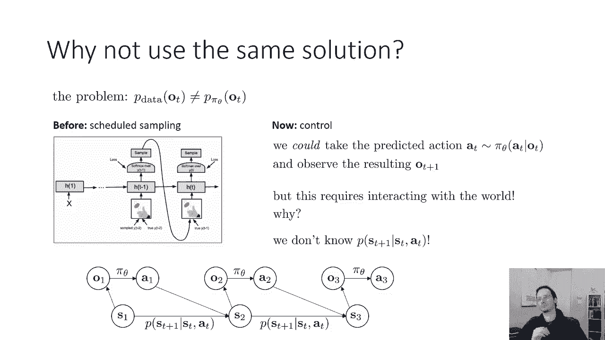

这个问题与我们之前在循环神经网络中看到的问题完全相同。

在RNN训练中，网络总是以真实的序列作为输入。但在测试时，它接收自己（可能不正确）的预测作为输入。一个早期的微小错误可能导致后续输入与训练时看到的任何输入都不同，从而引发更严重的错误。

行为克隆中的情况非常相似：
*   **训练时**：网络只看到来自专家观测分布的观测。
*   **测试时**：网络开始看到来自自身策略的观测，这些观测可能源于轻微不正确的动作。

这同样是一个从训练分布到测试分布的**分布偏移**问题。

---

## 潜在的解决方案与障碍 🧱

对于RNN，我们有一个潜在的解决方案：**计划采样**。在训练时，我们以一定的概率将网络自己之前的预测作为输入，而不是总是使用真实序列。

那么，我们能为模仿学习开发一个计划采样版本吗？理论上可以：从策略中采取预测的行动，观察产生的下一个观测，然后用这个观测来训练网络。

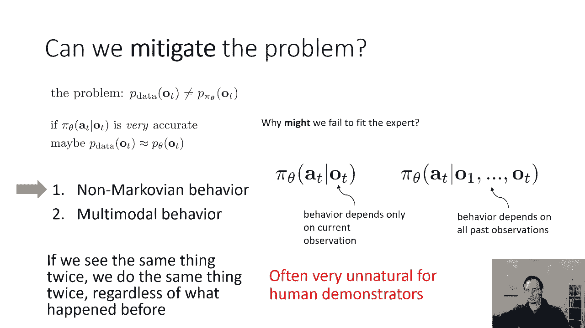

**然而，这里存在一个关键障碍**：对于RNN，这很容易做到，因为整个过程在计算机内模拟。但对于控制问题（如驾驶），涉及物理世界。我们只有一个记录了专家行动的视频，我们**不知道**如果采取了不同的行动，会产生什么观测。更正式地说，我们不知道状态转移概率 **p(s_{t+1} | s_t, a_t)** 或观测概率 **p(o_t | s_t)**。

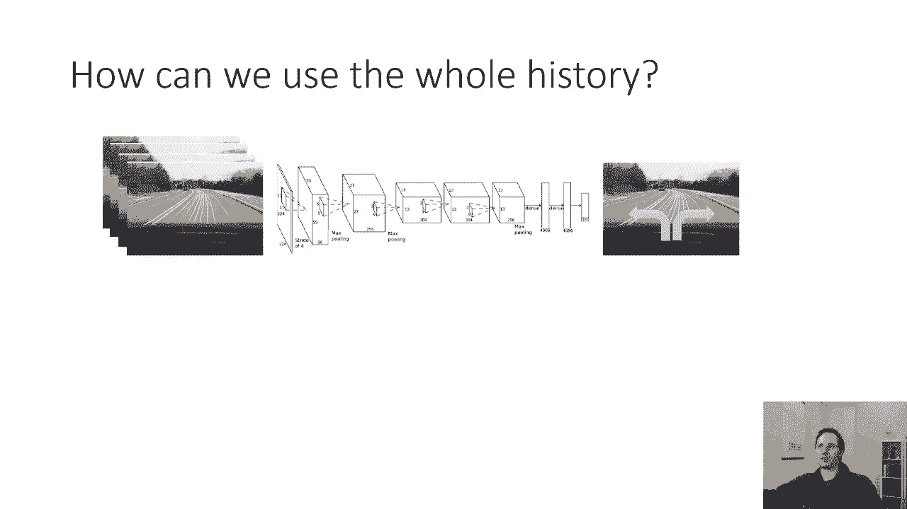

有一些算法（如基于模型的强化学习）试图学习这些概率，但对于简单的模仿学习，我们希望保持简单，只学习从图像到动作的映射。

---

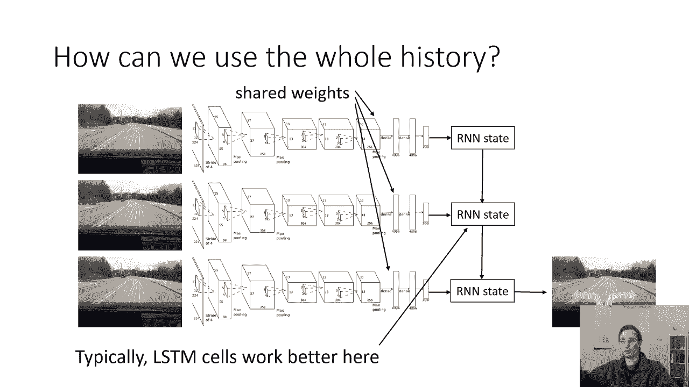

## 缓解分布偏移 🛡️

既然不能完全解决，我们能否缓解它？一个思路是：如果策略 **π_θ(a_t | o_t)** 非常准确，非常接近专家的真实动作分布，那么分布偏移将是最小的。在实践中，当 **p_data(o_t)** 非常广泛（数据集巨大）且策略泛化能力极好时，这种方法有时有效。

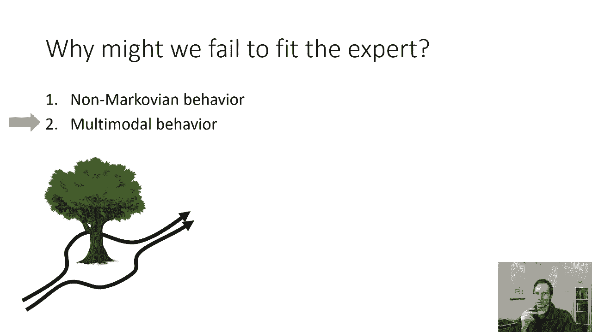

因此，我们需要：
1.  收集大量数据。
2.  训练一个非常精确的模型 **π_θ**。

关于收集大量数据无需多言（这就是英伟达的汽车需要行驶3000英里的原因）。那么，如何得到一个更精确的模型呢？

我们需要思考模型可能无法拟合专家数据的两个主要原因：
1.  **非马尔可夫行为**
2.  **多模态行为**

---

## 处理非马尔可夫行为 🧠➡️🤖

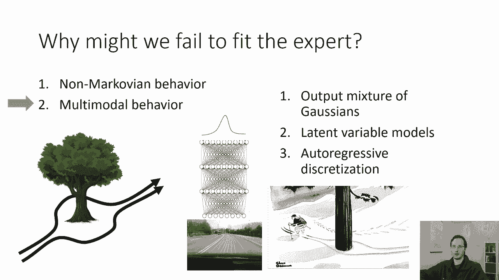

非马尔可夫行为是指：人类的行为并不只依赖于当前时刻的观测。例如，转向决策具有连续性，并且可能受到之前事件（如三分钟前被超车）的影响。一个更准确的模型应该让动作依赖于迄今为止所有的观测历史 **o_1, ..., o_t**。

我们可以使用什么样的神经网络架构来读取一系列图像并预测当前动作呢？

以下是一个适用于此任务的经典架构示例：

```python
# 伪代码示意架构
观测历史 [o_1, ..., o_t] -> 卷积编码器（共享权重）-> 特征序列 -> RNN/LSTM -> 最终隐藏状态 -> 全连接层 -> 动作 a_t
```

我们使用一个共享权重的卷积编码器处理每一帧图像，生成一个特征向量。这些特征序列被输入到一个RNN（如LSTM）中。最后，我们根据RNN的最终隐藏状态来预测动作。这利用了RNN来模拟人类行为的时序依赖性。

---

## 处理多模态行为 🛤️

多模态行为是指：在给定相同观测的情况下，可能存在多个同样合理但不同的动作。例如，无人机面对一棵树时，向左绕行或向右绕行都是可行的，但直飞是不可行的。

如果我们使用均方误差损失来回归连续的动怍值，模型可能会将“向左”和“向右”的数据平均，输出一个“直飞”的错误动作。

以下是几种处理多模态行为的方案：

### 方案一：离散化与Softmax
将连续动作空间离散化为多个区间，使用Softmax分类。这能很好地捕捉多模态分布（例如，左转概率50%，右转概率50%）。但对于高维动作空间，离散化的区间数量会呈指数级增长，难以实现。

### 方案二：高斯混合模型
让神经网络输出一个**条件高斯混合模型**的参数（多个均值 **μ**、方差 **σ** 和混合权重 **w**）。损失函数是数据在该混合模型下的对数似然。这种方法比单一高斯更好，但在高维空间中，可能需要大量混合成分才能近似复杂分布。

### 方案三：潜在变量模型
引入一个**潜在变量 z** 作为网络的额外输入。在训练时，我们需要推断数据对应的潜在变量；在测试时，可以随机采样 **z** 来产生不同的动作。训练这类模型需要特定技术，如**条件变分自编码器**或**标准化流**。

### 方案四：自回归离散化
这是通常最有效但稍复杂的方法。核心思想是：**将高维动作的每个维度依次离散化并预测**。
1.  首先，将动作的第一个维度离散化，用Softmax预测其分布并采样。
2.  将采样得到的第一个维度值作为输入，预测第二个维度的离散分布并采样。
3.  依此类推。

这类似于用RNN逐词生成句子，只不过这里的“词”是动作每个维度的离散值。这种方法易于采样，能表示非常复杂的分布，且易于训练。

> **请注意**：关于多模态分布建模的深入方法，我们将在后续关于生成模型的课程中详细讨论。

---

## 实践技巧：英伟达的驾驶系统 🎯

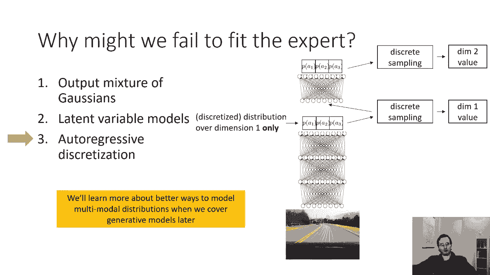

最后，我们来看一个在实践中让行为克隆成功工作的特殊技巧，它来自英伟达的自动驾驶论文。

该系统并没有使用复杂的RNN或多模态预测，而是采用了一个巧妙的“数据增强”方法：
*   他们在车上安装了**三个摄像头**：一个朝前，一个略微向左，一个略微向右。
*   **训练时**：
    *   正前方摄像头的图像标签是驾驶员的真实转向命令。
    *   左侧摄像头的图像标签是**真实转向命令加上一个小的右转修正**。
    *   右侧摄像头的图像标签是**真实转向命令加上一个小的左转修正**。

**这个技巧的原理是**：当车辆在测试时开始向左偏离时，它正前方摄像头看到的景象会变得更像训练时左侧摄像头看到的图像。而左侧图像的标签是“右转”，这个信号会促使车辆向右修正，从而回到道路中心。反之亦然。

这本质上是通过合成数据来模拟测试时可能犯的小错误，让模型学会如何纠正它们，从而缓解了分布偏移的影响。

---

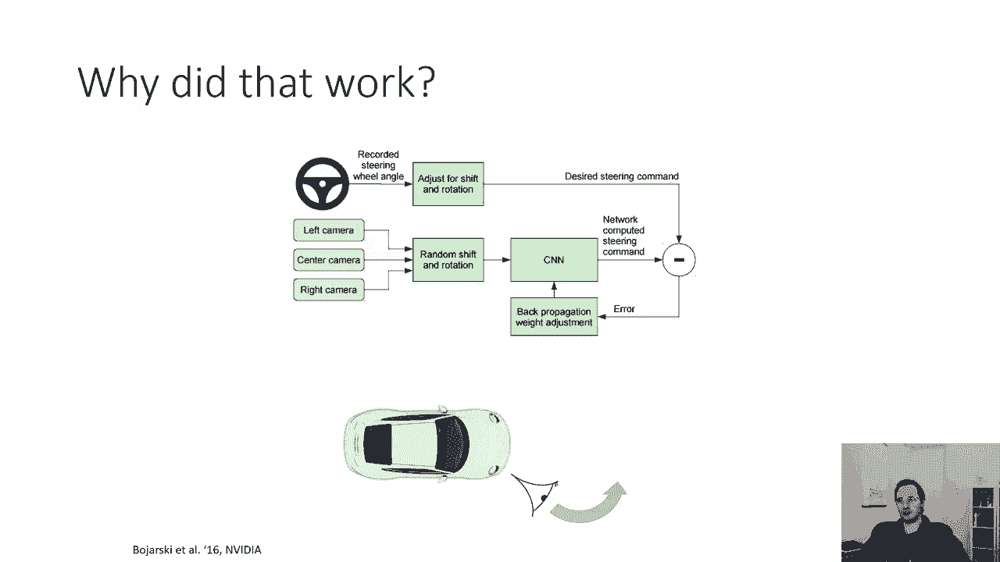

## 总结 📝

本节课我们一起学习了行为克隆面临的**分布偏移**挑战及其与RNN问题的类比。我们探讨了通过提高模型精度来缓解该问题的方向，具体包括：
*   使用**RNN架构**来处理**非马尔可夫行为**。
*   使用**离散化**、**高斯混合模型**、**潜在变量模型**或**自回归离散化**来处理**多模态行为**。

最后，我们看到了一个成功的实践案例——英伟达的多摄像头数据增强技巧，它说明了有时需要一些针对特定领域的“技巧”才能使行为克隆有效工作。如果行为克隆在您的任务中失败，请不要气馁，因为这通常是需要克服的预期挑战。

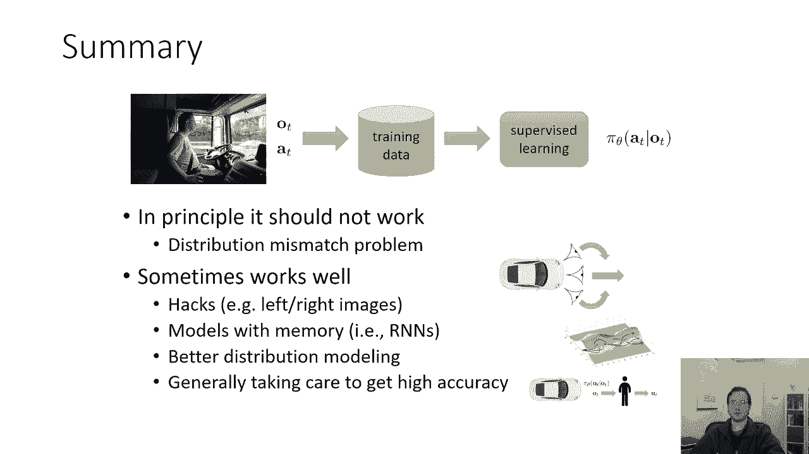

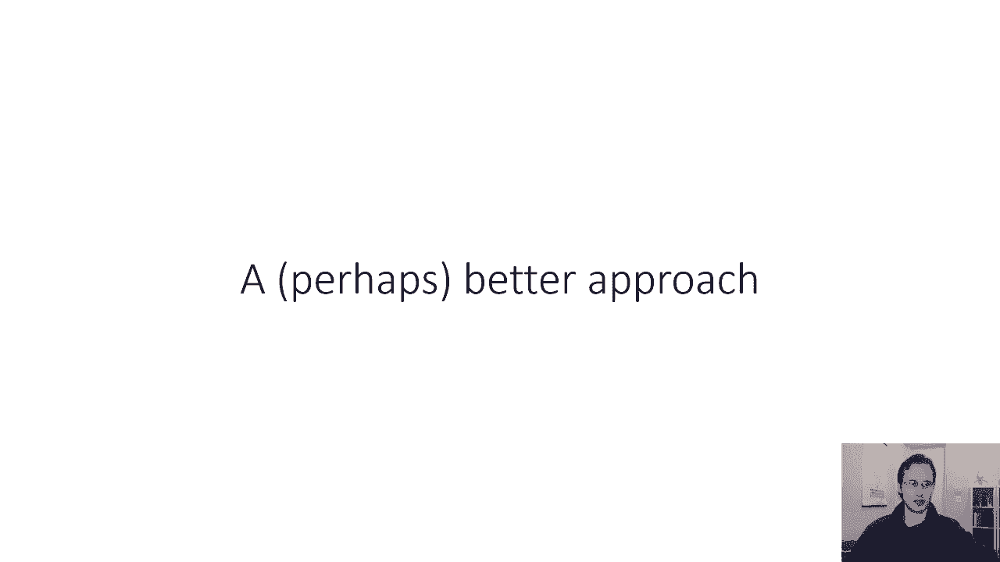

在讲座的下一部分，我们将介绍一种更有原则的模仿学习方法。