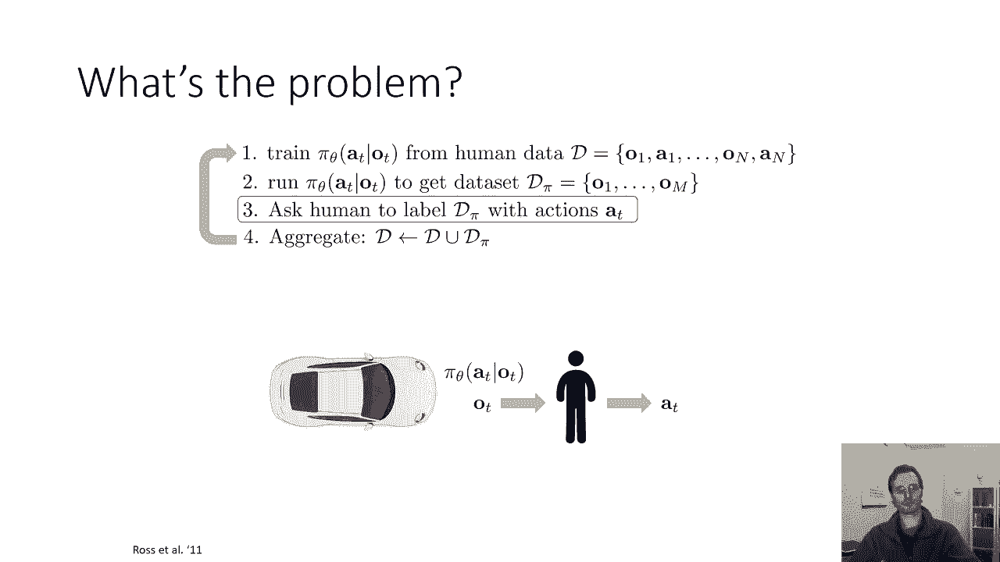
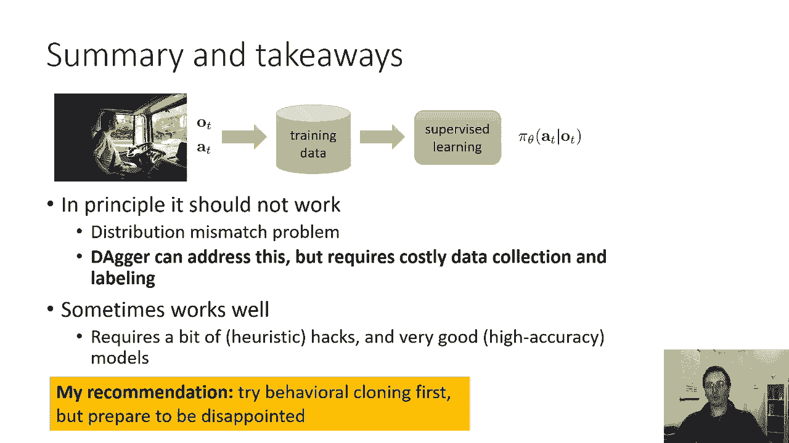
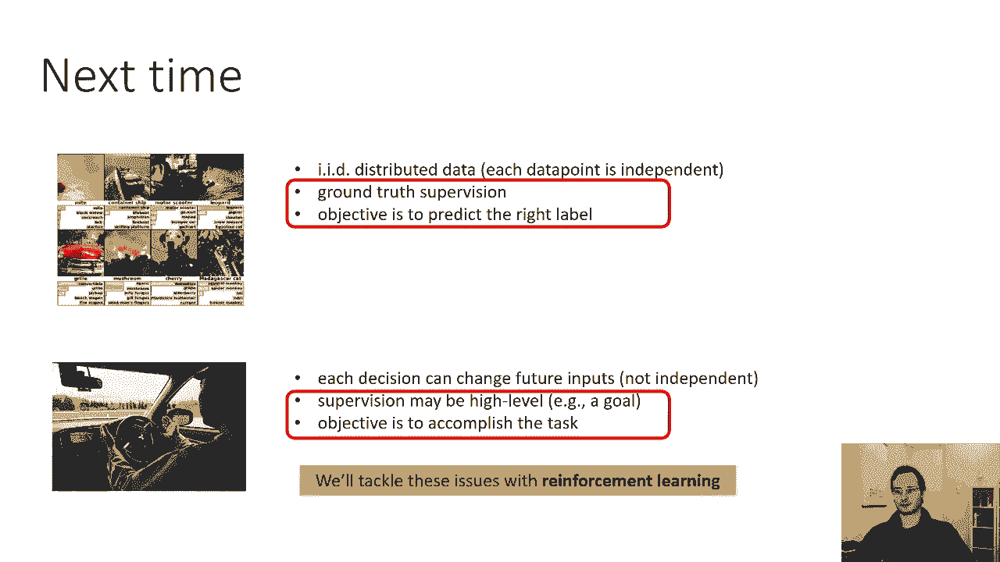

# 44：CS 182 第14讲 第3部分 - 模仿学习 🧠

在本节课中，我们将要学习模仿学习中的一个核心挑战——**分布转移问题**，并探讨一种名为 **DAgger** 的算法如何通过改进数据收集方式来尝试解决这个问题。我们还将比较行为克隆与DAgger的优缺点，并了解在何种情况下应选择何种方法。

---

## 行为克隆的分布转移问题 🔄

上一节我们介绍了模仿学习的基本概念。本节中我们来看看行为克隆面临的一个主要问题。

行为克隆的问题在于：当你根据学到的策略采取行动时，可能会犯错误。这个错误会导致智能体遇到**训练时从未见过的观察状态**。随后，智能体可能会犯下更大的错误，这些错误会不断累积和加剧。

从根本上说，问题归结为以下事实：训练数据中的观察值分布 **p_data(o_t)**，与实际运行策略时遇到的观察值分布 **p_πθ(o_t)** 是不同的。

**核心公式**：
*   训练数据分布：`p_data(o_t)`
*   策略运行分布：`p_πθ(o_t)`
*   问题：`p_data(o_t) ≠ p_πθ(o_t)`

那么，我们能否让这两个分布相等呢？如果策略是完美的，它们自然相等。但在一般情况下，这非常困难。是否存在一种算法，即使策略不完美，也能以某种方式保证做到这一点呢？

---

## DAgger算法：通过改进数据解决问题 🗡️

表面上看，如果策略总犯错误，似乎不可能让观察分布与真实分布匹配。**关键思想**是：如果你无法修复策略，那就去修复数据。

我们不是通过大幅改进策略π，而是通过**智能地收集数据**来让 `p_data(o_t)` 接近 `p_πθ(o_t)`。当然，你并不总能选择如何收集数据（例如，老板只给了一份固定的驾驶数据集）。但在你能影响数据收集的情况下，有一种名为 **DAgger** 的方法可以解决此问题。

DAgger代表 **数据集聚合**。它是一种迭代式的模仿学习算法，以一种特殊的方式收集数据，以避免分布转移问题。在某些情况下，DAgger效果非常好；但在无法以这种方式收集更多数据的情况下，则无法使用。

以下是DAgger算法的步骤：

1.  **获取初始数据集**：收集由人类专家提供的观察和行动组成的数据集 `D`。
2.  **训练初始策略**：使用数据集 `D` 训练初始策略 `πθ`。由于训练数据来自 `p_data`，该策略容易受到分布转移的影响。
3.  **运行策略并收集新观察**：运行学到的策略 `πθ`（例如控制汽车），并记录其产生的观察结果。我们称这个新数据集为 `D_π`。这些观察中可能包含一些糟糕的状态（例如汽车即将撞上障碍物）。在现实中，这需要安全措施（如安全驾驶员）。
4.  **人工标注新观察**：请人类专家为 `D_π` 中的每一个新观察状态，提供在这种情况下他们应采取的**正确行动**（地面真值）。
5.  **聚合数据集**：将新标注的数据集 `D_π` 与原始数据集 `D` 合并，得到更新的数据集 `D ← D ∪ D_π`。
6.  **重复迭代**：使用新的数据集 `D` 重新训练策略，然后重复步骤3-5。

你可能会问：这为什么有效？直觉是，如果你聚合足够多次，最终数据集将主要由来自 `p_πθ` 的数据主导，从而使 `p_data` 与 `p_πθ` 在实践中变得任意接近。实际上，通常在达到此状态之前，策略性能就已经很好了。

---

## DAgger的优缺点与实用建议 ⚖️

DAgger解决了分布转移问题，但它也存在一些缺陷，主要集中在第2步和第3步：

*   **第2步的问题**：运行不成熟的策略可能**不安全**或**不可行**（例如在真实物理系统中）。
*   **第3步的问题**：人类专家在系统不响应其输入的情况下（例如，看着车自己开，但无法干预），可能难以给出高质量的决策标签。这是一种不自然的数据收集方式。

当然，有一些方法可以缓解这些问题，例如让人类在必要时直接接管控制。但总体而言，DAgger算法的主要缺点是**数据收集和标注协议较为繁重**。

相比之下，单纯的行为克隆（取一个数据集，训练，然后部署）在数据收集上更具吸引力。

**总结本次讨论的要点**：
*   理论上，行为克隆因分布差异大而可能失效。
*   DAgger可以从原理上解决此问题，但需要昂贵的数据收集和标注。
*   有时，行为克隆配合启发式技巧和高精度模型也能有效工作。

**实用建议**：如果你想解决一个模仿学习问题：
1.  **首先尝试行为克隆**，但要做好它可能效果不佳的准备。
2.  如果行为克隆不起作用，则需要考虑更复杂的方法，如 **DAgger** 或我们下周将讨论的**强化学习方法**。

---

## 下节预告 🚀

在今天的讨论中，我们主要解决了**非独立同分布数据**的问题，但仍然假设我们能获得人类提供的**地面真值行动监督**。

在下节课中，我们将进入完全的**强化学习**设定。在这种设定下，我们不再有地面真值行动，而是会以**奖励函数**的形式获得一些高级目标。我们将讨论能够学习并成功实现这些目标的算法。

---

**本节课中我们一起学习了**：模仿学习中的分布转移挑战、DAgger算法如何通过迭代式数据聚合来应对这一挑战，以及在实际应用中如何根据数据收集的可行性在行为克隆和DAgger之间做出选择。