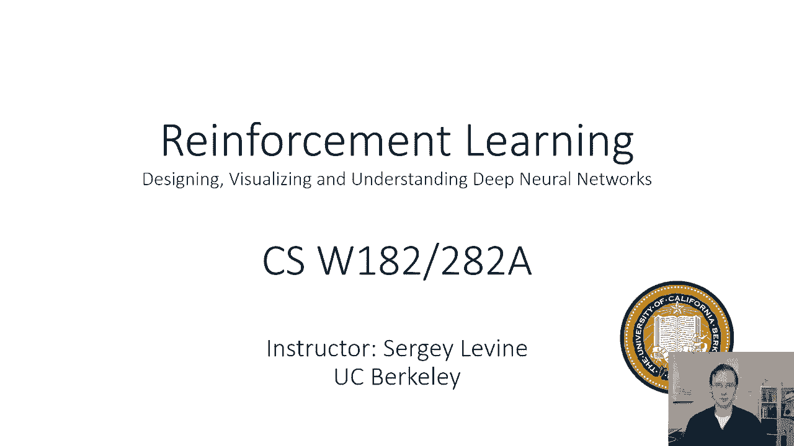
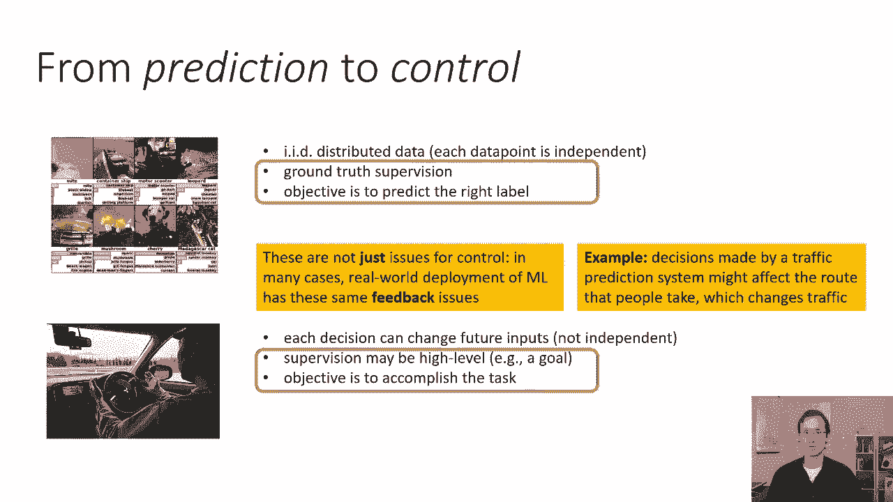
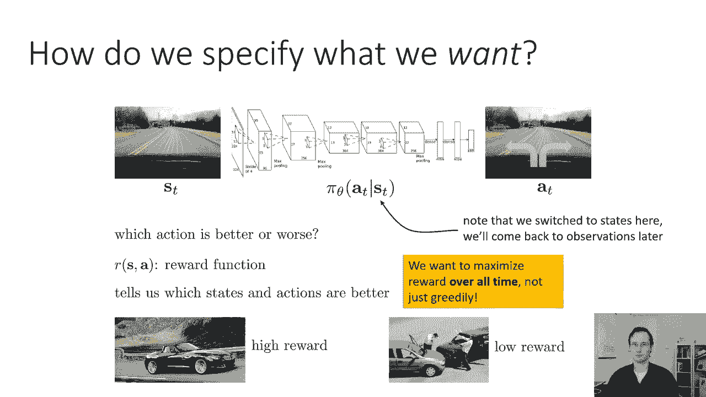
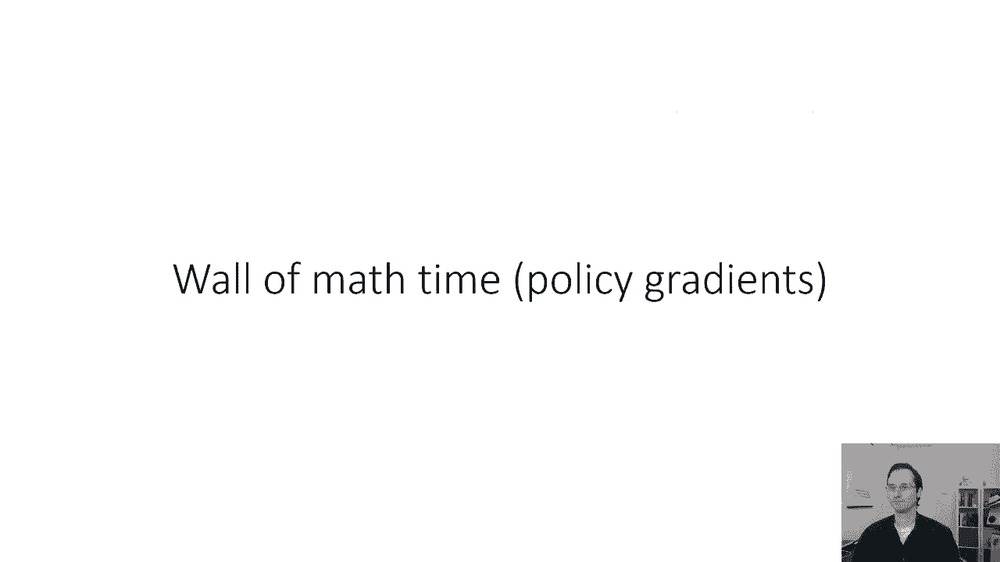

# 45：CS 182 - 第十五讲 - 第一部分 - 策略梯度 🎯



在本节课中，我们将学习强化学习的基本概念，特别是如何在没有专家监督数据的情况下，通过定义奖励函数来训练智能体完成复杂任务。我们将从回顾预测与控制问题的区别开始，正式定义马尔可夫决策过程，并最终推导出强化学习的核心优化目标。

---

## 从预测到控制 🔄

上一节我们讨论了基于学习的控制问题。本节中，我们来看看预测问题与控制问题的核心区别。

预测问题（如图像识别、情感分析）的输入与输出通常是独立同分布的。你对一个样本的预测不会影响下一个样本。同时，你拥有真实标签作为监督信号。



控制问题（如自动驾驶）则涉及顺序决策。你的每一个决策都会改变未来的输入，因此数据不再是独立同分布的。此外，你通常没有直接的“正确动作”作为监督，而是通过一个奖励函数来评估行为的好坏。

值得注意的是，即使是传统的预测系统，当部署到现实世界并影响数据分布时（例如交通预测影响用户路线选择），也会面临类似的反馈循环问题。本节课我们将聚焦于经典的顺序决策领域。

---

## 定义目标：奖励与回报 🏆

如果我们没有人类专家提供的“正确动作”数据，如何指导智能体学习？我们可以定义一个**奖励函数**。

奖励函数 `R(s, a)` 是一个标量函数，为每个状态（或状态-动作对）打分，表示其合意程度。例如，在驾驶任务中，车辆正确行驶的状态奖励高，发生碰撞的状态奖励低。



然而，智能体的目标不是贪婪地最大化即时奖励，而是最大化长期**总回报**。一个现在奖励较低但能避免未来灾难的决策，可能比一个现在奖励较高但会导致未来失败的决策更好。因此，强化学习需要进行长期推理。

---

## 马尔可夫决策过程 📐

为了形式化地描述强化学习问题，我们引入**马尔可夫决策过程**。一个MDP由以下核心元素定义：

1.  **状态集合 (S)**: 所有可能状态的集合。状态可以是离散的（如棋盘位置）或连续的（如车辆坐标）。我们假设状态满足**马尔可夫性质**，即当前状态包含了预测未来所需的所有历史信息。
2.  **动作集合 (A)**: 所有可能动作的集合。动作也可以是离散的（如左转、右转）或连续的（如方向盘转角）。
3.  **转移概率 (T)**: 定义了在状态 `s_t` 执行动作 `a_t` 后，转移到下一个状态 `s_{t+1}` 的概率分布。即 `T(s_{t+1} | s_t, a_t)`。
4.  **奖励函数 (R)**: 如前所述，`R(s_t, a_t)` 给出在状态 `s_t` 执行动作 `a_t` 后获得的即时标量奖励。

一个相关的概念是**部分可观测马尔可夫决策过程**，其中智能体接收的是与状态相关的**观测**而非状态本身。这引入了潜在的非马尔可夫性。本节课我们主要讨论完全可观测的MDP。

---

## 强化学习的形式化目标 🎯

在MDP中，智能体的行为由**策略** `π_θ(a | s)` 决定，它是一个参数为 `θ`（例如神经网络权重）的函数，输入状态 `s`，输出动作 `a` 的概率分布。

策略与环境的转移概率共同作用，产生一个状态-动作序列（或称**轨迹** `τ = (s_1, a_1, s_2, a_2, ...)`）上的分布 `p_θ(τ)`。

强化学习的最终目标是找到能最大化**期望总回报**的策略参数 `θ`。其数学形式化如下：

**目标公式**:
```
θ* = argmax_θ E_{τ ~ p_θ(τ)} [ Σ_{t=1}^{T} R(s_t, a_t) ]
```

其中，期望 `E` 是在由策略 `π_θ` 和环境动力学 `T` 共同生成的轨迹分布 `p_θ(τ)` 上计算的。理解这个期望最大化的目标是理解后续所有算法的基础。

---

## 总结 📝



本节课我们一起学习了强化学习的基础设定。我们明确了预测与控制问题的区别，引入了通过奖励函数定义任务目标的思想，并正式定义了马尔可夫决策过程这一核心框架。最后，我们推导出了强化学习的根本优化目标：寻找能最大化期望总回报的策略参数。在接下来的课程中，我们将基于这个目标，开始探索求解它的具体算法。