# 46：CS 182 第15讲 第2部分 - 策略梯度 🧠

在本节课中，我们将学习第一个强化学习算法——策略梯度。我们将通过数学推导理解其原理，并学习如何通过采样来估计和优化策略的期望回报。

---

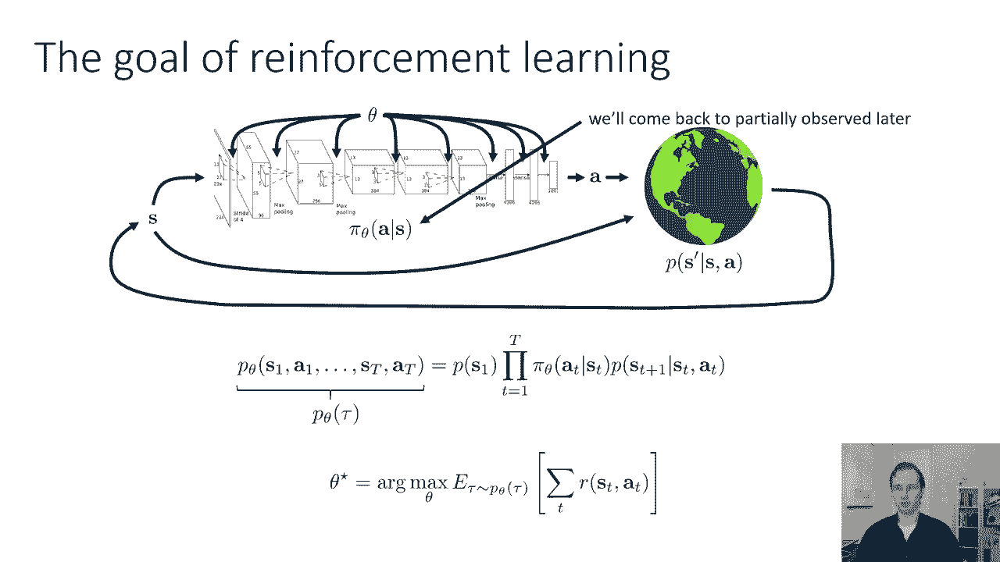

## 概述 📋

策略梯度是一种直接优化策略参数以最大化期望总奖励的方法。我们将从如何评估一个给定策略的期望回报开始，然后推导出计算该回报梯度的公式，最终得到一个可以通过采样和梯度上升来优化策略的实用算法。

---

## 1. 强化学习目标与评估 🔍

上一节我们介绍了强化学习的目标：最大化在由当前策略和MDP诱导的轨迹分布下的期望总奖励。其数学表达式为：

**目标公式**：
\[
J(\theta) = \mathbb{E}_{\tau \sim p_{\theta}(\tau)} \left[ \sum_{t} r(s_t, a_t) \right]
\]

其中，\(\tau\) 表示一条轨迹 \((s_1, a_1, s_2, a_2, ...)\)，\(p_{\theta}(\tau)\) 是由策略 \(\pi_{\theta}\) 和MDP动态共同定义的轨迹分布。

首先，我们关心如何评估这个目标。由于可能的轨迹数量是指数级的，我们无法枚举求和。但我们可以通过采样来构造一个无偏估计器。

**评估方法**：
从策略 \(\pi_{\theta}\) 中采样 \(N\) 条轨迹 \(\tau^{(i)}\)，计算每条轨迹的总奖励 \(R(\tau^{(i)})\)，然后取平均值：
\[
\hat{J}(\theta) = \frac{1}{N} \sum_{i=1}^{N} R(\tau^{(i)})
\]
这个估计量 \(\hat{J}(\theta)\) 是 \(J(\theta)\) 的无偏估计。采样意味着在现实世界（或模拟器）中运行策略多次。

---

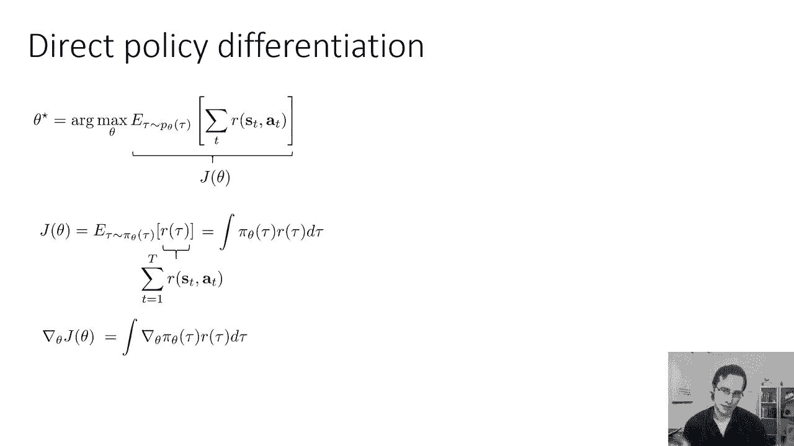

## 2. 策略梯度推导 🧮

我们的目标是最大化 \(J(\theta)\)，因此需要计算其梯度 \(\nabla_{\theta} J(\theta)\)。然后我们可以使用梯度上升法来更新策略参数 \(\theta\)。

我们将期望写成积分形式：
\[
J(\theta) = \int \pi_{\theta}(\tau) R(\tau) d\tau
\]
计算其梯度：
\[
\nabla_{\theta} J(\theta) = \nabla_{\theta} \int \pi_{\theta}(\tau) R(\tau) d\tau
\]

直接计算 \(\nabla_{\theta} \pi_{\theta}(\tau)\) 很困难。这里我们使用一个巧妙的数学技巧（对数导数技巧）：
\[
\nabla_{\theta} \pi_{\theta}(\tau) = \pi_{\theta}(\tau) \nabla_{\theta} \log \pi_{\theta}(\tau)
\]

将其代入梯度表达式：
\[
\nabla_{\theta} J(\theta) = \int \pi_{\theta}(\tau) \nabla_{\theta} \log \pi_{\theta}(\tau) R(\tau) d\tau
\]
这正好是另一个期望值：
\[
\nabla_{\theta} J(\theta) = \mathbb{E}_{\tau \sim \pi_{\theta}(\tau)} \left[ \nabla_{\theta} \log \pi_{\theta}(\tau) R(\tau) \right]
\]

现在，我们需要计算 \(\nabla_{\theta} \log \pi_{\theta}(\tau)\)。一条轨迹的概率可以分解为：
\[
\pi_{\theta}(\tau) = p(s_1) \prod_{t=1}^{T} \pi_{\theta}(a_t | s_t) p(s_{t+1} | s_t, a_t)
\]
取对数后：
\[
\log \pi_{\theta}(\tau) = \log p(s_1) + \sum_{t=1}^{T} \left[ \log \pi_{\theta}(a_t | s_t) + \log p(s_{t+1} | s_t, a_t) \right]
\]

对其求梯度时，只有 \(\log \pi_{\theta}(a_t | s_t)\) 项依赖于参数 \(\theta\)。初始状态分布 \(p(s_1)\) 和状态转移概率 \(p(s_{t+1} | s_t, a_t)\) 与 \(\theta\) 无关，因此它们的梯度为零。

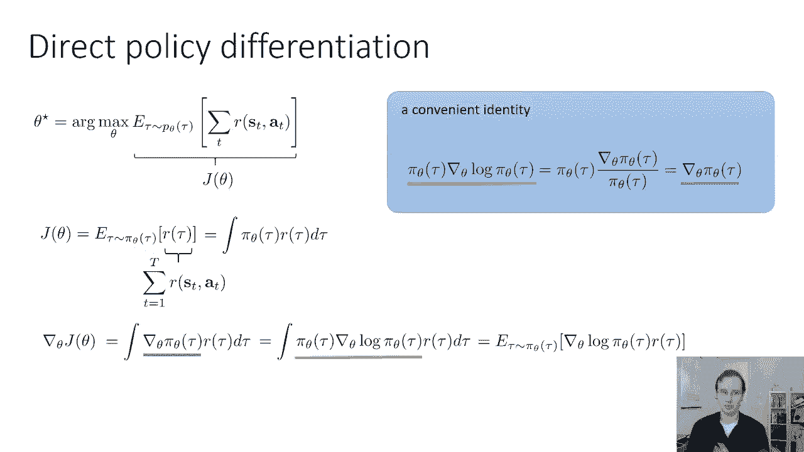

于是，梯度简化为：
\[
\nabla_{\theta} \log \pi_{\theta}(\tau) = \sum_{t=1}^{T} \nabla_{\theta} \log \pi_{\theta}(a_t | s_t)
\]

代入期望中，我们得到最终的策略梯度公式：

**策略梯度公式**：
\[
\nabla_{\theta} J(\theta) = \mathbb{E}_{\tau \sim \pi_{\theta}(\tau)} \left[ \left( \sum_{t=1}^{T} \nabla_{\theta} \log \pi_{\theta}(a_t | s_t) \right) \left( \sum_{t=1}^{T} r(s_t, a_t) \right) \right]
\]

---

## 3. 策略梯度算法实现 ⚙️

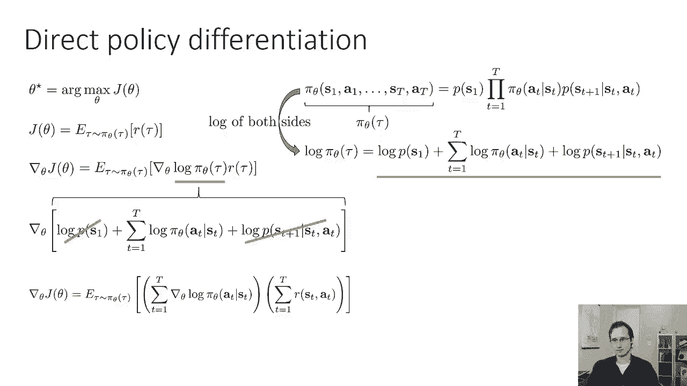

现在我们已经得到了策略梯度的理论公式。在实践中，我们通过采样来估计这个期望值。

以下是实现策略梯度算法的步骤：

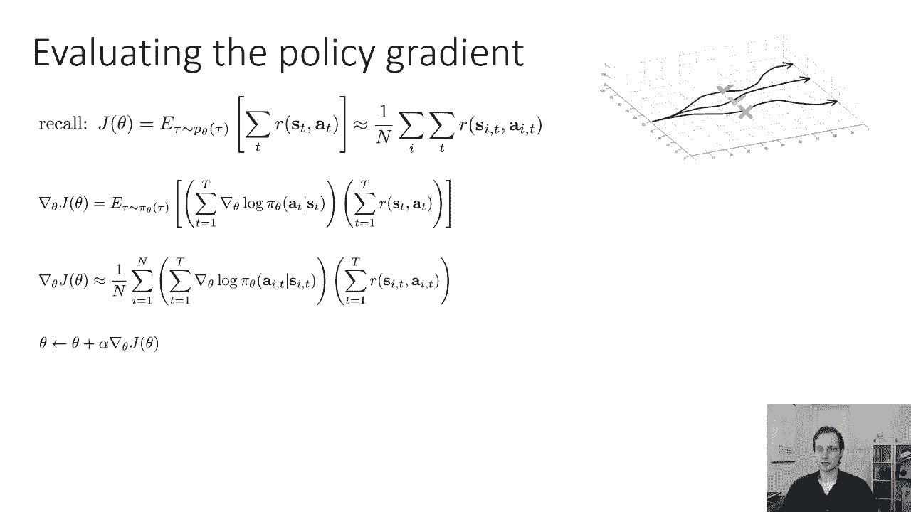

1.  **采样轨迹**：使用当前策略 \(\pi_{\theta}\) 在环境中运行，收集 \(N\) 条轨迹 \(\tau^{(i)}\)。
2.  **计算梯度估计**：对于每条轨迹 \(\tau^{(i)}\)，计算：
    *   \(\sum_{t} \nabla_{\theta} \log \pi_{\theta}(a_t^{(i)} | s_t^{(i)})\) （策略对数似然的梯度之和）
    *   \(R^{(i)} = \sum_{t} r(s_t^{(i)}, a_t^{(i)})\) （轨迹的总奖励）
    将两者相乘。
3.  **平均梯度**：对所有轨迹的上述乘积结果取平均，得到梯度估计 \(\hat{g}\)。
4.  **策略更新**：执行梯度上升更新策略参数：\(\theta \leftarrow \theta + \alpha \hat{g}\)。

这个算法有时被称为 **REINFORCE 算法**。

---

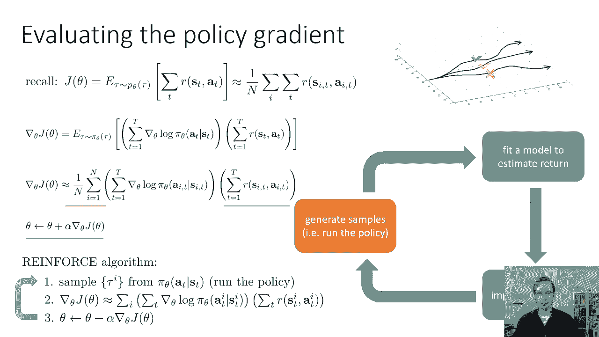

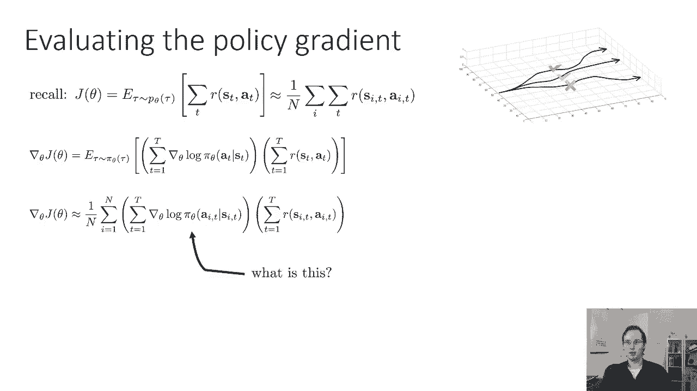

## 4. 直观理解与讨论 💡

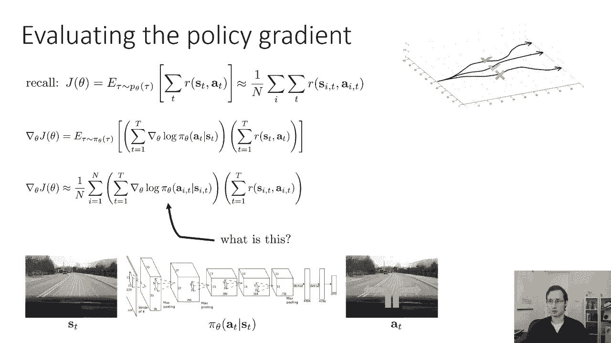

上一节我们推导了数学公式，本节我们来看看策略梯度背后的直观含义。

将策略梯度与监督学习中的最大似然估计（MLE）梯度进行比较，可以加深理解：

*   **最大似然梯度**：\(\nabla_{\theta} J_{ML} = \mathbb{E}_{\tau} \left[ \sum_{t} \nabla_{\theta} \log \pi_{\theta}(a_t | s_t) \right]\)
    *   目标：增加在观测到的状态上采取观测到的动作的概率。
*   **策略梯度**：\(\nabla_{\theta} J_{PG} = \mathbb{E}_{\tau} \left[ \left( \sum_{t} \nabla_{\theta} \log \pi_{\theta}(a_t | s_t) \right) R(\tau) \right]\)
    *   目标：根据轨迹的总奖励 \(R(\tau)\) 来缩放最大似然梯度。
    *   如果一条轨迹获得高奖励（“好”轨迹），算法会显著增加该轨迹中所有动作的概率。
    *   如果一条轨迹获得低（或负）奖励（“坏”轨迹），算法会降低该轨迹中动作的概率。

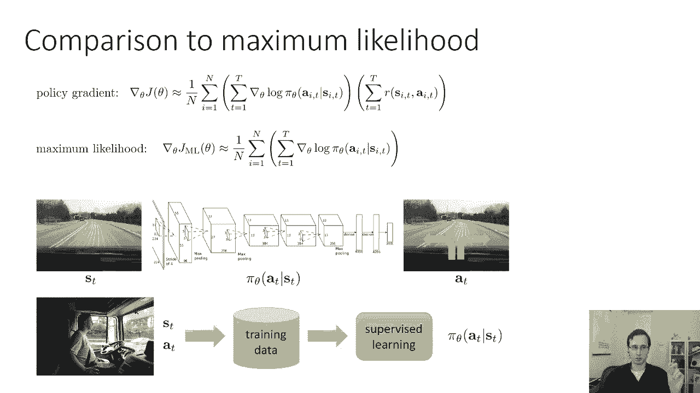

**核心直觉**：策略梯度算法实质上是**试错学习**的数学形式化。它让产生好结果的行动变得更可能，让产生坏结果的行动变得更不可能。即使它是一个基于梯度的优化，其最终效果与我们的学习直觉是一致的。

---

## 5. 关于部分可观测性的说明 👁️

一个重要的优点是，基础的（Vanilla）策略梯度算法**不依赖于马尔可夫性质**。算法中只使用了策略 \(\pi_{\theta}(a_t | o_t)\)（其中 \(o_t\) 是观测值），而没有显式使用状态转移概率。

这意味着：
*   在处理**部分可观测马尔可夫决策过程（POMDP）**时，基础策略梯度算法无需修改。
*   你只需要将观测序列输入策略网络即可。
*   相比之下，后续我们将学习的一些策略梯度变体（如Actor-Critic方法）可能依赖于马尔可夫性质，在POMDP中需要特别处理。

---

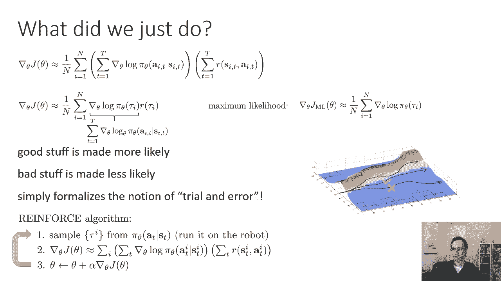

## 总结 🎯

本节课我们一起学习了策略梯度方法：

1.  我们从强化学习的核心目标——最大化期望总奖励出发。
2.  通过数学推导，利用对数导数技巧，得到了策略梯度 \(\nabla_{\theta} J(\theta)\) 的表达式，该表达式可以表示为关于轨迹分布的期望。
3.  我们发现梯度计算中不依赖于未知的环境动态（状态转移概率），只需知道策略本身，这使得算法可行。
4.  我们介绍了REINFORCE算法的实现步骤：采样、计算梯度估计、平均、更新。
5.  我们探讨了策略梯度的直观理解，即加权调整动作概率的试错学习。
6.  我们指出了基础策略梯度算法对部分可观测环境的良好适应性。

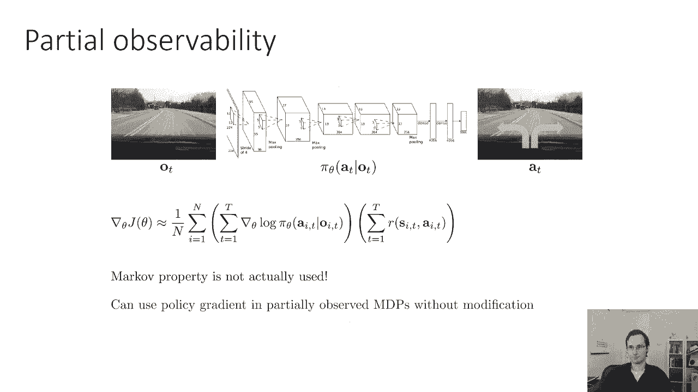

策略梯度是强化学习中一类重要算法的基础。在接下来的课程中，我们将以此为基础，学习更高效、更稳定的改进版本。