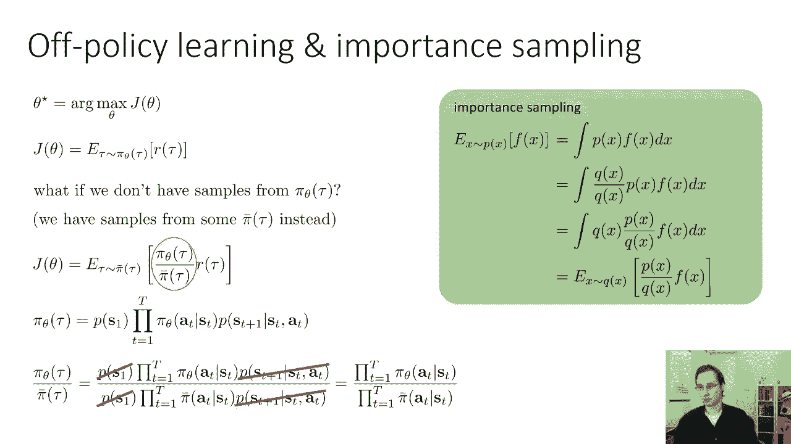
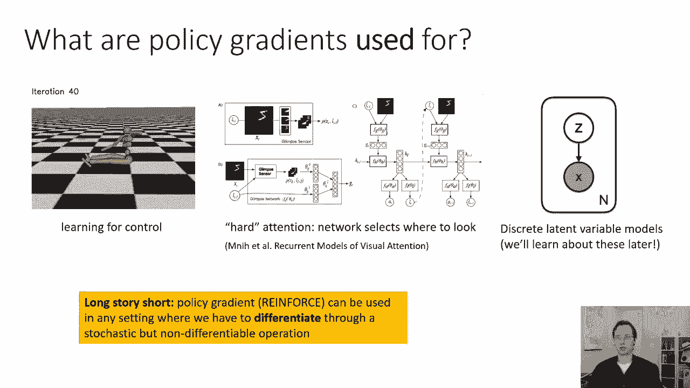
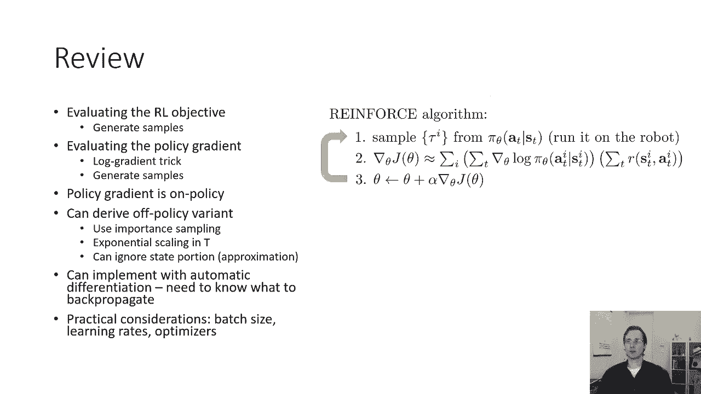
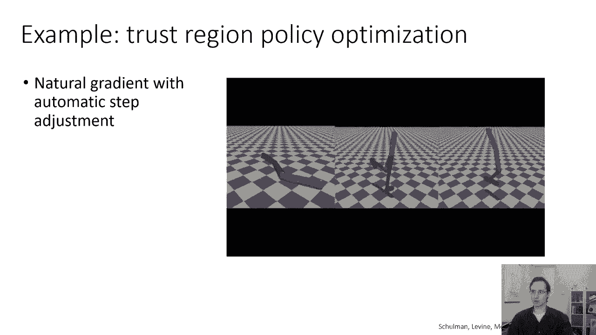
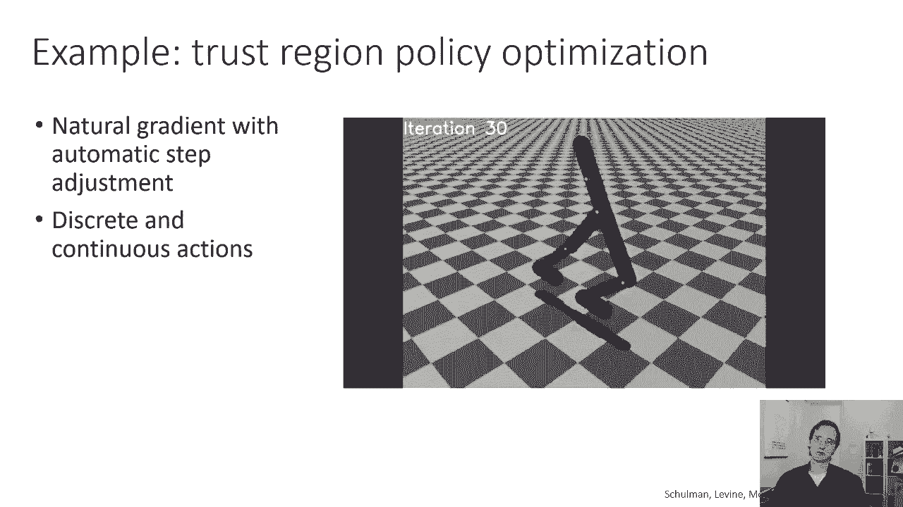
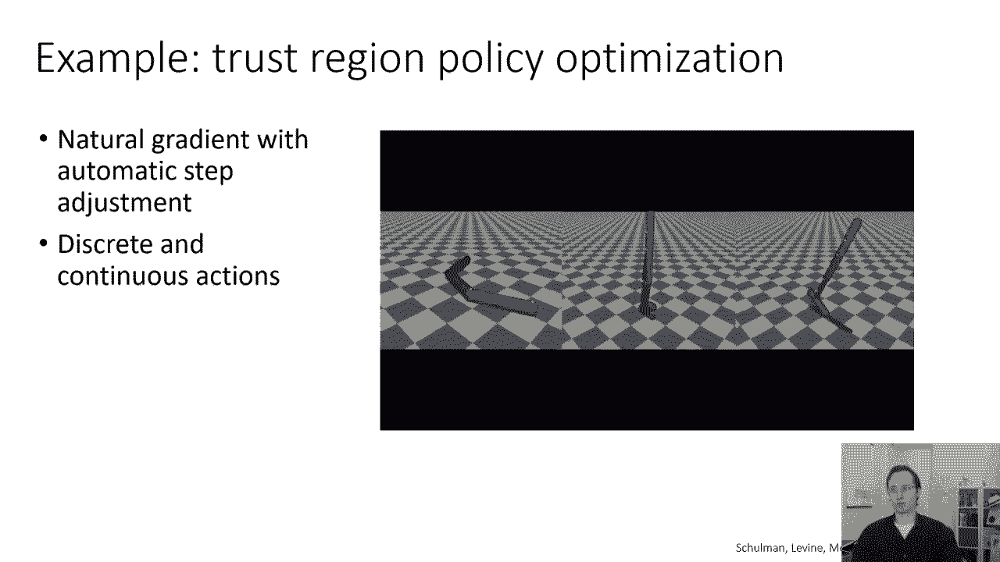
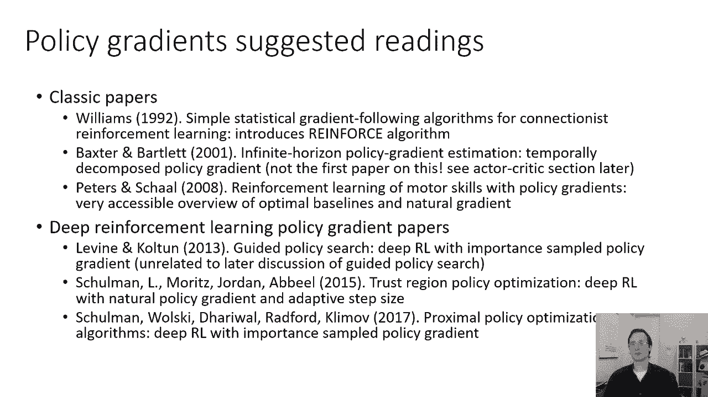

# 47：CS 182 第15讲 第3部分 - 策略梯度 🎯

在本节课中，我们将学习如何让策略梯度方法在实际中真正发挥作用。我们将探讨一些关键的改进技巧，例如利用因果关系和引入基线，这些技巧对于降低梯度估计的方差至关重要。此外，我们还将了解如何使用自动微分来实现策略梯度，并讨论其在实际应用中的一些重要考量。

---

## 改进策略梯度估计器 🔧

上一节我们介绍了策略梯度的基本数学形式。本节中，我们来看看如何通过利用问题的时序结构来改进它。

我们之前讨论的策略梯度估计器没有利用任何关于问题时间结构的知识。它计算所有动作概率的对数梯度之和，乘以所有奖励的总和。这没有解释一个关键事实：未来的行为不能影响过去的奖励。

我们可以通过注意到“未来的行为不能影响过去的奖励”这一事实，来构建一个更好的估计器。其背后的直觉是，我们将避免让未来的行动影响过去时间步的奖励。

具体做法是，我们重写标准策略梯度公式。原始公式为：
`∇θ J(θ) = Eτ∼πθ [ (∑t ∇θ log πθ(at|st)) * (∑t‘ r(st‘, at‘)) ]`

通过分配律，我们可以将其重写为：
`∇θ J(θ) = Eτ∼πθ [ ∑t (∇θ log πθ(at|st) * ∑t‘≥t r(st‘, at‘)) ]`

这个新形式让我们更清楚地看到问题：时间 `t` 处动作概率的梯度，乘以了包括过去奖励（`t‘ < t`）的和。但改变时间 `t` 的动作概率永远不会改变过去的回报。

因此，我们可以将内部求和的下限改为当前时间步 `t`，只累加从当前到未来的奖励：
`∇θ J(θ) = Eτ∼πθ [ ∑t (∇θ log πθ(at|st) * ∑t‘=t^T r(st‘, at‘)) ]`

这个估计器同样是正确的，并且由于去除了理论上期望为零的噪声项（过去的奖励），它在有限样本下的方差更小，估计更准确。我们通常将 `∑t‘=t^T r(st‘, at‘)` 记作 `Q̂(i, t)`。

---

## 引入基线以降低方差 📉

仅仅让好的轨迹更可能、坏的轨迹更不可能并不总是能保证发生。如果所有奖励都是很大的正数，策略梯度可能会简单地让所有轨迹都变得更可能，这不是我们想要的。

我们真正希望的是：比平均表现好的轨迹变得更可能，比平均表现差的轨迹变得更不可能。因此，直觉上，我们应该从奖励中减去一个基线（例如平均奖励）。

我们将梯度估计器修改为：
`∇θ J(θ) ≈ 1/N ∑i=1^N ∑t (∇θ log πθ(at^(i)|st^(i)) * (Q̂(i, t) - b))`
其中 `b` 通常取为平均奖励 `E[Q̂]`。

这个修改是允许的吗？令人惊讶的是，这个估计器在期望值上仍然是正确的（无偏的），并且通常能显著降低方差。我们可以证明，对于任何不依赖于动作的基线 `b`，`E[∇θ log πθ(a|s) * b] = 0`。

证明如下：
`Eτ∼πθ [∇θ log πθ(τ) * b] = ∫ πθ(τ) ∇θ log πθ(τ) * b dτ = b * ∇θ ∫ πθ(τ) dτ = b * ∇θ 1 = 0`
因为概率分布 `πθ(τ)` 的积分为1，其梯度为0。

因此，减去基线不会改变期望值，但通过减去一个已知期望为零的项，可以减少有限样本估计的波动，从而得到更准确的梯度方向。



---

## 策略梯度的局限性与离策略学习 🚧

关于策略梯度，需要注意的一点是，它是一种**同策略**算法。这意味着每次更新策略参数 `θ` 后，为了计算新的梯度，你必须根据**新的**策略 `πθ` 与环境交互来收集新的样本。旧策略下收集的样本不能直接复用。

这可能导致样本效率低下，因为训练神经网络通常需要大量梯度步，而每一步都需要新的交互数据。

那么，能否使用旧策略的样本来估计新策略的梯度呢？答案是肯定的，这可以通过**重要性采样**来实现。

重要性采样允许我们利用从一个分布（旧策略 `πθ‘`）中采样的数据，来估计在另一个分布（新策略 `πθ`）下的期望值。策略梯度的离策略估计形式如下：
`∇θ J(θ) ≈ Eτ∼πθ‘ [ (∏t πθ(at|st)/πθ‘(at|st)) * ∑t (∇θ log πθ(at|st) * Q̂(t)) ]`

其中，`(∏t πθ(at|st)/πθ‘(at|st))` 是重要性权重。

然而，直接使用这个公式有一个严重问题：重要性权重是 `T` 个概率的连乘，当轨迹很长时，这个权重会指数级地趋近于0或无穷大，导致估计器方差极大而不实用。

一个实用的近似方法是忽略状态分布的变化，只对动作概率进行重要性加权。如果新旧策略足够接近，这个近似带来的误差是有界的。这引出了诸如近端策略优化（PPO）等实用算法。

---

## 使用自动微分实现策略梯度 💻

策略梯度的形式与最大似然估计非常相似，只是多了一个奖励权重项。这让我们可以方便地利用自动微分工具来实现它。

在监督学习的最大似然中，我们构建损失函数为负对数似然，然后通过反向传播求梯度。对于策略梯度，我们可以构建一个“伪损失”：
`伪损失 = - 1/N ∑i ∑t [ log πθ(at^(i)|st^(i)) * Q̂(i, t) ]`
然后对这个伪损失进行反向传播。自动微分库会计算其梯度，而这个梯度正好就是策略梯度的估计（前提是我们在计算图中将 `Q̂` 视为常数，不依赖于 `θ`）。

以下是类似 TensorFlow 风格的伪代码：
```python
# 输入: states, actions, q_values
logits = policy_network(states) # 前向传播
neg_log_likelihood = cross_entropy_loss(logits, actions) # 计算负对数似然
weighted_neg_log_likelihood = neg_log_likelihood * q_values # 用Q值加权
loss = tf.reduce_mean(weighted_neg_log_likelihood) # 计算伪损失
gradients = tf.gradients(loss, policy_network.trainable_variables) # 反向传播
```

---



## 实践要点与总结 📝



以下是关于策略梯度实践的一些重要考虑：
*   **高方差**：策略梯度的梯度估计方差通常很大。因此，相比监督学习，你需要使用更大的批大小（更多样本）来获得稳定的更新。
*   **学习率调整**：由于梯度噪声大，使用自适应优化器（如 Adam）调整学习率尤为重要。
*   **应用范围**：策略梯度不仅用于强化学习控制问题，还可用于任何需要通过**随机且不可微**的操作进行微分的场景，例如带有离散潜在变量的模型或某些注意力机制。







本节课中我们一起学习了：
1.  如何通过**利用因果关系**（仅使用未来奖励）来改进策略梯度估计器，降低其方差。
2.  如何通过**引入基线**（如减去平均奖励）来进一步稳定训练，使算法能够区分高于平均和低于平均的表现。
3.  策略梯度是**同策略**算法，以及如何使用**重要性采样**进行离策略估计的近似方法。
4.  如何利用**自动微分**，通过构建一个加权的伪损失函数来简洁地实现策略梯度。
5.  策略梯度在实际应用中的一些关键特性和考量。



这些技巧是将策略梯度从理论公式转化为实用算法的关键。没有它们，策略梯度很难在复杂问题上奏效；而有了它们，策略梯度成为了解决一系列决策问题的基础工具。