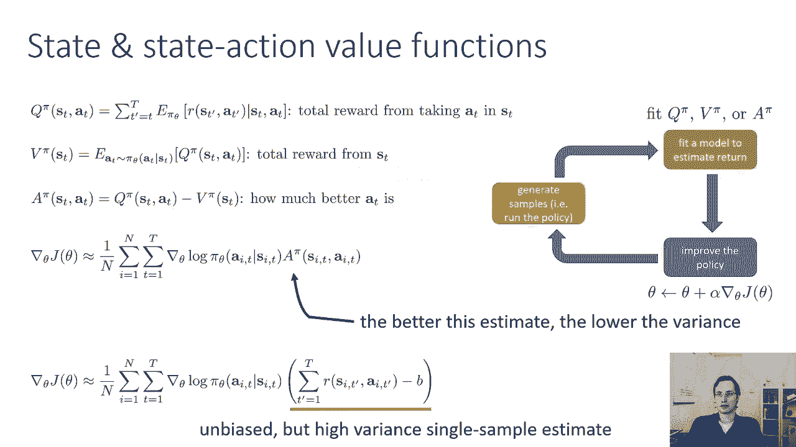
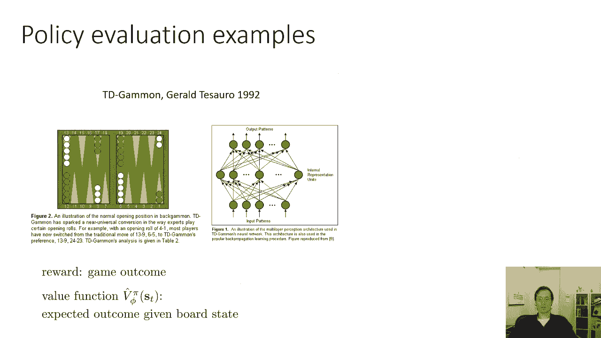
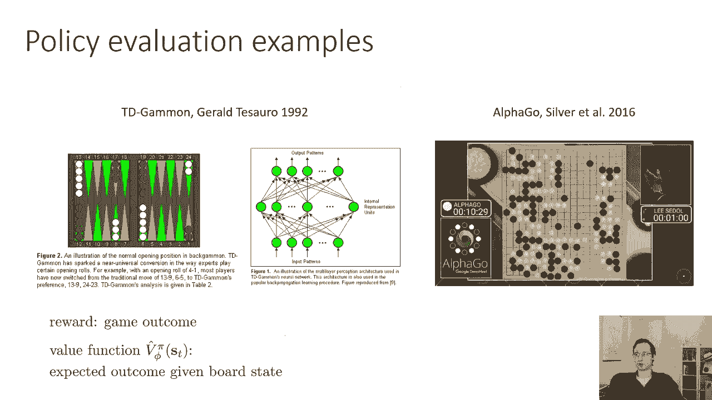
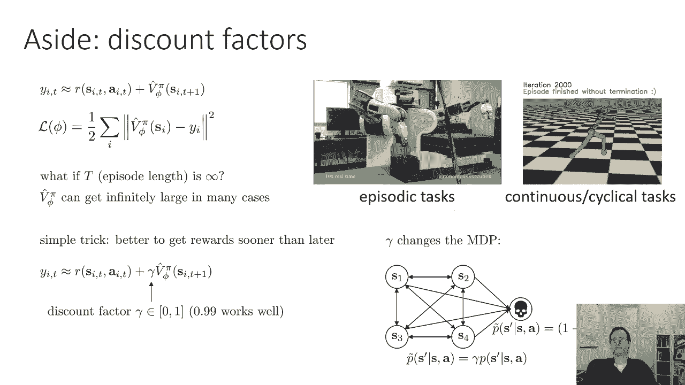
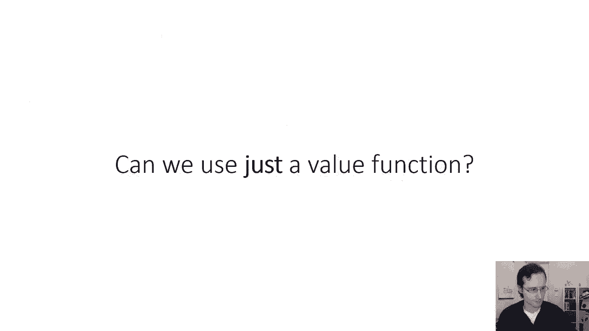

# 48：演员-评论家与Q学习 🎭🤖

在本节课中，我们将学习强化学习中的两种重要算法：演员-评论家方法和Q学习。我们将从回顾策略梯度开始，然后探讨如何通过更有效地估计回报来改进它，最终引出演员-评论家算法。

## 回顾策略梯度 📈

上一节我们介绍了策略梯度方法。经典的策略梯度算法（如REINFORCE）包含三个步骤：
1.  通过运行当前策略对轨迹进行采样。
2.  通过计算梯度对数概率与奖励估计的乘积之和来评估策略梯度。
3.  沿着策略梯度的方向更新策略。

其中，奖励估计 `Q_hat` 是从当前时间步 `t` 到轨迹结束所获得的实际奖励之和。然而，这种估计仅基于单个轨迹样本，方差较大。

## 改进奖励估计 🎯

本节中，我们来看看如何改进对预期回报的估计。`Q_hat` 是对在状态 `s` 采取行动 `a` 后预期回报的估计。在REINFORCE中，这个估计只是将单个轨迹后续的奖励简单相加。

更好的方法是估计真实的Q函数 `Q(s, a)`，即从状态 `s` 执行动作 `a` 并遵循策略 `π` 所能获得的**期望**总回报。如果我们能获得 `Q(s, a)` 的良好估计，就可以用它替代 `Q_hat`，从而得到更准确的策略梯度。

此外，我们上次学到，在策略梯度中引入基线（baseline）可以显著降低方差。一个特别有用的基线是状态值函数 `V(s)`，它表示从状态 `s` 开始并遵循策略 `π` 的期望回报。

以下是几个核心概念的定义：
*   **Q函数**：`Q^π(s, a) = E[ Σ_{t'=t}^T R(s_{t'}, a_{t'}) | s_t = s, a_t = a ]`
*   **价值函数**：`V^π(s) = E_{a~π}[Q^π(s, a)]`
*   **优势函数**：`A^π(s, a) = Q^π(s, a) - V^π(s)`

优势函数描述了在状态 `s` 下，动作 `a` 比该状态下的平均动作好多少。使用优势函数后，策略梯度可以表示为：
`∇_θ J(θ) ≈ E[ ∇_θ log π_θ(a|s) * A^π(s, a) ]`

我们对优势函数的估计越好，策略梯度的估计就越准确。

## 演员-评论家算法 🎬👨‍🏫

为了估计优势函数，我们引入第二个神经网络。现在，我们有两个网络：
*   **演员（Actor）**：策略网络 `π_θ(a|s)`，负责选择动作。
*   **评论家（Critic）**：价值网络 `V_φ(s)`，负责评估状态的好坏。

这种结构被称为**演员-评论家算法**。评论家网络的任务是进行**策略评估**，即拟合当前策略的价值函数 `V^π(s)`。

### 如何训练评论家？🔧

我们讨论两种拟合价值函数的方法：

**1. 蒙特卡洛（MC）评估**
这种方法直接使用从状态 `s` 开始到轨迹结束获得的实际总奖励 `G_t` 作为目标值 `y`，然后通过监督学习（最小化均方误差）来训练价值网络。
`L(φ) = (V_φ(s_t) - y_t)^2`，其中 `y_t = Σ_{t'=t}^T R_{t'}`

**2. 时序差分（TD）与自举（Bootstrapping）**
我们可以利用贝尔曼方程来获得更好的目标值。贝尔曼方程建立了相邻状态价值函数之间的联系：
`Q^π(s_t, a_t) = R(s_t, a_t) + E_{s_{t+1}}[V^π(s_{t+1})]`

因此，优势函数可以近似为：
`A^π(s_t, a_t) ≈ R(s_t, a_t) + V^π(s_{t+1}) - V^π(s_t)`

在训练评论家时，我们使用当前价值网络的预测来构建目标（即“自举”）：
`y_t = R_t + γ * V_φ(s_{t+1})`
其中 `γ` 是折扣因子（通常为0.99），用于让智能体更重视近期奖励，并保证无限时域任务中价值函数的收敛性。然后同样通过最小化均方误差 `(V_φ(s_t) - y_t)^2` 来更新评论家。

### 算法流程 🔄

一个完整的（在线）演员-评论家算法步骤如下：
1.  从环境中观察当前状态 `s_t`。
2.  演员根据策略 `π_θ(a|s_t)` 选择动作 `a_t`。
3.  执行动作 `a_t`，获得奖励 `r_t` 和下一个状态 `s_{t+1}`。
4.  **更新评论家**：计算目标值 `y_t = r_t + γ * V_φ(s_{t+1})`，通过梯度下降最小化 `(V_φ(s_t) - y_t)^2` 来更新参数 `φ`。
5.  **更新演员**：估计优势 `Â_t = r_t + γ * V_φ(s_{t+1}) - V_φ(s_t)`，通过梯度上升更新策略参数 `θ`：`θ ← θ + α * ∇_θ log π_θ(a_t|s_t) * Â_t`。

### 网络架构设计 🏗️

对于演员和评论家网络，有两种常见的设计方式：
*   **独立网络**：演员和评论家是两个完全独立的神经网络。简单稳定，但效率较低。
*   **共享特征网络**：演员和评论家共享底层的特征提取层，然后在顶层分成策略头和价值头。这允许特征共享，可能更高效，但训练可能更复杂。

## 总结 📚

本节课我们一起学习了演员-评论家算法。我们从策略梯度出发，指出了其使用单样本回报估计方差大的问题。通过引入价值函数作为基线，并定义了优势函数，我们得到了更优的策略梯度形式。为了估计优势函数，我们引入了评论家网络，并讲解了如何使用蒙特卡洛或时序差分方法来训练它。最终，我们得到了演员-评论家算法的完整框架，其中演员负责决策，评论家负责评估，两者协同工作，使得策略学习更加高效和稳定。