# 49：CS 182 第 16 讲 - 第二部分：Actor-Critic 与 Q-Learning 🧠

在本节课中，我们将学习如何从 Actor-Critic 方法出发，进一步构建完全基于值函数和 Q 函数的强化学习算法，最终引出经典的 Q-Learning 方法。我们将探讨如何省略显式的策略网络，直接利用值函数进行决策，并理解从动态规划到无模型 Q-Learning 的演变过程。

---

## 🤔 能否完全省略策略梯度？

上一节我们介绍了 Actor-Critic 方法，本节中我们来看看能否完全摆脱策略梯度。核心问题是：我们能否完全用值函数来进行强化学习，从而省略策略梯度？

回忆优势函数的定义：**A_π(s, a)** 表示在状态 **s** 下采取动作 **a** 相对于策略 **π** 的平均表现有多好。最优动作是优势函数的 **arg max**。如果我们能直接选择使优势最大化的动作，这通常比遵循当前策略 **π** 更好，甚至可能最优。

这意味着，我们或许可以隐式地定义一个策略：对于离散动作，我们评估所有动作的优势，然后选择优势最大的那个。这样，我们就不再需要一个独立的神经网络来表示策略，而是直接用优势函数来选择动作。

这种新策略至少和原策略一样好，通常更好。因此，我们对算法流程做了一个修改：我们仍然生成样本并拟合值函数，但不再通过策略梯度来改进策略，而是用这种贪婪的 **arg max** 选择来直接改进策略。

---

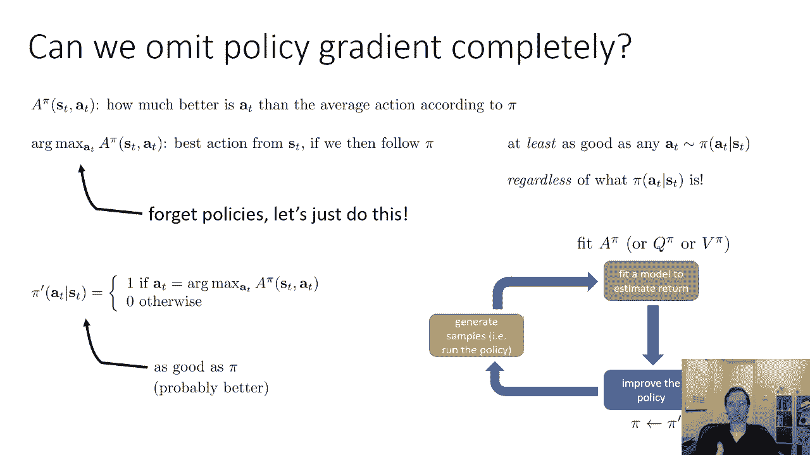

## 🔄 策略迭代算法基础

基于上述思想，我们可以构建策略迭代算法。其高层思想是：首先评估当前策略 **π** 的优势函数（通常通过计算值函数实现），然后将新策略设置为 **arg max** 策略，并重复此过程。

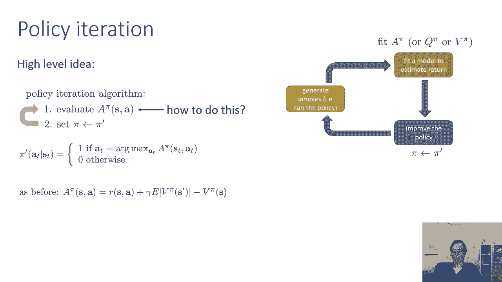

关键问题是如何计算 **A_π(s, a)**。我们可以使用之前讨论的 Actor-Critic 方法进行估计：

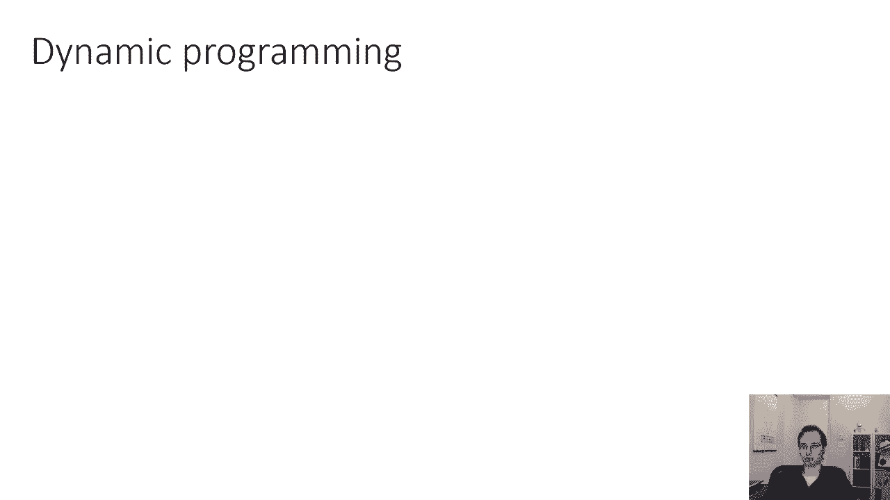

**A_π(s, a) ≈ r + γ * V(s') - V(s)**

我们可以使用蒙特卡洛方法或时序差分方法来用样本估计这个值。

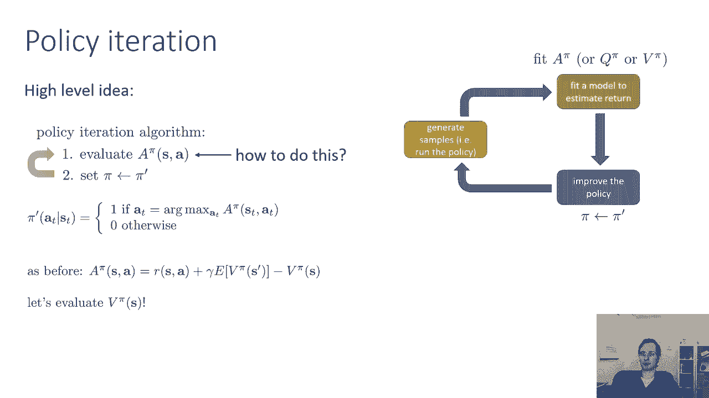

---

## 📊 动态规划视角：价值迭代

现在，让我们暂停一下，讨论一个特殊情况：如果我们知道状态转移概率 **P(s'|s, a)**，如何拟合 **V_π**？这有助于我们在已知模型的设定下推导出优雅的算法，然后再推广到无模型的设定。

假设状态和动作空间都是小而离散的，例如一个网格世界。在这种情况下，我们可以将值函数 **V_π** 存储在一个表中（每个状态一个值），转移概率存储在一个张量中。

值函数的贝尔曼更新方程为：

**V_π(s) = E_{a∼π, s'∼P}[r(s, a) + γ * V_π(s')]**

由于我们的策略 **π** 是 **arg max** 策略（确定性策略），我们可以将其代入方程。此时，期望中只有一个动作的概率为1，因此方程简化为：

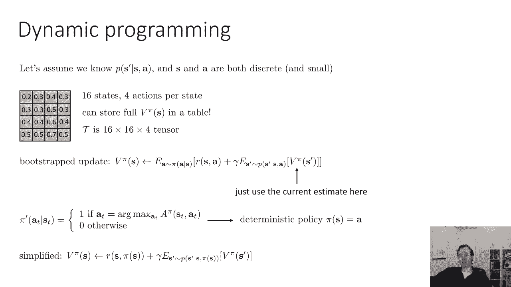

**V_π(s) = r(s, π(s)) + E_{s'∼P}[γ * V_π(s')]**

我们可以使用这个引导更新来评估 **V_π**，然后将新策略设置为 **arg max** 策略，并重复。这个过程称为**策略评估**。

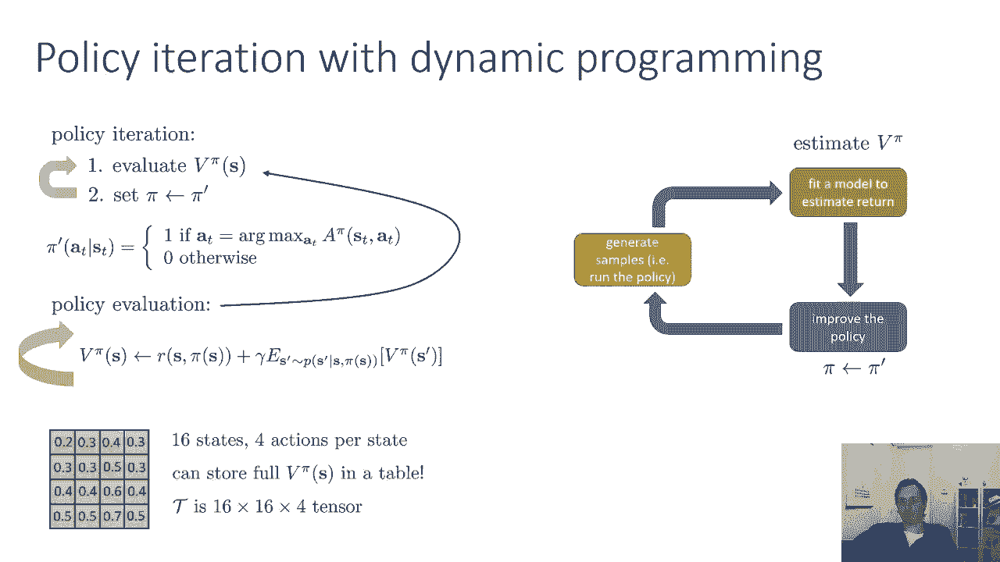

更高效的方法是进行**价值迭代**。我们注意到，**arg max** 策略的值实际上等于 Q 函数的最大值：

**V_π(s) = max_a Q(s, a)**

其中，**Q(s, a) = r(s, a) + γ * E_{s'}[V(s')]**。

因此，价值迭代算法直接对值函数进行备份：

**V(s) ← max_a [ r(s, a) + γ * E_{s'}[V(s')] ]**

这样就跳过了显式构造策略的中间步骤。

---

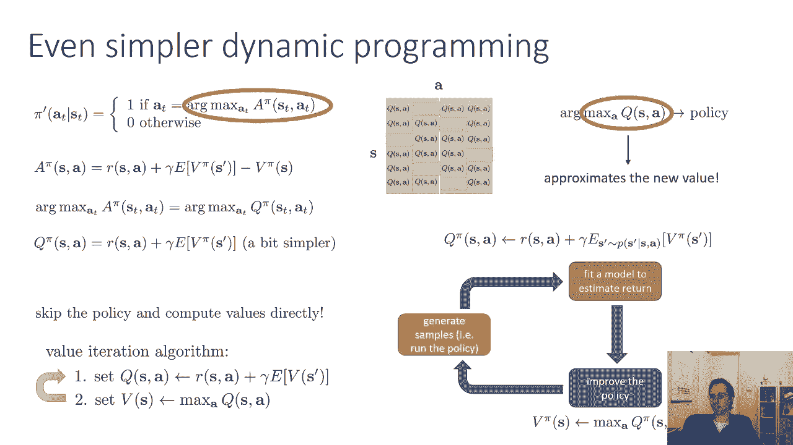

## 🧠 从表格到神经网络：函数逼近

当状态空间很大（例如图像）时，使用表格存储值函数变得不切实际（维度诅咒）。我们需要使用神经网络 **V_φ(s)** 来近似值函数，其中 **φ** 是网络参数。

我们可以借鉴价值迭代的思想，但使用均方误差回归来拟合神经网络。具体来说，我们计算目标值：

**y = r(s, a) + γ * max_{a'} V_φ(s')**

然后通过最小化 **(V_φ(s) - y)^2** 来更新网络参数 **φ**。

然而，这里存在一个大问题：在无模型设定下，我们无法准确计算 **max_{a'} V_φ(s')**，因为我们不知道采取不同动作会转移到什么状态 **s'**。

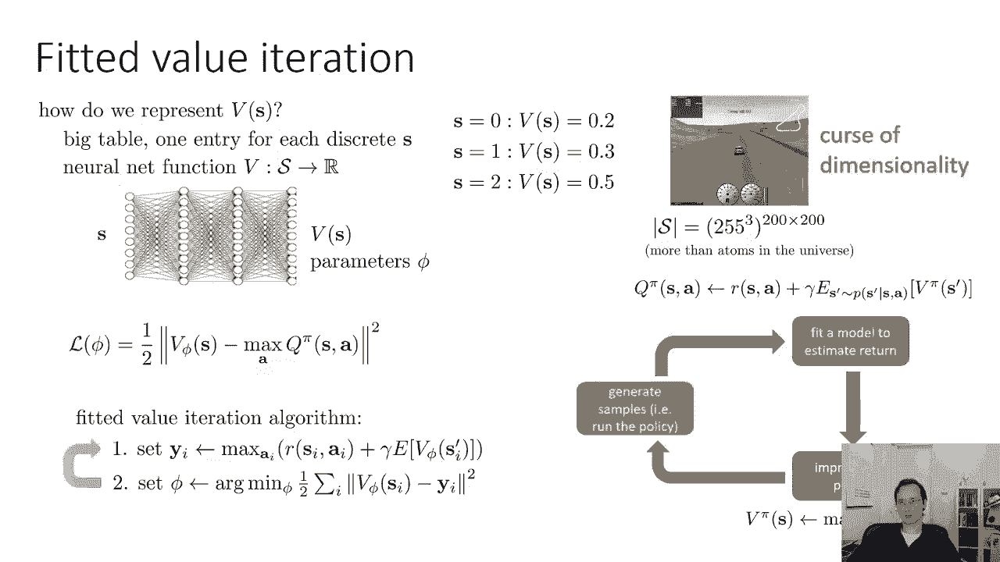

---

## 🚀 解决方案：Q-Learning 算法

为了解决上述问题，我们转向 Q-Learning。其核心思想是直接学习 Q 函数 **Q(s, a)**，而不是值函数 **V(s)**。

Q-Learning 的目标是让 Q 函数满足贝尔曼最优方程：

**Q(s, a) = r(s, a) + γ * max_{a'} Q(s', a')**

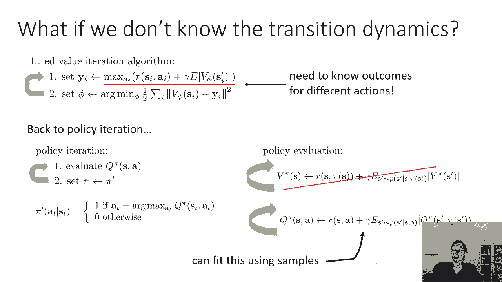

我们可以使用样本 **(s, a, r, s')** 来估计这个目标，并让 Q 函数向该目标回归。

以下是拟合 Q 迭代算法的步骤：

1.  **收集数据**：使用某种策略（如 ε-贪婪策略）与环境交互，收集状态、动作、奖励和下一个状态的数据集 **D**。
2.  **计算目标值**：对于数据集中的每个样本 **(s, a, r, s')**，计算目标值 **y = r + γ * max_{a'} Q_φ(s', a')**。
3.  **执行回归**：通过最小化均方误差 **(Q_φ(s, a) - y)^2** 来更新 Q 网络参数 **φ**。
4.  **重复**：迭代执行步骤 1-3。

这个算法的一个关键优点是：它可以使用**非策略**样本，即收集数据所用的策略可以与我们要学习的策略不同。这是因为 Q 函数是以动作为条件的，我们只需要在目标值计算中“查询” Q 网络对不同动作的估值。

---

## ⚠️ 实践注意事项

虽然 Q-Learning 在理论上（当使用函数逼近时）比策略梯度缺乏一些收敛性保证，但在实践中，通过精心调整，它可以非常有效。深度 Q 网络（DQN）及其变体就是建立在 Q-Learning 基础之上的成功案例。

要使其在实践中工作良好，通常需要注意以下几点：
*   使用目标网络来稳定训练。
*   使用经验回放来打破样本间的相关性。
*   谨慎选择超参数，如学习率、折扣因子 γ 和探索率 ε。

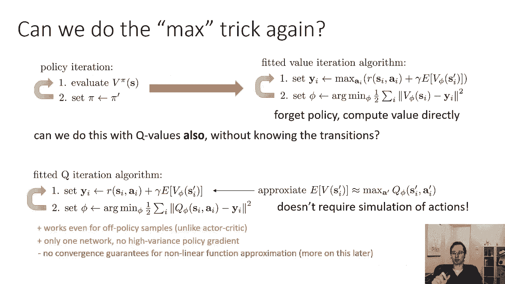

---

## 📝 总结

本节课中，我们一起学习了从 Actor-Critic 到 Q-Learning 的演变过程。

1.  我们首先探讨了**省略策略梯度**的可能性，提出了直接利用优势函数选择动作的贪婪方法。
2.  接着，在**已知模型**的设定下，我们回顾了**策略迭代**和**价值迭代**这两种动态规划方法。
3.  然后，面对**大状态空间**的挑战，我们引入了**神经网络进行函数逼近**。
4.  最后，为了解决无模型设定下无法计算最大值的问题，我们引出了**Q-Learning 算法**。该算法直接学习 Q 函数，通过贝尔曼最优方程进行更新，并能使用非策略数据进行学习。

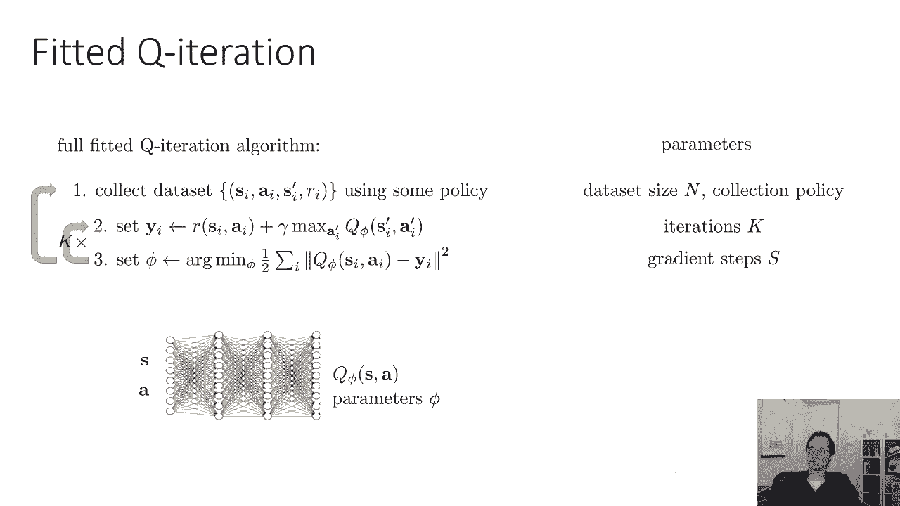

Q-Learning 为后续深度强化学习算法（如 DQN）奠定了重要基础，是价值函数方法中的核心思想。