# 50：CS 182 第16讲 第3部分 - Actor-Critic 与 Q-Learning 🧠

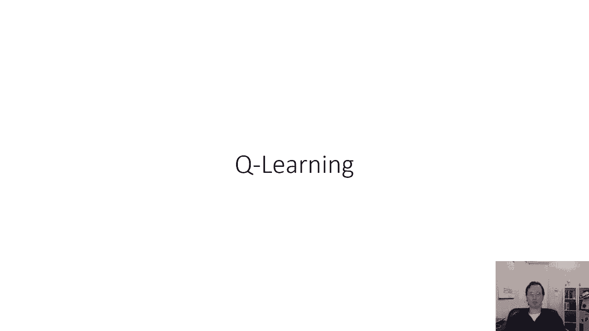

在本节课中，我们将推导出一个完整的深度Q学习算法。我们将从基础的在线Q学习开始，逐步分析其存在的问题，并引入重播缓冲区和目标网络等关键技术来构建稳定高效的深度Q学习（DQN）算法。最后，我们会讨论算法的实际应用技巧。

---

## 🚀 从全拟合Q迭代到在线Q学习

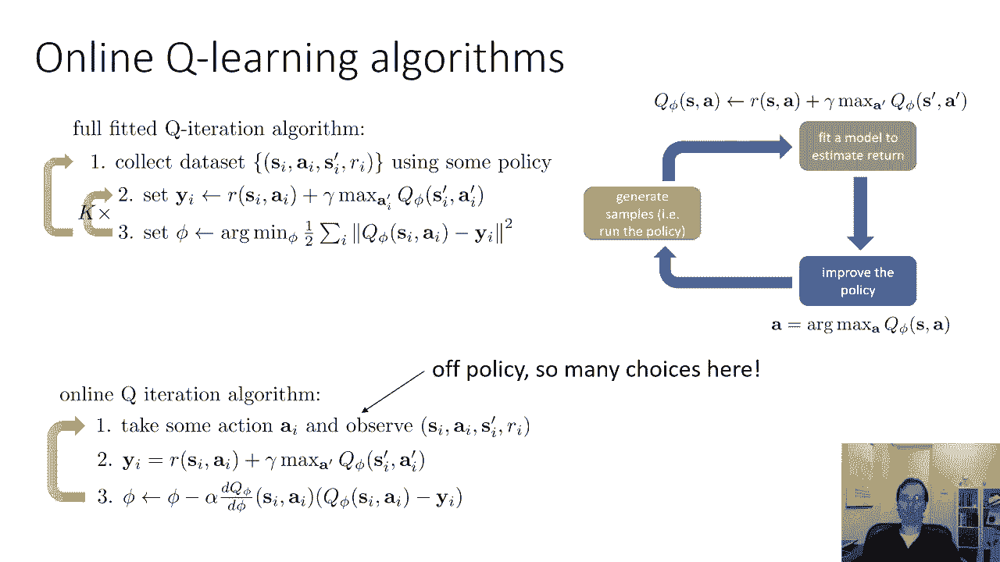

上一节我们介绍了全拟合Q迭代法。本节中，我们来看看如何将其推广为在线算法。

在线Q学习方法会执行一个动作，并观察一个状态转移 `(s, a, s', r)`。它会在单个转移上计算一个目标值 `y = r + γ * max_{a'} Q_φ'(s', a')`。然后，它执行一个梯度下降步骤，以最小化估计的Q值 `Q_φ(s, a)` 与目标值 `y` 之间的误差。

这就像是针对Q值的在线版Actor-Critic。它在环境中执行一步，观察转移，计算目标值，然后执行一个SGD梯度步。这种方法有时被称为**沃特金斯Q学习**，它是现代深度Q学习方法的基础。

为了让该算法与深度神经网络结合时能良好工作，我们需要在几个方面进行修改。

---

## 🤔 如何选择行动？探索策略

由于Q学习是**离策略**算法，这意味着选择行动的策略可以与评估Q值的策略不同。为了有效探索，我们不能总是选择当前认为最好的动作（argmax策略）。

以下是两种常见的探索策略：

*   **ε-贪婪探索策略**：设定一个较小的探索概率 ε。在概率 `1-ε` 的情况下，选择argmax动作；在概率 `ε` 的情况下，在所有可能动作中随机选择一个。
    *   **公式**：`a = argmax_a Q(s, a) with prob (1-ε); a ~ Uniform(actions) with prob ε`
*   **玻尔兹曼探索**：选择动作的概率与其Q值的指数成正比。这意味着Q值相近的动作被选中的概率也相近，而Q值很低的动作被选中的概率很低。
    *   **公式**：`P(a|s) ∝ exp(Q(s, a))`

对于初学者，建议从简单的ε-贪婪策略开始，因为它参数少，易于调整。

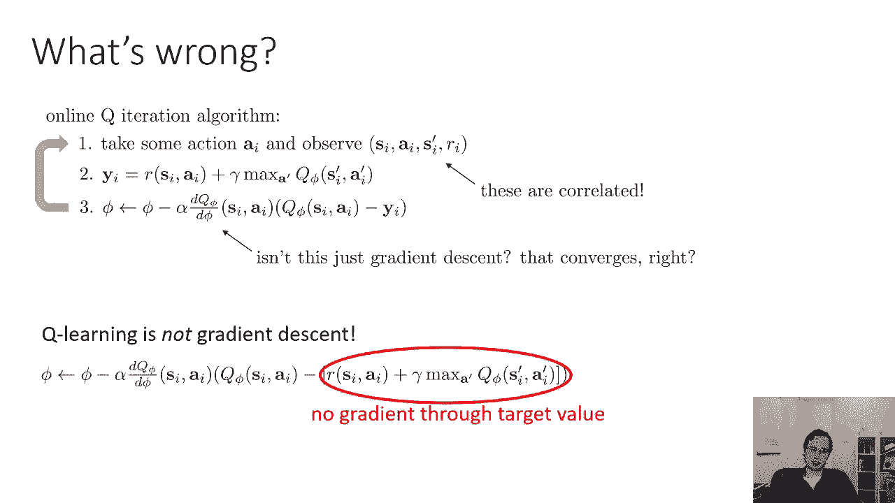

---

## ⚠️ 基础Q学习存在的问题

基础在线Q学习算法存在两个主要问题：

1.  **Q学习不是梯度下降**：在计算梯度时，我们将目标值 `y` 视为常数，忽略了 `y` 本身也依赖于Q函数参数 `φ` 的事实。这使得算法不像标准的梯度下降那样稳定。
2.  **样本相关性**：在线学习时，连续采样到的状态转移 `(s, a, s', r)` 是高度相关的。这违反了SGD要求样本独立同分布的假设，可能导致模型在局部相关的样本上过度拟合，而无法学习到全局结构。

---

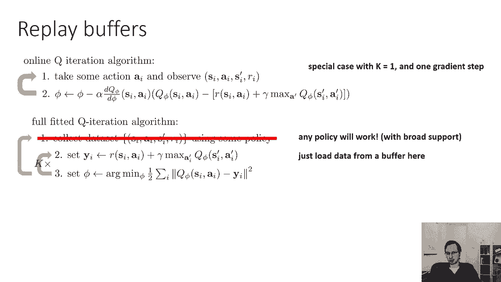

## 💾 解决方案一：重播缓冲区

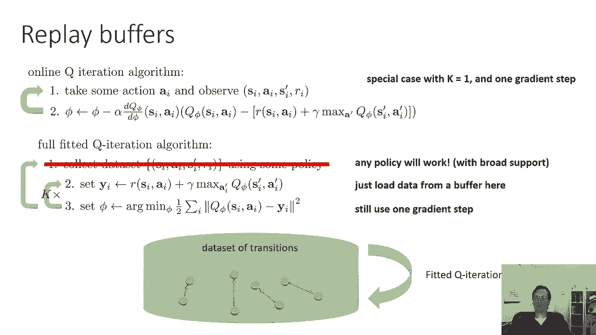

为了解决样本相关性问题，我们可以使用**重播缓冲区**。其核心思想是：将智能体与环境交互得到的所有转移 `(s, a, s', r)` 存储在一个缓冲区（或“桶”）中。当需要更新Q网络时，不是使用最新的转移，而是从缓冲区中**随机采样一小批**历史转移来进行训练。

这使得训练数据更接近独立同分布，更像是在进行小批量梯度下降。同时，缓冲区通常有容量上限，当数据满时会丢弃最旧的数据。

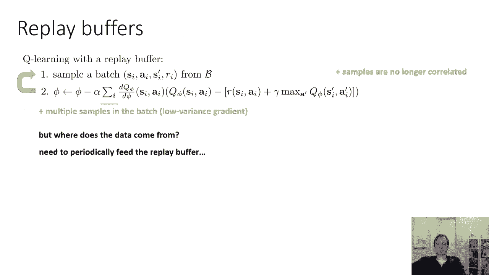

使用重播缓冲区的Q学习流程如下：
1.  使用某种策略（如ε-贪婪）收集数据，并将其添加到缓冲区。
2.  从缓冲区中采样一小批转移。
3.  在这小批数据上执行梯度下降步骤来更新Q函数。
4.  重复步骤2和3（可以重复多次，即k>1），然后回到步骤1收集新数据。

---

## 🎯 解决方案二：目标网络

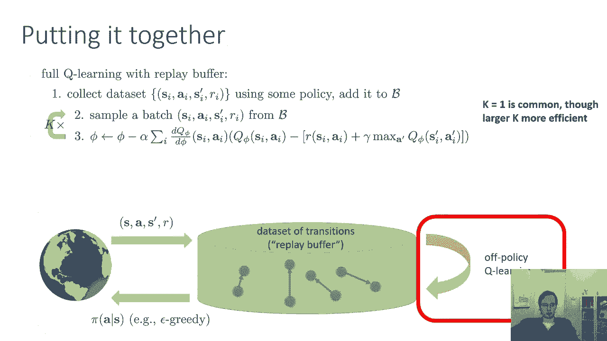

即使使用了重播缓冲区，**目标值持续变化**（“移动的目标”）的问题依然存在。这会导致Q函数不断追逐一个变化的目标，难以稳定收敛。

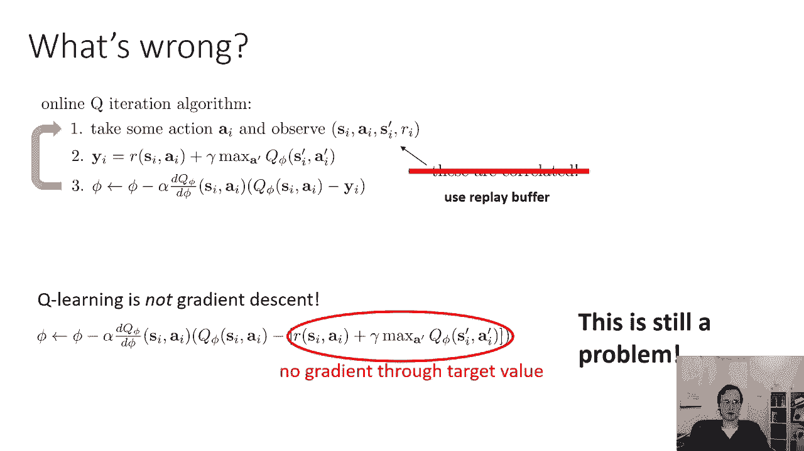

受全拟合Q迭代的启发（它在固定目标上执行多步回归，较为稳定），我们可以通过**减缓目标值的变化**来解决这个问题。具体方法是引入一个**目标网络**。

我们维护两个网络：
*   **主Q网络**：`Q_φ`，参数为 `φ`，用于评估Q值和选择动作，并持续更新。
*   **目标Q网络**：`Q_φ'`，参数为 `φ'`，**专门用于计算目标值** `y`。

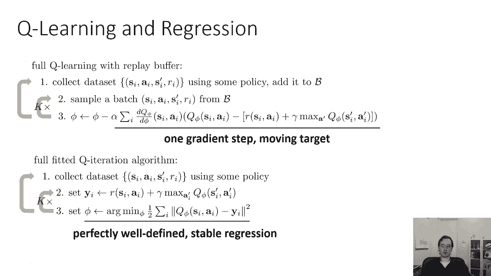

在计算目标值时，我们使用目标网络：`y = r + γ * max_{a'} Q_φ'(s', a')`。目标网络的参数 `φ'` 并不通过梯度下降直接更新，而是定期（例如每1万步）从主网络**复制**过来（`φ' ← φ`）。这样，目标值在多次更新中保持相对稳定，将问题转化为一个更稳定的监督回归任务。

---

## 🧩 完整的深度Q学习算法（DQN）

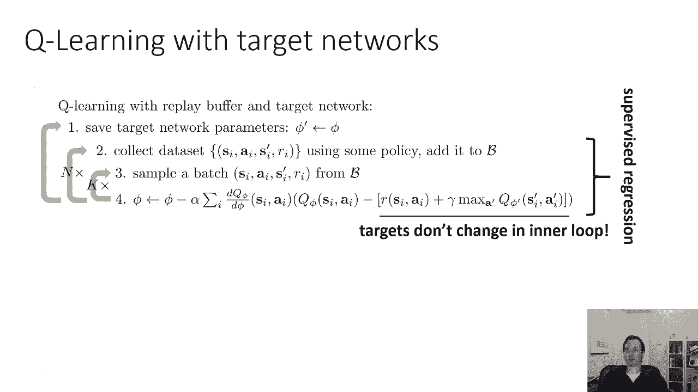

结合重播缓冲区和目标网络，我们得到了经典的**深度Q学习算法**，也称为**DQN**。

以下是算法的核心步骤：
1.  使用ε-贪婪策略选择动作 `a_t`，执行后观察到转移 `(s_t, a_t, s_{t+1}, r_t)`，并将其存入重播缓冲区 `D`。
2.  从缓冲区 `D` 中均匀随机采样一小批转移 `(s, a, s', r)`。
3.  使用目标网络计算目标值：`y = r + γ * max_{a'} Q_φ'(s', a')`。
4.  对主网络执行一个梯度下降步骤，最小化损失：`L(φ) = (Q_φ(s, a) - y)^2`。
5.  每隔 `N` 步（例如N=10000），将目标网络参数更新为当前主网络参数：`φ' ← φ`。

---

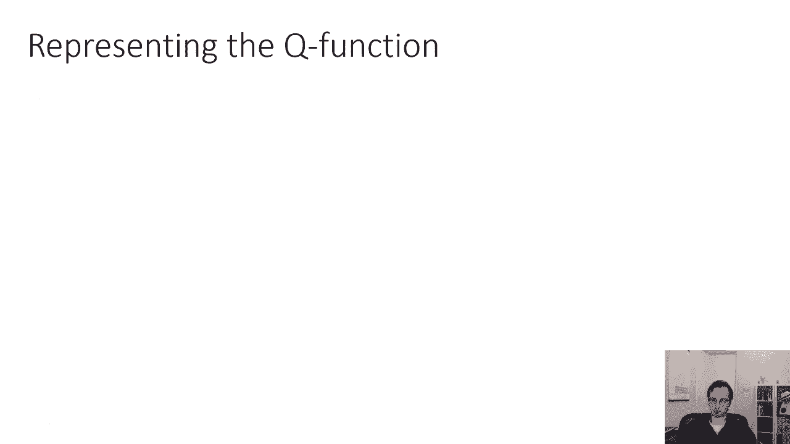

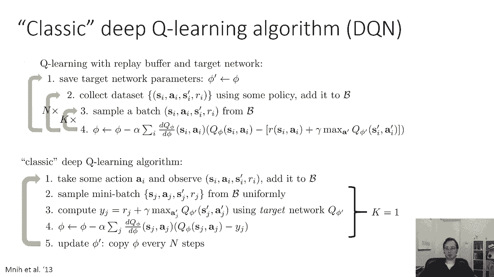

## 🕸️ Q函数的网络表示

要完成深度Q学习算法，我们还需要确定如何用神经网络表示Q函数。主要有两种选择：

*   **输入状态和动作，输出标量Q值**：`Q_φ(s, a)`。这在连续动作空间中更常见。
*   **输入状态，为每个可能动作输出一个Q值**：`Q_φ(s)` 输出一个向量，每个元素对应一个动作的Q值。这对于**离散动作空间**非常方便，因为求最大值 `max_a Q_φ(s, a)` 只需一次前向传播和一个向量最大值操作。

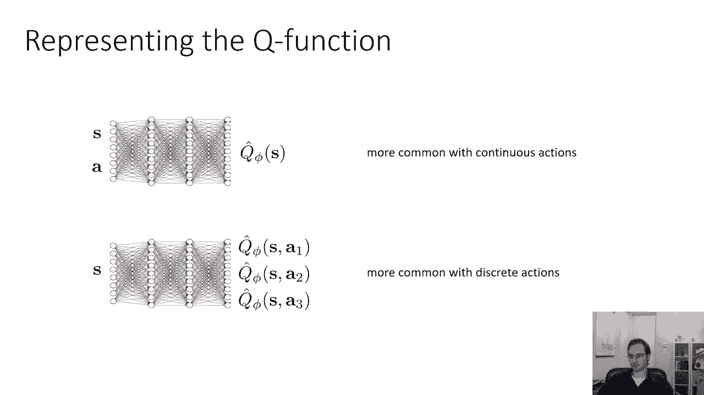

**注意**：对于连续动作空间，求最大值 `max_a Q(s, a)` 本身就是一个优化问题，计算上可能不便。因此，在连续动作空间中，使用基于策略的Actor-Critic方法通常更为方便。

---

## 🔄 离策略的Actor-Critic

如果我们既想要Q学习的离策略优势，又想在连续动作空间中使用，可以将Q学习的思想与Actor-Critic结合。

其算法流程与DQN类似，但关键区别在于目标值的计算和策略的更新：
1.  收集数据并存入缓冲区。
2.  从缓冲区采样小批量数据。
3.  计算目标值时，不使用 `max` 操作，而是使用一个独立的**目标演员网络** `π_θ'` 来选择动作：`y = r + γ * Q_φ'(s', π_θ'(s'))`。
4.  对评论家（Q网络）执行梯度下降。
5.  对演员（策略网络）使用策略梯度方法进行更新。
6.  定期软更新目标评论家网络和目标演员网络。

这种方法是许多现代先进算法（如**软演员评论家**）的基础。

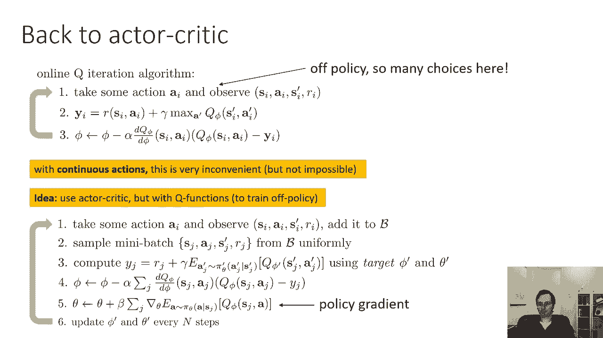

---

## 💡 Q学习的实用技巧

在实践中，深度Q学习需要精心调整才能稳定工作。以下是一些实用技巧：

*   **耐心调试**：Q学习的超参数调整比监督学习更耗时。性能曲线可能先上升后剧烈下降。建议先在简单环境（如网格世界）中验证实现。
*   **使用大容量重播缓冲区**：这有助于提高稳定性，使数据分布更接近独立同分布。
*   **理解学习曲线**：Q学习初期可能长时间表现不佳（随机探索阶段），一旦发现好的策略，性能会快速提升，形成“S型”学习曲线。这与监督学习不同。
*   **探索调度**：开始时使用较大的探索率ε，然后随着训练进程逐渐衰减（例如线性衰减），这样可以在早期充分探索，后期充分利用学到的策略。

---

## 📚 本节课总结

在本节课中，我们一起学习了：
1.  如何从全拟合Q迭代推导出在线Q学习算法。
2.  探索策略（如ε-贪婪）的重要性。
3.  基础Q学习存在的两个核心问题：非梯度下降性和样本相关性。
4.  使用**重播缓冲区**解决样本相关性问题。
5.  使用**目标网络**解决目标值不稳定的问题。
6.  结合两者得到了经典的**深度Q学习（DQN）** 算法。
7.  了解了Q函数的不同网络表示方法。
8.  简要了解了如何将Q学习思想扩展到连续动作空间的**离策略Actor-Critic**方法。
9.  掌握了一些让Q学习在实践中更稳定的**实用技巧**。

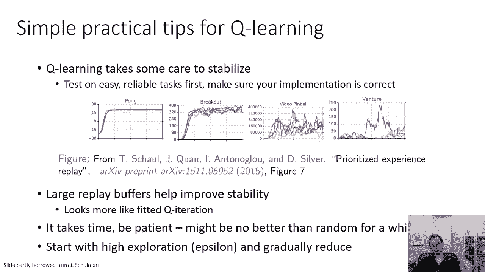

通过本讲，你应该对深度强化学习中Q学习系列算法的原理、挑战及解决方案有了系统的认识。