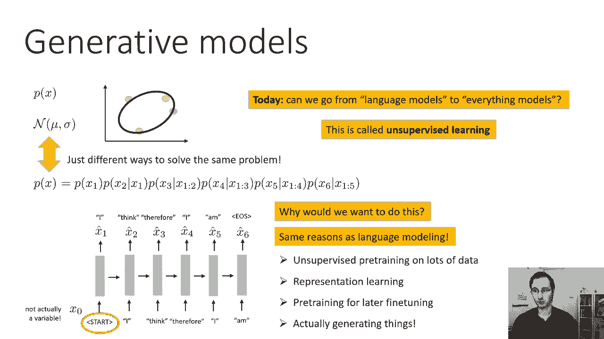
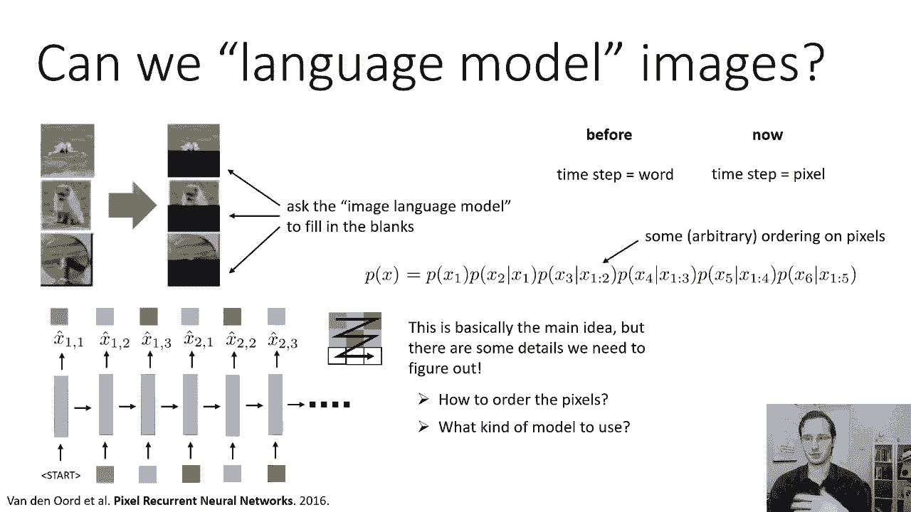
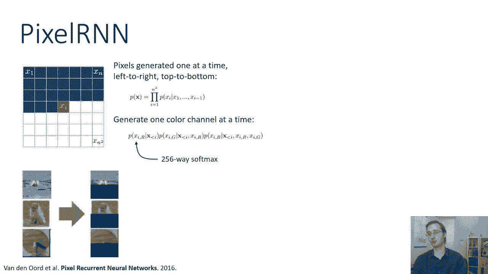
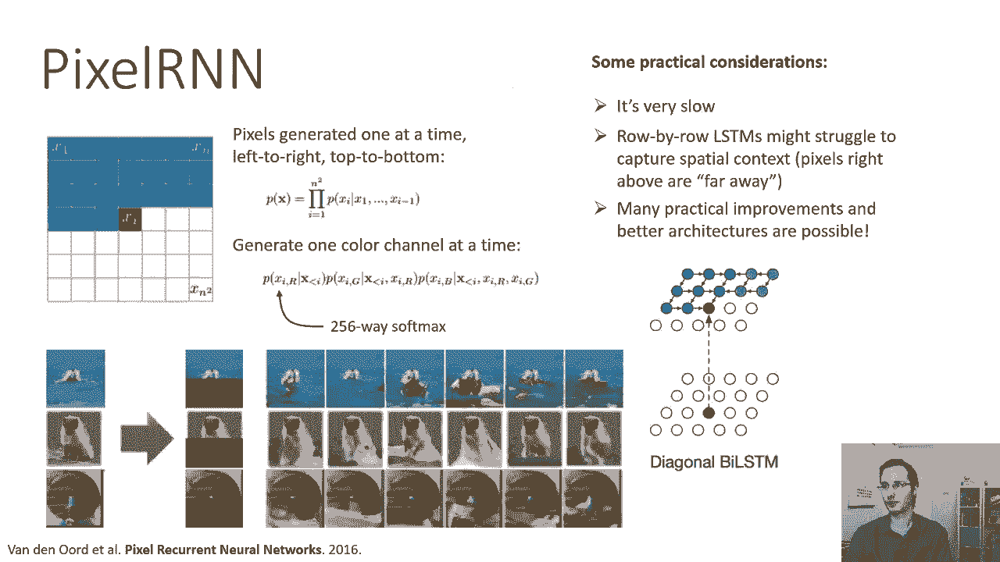
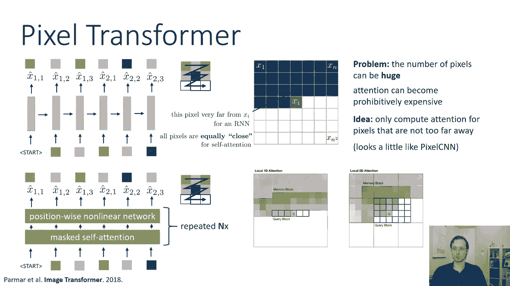
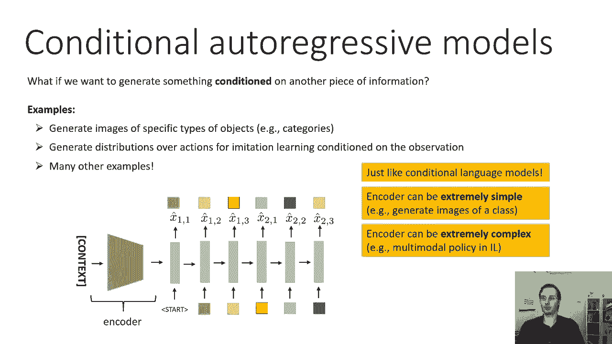
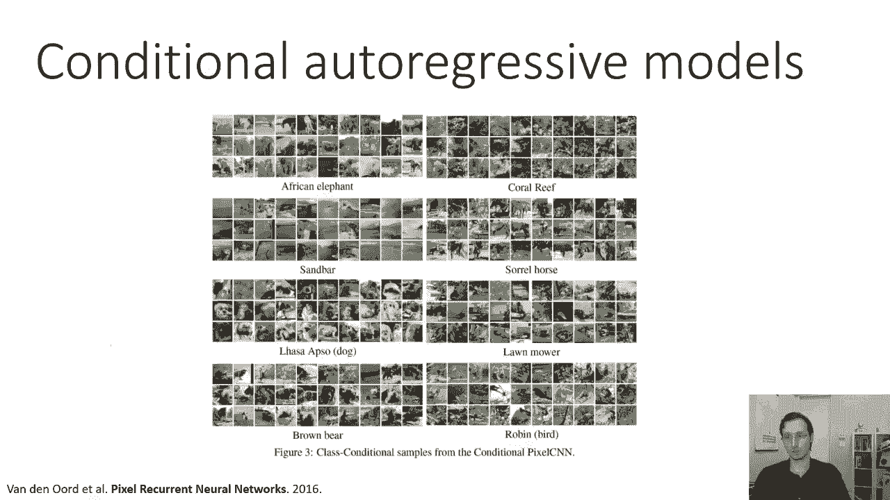
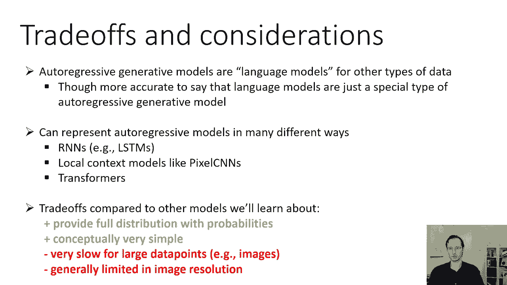

# 51：CS 182 - 第 17 讲 - 第 1 部分 - 生成模型 🧠

在本节课中，我们将要学习生成模型。我们将从概率模型的基础概念开始，逐步深入到自回归生成模型，并探讨如何将其应用于图像等非语言数据。

---

## 概述 📋

到目前为止，在这门课程中，我们已经讨论了监督学习和强化学习。从今天开始，我们将讨论无监督学习。但在深入之前，我们需要先讨论概率模型。

我们在本课程中学习的几乎所有模型，以及其他机器学习课程中的模型，本质上都是概率模型。最简单的概率模型之一是学习随机变量 **x** 上分布的模型。

例如，如果你有一个二维的点集合，你估计这些点的平均值和协方差，你真正做的是在学习这些点的多元正态概率模型。我们有时把它画成椭圆，其中椭圆的轮廓表示平均值的一个或两个标准差。平均值在椭圆的中心，一个或两个标准差是线所在的地方。

我们也有条件概率模型，这些模型表示给定 **x** 时 **y** 的分布 **p(y|x)**。像线性回归这样的模型就属于这一类，其中 **y** 表示点的垂直位置，**x** 表示水平位置。深度神经网络分类器也属于这一类，其中 **Y** 表示标签的类别，**x** 表示图像。

到目前为止，在这门课程中，我们主要讨论了学习形式为 **p(y|x)** 的条件模型。今天我们要学习 **p(x)**。

---

## 为什么需要生成模型？🤔

我们为什么要学习图像或其他类型输入的分布？我们很快就会回到这一点。问题是我们已经看到了一些生成模型，只是没有这样描述它们。

概率模型或生成模型的简单教科书图片是 **p(x)**。为什么它被称为生成模型？因为它可以生成 **x**。你不能从给定 **x** 模型的 **p(y|x)** 生成 **x**。所以线性回归模型不能帮助你生成 **x** 坐标。但是如果你有一个二维随机变量上的多元正态分布，你可以从 **p(x)** 中采样生成新的、相同分布的二维随机变量。

假设我们有一个多元正态分布，我们已经了解到的那种生成模型与这个多元正态有很大的不同，但它从根本上解决了同样的问题。这就是语言模型。

语言模型也表示 **p(x)**，其中 **x** 是单词序列。它们只是解决同一个问题的不同方法。语言模型对 **p(x)** 的表示与多元正态分布非常不同，但它在解决同样的问题。从某种意义上说，它也代表了在这种情况下句子上的概率分布。

表示概率分布意味着它可以为该空间中的每个点分配概率。语言模型的空间是句子的空间。对于每一个可能的句子，语言模型可以分配一个概率。它通过使用概率链式法则来做到这一点。

链式法则指出，任何联合分布都可以分解为条件分布的乘积。所以如果我们说 **p(x)**，其中 **x** 是一个序列 `(x0, x1, x2, x3, ..., x6)`，你可以用概率链式法则来写：

```
p(x) = p(x0) * p(x1|x0) * p(x2|x0, x1) * p(x3|x0, x1, x2) * ... * p(x6|x0, ..., x5)
```

仔细听的人会注意到，我说的和幻灯片上的有点不一致。我说你从 `p(x0)` 开始，但在幻灯片上，方程实际上是从 `p(x1|x0)` 开始的。这可能看起来有点不对劲，但它不是 `x0`。语言模型的 `x0` 是我们一开始输入的第一个令牌，第一个令牌总是相同的（开始令牌），所以它实际上不是随机变量。我们知道开始令牌是什么，这不是随机的，总是一样的。

这意味着在现实中，您可以在这些条件中的每一个中省略对 `x0` 的依赖，因为 `x0` 不是变量，它只是一个常数。这意味着你可以等价地这样写：

```
p(x) = p(x1) * p(x2|x1) * p(x3|x1, x2) * ... * p(x6|x1, ..., x5)
```



现在，更明显的是，语言模型实际上是在学习 **x** 上的联合分布。它不是条件分布，它不以 `x0` 为条件，因为 `x0` 不是变量。它真的是一个完整的联合分布，它是一个概率模型，它是一个生成模型，就像上面的多元正态分布一样，是一个生成模型。

只是语言模型代表了一个复杂得多的分布，在一个复杂得多的物体上。但它满足概率生成模型的所有要求：它可以为你给它的每一个句子分配一个概率，你可以用它来取样句子。您实际上可以输入开始令牌，在第一个单词上获得软最大值分布，从中采样，把它作为第二个词输入，等等。你实际上可以从这个分布中生成自然语言句子。所以它是一个成熟的概率生成模型。

---

## 生成模型的应用 🚀

我们为什么要做好这件事？我们已经了解了我们可能需要语言模型的几个原因。

例如，您可以在没有任何标签的大量数据上训练语言模型。所以你可以下载所有的维基百科并训练一个语言模型。你可以用它来获取非常适合下游自然语言任务的表示。这就是我们在谈论 ELMo 和 BERT 时学到的。您可以预先训练它，以便以后进行微调，就像我们讨论 BERT 的时候所说的。

当然，你可以用它来生成东西。所以如果你真的想完成一些句子或生成假句子，您可以使用语言模型。

所以今天讨论的主题不是如何建模语言，我们已经谈过了。主题是我们如何从语言建模到一切建模。我们能不能用我们用来构建这些语言模型的相同思想，建立其他类型物体的模型，如图像或声音？这叫做无监督学习。

这叫做无监督学习，因为提供给模型的训练数据没有用任何标签标记，不需要监督。它只需要未标记的数据。就像语言模型可以用来获取表示一样，或者以后可以微调到其他任务的模型，或者为了额外产生的东西。

我们建立在其他类型数据上的生成模型，如图像、声音等等，也可以用来表示，可用于预训练的学习，用于以后的微调。它们可以用来生成东西，就像语言模型一样。图像和其他类型数据上的生成模型不需要监督。

这就是为什么我们称之为无监督学习。



---

## 从语言到图像：自回归图像生成 🖼️

好的，所以我们可以将语言模型的思想应用于图像。假设我们有一些真实的图像，我们将用它们来训练。然后我们会得到一些新的测试图像，假设我们以前没见过这些图像。你可能想做的一项特殊任务是完成这些图像。我们也可以生成全新的图像，但也许我们能想到的特殊任务是完成一幅图像。

所以也许中间有这只狗的真实照片，底部被切掉，你想让你的模型完成底部的部分。如果你能在图像上训练一个“图像语言模型”，你可以让它填空，就像语言模型可以完成一个句子一样。

在模型的每一步之前都是一个词，现在每一步都是一个像素。所以我们将尝试在像素上训练一个语言模型。就像以前一样，我们将应用概率链式法则来分解分布：

```
p(x) = p(x1) * p(x2|x1) * p(x3|x1, x2) * ... * p(xn|x1, ..., xn-1)
```

其中下标表示我们正在查看的像素。所以 **x** 是像素数组，`x1` 是第一个像素，`x2` 是第二个像素，`x3` 是第三个像素，等等。

现在我们必须在像素上选择一个顺序来做到这一点。我们将选择一些相当任意的顺序，我们一会儿再讨论。但是模型的工作方式，一种非常简单的 RNN 模型将与语言模型完全相同。

所以我们有某种开始令牌，我们把它输入模型。然后不是产生一个词，我们产生的是一个像素。我们将像素离散化。颜色实际上是离散的，每个颜色通道的值在 0 到 255 之间，所以只有 256 个可能的值。所以我们在可能的颜色值上有一个很大的 softmax，我们一次生产一个。

在第一步，RNN 接收开始令牌，它在第一个像素的颜色上产生一个 softmax 分布。然后就像在测试时的语言模型中一样，生成的采样颜色在第二个时间步骤作为输入输入，它生成第二个像素的颜色。然后这个过程重复。

当然每张图像中都有很多像素，所以这将是一个相当长的序列。我们必须选择顺序。在这种情况下，我选择的特定顺序是扫描线顺序。所以你首先通过第一行像素 `(x11, x12, x13)`，然后去第二行 `(x21, x22, x23)`，然后去第三行 `(x31, x32, x33)`。这是一个特殊的顺序。

您可以任意挑选顺序。没有一个完美的选择，但选择有一定局部性的顺序是很好的。扫描线排序很好，因为至少水平附近的像素是顺序的，虽然在垂直方向上不是。

这基本上是 Pixel RNN 或 Pixel CNN 背后的主要思想。但我们还需要弄清楚一些细节才能把它变成一个完整的、成熟的生成模型。首先我们要决定如何排列像素。不幸的是，没有一个完美的答案，所以我们只是挑一些东西。我们得决定用什么样的模型。



当我们谈论语言建模时，我们了解了 RNNs、LSTMs、多层 LSTM、双向 LSTM、Transformer。当然，其中许多选择也可供我们选择，当我们在像素上建立这些模型时。

---

## 自回归生成模型的核心步骤 📝

以下是构建和训练自回归生成模型的主要原则：

1.  **分解维度**： 我们把 **x** 分成它的维度 `(x1, x2, ..., xm)`。**x** 可能是一个图像，而 `x1`, `x2`, `x3` 可能是图像中不同的像素。
2.  **离散化**： 我们将这些维度离散为 **k** 个值。在某些情况下，如图像生成，图像像素自然离散成 256 个值，因为像素只能呈现 256 种不同的颜色。
3.  **表示联合分布**： 我们在所有像素上（或在 **x** 的所有维度上）表示完整的联合分布 `p(x)`。我们通过链式法则来实现：
    ```
    p(x) = p(x1) * p(x2|x1) * p(x3|x1, x2) * ... * p(xm|x1, ..., xm-1)
    ```
    每个维度都依赖于以前的所有维度。对所有以前维度的依赖由 RNN 捕获，或者被一个带着掩码的自我注意的 Transformer 捕获。然后，每个维度上的实际分布只是一个 softmax，超过它所能承受的 **k** 个可能值。
4.  **选择序列模型**： 使用您最喜欢的序列模型来实际建模 `p(x)`。这可能是一个 RNN、LSTM、堆叠的 LSTM、双向 LSTM、带掩码自我注意的 Transformer。你想要什么都可以。

---

## 如何使用自回归生成模型 🛠️

假设你训练好了这个模型，你可以：



*   **采样**： 你可以从自回归生成模型中取样。使用祖先采样：先取样 `x1`，然后取样 `x2` 给定 `x1`，然后采样 `x3` 给定 `x1, x2`，以此类推。这与从语言模型生成句子的方式完全相同。
*   **补全**： 如果图像的一部分（或任何数据类型）是已知的，你想完成剩下的部分。您可以输入已知的值，然后对剩下的部分进行采样。这也是完全合法的做法。
*   **寻找最可能补全**： 如果你想找到最有可能的完成，你可以使用波束搜索，就像我们用波束搜索机器翻译一样。
*   **表示学习**： 这个想法和像 ELMo 或 BERT 这样的东西是一样的。我们可以使用序列模型的隐藏状态，作为用于下游任务的像素的表示。

---

## 具体模型：Pixel RNN 🧬

让我们走过这一类中的一种流行模型，这是特定于图像的自回归生成建模，被称为 Pixel RNN。

Pixel RNN 中的想法是：我们要生成像素，一次一个，从左到右，按扫描线顺序从上到下。所以整个图像的概率是由在所有像素上的乘积给出的。如果图像是 `n x n` 像素，每个像素都依赖于它的“前辈”，定义为所有正在进行的扫描线，以及当前像素左侧的所有前面的像素，在当前扫描线中。

现在，每个像素由三个颜色通道（红、绿、蓝）组成，所以我们还必须一次生成一个颜色通道。所以实际上每个像素都有一个小网络：给出前面所有像素的红色，然后给出前面所有像素和这个像素自己的红色，生成绿色，然后生成给定所有前面像素和这个像素红、绿色的蓝色。你也可以把它当成三个独立的像素，但它们是特殊的、稍微长一点的、二维空间中的自回归模型。

然后每个彩色通道都是 256 路的 softmax，所以每个颜色通道的亮度可以有 256 个可能的值。

一旦你训练好了，你可以给它，例如，图像的上半部分，它可以完成下半部分不同的随机实现。这些是 Pixel RNN 生成的实际样本。当它呈现这些图像的上半部分时，你可以看到完成度是不同的，因为它们是随机取样的。但它们也相当明智。

Pixel RNN 的一些实际考虑：它还是挺慢的。因为虽然基本配方与语言模型相同，但图像可能有大约 1000 个像素（如 32x32），每个像素有三个通道，这就增加到 3000 个“时间步”。无论是训练 Pixel RNN 还是从中取样都是相当昂贵的。

此外，逐行生成图像可能无法捕捉到图像中存在的一些空间上下文，因为位于扫描线正上方的像素在 RNN 排序中被认为是遥远的。在实践中可以使用各种各样的技巧来缓解此问题，例如“对角线双向 LSTM”，其中当前像素可以从其上方的隐藏状态接收快捷连接。

---

## 更高效的变体：Pixel CNN 🎯

Pixel CNN 的想法是让这个生成过程更快，通过不在所有像素上构建完整的 RNN，但是仅仅使用卷积来确定像素的值，基于它的邻居。

在我们建立 RNN 之前，这将读取上面所有的像素和当前像素的左边。现在我们要做的是，我们要说：这个像素的值，我们将以 256 路 softmax 产生，但它只依赖于此像素的本地邻域。这很像卷积网络的工作方式，除了我们的问题是我们没有生成整个社区。

如果我们要生成这些像素，按扫描线顺序一次一个，当前像素上方的像素、左边的像素已经生成，但是下面的像素和右边的像素还没有生成。所以我们要做的是，我们实际上将有一个**掩码卷积神经网络**，这将读取像素的值，但它对下面的所有东西和右边的权重都是零。所以这个卷积网络产生的值，仅依赖于当前像素左侧和上方的像素。它不会在当前像素中读取（因为它在产生它），它不会读到下面或右边的任何东西。

在训练期间，我们可以并行化这个过程，因为我们有所有可用的像素，只要你强制过滤器的权重对下面或右边像素的输入为零。训练可以很快。

然而，在生成新图像时，**不能**并行化生成过程。因为并行生成像素意味着你必须在图像中间生成一个像素，和左上角同时。但是中间的像素需要读取上面和左边的像素来计算它的价值，而这些还没有产生。所以生成仍然需要一次一个像素地发生。

但 Pixel CNN 并不像看起来那么受限制。因为当地社区的像素本身，取决于它们附近的值。此外，我们可以用多层卷积和更大的感受野。所以如果你有五乘五的卷积，有多层，感受野可能包括几乎整个图像。所以尽管这看起来像是一个有点限制性的体系结构，它实际上相当强大，在训练中速度要快得多。

---

## 其他架构：Pixel Transformer 🔄

我们也可以建立其他类型的模型，与我们在本课程的语言建模部分中讨论的方法相同。不仅仅是 RNNs，我们可以构建 Pixel Transformer。

我们可以从一个像素接一个像素的 LSTM，或者堆叠 LSTM，转向一个带掩码的自我注意和非线性网络重复 N 次的架构，就像在 Transformer 解码器中一样。我们可以使用 Transformer 解码器风格的架构来建立图像模型。

Transformer 有一些非常好的特性：它并不强加特定的顺序（需要位置编码），这意味着即使我们必须选择一个顺序来生成像素，所有的像素在自我注意力机制下都是同样“接近”的。自我注意力可以很容易地索引到任何像素。



然而，像素数可以很大，注意力可能会变得昂贵得令人望而却步（O(n²) 复杂度）。为了使这在计算上可行，实际用于图像 Transformer 的想法是只计算不太远的像素的注意力（局部注意力），类似于 Pixel CNN 的直觉。

---

## 条件自回归模型 🎨

如果我们想生成以另一条信息为条件的东西呢？就像我们可以训练条件语言模型一样，我们可以训练条件自回归模型。

例如，你可以有一个模型不只是生成随机的像素图像，但你可以告诉它生成一只鸟、生成汽车、产生蒸汽火车。你可以有一个条件的自回归模型来模仿学习，它在模仿学习的动作上生成分布，以观察为条件。

食谱非常类似于条件语言模型。你有一些你正在调节的东西，我们称之为上下文。这可以像对象标签一样简单，或者像模仿学习中的状态或观察一样复杂。上下文是使用某种编码器网络处理的，这可能只是一个前馈模型、一个卷积网络，也可能是另一个 RNN。这个编码器的输出被用来开始自回归生成过程的第一步。

---

## 权衡与考虑 ⚖️



自回归生成模型基本上就像语言模型，但对于其他类型的数据。更准确地说，语言模型只是一种特殊类型的自回归生成模型。

您可以用许多不同的方式表示自回归模型：可以使用 RNNs 或 LSTMs，可以使用本地上下文模型（如 Pixel CNNs，训练起来更便宜、更简单），或者可以使用更复杂的自我注意模型（如 Transformers）。



**优点：**
*   它们提供了具有概率的完整分布。它们真的会给每个可能的 **x** 分配一个概率，这些概率很容易得到。
*   概念上非常简单。如果你理解语言模型，你很可能会理解自回归生成模型。

**缺点：**
*   对于大的 **x**（如高分辨率图像），它们可能非常慢。训练和生成都极其缓慢。
*   通常需要限制图像分辨率（例如 32x32 或 64x64），而其他生成模型（如 GANs）可以生成更高分辨率的图像。

---

## 总结 📚

本节课中我们一起学习了生成模型的基础。我们从概率模型和语言模型出发，理解了自回归生成模型的核心思想：通过链式法则将联合分布分解为一系列条件分布，并利用序列模型（如 RNN、CNN、Transformer）进行建模。

我们探讨了如何将这一思想应用于图像生成，介绍了 Pixel RNN、Pixel CNN 和 Pixel Transformer 等具体模型及其权衡。我们还了解了条件自回归模型，使其能够根据特定上下文（如类别标签）生成内容。



自回归模型提供了清晰、可计算的概率分布，是理解更复杂生成模型的重要基石。在接下来的课程中，我们将继续探索其他类型的生成模型。