# 52：CS 182 讲座 17 - 第 2 部分 - 生成模型 🧠

在本节课中，我们将要学习一种不同的模型类别——自动编码器。自动编码器是一类广泛用于无监督学习任务的模型。我们将探讨其基本思想、不同类型以及它们如何通过特定结构来学习有意义的表示。

---

## 自动编码器概述 🎯

在上一节中，我们讨论了生成模型的基本概念。本节中，我们来看看自动编码器。自动编码器并非都是生成模型，但它们是理解现代生成模型（如变分自动编码器）的重要基础。

自动编码器的核心思想是：模型接收输入（如图像），并尝试重建相同的输出。为了使这个任务不平凡，模型内部需要引入某种结构，阻止它简单地学习恒等函数，从而迫使它学习数据的有意义表示。

---

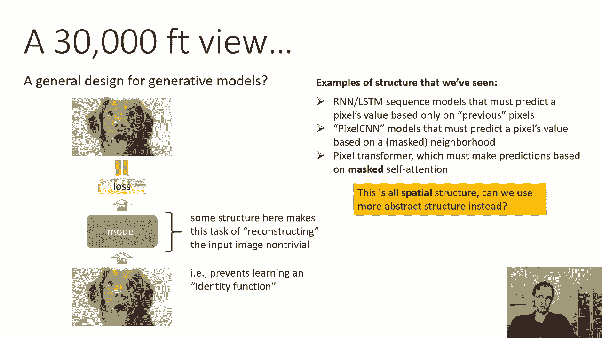

## 自动编码器的通用框架 🔧

我们可以将许多模型（如像素RNN、图像Transformer）视为广义的自动编码器。它们都遵循一个通用模式：输入是数据（如像素），输出是重建的相同数据，中间的结构使得重建任务具有挑战性。

以下是自动编码器通用框架的要点：
*   **输入 (x)**：原始数据，例如图像像素。
*   **编码器 (Encoder)**：一个神经网络，将输入 `x` 映射到**隐藏状态 (h)**。
*   **隐藏状态 (h)**：数据的中间表示，是我们希望学习的有意义特征。
*   **解码器 (Decoder)**：另一个神经网络，从隐藏状态 `h` 重建输出 `x'`。
*   **目标**：最小化重建损失 `L(x, x')`，使输出 `x'` 尽可能接近输入 `x`。

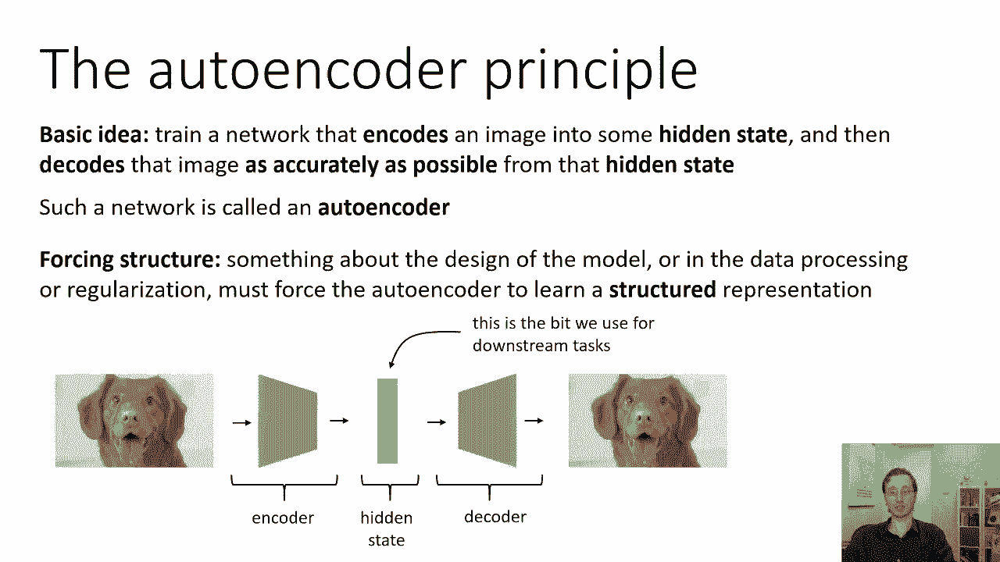

为了使模型学习有意义的 `h`，而非恒等函数，必须在模型设计、数据处理或正则化中引入**结构**。

---

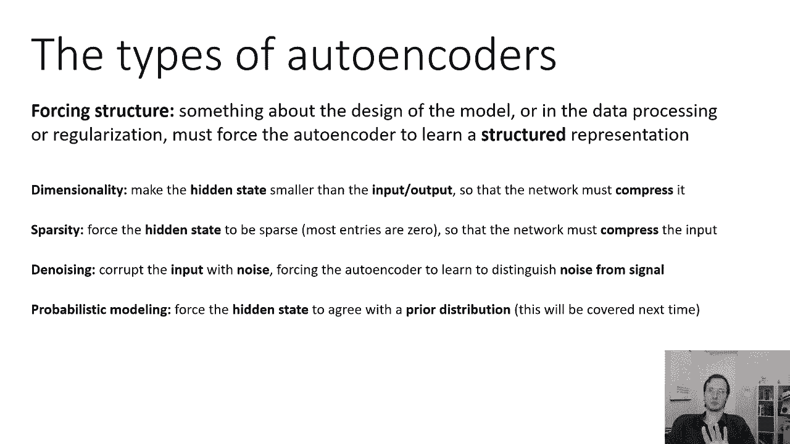

## 强制结构的方法 🛠️

上一节我们介绍了自动编码器的通用框架。本节中，我们来看看几种在隐藏状态 `h` 上强制结构的具体方法。

以下是几种常见的强制结构的方法：
1.  **限制维度 (Bottleneck)**：使隐藏状态 `h` 的维度远小于输入 `x` 的维度。公式表示为：`dim(h) << dim(x)`。这迫使网络压缩信息。
2.  **稀疏性 (Sparsity)**：强制隐藏状态 `h` 中大多数元素为零。这可以通过在损失函数中添加 `L1` 正则化项实现：`Loss = L_reconstruction(x, x') + λ * ||h||_1`。
3.  **去噪 (Denoising)**：用噪声破坏输入，得到 `x̃`，然后训练模型从 `x̃` 重建干净的 `x`。这迫使模型学习区分信号与噪声。
4.  **先验匹配 (Prior Matching)**：强制隐藏状态 `h` 的分布符合某个简单的先验分布（如高斯分布）。这将在后续课程中详细讨论。

---

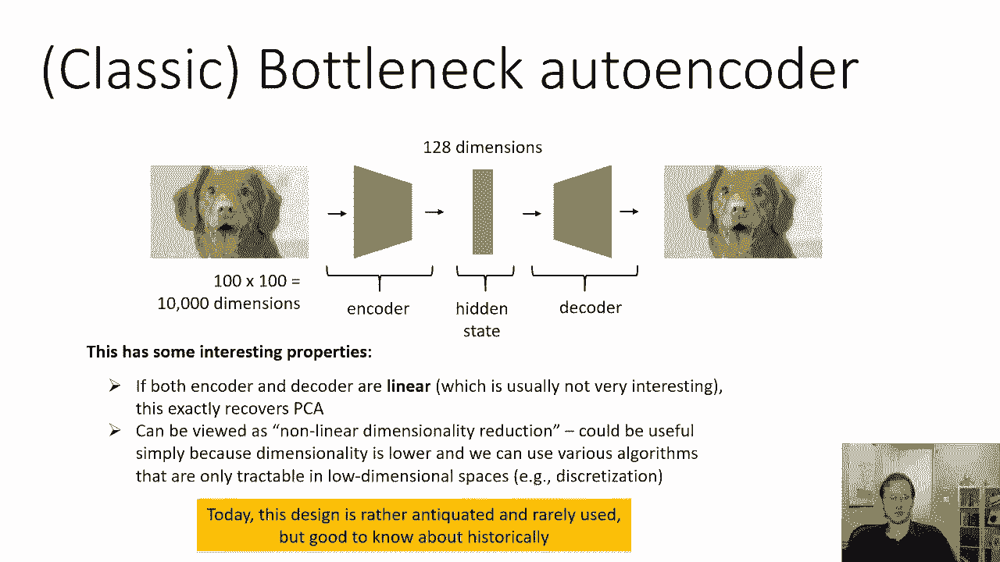

## 瓶颈自动编码器 📦

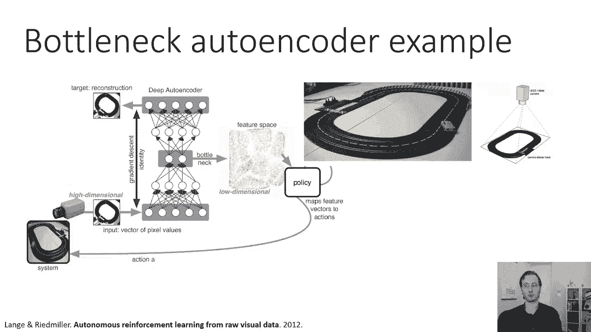

现在，让我们深入了解第一种方法：瓶颈自动编码器。这是最经典的自动编码器之一。

其思想非常简单：无论输入维度多高，都选择一个维度低得多的隐藏状态。例如，对于一个100x100像素（10000维）的图像，将 `h` 限制为仅128维。由于 `h` 无法存储所有像素信息，模型必须学习数据的压缩表示。

一个有趣的数学事实是：如果编码器和解码器都是**线性**的，并使用均方误差损失，那么训练得到的瓶颈自动编码器**等价于主成分分析 (PCA)**，其中 `h` 的维度就是主成分的数量。因此，非线性瓶颈自动编码器可以看作是PCA的非线性推广，用于降维。

虽然这种设计现在被认为有些过时，但在某些需要非线性降维的场景中仍然有用。

---

## 稀疏自动编码器 🌲

接下来，我们探讨第二种方法：稀疏自动编码器。这种方法背后的直觉是：我们能否用一小组“属性”来描述输入？

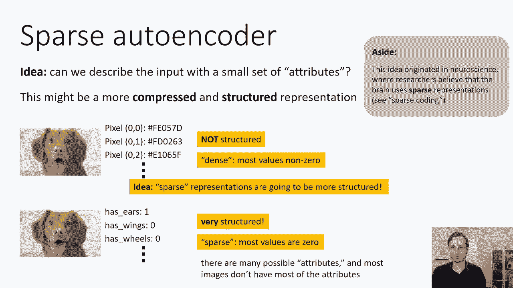

例如，描述一张图像时，与其列出所有像素值，不如列出它是否具有“耳朵”、“轮子”、“翅膀”等属性。对于大多数图像，大多数属性值应为零（例如，汽车没有翅膀）。这种表示是**稀疏的**，并且更有条理、更容易解释。

稀疏自动编码器的目标就是学习这种稀疏的隐藏表示 `h`。与瓶颈自动编码器不同，`h` 的维度可以很高（甚至超过输入维度），但通过损失函数强制其稀疏。

实现稀疏性的一种简单方法是在损失函数中添加 `L1` 正则化项：
`总损失 = 重建损失 + λ * Σ|h_i|`
`L1` 范数的梯度会持续将较小的 `h_i` 推向零，而较大的值由于对重建有用得以保留，最终导致稀疏表示。

---

## 去噪自动编码器 🧼

最后，我们来看第三种广泛使用的方法：去噪自动编码器。其核心思想与BERT的掩码语言模型类似：一个好的模型如果学会了数据的有意义结构，就应该能够“修复”被破坏的输入。

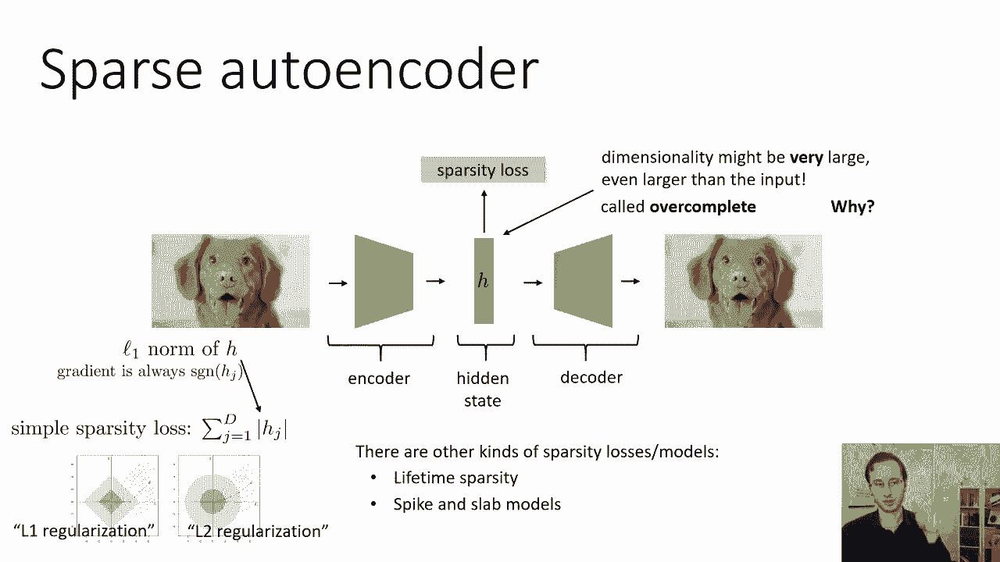

具体操作是：先对输入 `x` 加入噪声（如随机掩盖部分像素），得到损坏版本 `x̃`。然后，训练自动编码器从 `x̃` 重建出原始的干净数据 `x`。为了完成这个任务，模型必须学会区分数据中的真实模式（信号）与随机噪声。

去噪自动编码器实现简单，且能非常有效地学习到稳健的特征表示。像BERT这样的现代模型就可以被视为一种复杂的、针对序列数据的去噪自动编码器。

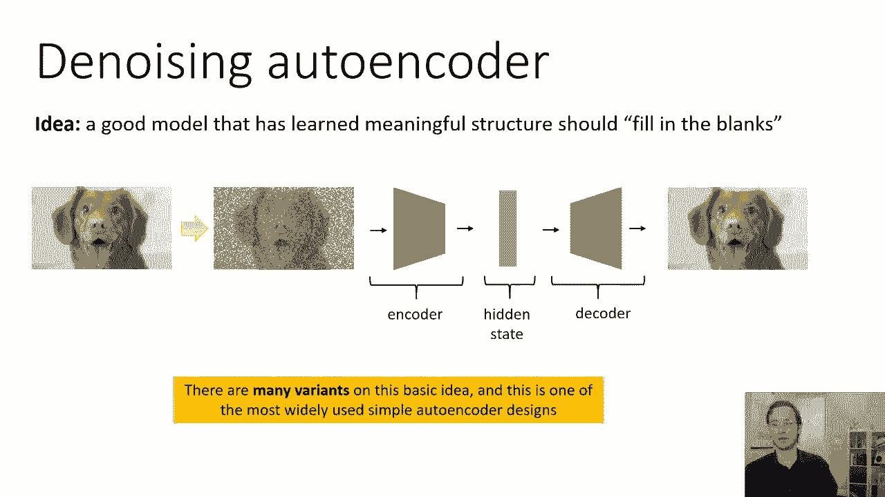

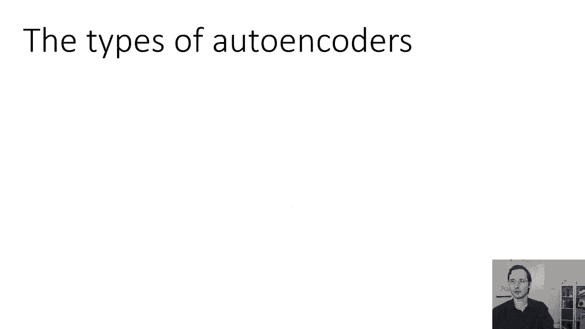

---

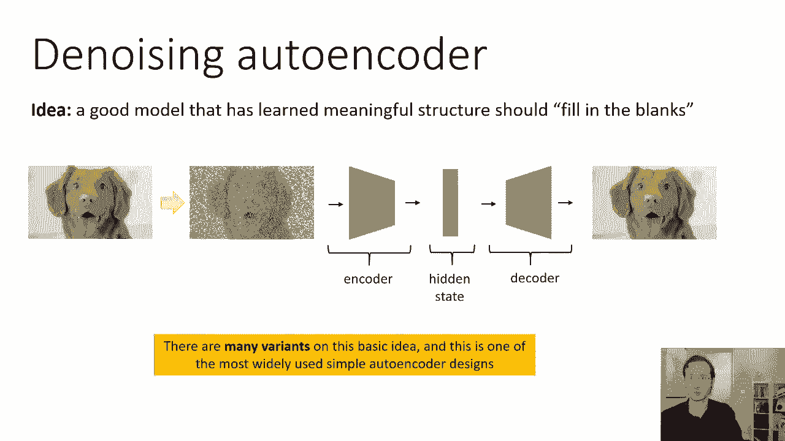

## 总结 📝

本节课中，我们一起学习了自动编码器的基本概念和几种主要类型。

我们首先了解了自动编码器的通用框架：通过编码器-解码器结构重建输入，并依赖内部结构来学习有意义的隐藏表示。

接着，我们详细探讨了三种强制结构的方法：
1.  **瓶颈自动编码器**：通过降低隐藏状态维度来强制压缩，实现降维。
2.  **稀疏自动编码器**：通过 `L1` 等正则化强制隐藏状态稀疏，旨在获得解耦的、类似属性的特征。
3.  **去噪自动编码器**：通过破坏输入再要求重建，迫使模型学习数据的本质结构，是实践中最常用的类型之一。

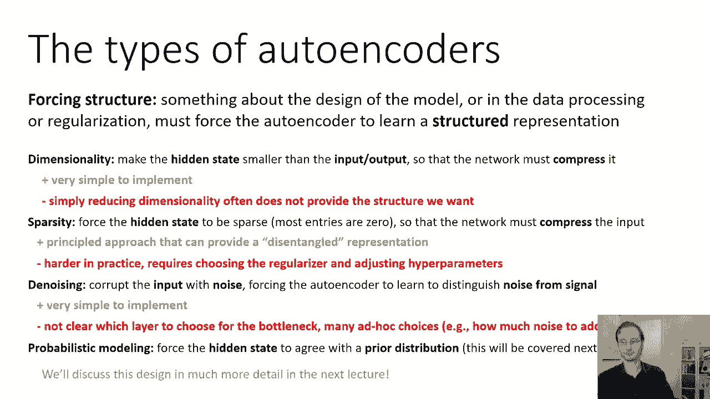

每种方法都有其优缺点和适用场景。理解这些经典方法为我们后续学习更强大的现代生成模型（如变分自动编码器）奠定了坚实的基础。