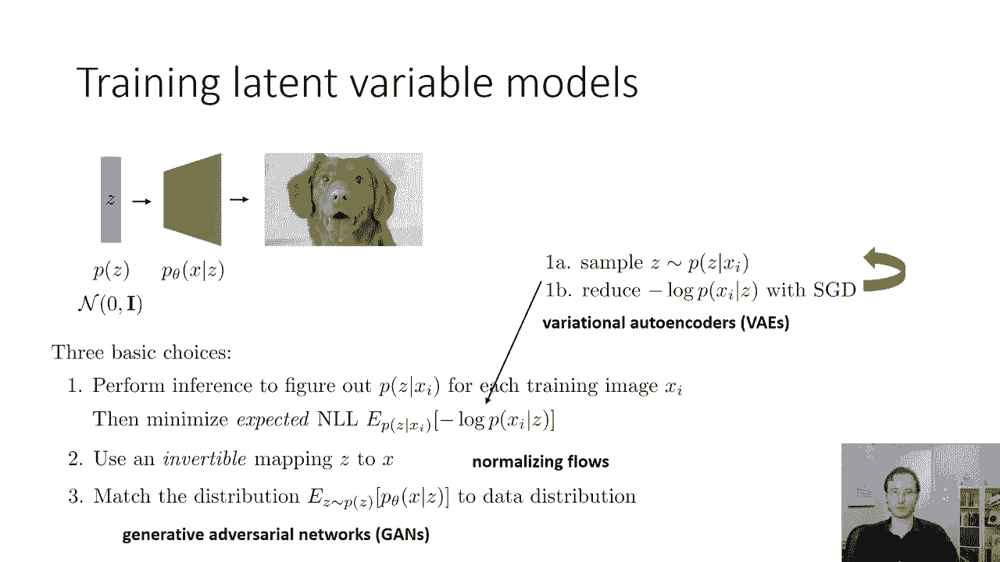
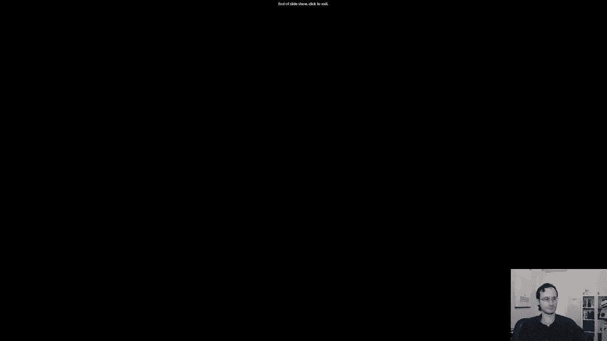

# 53：CS 182 - 第 17 讲 - 第 3 部分 - 生成模型 🧠

在本节课中，我们将要学习生成模型，特别是自动编码器的历史背景及其在现代深度学习中的演变。接着，我们将深入探讨潜在变量模型的基本概念，为后续学习变分自编码器（VAE）和生成对抗网络（GAN）等高级模型打下基础。

## 自动编码器的历史背景与分层预训练 📜

上一节我们介绍了自动编码器的基本工作原理，本节中我们来看看它在深度学习发展早期的一个关键应用。

在深度学习的早期，自动编码器通过一种称为“分层预训练”的技术被广泛使用。这项技术是激发现代深度学习研究的重要原因之一。尽管如今它已不那么常用，但了解其历史背景有助于理解某些反复出现的设计思想。

分层预训练的核心思想是：如何在不进行端到端反向传播的情况下，训练非常深的神经网络。

以下是分层预训练的具体步骤：

1.  从输入数据（如图像）开始，训练一个浅层的自动编码器（例如2-4层）。这个编码器会学习到一个隐藏表示（用蓝色矩形表示）。
2.  使用这个浅层编码器对训练集中的所有图像进行编码，得到对应的隐藏状态。
3.  将这些隐藏状态作为新的输入，在其上训练另一个浅层自动编码器。这个编码器会学习到更抽象的隐藏表示（用绿色矩形表示）。
4.  重复此过程，逐层训练更多的自动编码器，每一层都学习到更高级、更抽象的表示。
5.  将所有浅层编码器组合起来，就构成了一个非常深的编码网络。最后，我们可以对这个深度网络进行端到端的微调，以执行特定的下游任务（如图像分类）。

在早期，这种方法非常有效，因为它能够训练出比单纯使用端到端反向传播更深的网络。然而，随着ReLU激活函数、批量归一化、更好的超参数调优技术（如Adam优化器）的出现，我们能够更有效地直接训练深度网络。因此，分层预训练的重要性逐渐降低，如今更多地被直接端到端的训练方法所取代。

## 自动编码器的现状与应用场景 🔍

上一节我们回顾了自动编码器的历史角色，本节中我们来看看它在当前深度学习领域的定位。

如今，传统的自动编码器（如去噪或稀疏自动编码器）使用得不再那么广泛，因为有更强大的替代方案出现。

*   **对于表征学习**：变分自编码器（VAE，一种概率生成模型）和对比学习等方法，在很大程度上取代了传统的自动编码器。
*   **对于生成任务**：生成对抗网络（GAN）和自回归模型（如PixelRNN）在生成高质量样本方面表现更佳。传统自动编码器难以从中进行采样生成新数据。
*   **对于快速、简单的表征学习**：训练一个去噪自动编码器在计算上仍然非常高效，比训练PixelRNN等模型快几个数量级。因此，如果需要一个快速实现的代理方案，它仍然是一个可行的选择。

传统自动编码器的一个主要限制是**难以从中采样或生成新数据**，这限制了其应用范围。变分自编码器（VAE）通过引入概率框架部分解决了这个问题，使其成为当前应用最广泛的自动编码器变体。

## 潜在变量模型导论 🧩

上一节我们讨论了自动编码器的现状，本节中我们将开始学习生成模型的一个核心框架——潜在变量模型。这将为我们周三学习变分自编码器（VAE）奠定基础。

### 什么是潜在变量？

在之前的概率模型中（如 `p(x)` 或 `p(y|x)`），唯一的随机变量是观测到的 `x` 和 `y`。潜在变量模型则引入了未被观测到的随机变量 `z`，它代表了数据生成过程中的一些隐藏因素。

一个经典的例子是**高斯混合模型**。假设我们观测到的数据点形成了三个簇（如下图），但模型并不知道这些簇的存在。我们可以引入一个潜在变量 `z`，它是一个有三个取值的分类变量，分别代表属于红色、品红色或绿色簇。数据的分布 `p(x)` 就可以表示为在所有可能 `z` 值上，条件分布 `p(x|z)` 的加权和。

`p(x) = Σ_{z} p(x|z) * p(z)`

### 为何使用潜在变量模型？

假设数据 `x` 的分布 `p(x)` 非常复杂（例如，自然图像的分布），难以直接用简单的分布（如单个高斯分布）来建模。

潜在变量模型的思路是：**通过组合简单的分布来建模复杂的分布**。具体做法是：
1.  为潜在变量 `z` 设定一个简单的先验分布 `p(z)`，例如标准正态分布。
2.  定义一个由神经网络参数化的条件分布 `p_θ(x|z)`。这个分布本身可以很简单（例如高斯分布），但其参数（均值和方差）是 `z` 的复杂函数。

这样，复杂的 `p(x)` 就被表示为：
`p(x) = ∫ p_θ(x|z) * p(z) dz`
我们将建模的复杂性从分布本身转移到了确定性的映射函数（神经网络）上，而这是我们所擅长的。

### 如何训练潜在变量模型？⚙️

我们通常使用最大似然估计来训练概率模型，即最大化训练数据的对数似然：
`max_θ Σ_i log p_θ(x_i)`
然而，对于潜在变量模型，`p_θ(x_i) = ∫ p_θ(x_i|z) * p(z) dz` 这个积分通常没有解析解，难以直接计算。

实践中，我们常使用**期望对数似然**作为替代目标。其核心直觉是：既然数据集中没有 `z`，我们就根据当前模型“猜测”每个 `x_i` 对应的最可能的 `z` 是什么，然后基于这个猜测来优化模型。这涉及到估计后验分布 `p(z|x)`，这个过程被称为**概率推断**。

解决概率推断是训练潜在变量模型的主要挑战。周三我们将学习一种非常流行的方法——**变分推断**，它是变分自编码器（VAE）训练的核心。

## 深度学习中的潜在变量模型 🖼️

上一节我们介绍了潜在变量模型的抽象概念，本节中我们来看看它在深度学习中的具体实现形式。

在深度学习中，一个潜在变量生成模型通常包含以下两部分：
1.  **先验分布 `p(z)`**：通常设定为一个简单的分布，如多维标准正态分布。`z` 是一个随机向量。
2.  **解码器（生成器）**：一个神经网络，它将潜在向量 `z` 映射到数据 `x` 上的一个分布 `p_θ(x|z)`。

**生成新样本的机械过程非常简单**：
1.  从先验分布 `p(z)` 中采样一个随机向量 `z`（例如，生成一组服从标准正态分布的随机数）。
2.  将 `z` 输入解码器神经网络。
3.  解码器输出定义了数据 `x` 上的分布（例如，每个像素的RGB值），从这个分布中采样，即可得到一个新样本（如图像）。

### 如何表示 `p_θ(x|z)`？

这取决于数据的类型：
*   **连续值数据（如图像像素归一化到[0,1]）**：通常使用**对角协方差多元高斯分布**。解码器为每个像素输出一个均值 `μ`（和可选的方差 `σ`）。为简化，方差常被设为固定值，此时训练目标简化为均方误差（MSE）。
*   **离散值数据（如8位图像像素）**：可以为每个像素输出一个256路的softmax分布（类似于PixelRNN），但所有像素在给定 `z` 的条件下被假设为相互独立。

### 使用什么网络架构？

解码器的架构选择很重要：
*   **小型图像或非图像数据**：使用全连接网络（一系列线性层加激活函数）通常是足够的。
*   **大型、复杂图像**：更佳的选择是使用**转置卷积网络**。首先通过全连接层将 `z` 向量转换为低分辨率特征图，然后通过一系列转置卷积层进行上采样，逐步提高分辨率，最终生成完整图像。

### 训练方法概览

训练潜在变量模型主要有三种范式，我们将在周三深入探讨：
1.  **变分自编码器（VAE）**：通过变分推断来近似后验分布 `p(z|x)`，并最大化一个被称为证据下界（ELBO）的似然下界。
2.  **标准化流（Normalizing Flows）**：学习一个从 `z` 到 `x` 的可逆映射，使得概率密度的计算变得容易。
3.  **生成对抗网络（GAN）**：不显式建模每个 `x` 对应的 `z`，而是训练一个生成器，使其生成的样本分布与真实数据分布尽可能匹配，通过一个判别器来提供训练信号。

## 总结 📝

本节课中我们一起学习了生成模型的重要基础。我们首先回顾了自动编码器通过分层预训练在深度学习历史上的作用，并分析了其当前的应用场景。随后，我们深入探讨了潜在变量模型的核心思想：通过引入简单的潜在变量分布和由神经网络参数化的条件分布，来建模复杂的数据分布。我们还了解了其基本表示形式和训练所面临的核心挑战（概率推断）。最后，我们概述了在深度学习中实现潜在变量模型的几种流行方法（VAE、标准化流、GAN），为接下来的课程做好了准备。