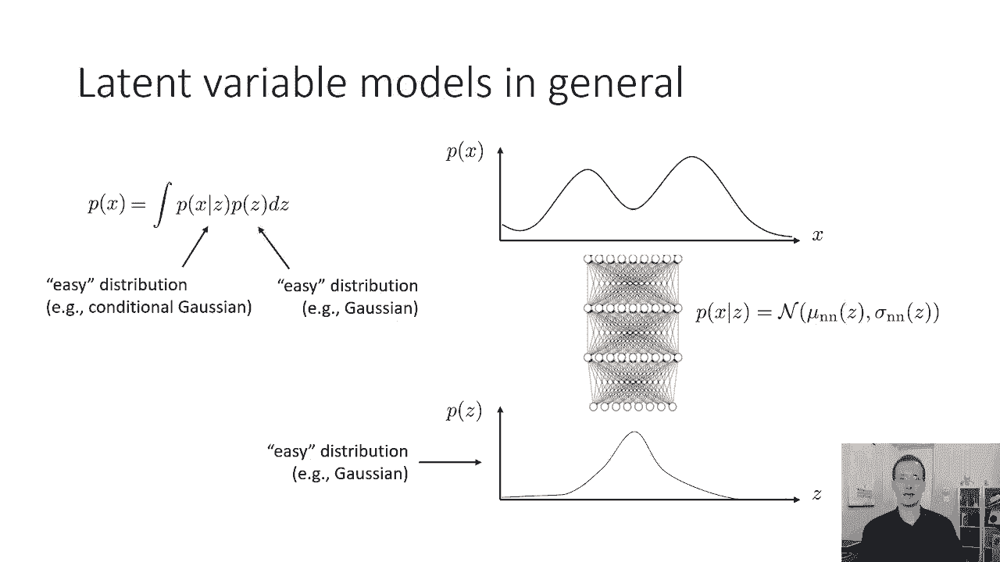
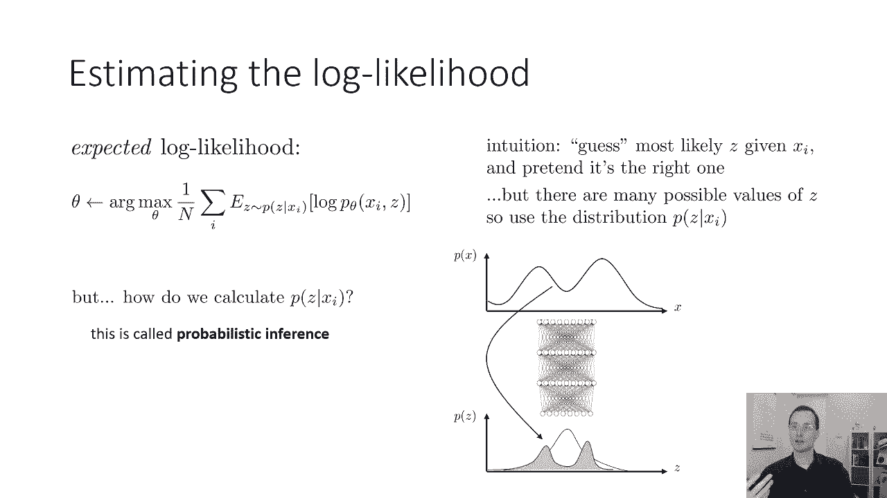
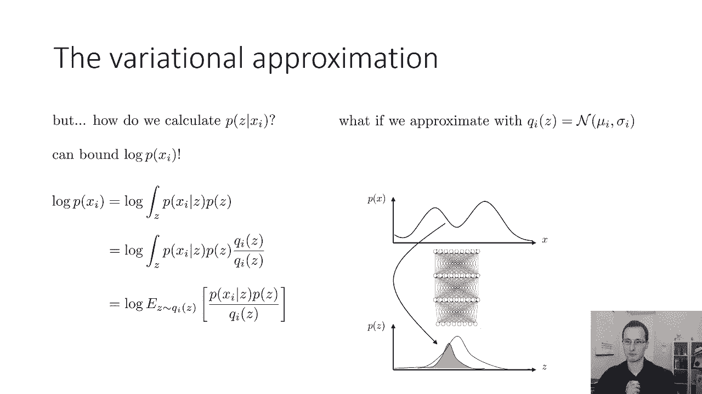
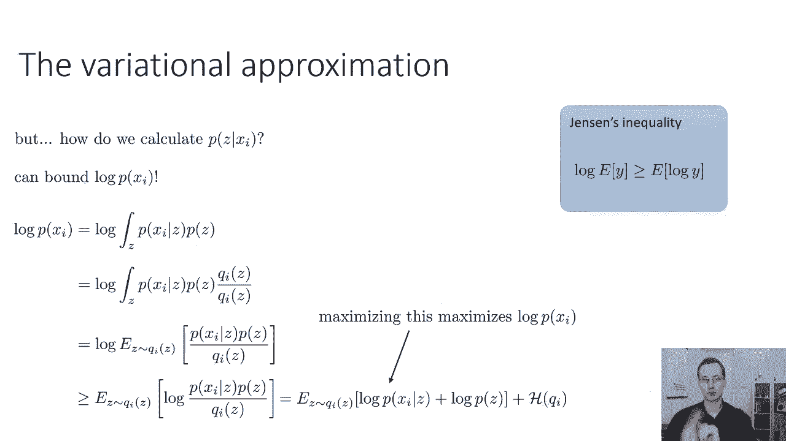
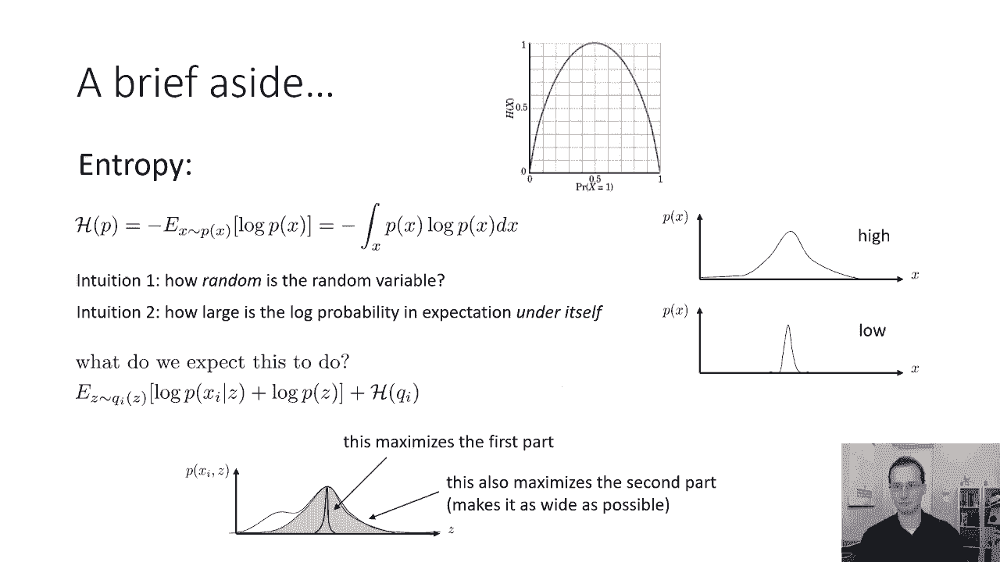
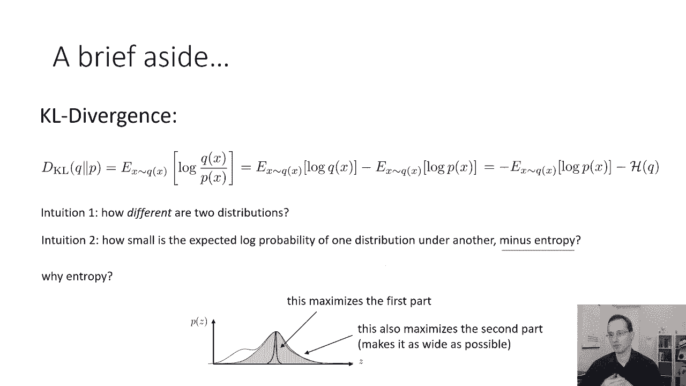
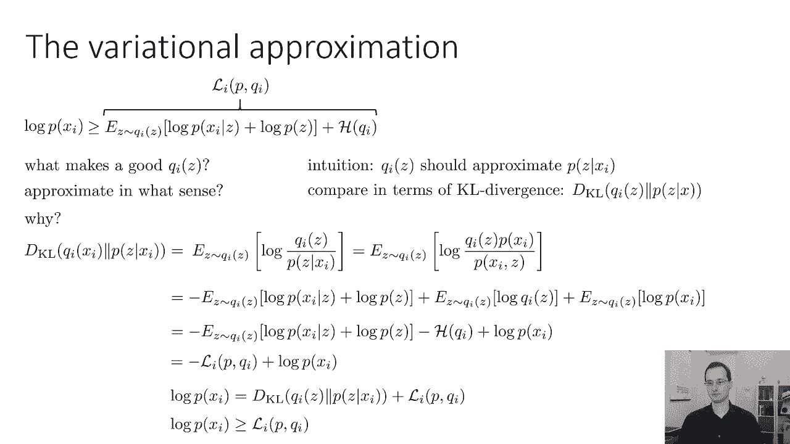
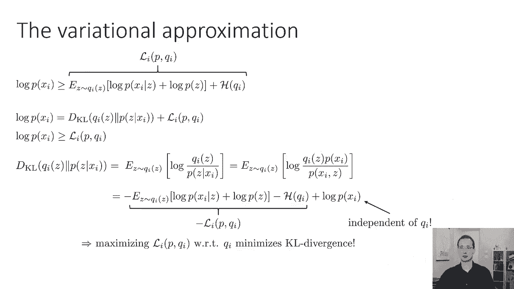
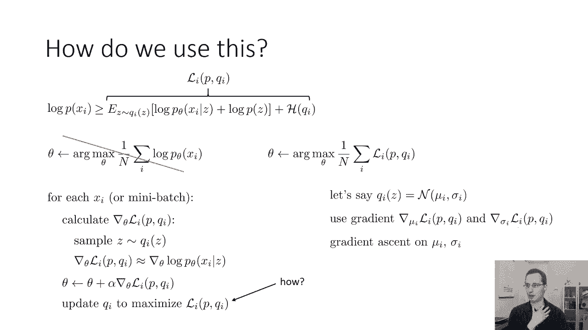
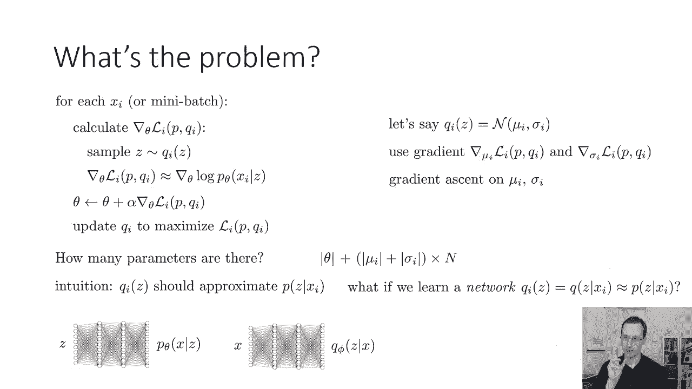

# 54：CS 182 第 18 课 - 第 1 部分：潜在变量模型 🧠

在本节课中，我们将继续讨论生成模型，重点介绍**潜在变量模型**。我们将探讨**变分自编码器**和另一种称为**标准化流**的模型。我们将学习如何通过变分近似来训练这些复杂的模型，并理解其背后的数学原理。

---

## 回顾：潜在变量模型

上一节我们介绍了生成模型。本节中，我们来看看如何用潜在变量模型表示复杂分布。

潜在变量模型的核心思想是：我们不再直接对复杂数据 `x` 的分布 `p(x)` 建模，而是引入一个更简单的潜在变量 `z`（例如，一个简单的单峰高斯分布）。然后，我们假设在给定 `z` 的条件下，`x` 的分布 `p(x|z)` 是一个简单的分布（如高斯分布），但其参数（均值和方差）是 `z` 的复杂函数（通常由神经网络表示）。

**公式表示：**
- 先验分布：`p(z)`，例如 `z ~ N(0, I)`
- 条件分布：`p(x|z) = N(μ(z; θ), σ(z; θ))`，其中 `μ` 和 `σ` 是神经网络函数。

这样，`x` 的边缘分布 `p(x)` 由积分给出：
`p(x) = ∫ p(x|z) p(z) dz`

从 `z` 采样生成 `x` 很容易：先采样 `z`，再从 `p(x|z)` 采样 `x`。然而，训练模型需要计算或估计这个积分，这通常很困难。

---

## 变分近似与证据下界

为了训练模型，我们避免直接计算棘手的积分，转而使用**期望对数似然**。其直觉是：我们不知道每个数据点 `x_i` 对应的真实潜在变量 `z`，因此我们“猜测” `z` 的可能值，并最大化 `x` 和 `z` 的联合概率。

这个“猜测”过程称为**推断**，即估计给定 `x` 时 `z` 的后验分布 `p(z|x)`。推断本身通常也很困难。因此，我们采用**变分近似**：用一个更简单、易于处理的分布 `q_i(z)` 来近似真实后验 `p(z|x_i)`。

对于任何选择 `q_i(z)`，我们可以推导出对数似然 `log p(x_i)` 的一个下界，称为**证据下界**。

**推导过程：**
1.  引入变分分布 `q_i(z)`，并利用 Jensen 不等式：
    `log p(x_i) = log ∫ p(x_i|z) p(z) dz = log E_{z~q_i(z)} [p(x_i|z)p(z) / q_i(z)]`
    `≥ E_{z~q_i(z)} [log (p(x_i|z)p(z) / q_i(z))]`
    这个下界记为 `L_i`。

2.  展开 `L_i`：
    `L_i = E_{z~q_i(z)} [log p(x_i|z)] + E_{z~q_i(z)} [log p(z)] - E_{z~q_i(z)} [log q_i(z)]`
    其中，最后一项是 `q_i(z)` 的**负熵**。

**核心概念：**
- **证据下界**：`L_i(p, q_i) = E_{z~q_i(z)} [log p(x_i|z) + log p(z) - log q_i(z)]`
- 最大化 `L_i` 会同时：
    1.  提高数据的对数似然 `log p(x_i)`。
    2.  减小 `q_i(z)` 与真实后验 `p(z|x_i)` 之间的 KL 散度，使下界更紧。

---

## 信息论概念：熵与 KL 散度

为了深入理解证据下界，我们需要了解两个信息论概念。

**熵**衡量一个分布的随机性。对于分布 `p(x)`，其微分熵定义为：
`H(p) = -E_{x~p(x)} [log p(x)]`
熵越高，分布越均匀、越不确定；熵为零意味着分布是确定性的。

**KL 散度**衡量两个分布 `q(x)` 和 `p(x)` 之间的差异：
`D_KL(q || p) = E_{x~q(x)} [log (q(x) / p(x))] = -H(q) - E_{x~q(x)} [log p(x)]`
KL 散度总是非负的，且当 `q = p` 时为零。

证据下界 `L_i` 与 KL 散度的关系为：
`log p(x_i) = L_i(p, q_i) + D_KL(q_i(z) || p(z|x_i))`
由于 KL 散度非负，`L_i` 是 `log p(x_i)` 的确切下界。最大化 `L_i` 会推动 `log p(x_i)` 上升，同时最小化 `q_i(z)` 与真实后验之间的 KL 散度。

---

## 训练变分模型

上一节我们建立了理论框架。本节中，我们来看看如何将其转化为可行的训练算法。

我们的目标是最大化所有数据点的证据下界之和。这涉及对模型参数 `θ`（生成网络 `p_θ(x|z)`）和变分参数 `φ_i`（每个数据点的近似后验 `q_i(z)`）进行优化。

**传统变分推断方法：**
为数据集中每个点 `x_i` 单独维护一组变分参数（如高斯分布的均值 `μ_i` 和方差 `σ_i`）。然后通过梯度上升同时更新 `θ` 和所有 `{μ_i, σ_i}`。

**此方法的局限性：**
参数数量与数据集大小成正比。对于大型数据集（数百万样本），需要维护数百万个 `(μ_i, σ_i)` 对，这非常低效且难以扩展。

---

## 摊余变分推断与变分自编码器

为了解决参数过多的问题，我们引入**摊余变分推断**。其核心思想是：不再为每个数据点单独学习变分参数，而是训练一个**推断网络** `q_φ(z|x)`，它是一个神经网络，输入数据 `x`，直接输出近似后验 `q(z|x)` 的参数（如均值和方差）。

这样，我们只需要学习推断网络的参数 `φ` 和生成网络的参数 `θ`，参数数量是固定的，与数据集大小无关。

**变分自编码器**正是基于此思想构建的：
- **编码器（推断网络）**：`q_φ(z|x)`，将数据 `x` 映射到潜在空间分布。
- **解码器（生成网络）**：`p_θ(x|z)`，将潜在变量 `z` 映射回数据空间。

训练时，我们最大化所有数据点的证据下界 `L(θ, φ)`。其梯度可以通过从 `q_φ(z|x_i)` 采样 `z`，并使用**重参数化技巧**来得到低方差的梯度估计，从而用随机梯度下降进行优化。

---

## 总结

本节课我们一起学习了潜在变量模型的核心思想与训练方法。

1.  **潜在变量模型**通过引入简单潜在变量 `z` 和条件分布 `p(x|z)` 来建模复杂数据分布 `p(x)`。
2.  **变分近似**通过一个简单的分布 `q(z)` 来近似难以计算的后验分布 `p(z|x)`。
3.  **证据下界**为对数似然提供了一个可优化的下界，最大化它等价于同时提高数据似然和 tighten 变分近似。
4.  **摊余变分推断**通过一个共享的推断网络 `q_φ(z|x)` 来预测所有数据点的变分参数，极大地提升了效率，并构成了**变分自编码器**的基础。

在下一部分，我们将深入探讨变分自编码器的具体实现细节和训练技巧。