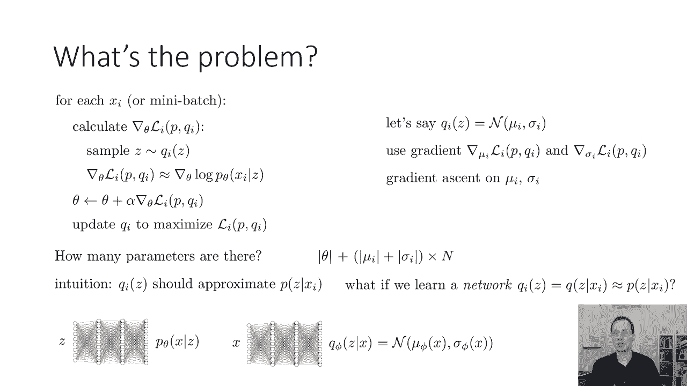
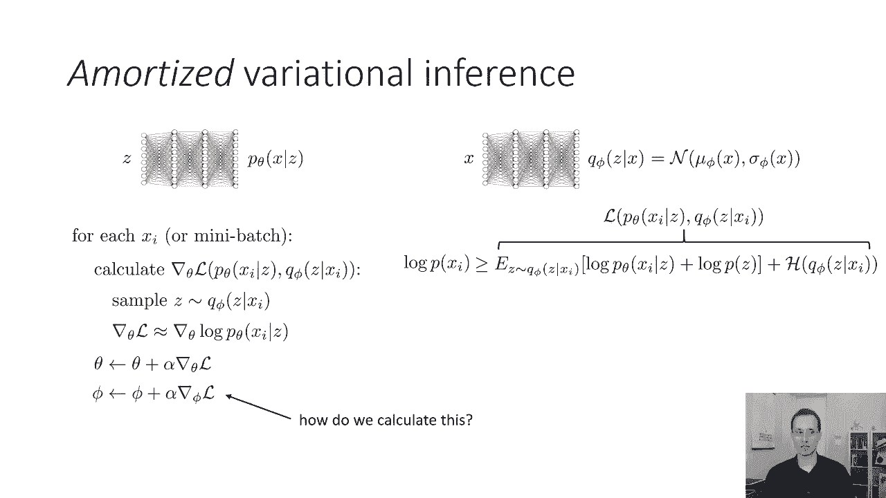
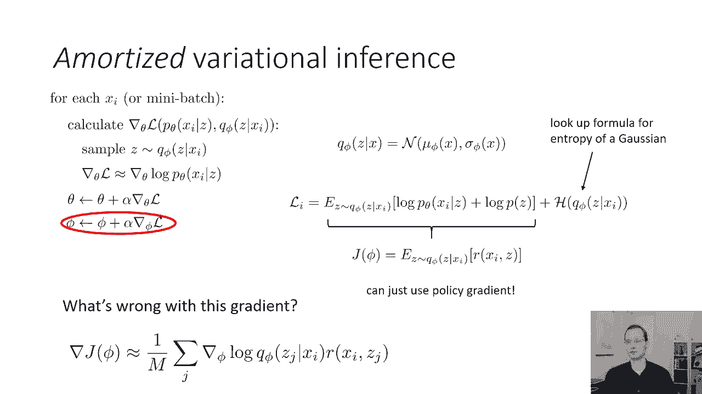
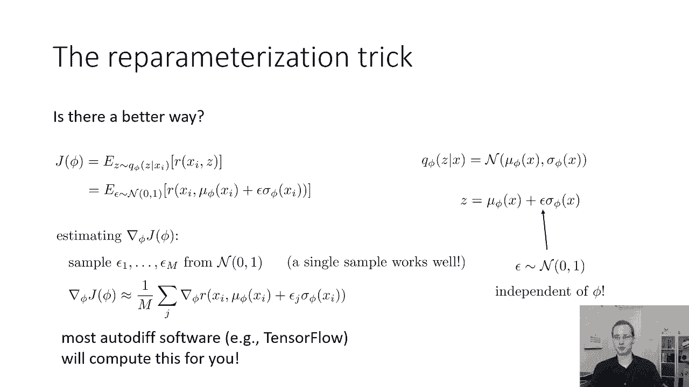
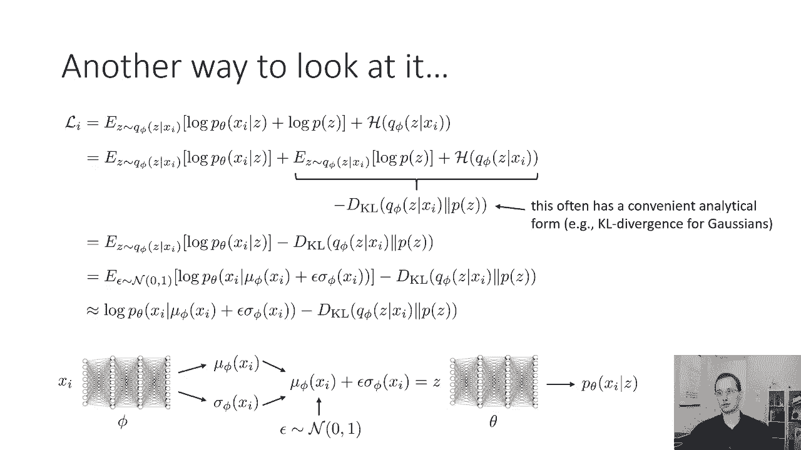
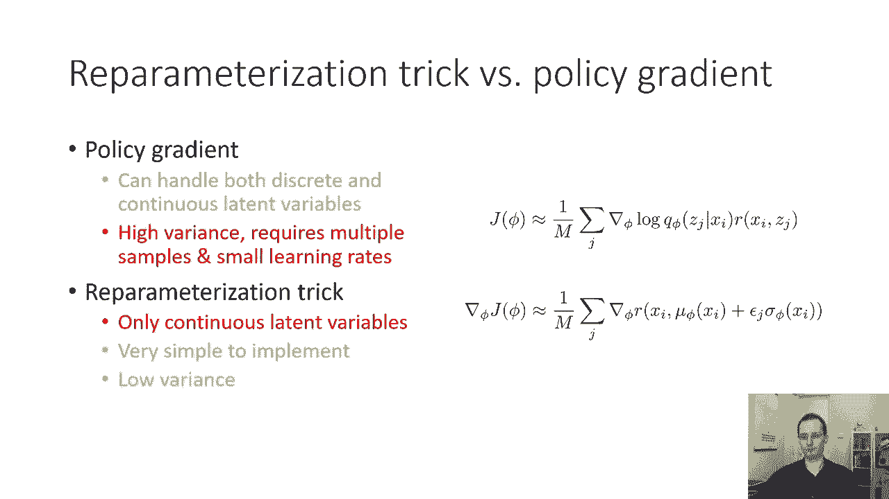

# 55：CS 182 第 18 讲 - 第 2 部分：潜在变量模型 🧠

在本节课中，我们将要学习一种名为**摊销变分推理**的方法，用于训练潜在变量模型。我们将探讨如何通过神经网络来分摊推理的计算负担，并详细介绍其核心算法——**变分自编码器**的实现。

---

## 第一部分：从正则变分推理到摊销推理 🔄

在上一部分，我们讨论了正则变分推理是训练潜在变量模型的一种可行方法。但是，如果我们需要为数据集中的每个数据点 `x_i` 单独存储一个变分分布 `q(z_i)` 的均值和方差，当数据集很大时，存储量会非常巨大。

为了解决这个问题，本节我们将讨论一种名为**摊销变分推理**的方法。之所以称为“摊销”，是因为我们不再为每个数据点单独表示均值和方差，而是将推理的挑战分摊到所有数据点上。具体做法是使用一个神经网络来为我们进行推理。

因此，我们实际上有两个神经网络：
1.  一个生成模型 `p_θ(x|z)`，参数为 `θ`。
2.  一个推理网络 `q_φ(z|x)`，参数为 `φ`，它试图预测给定输入 `x` 时潜在变量 `z` 的分布。具体来说，它会输出 `z` 的均值 `μ_φ(x)` 和方差 `σ_φ(x)`。

这意味着我们不再为每个数据点存储单独的均值和方差，而是训练一个神经网络来输出这些参数。

---

## 第二部分：摊销变分推理的目标函数 📈

上一节我们介绍了摊销推理的基本思想，本节中我们来看看其目标函数。我们使用**证据下界**作为优化目标。

我们之前推导的证据下界表达式为：
`ELBO = E_{q(z_i)}[log p_θ(x_i|z_i)] - KL(q(z_i) || p(z))`

在摊销推理中，我们用 `q_φ(z|x_i)` 替换了 `q(z_i)`。因此，新的证据下界为：
`ELBO(θ, φ) = E_{q_φ(z|x_i)}[log p_θ(x_i|z)] - KL(q_φ(z|x_i) || p(z))`

训练过程如下：
1.  计算证据下界关于参数 `θ` 和 `φ` 的梯度。
2.  使用梯度上升步骤更新参数。

计算关于 `θ` 的梯度相对简单，可以通过反向传播完成。然而，计算关于 `φ` 的梯度则更具挑战性，因为 `φ` 出现在我们计算期望的分布参数中。

---

## 第三部分：计算梯度的挑战与方法 ⚙️

上一节我们提到了计算 `φ` 梯度的挑战，本节中我们来看看具体的解决方法。证据下界中关于 `φ` 的梯度出现在两部分：
1.  期望项 `E_{q_φ(z|x_i)}[log p_θ(x_i|z)]`。
2.  KL散度项 `KL(q_φ(z|x_i) || p(z))`。

KL散度项通常有解析解（特别是当 `q_φ` 和 `p(z)` 都是高斯分布时），其梯度容易处理。困难在于期望项的梯度。

一种计算期望项梯度的方法是使用**策略梯度**方法。我们可以将期望项重写为 `E_{q_φ(z|x_i)}[r(x_i, z)]`，其中 `r(x_i, z) = log p_θ(x_i|z)`。这与强化学习中的目标函数形式相同，因此可以使用策略梯度定理来估计梯度：
`∇_φ E_{q_φ(z|x_i)}[r(x_i, z)] ≈ (1/N) Σ_j r(x_i, z_j) ∇_φ log q_φ(z_j | x_i)`

然而，这种方法的缺点是梯度估计的**方差很大**，可能需要大量样本才能获得准确的估计，计算成本较高。

---

## 第四部分：重参数化技巧 🎯

上一节我们介绍了策略梯度方法及其高方差问题，本节中我们来看一个更优的解决方案——**重参数化技巧**。

我们的目标是计算 `∇_φ E_{q_φ(z|x_i)}[log p_θ(x_i|z)]`。由于 `q_φ(z|x_i)` 是高斯分布，我们可以将采样过程重参数化：
`z = μ_φ(x_i) + ε ⊙ σ_φ(x_i)`
其中，`ε ~ N(0, I)` 是一个标准高斯噪声，`⊙` 表示逐元素相乘。

通过这种重参数化，`z` 成为了 `φ` 和确定性的噪声 `ε` 的确定性函数。因此，期望可以改写为：
`E_{q_φ(z|x_i)}[log p_θ(x_i|z)] = E_{ε~N(0,I)}[log p_θ(x_i | μ_φ(x_i) + ε ⊙ σ_φ(x_i))]`

现在，期望所基于的分布 `N(0, I)` 不再依赖于参数 `φ`。这样，我们就可以将梯度算子移入期望内部：
`∇_φ E[...] = E_{ε~N(0,I)}[∇_φ log p_θ(x_i | μ_φ(x_i) + ε ⊙ σ_φ(x_i))]`

我们可以通过以下步骤估计这个梯度：
1.  从 `N(0, I)` 中采样一个（或少量）噪声样本 `ε`。
2.  计算 `z = μ_φ(x_i) + ε ⊙ σ_φ(x_i)`。
3.  计算目标函数 `log p_θ(x_i | z)`。
4.  使用自动微分（如 TensorFlow 或 PyTorch）计算该目标函数关于 `φ` 的梯度。

这种方法梯度估计的方差远低于策略梯度方法。

---

## 第五部分：变分自编码器的实现 🏗️

上一节我们学习了重参数化技巧的理论，本节中我们来看看如何将其组合起来，实现一个完整的模型——**变分自编码器**。

变分自编码器的证据下界目标函数可以写为：
`L(θ, φ; x_i) = E_{ε~N(0,I)}[log p_θ(x_i | z)] - KL(q_φ(z|x_i) || p(z))`
其中 `z = μ_φ(x_i) + ε ⊙ σ_φ(x_i)`。

以下是实现步骤：
1.  **编码器网络（推理网络）** `q_φ(z|x)`：输入 `x_i`，输出均值 `μ_φ(x_i)` 和对数方差 `log σ_φ^2(x_i)`（通常输出对数方差以保证正值）。
2.  **采样**：生成噪声 `ε ~ N(0, I)`，计算 `z = μ_φ + ε * exp(0.5 * log σ_φ^2)`。
3.  **解码器网络（生成网络）** `p_θ(x|z)`：输入 `z`，输出重构的 `x` 或其分布参数（例如，对于二值图像输出伯努利参数，对于连续值输出高斯均值）。
4.  **计算损失**：
    *   重构损失：`log p_θ(x_i | z)`。
    *   KL散度损失：`KL(N(μ_φ, σ_φ^2) || N(0, I))`，此项有解析解。
5.  **优化**：使用自动微分计算总损失 `L` 关于 `θ` 和 `φ` 的梯度，并用梯度上升（或Adam等优化器）更新参数。

其网络结构类似于一个自编码器，因此得名“变分自编码器”。编码器将数据映射到潜在空间，解码器从潜在空间重构数据，但中间加入了随机性（通过 `ε`）来模拟概率分布。

---

## 第六部分：方法对比与总结 📊

在本课程中，我们一起学习了摊销变分推理和变分自编码器。最后，我们来对比一下两种梯度估计方法：

*   **策略梯度方法**：
    *   **优点**：可以处理**离散**和连续的潜在变量。
    *   **缺点**：梯度估计**方差高**，可能需要更多样本和更小的学习率。

*   **重参数化技巧**：
    *   **优点**：实现**简单**，梯度估计**方差低**，更高效稳定。
    *   **缺点**：仅适用于**连续**的潜在变量（且通常要求分布易于重参数化，如高斯分布）。

在实践中，对于连续的潜在变量模型（如VAE），**重参数化技巧是首选方法**。它使得我们可以像训练普通神经网络一样，用反向传播高效地训练复杂的概率生成模型。

**总结**：本节课我们深入探讨了摊销变分推理，它通过神经网络分摊了推理成本。我们重点介绍了**重参数化技巧**，该技巧通过将随机采样过程转化为确定性计算，使得梯度计算变得高效且低方差，从而实现了**变分自编码器**这一强大且流行的生成模型。