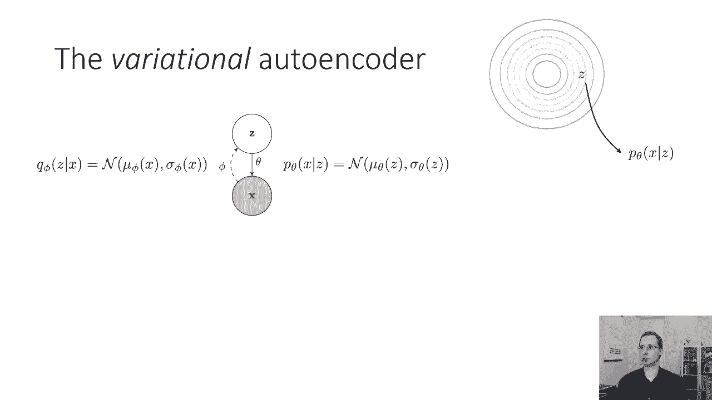
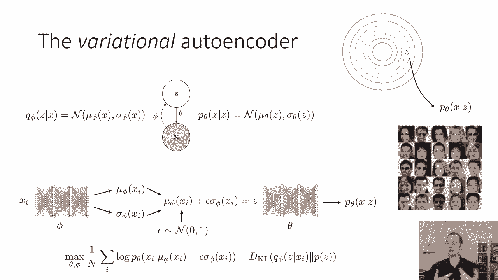
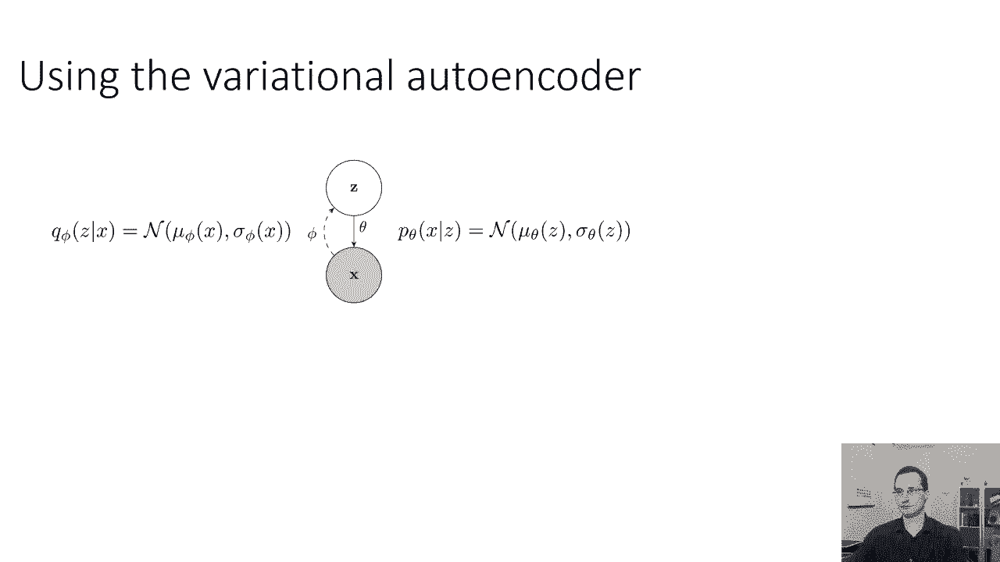
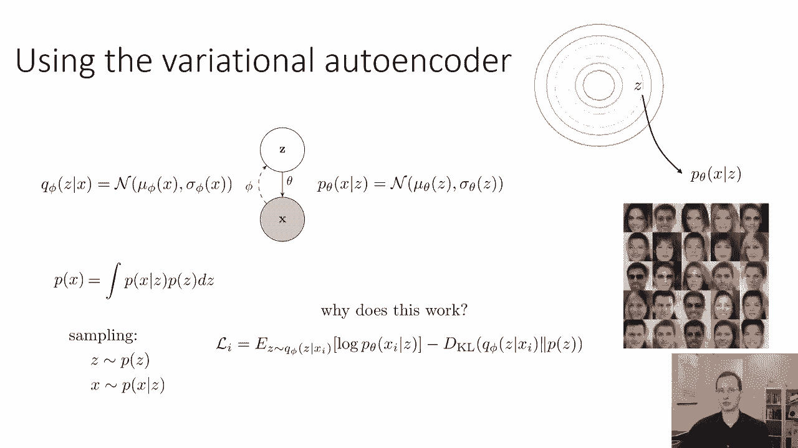
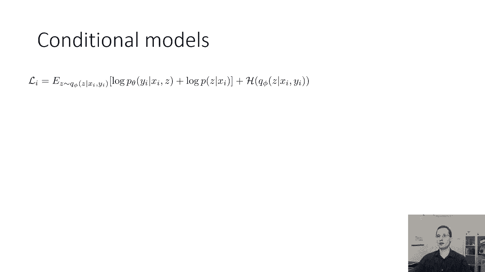
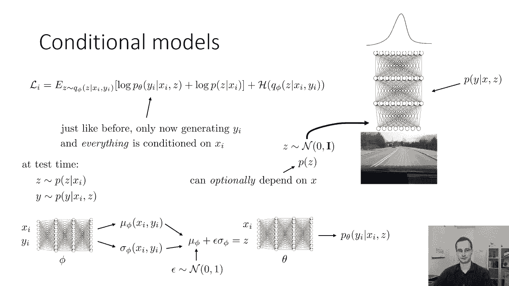
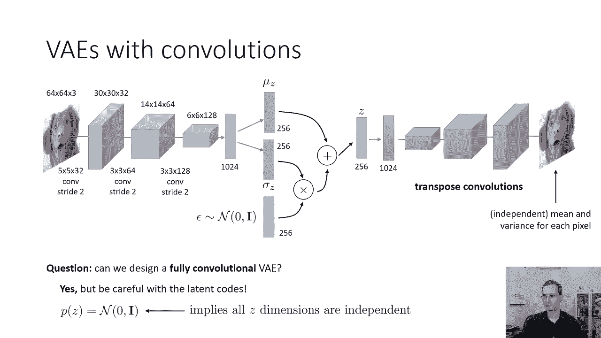
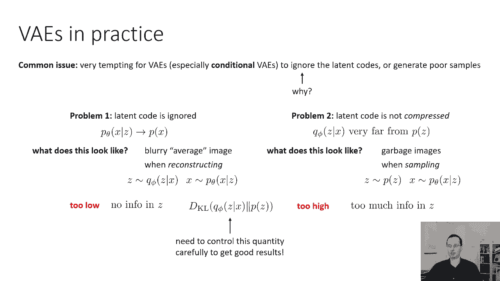
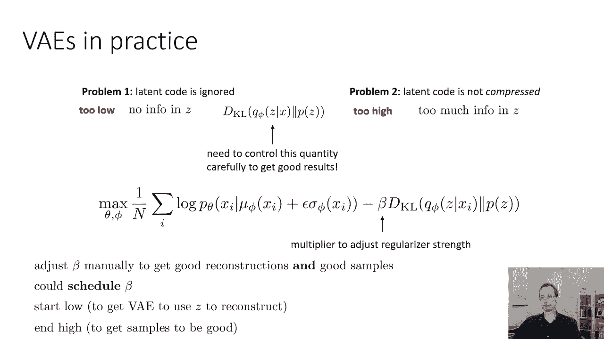

# 56：CS 182 第 18 讲第 3 部分 - 变分自编码器 🧠

在本节课中，我们将学习变分自编码器的完整架构、工作原理、训练目标以及如何将其应用于条件生成任务。我们还将探讨其网络结构设计、实践中常见的问题及其解决方案。



---

## 变分自编码器架构 🏗️

变分自编码器是一种潜变量模型。它假设潜变量 **z** 服从高斯先验分布，并观测到变量 **x**（例如一张图像）。该模型包含一个用于推理的编码器 **q** 和一个用于生成的解码器 **p**。

编码器 **q(z|x)** 是一个神经网络，它接收输入 **x**，并输出潜变量 **z** 的均值 **μ** 和方差 **σ²**。解码器 **p(x|z)** 接收一个从潜变量分布中采样的 **z**，并输出观测变量 **x** 的分布参数（例如图像中每个像素的均值和方差）。

**潜变量采样公式**：
```
z = μ + ε ⊙ σ
```
其中 **ε** 是从标准正态分布中采样的噪声向量，**⊙** 表示逐元素相乘。





训练完成后，变分自编码器可用于生成新图像。这与去噪自编码器或瓶颈自编码器不同，后者主要学习数据表示，但不具备良好的生成能力。

---



## 训练目标与直觉 🎯



变分自编码器的训练目标由两部分组成。第一部分类似于自编码器的重构损失，第二部分是 KL 散度正则项。

**目标函数**：
```
L(θ, φ; x) = E_{z∼q_φ(z|x)}[log p_θ(x|z)] - β * D_KL(q_φ(z|x) || p(z))
```

上一节我们介绍了变分自编码器的基本架构，本节中我们来看看其训练目标的直观理解。

目标的第一部分鼓励模型从潜变量 **z** 准确地重构出输入 **x**。第二部分，即 KL 散度项，惩罚了编码分布 **q_φ(z|x)** 与先验分布 **p(z)**（通常是标准正态分布）之间的差异。



这种设计带来了一个关键直觉：KL 散度项鼓励编码器产生的 **z** 分布与从先验 **p(z)** 中采样的分布相似。这样，在测试生成时，如果从先验 **p(z)** 中采样，解码器也会对这类 **z** 感到“熟悉”，从而能够生成合理的图像。

---

## 条件变分自编码器 🔄

我们还可以训练条件变分自编码器，这实际上相当简单。如果我们希望建立一个模型，在给定输入 **x** 的条件下，输出变量 **y** 的分布 **p(y|x)** 可能很复杂。

此时，我们的直觉是：虽然 **p(y|x)** 复杂，但 **p(y|x, z)** 在给定潜变量 **z** 后可能变得简单。因此，解码器变为 **p_θ(y|x, z)**，编码器变为 **q_φ(z|x, y)**。所有操作都与之前相同，只是现在生成 **y**，且所有过程都以 **x** 为条件。

以下是条件变分自编码器的架构要点：
*   编码器接收 **x** 和 **y**，输出 **μ** 和 **σ**。
*   采样得到 **z = μ + ε ⊙ σ**。
*   解码器接收 **x** 和 **z**，生成 **y**。

这种架构可用于需要多模态输出的任务，例如模仿学习，或生成以类别标签等特定信息为条件的图像。

---

## 网络结构设计 🧱

现在，让我们更多地讨论用于变分自编码器的神经网络架构，特别是如何设计带有卷积层的变分自编码器。

以下是一个可能的卷积变分自编码器架构示例：

1.  **编码器**：输入图像（例如 64x64x3）。经过若干层卷积（通常伴随步幅以降低分辨率）后，特征图被展平，并通过全连接层输出潜变量 **z** 的均值 **μ** 和方差 **σ**。
2.  **采样**：从标准正态分布采样噪声 **ε**，利用公式 **z = μ + ε ⊙ σ** 得到潜变量。
3.  **解码器**：**z** 首先通过全连接层提升维度，然后经过若干层转置卷积（反卷积）进行上采样，最终重建出与输入尺寸相同的图像。



关于解码器输出的说明：解码器可以输出每个像素的均值和方差，也可以只输出均值并固定方差。此外，也可以使用离散输出，如每个像素的 256 路 softmax。

**一个思考**：能否设计一个全卷积的变分自编码器？从机制上讲是可行的，只需让 **μ**、**σ** 和 **ε** 都成为卷积响应图即可。但需要注意，由于先验 **p(z)** 假设各维度独立，而卷积特征图的值之间通常相关，这可能导致最小化 KL 散度变得困难。

---

## 实践中的常见问题与解决方案 ⚠️

在实践中使用变分自编码器时，可能会遇到一些常见问题。

以下是两个典型问题：

1.  **潜变量被忽略**：模型倾向于忽略 **z**，**q_φ(z|x)** 接近先验 **p(z)**，**z** 不包含关于 **x** 的信息。这导致重建结果模糊，像是数据集的平均图像。
2.  **潜变量未被压缩**：**q_φ(z|x)** 与先验 **p(z)** 差异很大，**z** 编码了过多信息。这导致重建效果很好，但从先验 **p(z)** 采样并解码时，会生成无意义的图像。

这两个问题可以通过训练目标中 KL 散度项的值来表征：
*   对于问题一，KL 散度通常**太低**。
*   对于问题二，KL 散度通常**太高**。

理解这些问题至关重要，因为它们的解决方案通常不同。

---

### 调整 KL 散度权重



为了使训练更有效，一个常见的技巧是在 KL 散度项前引入一个可调的超参数 **β**。

**调整策略**：
*   如果出现**问题一**（潜变量被忽略，重建模糊），需要降低 **β**，减轻对 KL 散度的惩罚，让模型更自由地利用 **z**。
*   如果出现**问题二**（潜变量未被压缩，样本质量差），需要增加 **β**，加强对 KL 散度的约束，使 **q_φ(z|x)** 更接近先验。

有时，可以动态调整 **β**：训练初期使用较小的 **β**，让模型学会使用 **z**；当重建质量较好后，逐渐增加 **β** 以改善生成样本的质量。

---

## 总结 📝



本节课中，我们一起学习了变分自编码器的完整框架。我们了解了其编码器-解码器架构、由重构损失和 KL 散度正则项构成的目标函数，以及该设计如何使模型具备生成能力。我们还探讨了条件变分自编码器的扩展、卷积网络结构的设计，并深入分析了实践中“忽略潜变量”和“潜变量未压缩”这两个关键问题及其通过 **β** 参数进行调节的解决方案。掌握这些概念对于有效训练和应用变分自编码器至关重要。