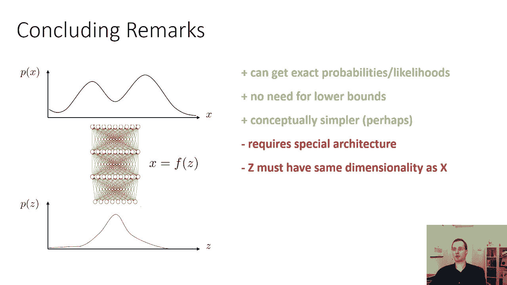
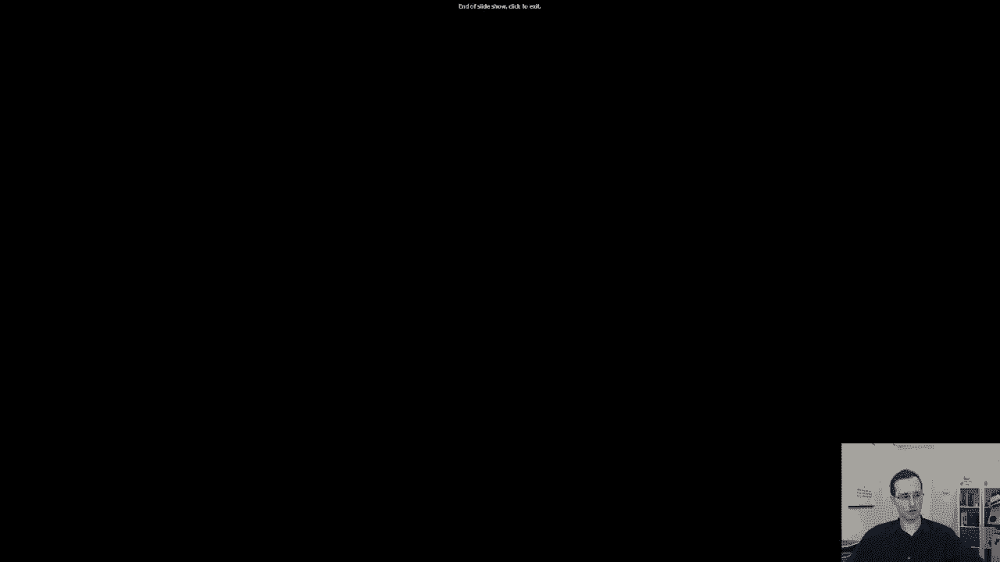

# 57：CS 182 讲座 18 - 第 4 部分 - 隐变量模型 🧠

在本节课中，我们将学习一种与变分自编码器结构相似但训练更简单的模型。我们将重点介绍**规范化流模型**，它使用确定性的可逆映射，从而能够精确计算数据的概率，而不仅仅是变分下界。

---

## 概述 📋

上一节我们讨论了变分自编码器及其变分下界。本节中，我们将探讨一种不同的隐变量模型——**规范化流**。该模型的核心思想是使用一个确定性的、可逆的映射函数 `f` 将潜在变量 `z` 转换为数据 `x`，从而可以直接计算数据的精确概率。

---

## 变量变化公式与核心思想 🔄

在变分自编码器中，解码器输出的是给定 `z` 时 `x` 的分布。而在规范化流中，我们使用一个**确定性解码器**，即 `x = f(z)`，其中 `f` 是一个可逆函数。

为什么这很重要？因为现在我们可以使用**变量变化公式**来计算 `x` 的概率密度 `p(x)`：

**公式：**
```
p(x) = p(z) * |det(df/dz)|^{-1}
```
其中 `z = f^{-1}(x)`。

这个公式的直观理解是：当通过函数 `f` 将 `z` 映射到 `x` 时，概率密度会随着 `f` 引起的体积膨胀或收缩而调整。`|det(df/dz)|` 项正是用来补偿这种体积变化的。

---

## 规范化流模型的目标 🎯

我们的训练目标是最大化数据集中所有样本 `x` 的对数似然。将变量变化公式代入，目标函数变为：

**公式：**
```
log p(x) = log p(z) - log |det(df/dz)|
```
通常，我们假设 `p(z)` 是一个简单的分布，例如标准正态分布 `N(0, I)`。

因此，构建规范化流模型的关键在于：设计一个可逆的神经网络 `f`，使得其雅可比矩阵的行列式 `det(df/dz)` 易于计算。

---

## 构建可逆网络层 🧱

规范化流模型由多层可逆变换堆叠而成。整个网络 `f` 的可逆性要求每一层都是可逆的。整个网络的对数行列式是各层对数行列式之和。

**公式：**
```
log |det(df/dz)| = Σ_i log |det(df_i/dz_i)|
```

因此，我们的主要任务是设计一个**可逆的神经网络层**。

---

## 一种简单的可逆层：仿射耦合层

以下是构建可逆层的一种简单方法，称为**仿射耦合层**。

首先，将输入向量 `z` 分成两部分：`z = [z_A, z_B]`。
*   `z_A`：前半部分。
*   `z_B`：后半部分。

该层的变换定义如下：
1.  `x_A = z_A` （直接复制前半部分）。
2.  `x_B = z_B + g_θ(z_A)` （后半部分加上一个由前半部分计算出的非线性变换）。

其中 `g_θ` 可以是任意的神经网络（如带ReLU的全连接层）。

**可逆性证明：**
给定输出 `x = [x_A, x_B]`，我们可以轻松恢复输入 `z`：
1.  `z_A = x_A`。
2.  `z_B = x_B - g_θ(z_A) = x_B - g_θ(x_A)`。

**雅可比行列式：**
该变换的雅可比矩阵是一个下三角矩阵，其对角线元素全为1。因此，其行列式 `det(df/dz) = 1`，这使得对数行列式项为零，计算非常简便。

然而，这种设计的表达能力有限，因为它不改变数据的体积（尺度）。

---

## 更具表达力的可逆层：Real NVP

为了增强模型的表达能力，我们可以使用 **Real NVP** 层。它同样对输入进行分割，但变换更为复杂：

1.  `x_A = z_A`。
2.  `x_B = z_B ⊙ exp(h_θ(z_A)) + g_θ(z_A)`。

其中：
*   `⊙` 表示逐元素相乘。
*   `h_θ` 和 `g_θ` 是两个神经网络。
*   `exp` 操作确保缩放因子为正，避免信息丢失。

**可逆性：**
逆变换为：
1.  `z_A = x_A`。
2.  `z_B = (x_B - g_θ(z_A)) ⊙ exp(-h_θ(z_A))`。

**雅可比行列式：**
此时雅可比矩阵的对角线不再全为1，行列式变为 `exp(Σ_i h_θ(z_A)_i)` 的乘积。这使得模型能够学习更复杂的分布。

---

## 规范化流的优势与局限 ⚖️

**优势：**
1.  **精确似然**：可以直接计算数据点的精确概率 `p(x)`，而非变分下界。
2.  **概念简洁**：无需处理变分推断的复杂性。

**局限：**
1.  **架构限制**：必须使用特殊的可逆层，不能直接使用标准网络层（如普通ReLU层）。
2.  **维度约束**：由于每一层都必须可逆，输入和输出的维度必须保持一致。对于高维数据（如图像），这要求潜在变量 `z` 的维度与数据 `x` 相同，可能不如变分自编码器（可使用低维潜在空间）高效。

---

## 总结 📝

本节课我们一起学习了**规范化流模型**。
*   我们首先了解了其核心思想：使用**可逆的确定性函数**连接潜在空间与数据空间，并通过**变量变化公式**计算精确似然。
*   接着，我们探讨了如何通过堆叠**可逆层**来构建深度规范化流网络。
*   我们介绍了两种具体的可逆层设计：简单的**仿射耦合层**和更具表达力的**Real NVP层**。
*   最后，我们讨论了规范化流相对于变分自编码器的优势（精确似然）和局限（架构限制与维度约束）。





规范化流为生成模型提供了一条避开变分下界、直接优化似然的途径，是深度学习概率建模中的重要工具之一。