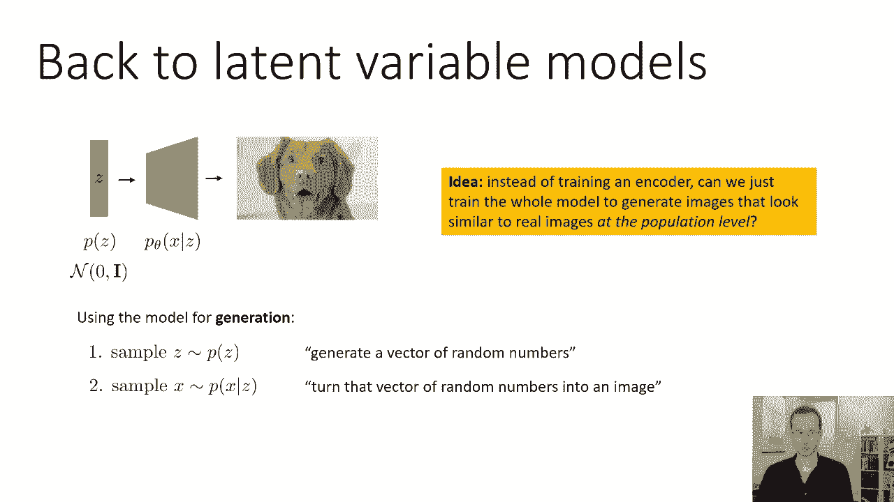
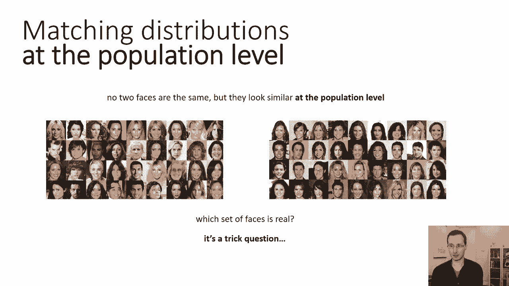
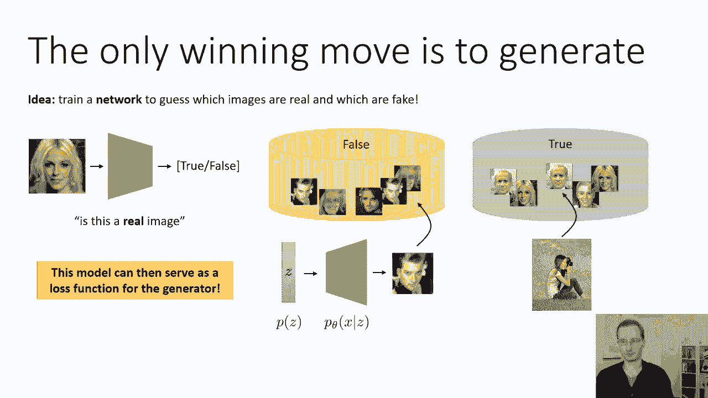
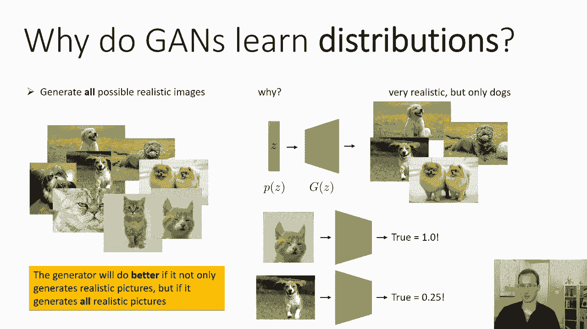
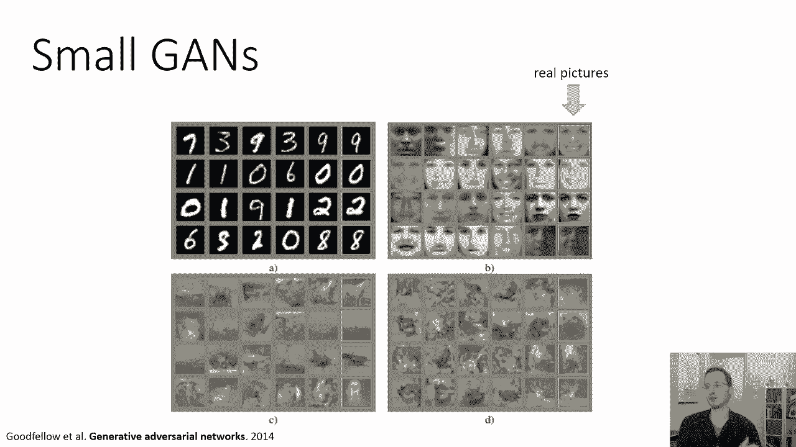
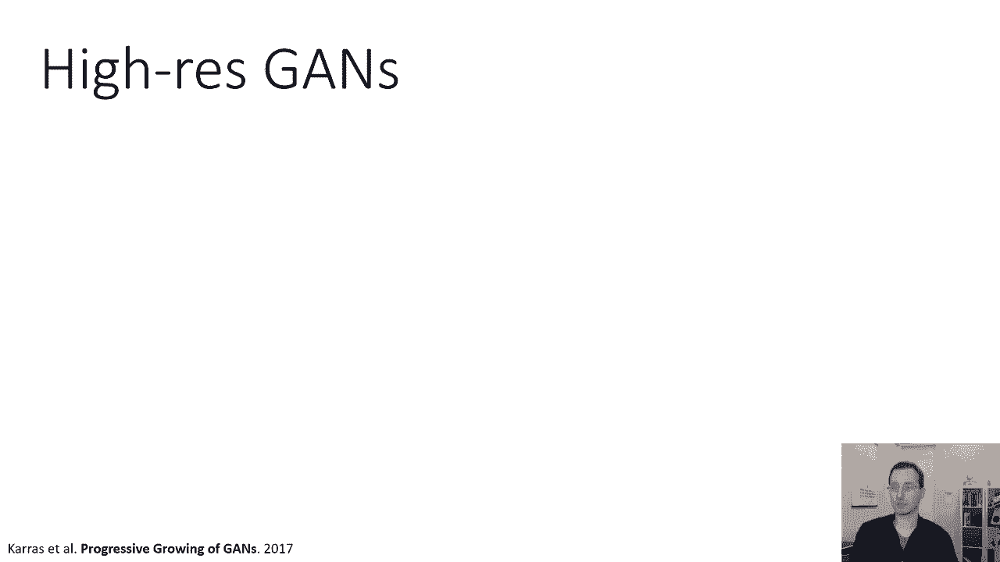
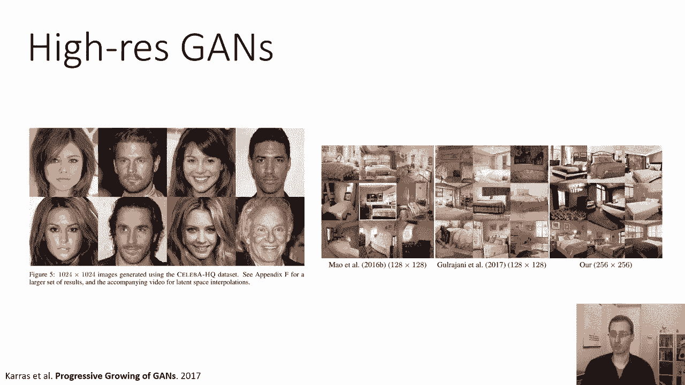
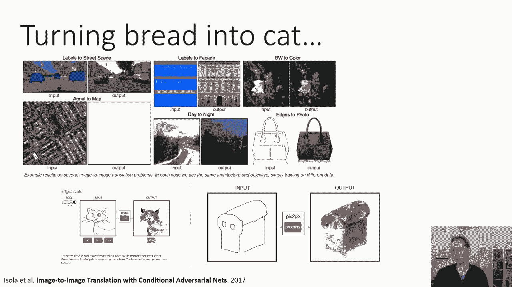
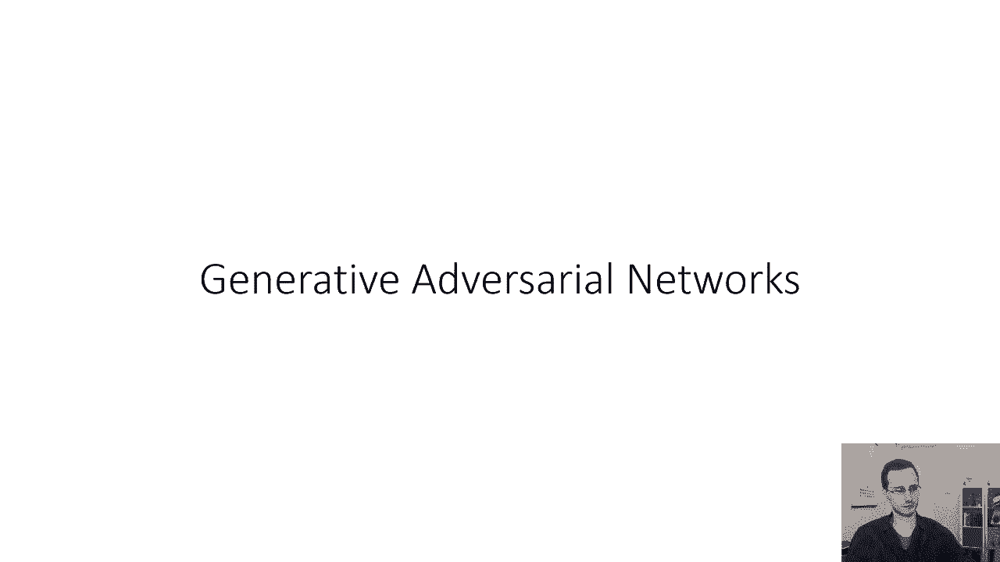

# 58：CS 182 - 第19课 - 第1部分 - 生成对抗网络 (GANs) 🎨

在本节课中，我们将学习最后一类生成模型——生成对抗网络。我们将探讨其核心思想、工作原理以及为何它能生成逼真的图像。

---

## 潜在变量模型回顾

上一节我们介绍了规范化流等生成模型。本节中，我们来看看生成对抗网络如何从另一个角度构建生成模型。

首先，让我们回顾一下潜在变量模型的基本概念。在潜在变量模型中，我们有一个潜在变量 **z**。这本质上是一个随机数向量，从某个先验分布中采样得到。例如，我们可以设定 **z** 有256个维度，每个维度都从均值为0、方差为1的正态分布中采样。

我们选择一个先验分布 **p(z)**，然后使用一个神经网络来表示给定 **z** 时 **x** 的分布，或者像在规范化流中那样，建立一个从 **z** 到 **x** 的确定性映射。这个模型将随机向量 **z** 作为“随机数生成器”，并利用它们生成相应的图像。其目标是捕捉图像的真实分布。

生成过程可以概括为：从已知的 **p(z)** 中采样 **z**，然后通过神经网络生成图像 **x**。公式表示如下：

\[
x = G(z), \quad z \sim p(z)
\]

其中 **G** 是生成器网络。

---

## 生成对抗网络的核心思想

上一节我们回顾了传统的潜在变量模型训练方法。本节中，我们来看看生成对抗网络如何采用一种全新的训练策略。

生成对抗网络的核心思想是：与其像变分自编码器那样为每个真实图像猜测对应的潜在变量 **z**，不如直接训练整个模型，使其在整体分布层面上生成与真实图像相似的图像。

我们可以通过一个例子来理解“在整体分布层面上相似”的含义。假设有两组人脸图像，左边一组和右边一组。它们并非一一对应，但整体看起来风格相似。如果从两组中各取五张图像混合展示，你无法区分哪些来自左边、哪些来自右边，那么我们就说这两组图像在分布层面上是相似的。

GAN 通过设置一个“游戏”来实现这一目标。在这个游戏中，唯一获胜的方式就是生成逼真的图像。

---

## 鉴别器与生成器的对抗

上一节我们介绍了GAN的基本目标。本节中，我们来看看实现这一目标的具体机制。

GAN 包含两个网络：一个**鉴别器**和一个**生成器**。

**鉴别器**是一个分类器，其任务是查看图像并判断它是真实的还是生成的。它输出一个介于0到1之间的概率值，表示图像为真的概率。公式表示如下：

\[
D(x) = P(\text{图像 } x \text{ 为真})
\]

**生成器**是一个确定性函数，它将一个随机噪声向量 **z** 映射为图像 **x**。与规范化流不同，它不必是可逆的，也不要求维度匹配。其目标是生成足以“欺骗”鉴别器的图像。

为了训练鉴别器，我们需要一个包含真实图像和生成图像的数据集。真实图像来自我们的训练集，生成图像则来自当前（可能还很差劲的）生成器。

---

## 基础训练流程

以下是GAN的一个基础训练流程。请注意，这不是最终算法，但能帮助我们理解其工作原理。

1.  获取真实图像数据集 **D_true**。
2.  初始化生成器 **G**。
3.  生成假图像数据集 **D_fake**：从先验分布 **p(z)** 中采样 **z**，然后通过 **G(z)** 得到假图像。
4.  训练鉴别器 **D**：将 **D_true** 中的图像标记为“真”，**D_fake** 中的图像标记为“假”，进行监督学习训练。
5.  使用鉴别器为生成器构造损失函数。一个简单的选择是：生成器希望其生成的图像被鉴别器判为“真”的概率最大。因此，损失函数可以是生成图像为“真”的负对数概率：

\[
\mathcal{L}_G = -\log D(G(z))
\]

然而，这个基础流程存在一个问题：如果只执行一次第5步，生成器只需要生成比当前假图像集稍好的图像就能“欺骗”当前这个鉴别器，但这可能仍远未达到逼真的程度。

---

## 迭代对抗训练

为了解决上述问题，GAN采用了一种迭代的对抗训练过程，让鉴别器和生成器在竞争中共同进步。

我们不会一次性训练好鉴别器，而是交替进行以下步骤：

1.  **固定生成器，更新鉴别器**：用当前生成器生成一批假图像，与真实图像混合，训练鉴别器一步（一个梯度步），使其更好地区分真假。
2.  **固定鉴别器，更新生成器**：根据当前鉴别器给出的“真实性评分”，更新生成器一步，使其生成更逼真的图像来“欺骗”鉴别器。

这个过程就像一场游戏：鉴别器不断学习识破假货，而生成器不断学习制造更逼真的赝品。生成器获胜的唯一途径，就是生成与真实图像在整体分布上无法区分的图像。

---

## 为何GAN能学习完整分布？

上一节我们描述了训练过程。本节中，我们深入探讨一下为何这种对抗机制能迫使生成器学习完整的真实数据分布，而不仅仅是生成几张逼真的图片。

生成器的理想目标是让鉴别器对其所有生成图像都输出概率 **0.5**，即鉴别器完全无法判断真假。要达到这一点，生成器必须满足两个条件：

1.  **生成逼真的图像**：如果图像有明显瑕疵，鉴别器会轻易识破。
2.  **生成所有类型的逼真图像**：这是关键点。假设真实数据集中一半是猫、一半是狗。如果生成器只学会了生成逼真的狗，那么当鉴别器看到猫时，它会立刻知道这来自真实数据集（因为假数据里没有猫）；当看到狗时，它也会倾向于认为来自假数据集（因为假数据全是狗）。这样，鉴别器就不会在所有图像上都输出0.5。

因此，为了在这场对抗游戏中最终获胜，生成器必须学会覆盖真实数据分布中的所有模式（如猫和狗），而不仅仅是其中一部分。这就是GAN能够学习完整分布的理论原因。

> **注意**：在实践中，GAN有时会遇到“模式崩溃”问题，即生成器只生成少数几种类型的图像，而未能覆盖全部分布。这是优化GAN的一个挑战。

---

## GAN的效果展示

自2014年Ian Goodfellow提出以来，GAN技术已经取得了长足的进步。

*   **早期GAN**：可以生成MNIST手写数字、人脸等，但图像较为模糊。
*   **现代GAN**：如ProGAN、BigGAN等，能够生成高分辨率、细节丰富的图像，在许多情况下与真实照片难以区分。
*   **条件生成**：GAN还可以用于“图像到图像”的翻译任务，例如将草图转换为照片、将白天场景转换为夜晚等，展现了强大的创造力和应用潜力。

---

## 总结

在本节课中，我们一起学习了生成对抗网络的基本原理。我们了解到，GAN通过设置鉴别器和生成器之间的对抗游戏，迫使生成器学习匹配真实数据的整体分布。其核心在于迭代的对抗训练过程，以及生成器为了“欺骗”鉴别器而必须生成多样且逼真图像的内在动力。尽管存在模式崩溃等优化挑战，GAN已成为当前最强大的生成模型之一，能够创造出令人惊叹的逼真图像。