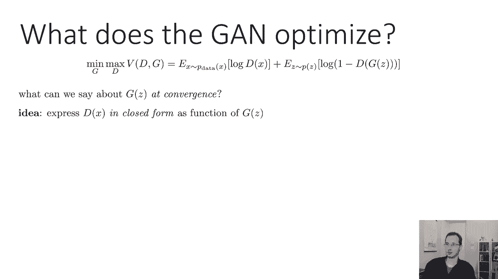
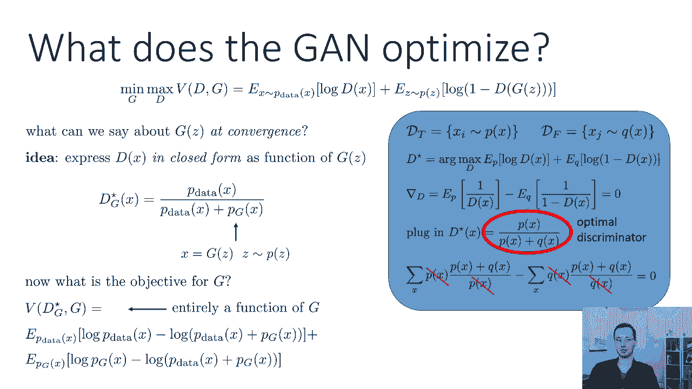
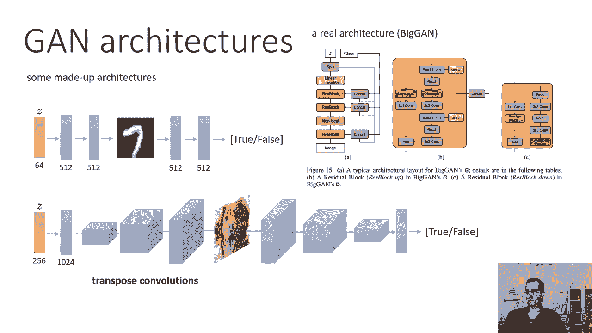
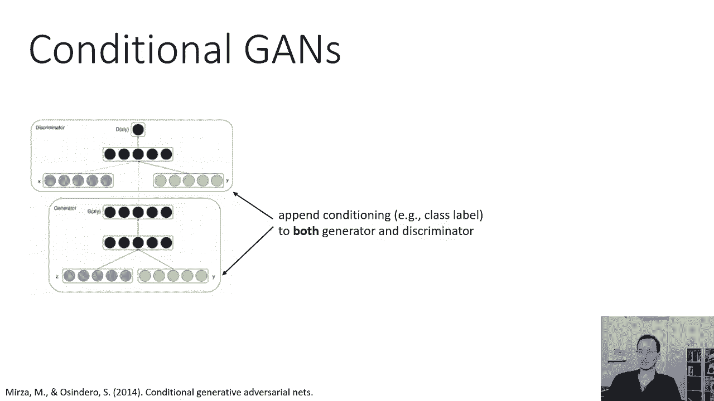
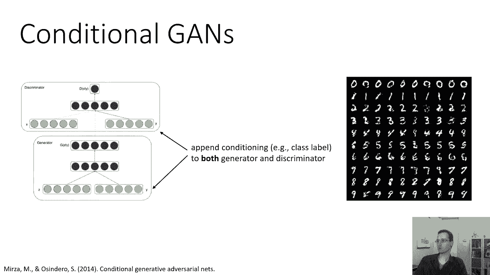
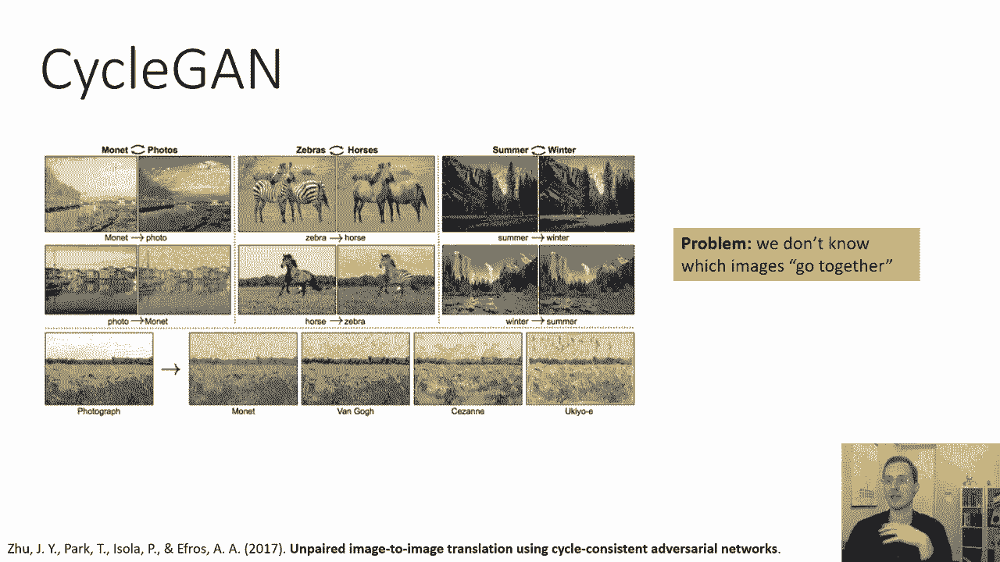
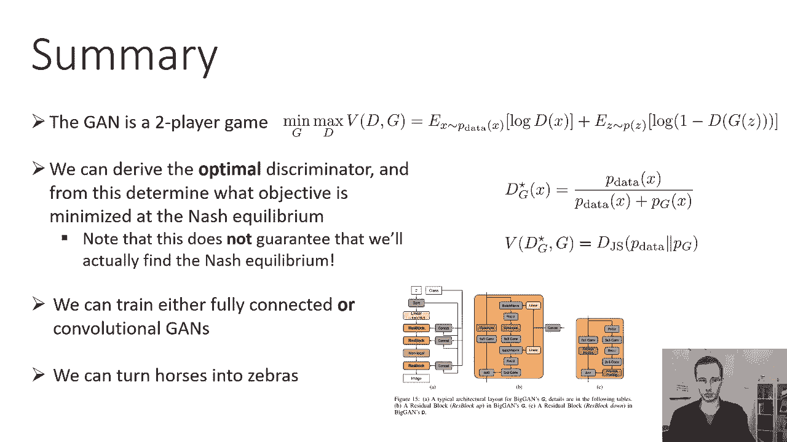

# 59：CS 182 第19讲 第2部分 - GANs 🧠

在本节课中，我们将深入探讨生成对抗网络的技术细节。我们将从GAN算法的基本框架开始，逐步分析其工作原理、优化目标、理论推导以及实际应用中的架构设计。

---

## GAN算法概述

上一节我们介绍了GAN的基本概念，本节中我们来看看其算法的具体轮廓。GAN的过程可以被描述为一个经典的两人博弈，即最小最大问题。

在这个博弈中，有两个参与者：生成器 **G** 和判别器 **D**。他们试图最小化或最大化同一个目标函数，但方向相反。生成器 **G** 试图最小化该目标，而判别器 **D** 试图最大化它。这构成了他们之间的竞争关系。

目标函数本质上是判别器的分类目标，可以表示为交叉熵损失。具体公式如下：

**公式：**
```
min_G max_D V(D, G) = E_{x~p_data(x)}[log D(x)] + E_{z~p_z(z)}[log(1 - D(G(z)))]
```

在这个表达式中：
*   第一项 `E_{x~p_data(x)}[log D(x)]` 是判别器对真实数据（正样本）的对数似然期望。
*   第二项 `E_{z~p_z(z)}[log(1 - D(G(z)))]` 是判别器对生成数据（负样本）的对数似然期望。

判别器 **D** 的目标是最大化 `V(D, G)`，这等价于最小化交叉熵损失。生成器 **G** 的目标是最小化 `V(D, G)`，即让判别器难以区分生成的图像是假的。

---



## 优化算法与梯度计算

上一节我们定义了GAN的目标函数，本节中我们来看看如何通过优化算法来求解这个最小最大问题。这不再是传统的单目标梯度下降，而是一个寻找两人博弈纳什均衡的过程。

我们将目标函数用参数重写：
*   **θ** 代表生成器 **G** 的参数。
*   **φ** 代表判别器 **D** 的参数。

**公式：**
```
min_θ max_φ V(θ, φ)
```

算法在两者之间交替进行：
1.  **固定生成器 G (θ)**，对判别器 **D (φ)** 执行梯度上升步，以最大化 `V`。
2.  **固定判别器 D (φ)**，对生成器 **G (θ)** 执行梯度下降步，以最小化 `V`。

以下是实现细节：

**使用小批量随机梯度**
在实践中，我们使用小批量数据来近似梯度：
*   对于第一项期望 `E_{x~p_data(x)}[log D(x)]`，我们使用一小批真实训练数据点。
*   对于第二项期望 `E_{z~p_z(z)}[log(1 - D(G(z)))]`，我们采样相同数量的一批随机噪声 **z**，通过生成器得到生成图像，然后在这批生成图像上计算。

**梯度计算**
*   **判别器的梯度**：这直接是交叉熵损失的梯度，计算方式与标准分类器相同。
*   **生成器的梯度**：生成器的损失函数涉及将生成的图像输入判别器。因此，我们通过判别器反向传播到生成器。利用链式法则，生成器的梯度为 `dL/dθ = (dL/dx) * (dx/dθ)`，其中 `x = G(z)`。在实际编码中，只需构建一个包含生成器和判别器的计算图，然后使用自动微分软件进行常规的反向传播即可。



---

## 理论分析：GAN优化了什么？

我们了解了GAN的训练过程，但GAN最终优化的是什么目标？我们能否对这个双人博弈进行分析，并正式声明在收敛时，生成器的分布会匹配真实数据分布？

为了理论分析，我们简化问题：假设判别器能力足够强（即函数空间足够有表现力），我们可以求出给定生成器 **G** 时，最优判别器 **D*** 的闭式解。

设真实数据分布为 `p_data(x)`，生成器分布为 `p_g(x)`。最优判别器 **D*** 为：

**公式：**
```
D*(x) = p_data(x) / (p_data(x) + p_g(x))
```

这个表达式被称为贝叶斯最优分类器。

现在，我们将这个最优判别器 `D*(x)` 代回原始的 min-max 目标函数中，从而得到一个只关于生成器 **G** 的目标函数 `C(G)`。经过代数推导（涉及KL散度），`C(G)` 可以表示为：

**公式：**
```
C(G) = -log(4) + KL(p_data || (p_data+p_g)/2) + KL(p_g || (p_data+p_g)/2)
```

其中，`KL(P||Q)` 是分布P和Q之间的KL散度。这个表达式实际上是 **Jensen-Shannon散度 (JSD)**。JSD具有以下性质：
*   当且仅当 `p_data = p_g` 时，JSD为0。
*   JSD是对称的，即 `JSD(p_data || p_g) = JSD(p_g || p_data)`。

**结论**：从理论上讲，当生成器和判别器都达到最优时（即达到纳什均衡），GAN的训练过程是在最小化真实数据分布 `p_data` 与生成器分布 `p_g` 之间的Jensen-Shannon散度。这证明了GAN确实在努力匹配真实数据分布。

---





## 实践技巧与架构设计



上一节的理论推导为我们提供了理解，本节中我们来看看实际训练GAN时的一些重要技巧和常见架构。

**生成器损失函数的选择**
在原始公式中，生成器的损失是 `E_z[log(1 - D(G(z)))]`，即最小化图像被判别为“假”的概率。但在实践中，我们常使用一个修改版本：`E_z[-log(D(G(z)))]`，即最大化图像被判别为“真”的概率。



选择后者的原因在于梯度行为更好。函数 `log(1-x)` 在x较小时（生成器很差时）梯度非常小，不利于学习；而函数 `-log(x)` 在x较小时梯度很大，能提供更强的学习信号，当生成器变好时梯度又逐渐变小，有利于稳定收敛。

**GAN架构**
以下是几种常见的架构：

*   **全连接GAN**：适用于低分辨率图像（如MNIST手写数字）。生成器和判别器均由若干全连接层构成。
*   **卷积GAN (DCGAN)**：适用于更高分辨率的图像。生成器使用转置卷积（反卷积）进行上采样，判别器使用标准卷积层。这是现代GAN的基础架构。
*   **条件GAN (cGAN)**：用于生成特定类别的图像。方法是将类别标签（如one-hot向量）同时连接到生成器和判别器的输入。这样，生成过程可以以类别信息为条件。
*   **循环GAN (CycleGAN)**：用于解决无配对数据的图像到图像翻译问题（如将马转换为斑马）。它使用两个生成器（G: A->B, F: B->A）和两个判别器，并引入**循环一致性损失**，确保将一个域的图像转换到另一个域再转换回来时，能近似还原为原图像。

---

## 总结

本节课中我们一起学习了生成对抗网络的核心内容。

我们首先回顾了GAN作为两人最小最大博弈的基本框架。接着，我们详细讲解了其交替优化算法以及梯度的计算方法。通过理论分析，我们推导出最优判别器的形式，并证明了在均衡状态下，GAN实际上是在最小化真实分布与生成分布之间的Jensen-Shannon散度。最后，我们探讨了实践中的关键技巧（如损失函数选择）和多种GAN架构（包括全连接、卷积、条件及循环GAN）。



GAN通过生成器与判别器的对抗性训练，提供了一种强大且灵活的生成模型框架，在图像生成、风格转换等领域取得了显著成功。