# 60：CS 182 讲座 19 第 3 部分 - GANs 🧠

在本节课中，我们将要学习生成对抗网络的一些现代训练方法。这些方法通常比经典的简单GAN训练效果更好。

## 概述 📋

在讲座的最后一部分，我们将讨论一些现代的训练方法，即GANs。这些方法通常比我之前描述的经典简单GAN工作得更好。

## GANs存在的问题 🤔

如果你只是按照我在讲座第二部分中描述的方式实施GAN训练，你可能会发现最简单的问题是它需要大量的超参数调整才能正常工作。

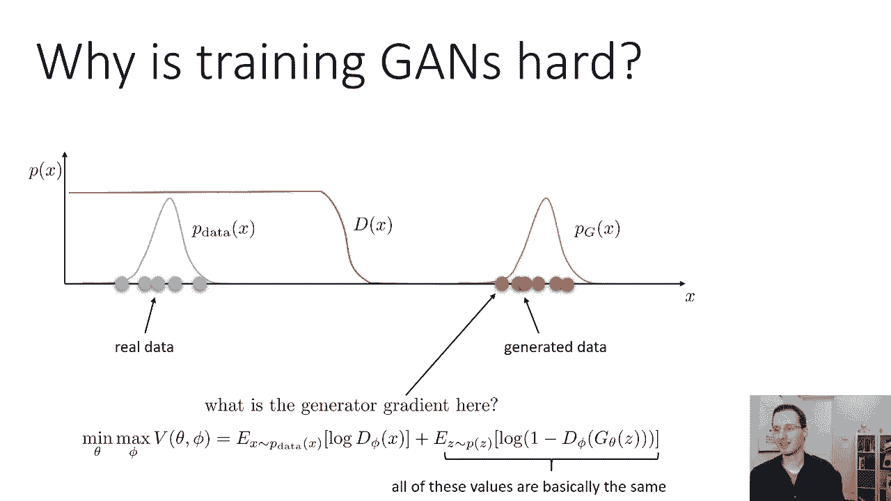

为什么对于GANs来说这是一个特别困难的场景？也许可以说明这个问题。假设x是一维的，这样我现在就可以把它们画在幻灯片上了。

假设这些蓝色圆圈代表真实数据。当然在现实中你可能有成千上万甚至数百万的数据点，而这里我只有五个。但现在只是为了可视化，假设这些橙色圆圈代表当前生成器生成的样本。

所以你可以想象p_data是一个分布，看起来像这样。和p_g（生成器的分布）现在看起来是这样的。如果我用这个p_data训练我的鉴别器，这个p_g，我的鉴别器基本上真实的概率可能是这样的。它将完美地接近真实数据的零点，它将完美地零点零接近生成的数据。它在中间的某个地方会有一些决策边界，离任何一种分布都很远。

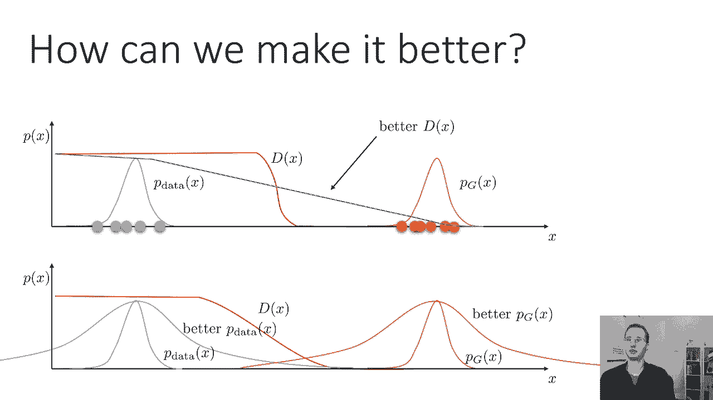

现在请记住，生成器完全通过使用梯度来学习，通过鉴别器。那么生成器梯度实际上在生成的数据附近是什么？鉴别器在所有这些点上均匀地输出零。所以记住这是双人游戏的表达式，第二部分是生成器的目标。所有这些值，所有这些log(1 - D(x))在生成的数据附近基本相同，因为鉴别器在这一点上已经完全饱和，它输出了完美的精确度。对所有的训练数据都是完美的一个零，对于所有生成的数据完全为零。你可能需要调整了一点，以确保你不会得到NaN，但基本上它将是一个对数，这不是很有效。

## 改进思路 💡

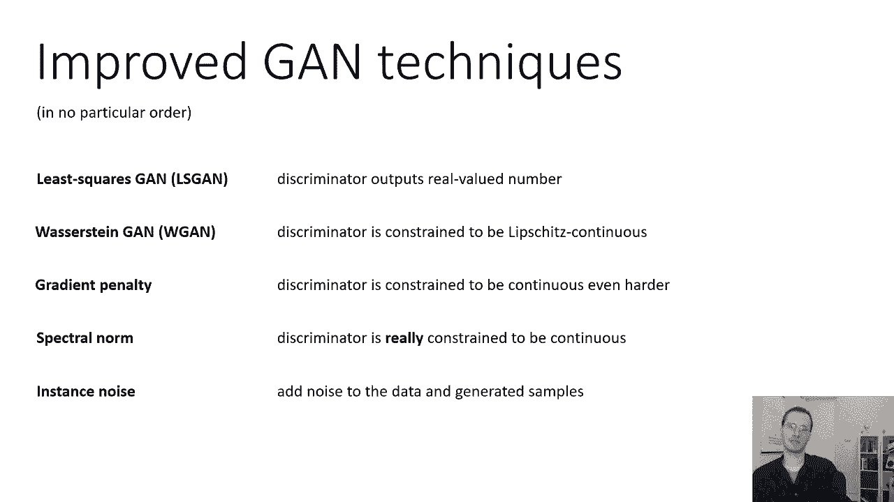

那么我们怎样才能让这变得更好？我们怎样才能确保即使生成器与鉴别器相比非常糟糕，当生成的数据离p_data很远时，鉴别器仍然给我们一个有意义的梯度信号？

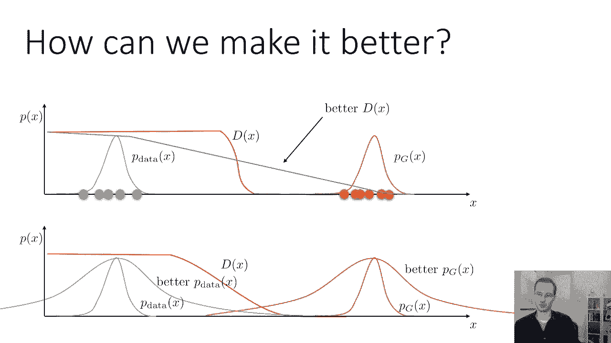

我们可以做的一件事是我们可以以某种方式改变我们的鉴别器。也许我们可以以某种方式改变辨别者的训练方式，因此即使它可以完美地将p_data从p_g中分类，仍然鼓励在这些分布之间产生一个更平滑的斜坡，给发电机一些梯度信号，引导它向p_data。

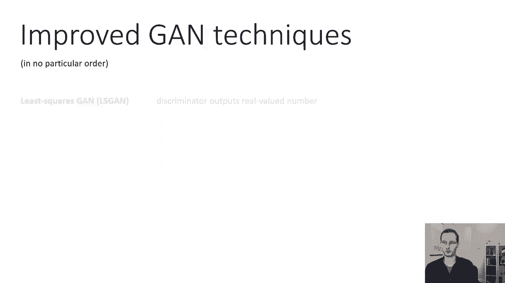

我们可以做的另一件事是我们基本上可以稍微改变一下分布。也许我们可以以某种方式修改p_data和p_g，所以重叠的比较多，然后辨别者就不会那么震惊了，然后我们会看到一个更强的梯度信号。所以这两个都是可行的想法。

我们可以用一些实际的方法来实例化这种直觉。

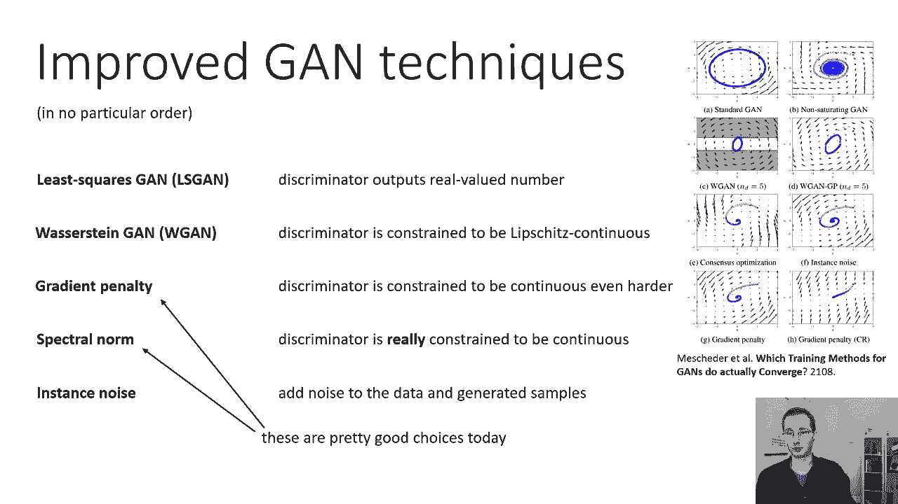

## 改进的GAN技术 🛠️

一些改进的GAN技术，没有特别的顺序：

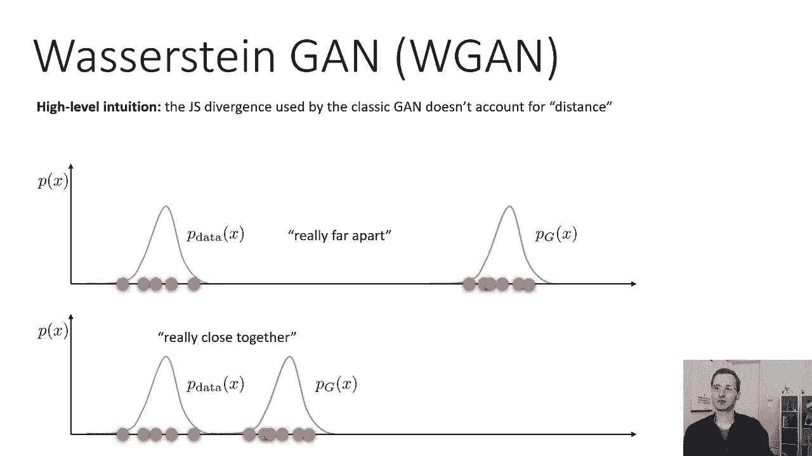

*   **最小二乘GAN (LSGAN)**：是修改GAN鉴别器的一种方法，输出一个实值数，而不是零到一之间的概率，并训练鉴别器，使其产生更平滑的斜坡。
*   **Wasserstein GAN (WGAN)**：是将鉴别器修改为Lipschitz连续的一种方法，这也鼓励它在p_data和p_g数据之间有更干净的斜率。
*   **梯度惩罚 (Gradient Penalty)**：是提高WGAN的一种方法，因此判别器被限制为连续的，就更难了。所以它试图做与WGAN相同的事情，但更有效。
*   **谱范数 (Spectral Norm)**：是一种真正约束判别器连续的方法。所以基本上如果你再听到Wasserstein、梯度惩罚或谱范数，他们都在试图用稍微不同的方式做同样的事情。
*   **实例噪声 (Instance Noise)**：一个稍微不同的方法来改善GAN训练。基本上就是做幻灯片底部的事情，它试图通过增加大量噪声来改变分布，到p_data和生成的示例。

希望让它们的分布有更多的重叠。

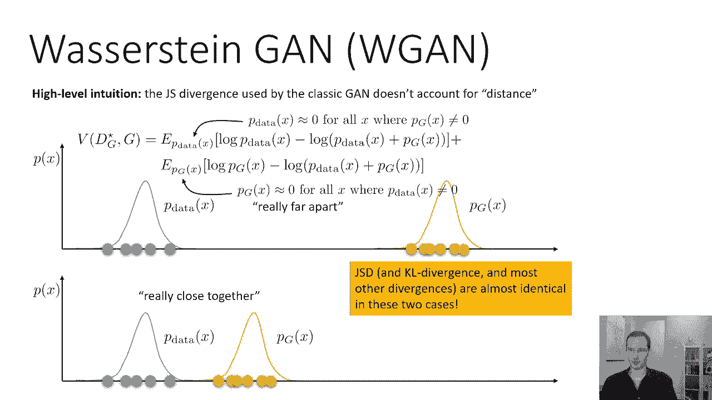

所以这是实例噪声。

如果你想了解这些不同技术之间的一些比较，至少在理论上是这样，你可以看看这篇论文，叫做《GANs的哪些训练方法实际上是收敛的》。它分析了GANs的基本收敛。左上角的标准GANs在收敛方面非常糟糕。所以在许多简单的情况下他们可能找不到平衡，但许多改进的GAN技术可以找到平衡，或者至少接近它。

如果你想要一种技术实际使用，我的建议是用梯度惩罚或谱范数，这些都是今天很好的选择。梯度惩罚实现起来更简单一点，谱范数可以更有效一点，但实现起来有点难。它们基本上都是基于Wasserstein GAN的。

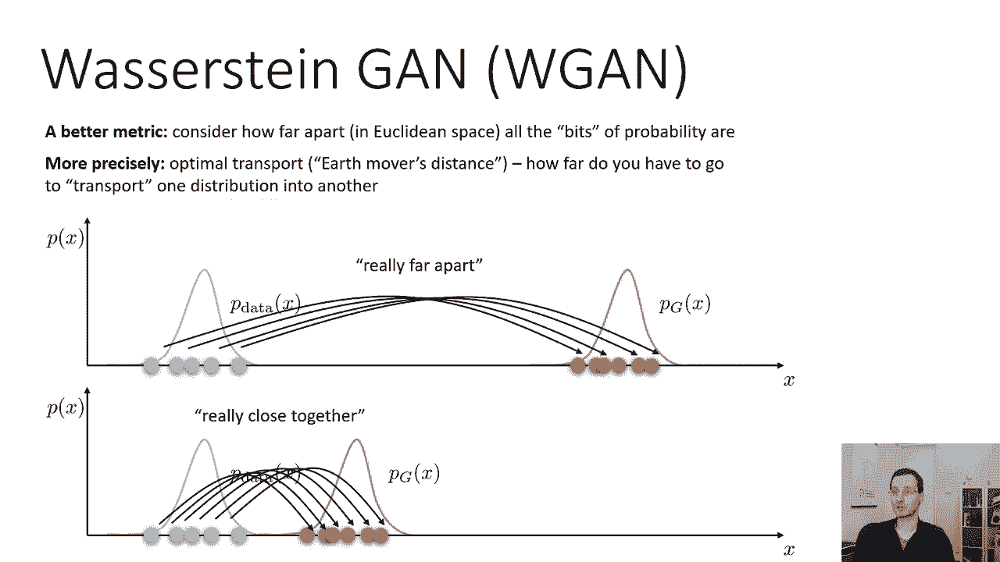

在今天的讲座中，我将主要关注Wasserstein GAN，然后简要地说明梯度惩罚和谱范数如何工作。但请记住，像最小二乘GAN、实例噪声也是可行的选择，欢迎你在文献中查找它们，以了解更多关于它们的信息。

## Wasserstein GAN 的直觉 🚚

现在我将再次专注于描述Wasserstein GAN。高层直觉是Jensen-Shannon散度（经典GAN所使用的）没有任何方法来解释距离。

基本上，如果你有这种情况，你可以说这两个分布相距甚远。或者你可以有这个场景，然后说好，这两个分布非常接近。就Jensen-Shannon散度而言，这两种情况差不多，因为在这两种情况下，分布之间的重叠可以忽略不计。

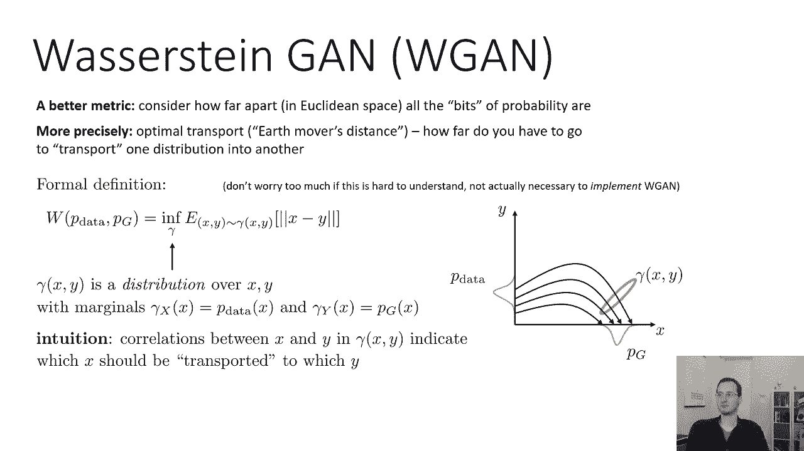

所以散度和KL散度，和大多数其他纯粹使用在这两种情况下概率几乎相同，尽管很明显底部的要好得多。

高层解释了为什么在GAN中很难获得有意义的梯度，当生成器很糟糕的时候。因为一个好的梯度应该告诉你改善上面情况的方法是走向下面的情况。但是如果你的散度度量认为这两个分布几乎相同，那么当然它不会有太大的梯度。

在数学上这是真的原因是，如果你看Jensen-Shannon散度的形式，GAN目标的形式，你会看到基本上它是用一个分布下的对数概率表示的，在另一种分布下的预期。其中p_g近于零，因为所有的x p_data都不是零，那么这些表达式就不会给你任何有意义的梯度。这样基本上解释了为什么顶部的情况被认为与底部的情况非常相似，就Jensen-Shannon散度而言，尽管在底部的情况下，这些分布非常接近。

所以我们能做的是纠正这个问题，用再次训练的方法，用不同的散度度量来更好地捕捉两个分布的距离。

## 地球移动距离 (Earth Mover‘s Distance) 🏗️

下面是你如何考虑一个更好的指标：考虑欧几里得空间中所有概率比特之间的距离。所以想象一下这些分布，基本上是成堆的材料，成堆的泥土。你要走多远才能把泥土从一堆搬到另一堆？这有时被称为最优运输问题或地球搬运工距离。你要走多远才能把一个发行版运送到另一个发行版？

所以如果你想象一下这个，这条蓝色曲线实际上就像一堆物理材料，这个橙色的曲线是你想让材料去的地方。想象一下你必须拿起每一块蓝色的材料，把它搬到橙色的堆里。你要走多远才能做到这一点？所以你可以把这个拿过来，把这个拿过去，把这个拿过来，等等。每次你去那里，你回去再拿一些。所以你要走的总距离，这两个分布相距多远。

现在，当然啦，在现实中这些小材料是无限小的，你要无限多次旅行。但如果你把这个连续的东西离散化，取极限，当离散化为零时，这将给你对距离测量的正确直觉。所以如果他们真的靠得很近，即使它们的重叠仍然为零，你必须走更少的路来携带每一点分配，从一堆到另一堆。所以这被称为地球移动距离或Wasserstein距离。

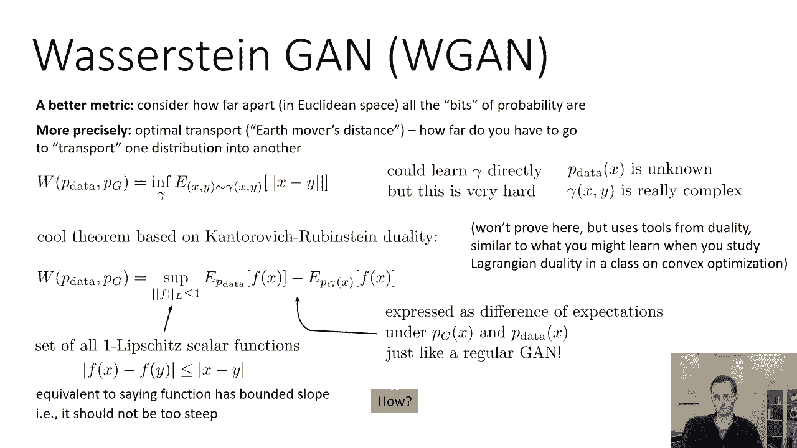

## Wasserstein距离的形式化定义 📐

正式定义Wasserstein距离有点复杂，我会尽我所能给你这个正式定义的直觉，但如果你不完全清楚，别太担心，你其实不需要明白这一点，为了再次实现Wasserstein GAN。但获得对此的直觉可能会有所帮助。

所以Wasserstein距离可以写成 `W(p_data, p_g)`。正式定义是 `y` 与 `x` 之间距离的期望值，其中 `y` 和 `x` 根据联合分布 `γ` 的最优选择进行分布。所以你找到最小化这个期望值的最佳伽马 `γ`。

什么是伽马 `γ`？伽马是 `x` 和 `y` 上的分布，其中关于 `x` 的边距是 `p_data`，相对于 `y` 的边距是 `p_g`。直觉是 `x` 和 `y` 之间的相关性，`y` 表示应运输哪个 `x`。

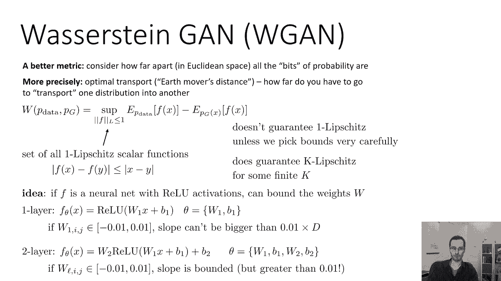

对我来说，试图理解这一点的最好方法是视觉。如果你想象一个图，其中一个轴是 `x`，另一个是 `Y`。你可以把 `p_data` 看作是 `y` 轴上的分布，`p_g` 是 `x` 轴上的分布。然后伽马 `γ` 是一个联合分布，描述了 `y` 轴上的哪个点，到 `x` 轴上的哪个点。

所以你会注意到这里，`p_g` 的左侧部分与伽马下 `p_data` 的底部部分相关，这意味着这个部分会放在这里，然后这个部分会在这里，这一块会放在这里，这一块会放在这里，以此类推。所以为了评估Wasserstein距离或推土机的距离，你会发现伽马 `γ` 使这些距离的期望值最小化，使每个 `y` 的 `x` 和 `y` 之间的差异最小化，到那个特定的 `x`。所以直觉上，寻找伽马 `γ` 就像找到移动 `p_data` 中所有点的最佳计划。

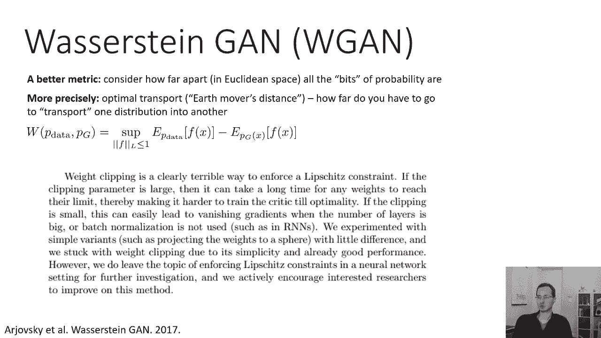

## Kantorovich-Rubinstein 对偶性 🔄

实际上像这样直接学习伽马 `γ` 是非常非常困难的，因为 `p_data` 未知，伽马 `γ(x, y)` 本身可能是一些非常非常复杂的分布。

所以有一个非常酷的定理，我们可以根据Kantorovich-Rubinstein对偶性使用，这为我们提供了一个更容易处理的方法来解决Wasserstein距离。我要陈述这个结果，我不打算证明，但声明是Wasserstein距离（上面的表达式）也等于所有可能函数 `f` 的上确界（supremum），`f` 的 `p_data` 下的期望值减去 `f` 的 `p_g` 下的期望值。

我们不会在这里证明这一点，但这一点的证明使用了二元性的工具，类似于你可能学到的，当你研究一类凸优化中的拉格朗日对偶时。所以你知道，我不想在这里讨论这个，因为我认为这门课的预备知识不一定会提供必要的工具来做到这一点。

非常非常粗糙的直觉，基本上 `f` 将来自你得到的同一个地方，基本上是拉格朗日乘数。这是一种高层次的直觉。所以你对伽马 `γ` 有一个限制，即伽马 `γ` 的边缘与 `p_data` 和 `p_g` 匹配，你基本上要把它的对偶。所以我不打算证明，但你现在可以相信我的话，这是真的。

这个表达Wasserstein距离的真正吸引人的地方是，它表达了 `p_g` 和 `p_data` 下 `f` 的期望值的差异。就像一个普通的GAN，正则GAN是 `p_data` 下 `log D(x)` 的期望值，然后在 `p_g` 下 `log(1 - D(x))` 的期望值。现在我们有了 `p_data` 下 `f(x)` 的期望值，和 `p_g` 下 `-f(x)` 的期望值。所以这真的很酷，这开始看起来更像是一场游戏。

现在，你们中的一些人可能已经注意到了，我没有提到任何关于上确界已经接管了这个有趣的表达，说 `||f||_L <= 1`。那是你应该重新做这件事的简写，一个Lipschitz的函数。一个Lipschitz意味着 `f(x)` 和 `f(y)` 之间的差应小于或等于 `x` 与 `y` 之差。所以它基本上是Lipschitz连续的，常数为1。这相当于说函数是有界斜率，所以永远不要太陡。

为什么好？因为如果 `f` 太陡，那么它可以在 `p_data` 下任意最大化 `f(x)`，并任意最小化 `p_g` 下的 `f(x)`。这个坡度限制基本上是一种对你能行驶多快的速度限制，当您将一个发行版的部分传送到另一个发行版时。所以如果我们回到地球搬运工的类比，把坡度限制在1就等于说你的限速是1，你从一个点到另一个点的速度有多快。

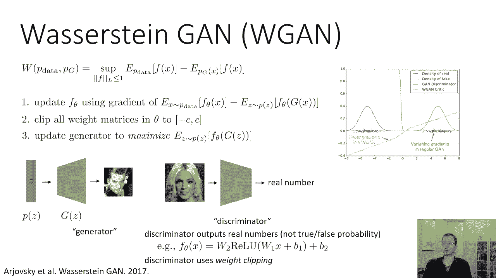

当然，很容易把它概括为，如果你是两个Lipschitz，意味着 `f(x) - f(y)` 小于等于 `2 * ||x - y||` 或一般的 `K`-Lipschitz，也很好。然后你的解决方案将是Wasserstein距离乘以 `K`。所以如果你不是1-Lipschitz而是2-Lipschitz，那么最高的解将是 `W(p_data, p_g)` 乘以2。所以重点不是它是一个Lipschitz，斜坡是有界的。斜坡是有界的意味着从一个配送站到另一个配送站的速度是有限制的，这使得这些距离实际上是有意义的。如果你没有速度限制，如果你能旅行，如果你基本上可以瞬间传送，那么你就不会得到一个有意义的数量。所以你需要某种速度限制，速度限制是多少实际上并不重要，只要是好的。

那么我们如何执行速度限制？我们如何强制 `f` 的斜率应该以某个常数为界？

## 实现 Lipschitz 约束：权重裁剪 (Weight Clipping) ✂️

这基本上是实例化WGAN的困难部分。所以我有个主意，这不一定是最好的主意，但如果 `f` 是一个具有ReLU激活的神经网络，这是一个想法。

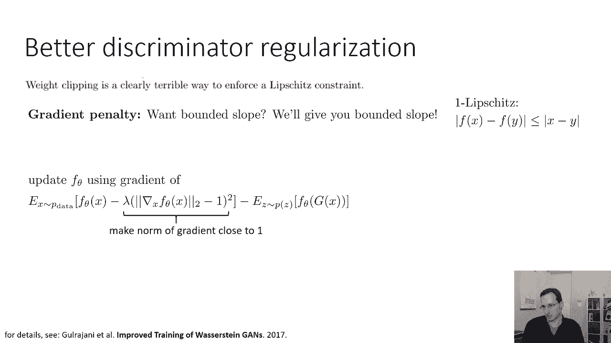

如果你只是绑定权重矩阵 `w` 的权重，例如，如果你只有一层网络，你基本上有一个线性层，然后是一个ReLU非线性。所以如果 `f_θ(x) = ReLU(W_1 x + b)`，这不是一个很好的架构，但只是作为一个例子。你在 `W` 中的所有条目都在，让我们说，负零点零一和正零点零一之间。那么你的斜率可以大于 `0.01 * d`。

这是一个非常简单的例子。如果你有一个两层神经网络，所以它是 `W_2 * ReLU(W_1 x + b_1) + b_2`，你的参数是 `W_1, b_1, W_2, b_2`。然后可以将两个权重矩阵中的所有条目约束为在负数之间，`-0.01` 和 `0.01` 之间。然后你的斜率也将是有界的，当然比以前大了很多，因为你实际上是把这些 `W` 相乘在一起，但它仍然受一个常数的限制。

所以这并不能保证它是一个Lipschitz，除非你非常小心地选择界限，但它确实保证了它是一些常数的Lipschitz，这意味着斜坡将是有界的，这意味着你会得到一些Wasserstein距离的倍数。所以它确实保证了某个有限 `k` 的 `k`-Lipschitz。

这就是你们所有人需要的。现在警告，这是从最初的Wasserstein GAN论文中摘录的，我要直接读给你听，是那篇论文中一个过于诚实的段落：

> “权重裁剪显然是一种可怕的方式来强制Lipschitz约束。如果裁剪参数较大，那么任何方法都可能需要很长时间才能达到极限，从而使批评家更难训练直到最优。如果剪裁很小，这很容易导致梯度消失，当层数较大或不使用批处理规范化时。我们用简单的变体进行了实验，就像把重量投射到一个稍微不同的球体上。我们坚持用重量夹，由于它的简单性和已经很好的性能。然而，我们确实留下了强制Lipschitz约束的话题，在神经网络环境中的进一步研究。我们积极鼓励有兴趣的研究人员改进这种方法。”

事实上，如今，我们会认为这种重量裁剪方法大多已经过时了。

## WGAN 训练过程 🔄

有更好的方法来做到这一点，但是如果我们想通过这个Wasserstein GAN程序，它是这样工作的：

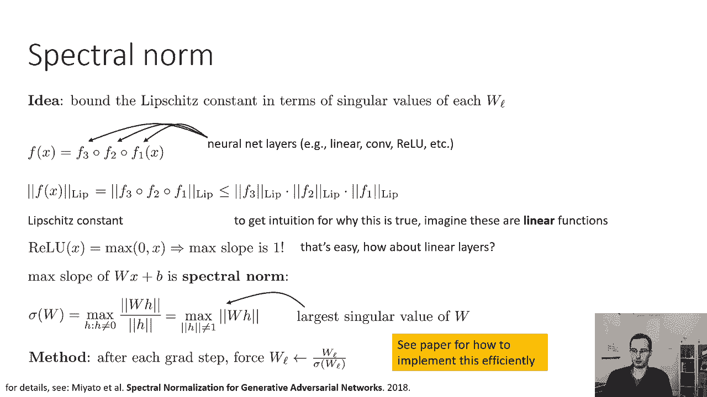

我们会像以前一样有生成器 `G`。我们现在会有一个“鉴别器”（在WGAN中常称为“批评家” `C` 或 `f`），而不是输出图像是真实的概率，它实际上只是输出一个实数。那个实数是不受约束的，所以你只要一堆带有ReLUs的线性层，比如说，最后没有Sigmoid。所以一个例子，一个非常简单的鉴别器的架构将只是一个两层神经网络，真的在第一层之后，第二层之后什么都没有。所以你不再输出概率了，只是输出实数。

鉴别器将使用权重裁剪。事情是这样的：随机梯度算法的每一次迭代，您将更新鉴别器 `f_θ`，使用 `E_{x~p_data}[f(x)] - E_{z~p(z)}[f(G(z))]` 的梯度。有一个小类型应该是 `f(G(z))`。所以这就像普通GAN中的更新一样，仅使用WGAN目标。但是你会把Theta里面的所有权重矩阵都裁剪掉，在 `f` 的参数内，在某个常数 `c` 之间，所以在 `-c` 和 `c` 之间。这将确保判别器是某个有限 `k` 的 `k`-Lipschitz。

然后更新生成器，使 `E_{z~p(z)}[f(G(z))]` 最大化。这就是整个训练过程。变化是判别器进入目标的方式，然后这个裁剪的步骤。

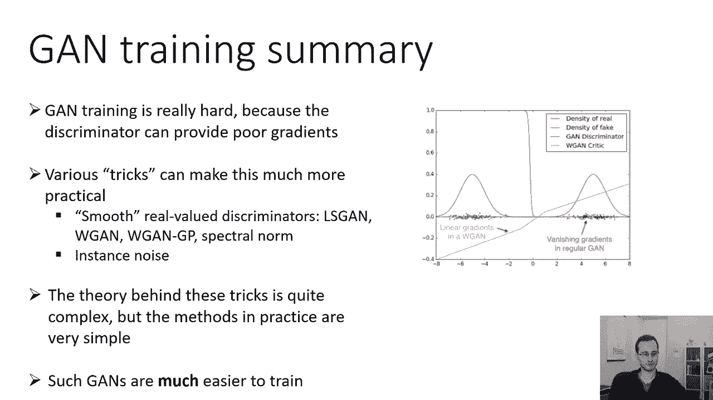

如果我们真的把它想象成一种简单的例子，我们得到的鉴别器曲线实际上看起来要好得多。这是WGAN论文中的一个例子，基本上和我以前的例子一样。所以蓝色的东西显示了真实的样本，绿色的东西显示假的生成样本，红色曲线是一个常规的鉴别器。你可以看到传统的鉴别器基本上给出了一个点的概率，