# 62：CS 182 第 20 讲 - 第 2 部分：对抗性示例 🎯

在本节课中，我们将要学习一种特殊现象——对抗性示例。这是一种神经网络会犯的错误，它揭示了模型在特定扰动下的脆弱性。我们将探讨什么是对抗性示例、它们为何发生、以及它们对机器学习安全性和模型泛化能力的启示。

## 什么是对抗性示例？🤔

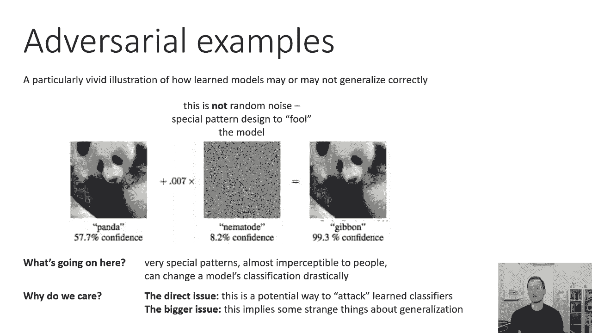

上一节我们讨论了图像的自然扰动和分布偏移。本节中，我们来看看一种非自然的扰动——对抗性示例。

对抗性示例是一个特别生动的例子，说明了学习到的模型可能无法正确泛化。这是一个典型的对抗性示例：左边有一张原始照片，被分类器以 57.7% 的置信度归类为熊猫。然后，我们将一个特殊的模式乘以一个很小的幅度（例如 0.007），并将其添加到熊猫图片上。我们得到了一张新的图片，它在视觉上与原图几乎无法区分，但却被分类器以 99.3% 的置信度归类为长臂猿。

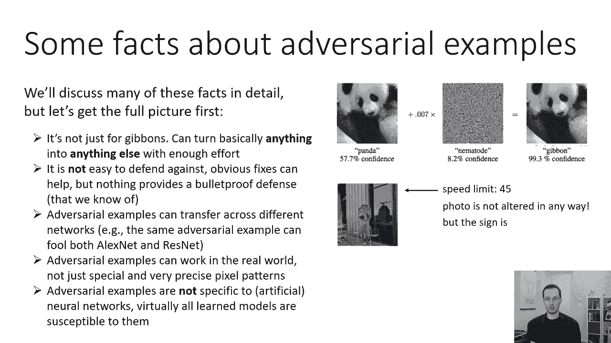

这个特殊的模式并非随机噪声，而是一个经过精心设计、专门用于欺骗模型的模式，因此被称为“对抗性”示例。这种扰动通常非常微小，以至于人类视觉难以察觉，但对于神经网络来说，它足以彻底改变分类结果。

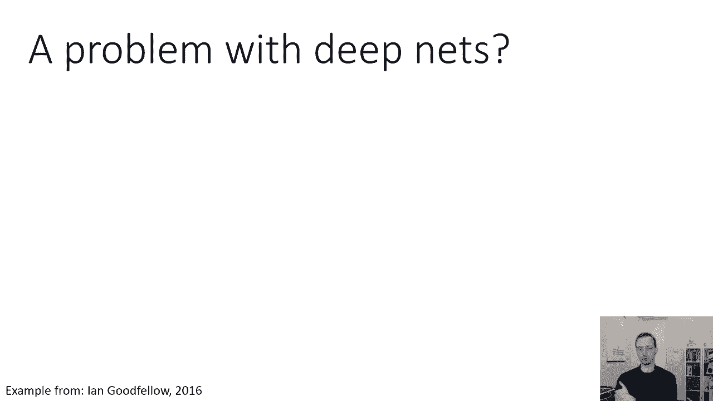

## 我们为何需要关注对抗性示例？⚠️

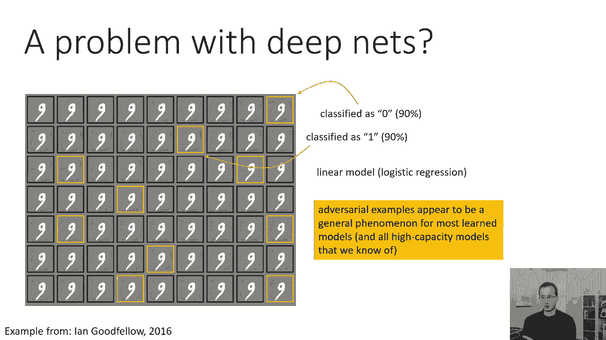

对抗性示例不仅仅是一种理论上的好奇心，它具有重要的实际安全影响。

以下是几个关键原因：
*   **直接的安全攻击**：存在许多现实动机去欺骗分类器。例如，欺诈者可能希望修改交易记录以逃避信用卡欺诈检测；有人可能希望修改受版权保护的材料以上传至网站而不被识别。
*   **模型泛化的启示**：如果神经网络会犯这样的错误，这可能暗示了这些网络在泛化方式上存在一些根本性的问题。理解对抗性示例有助于我们构建更鲁棒、泛化能力更好的神经网络。

## 对抗性示例的关键事实 📝

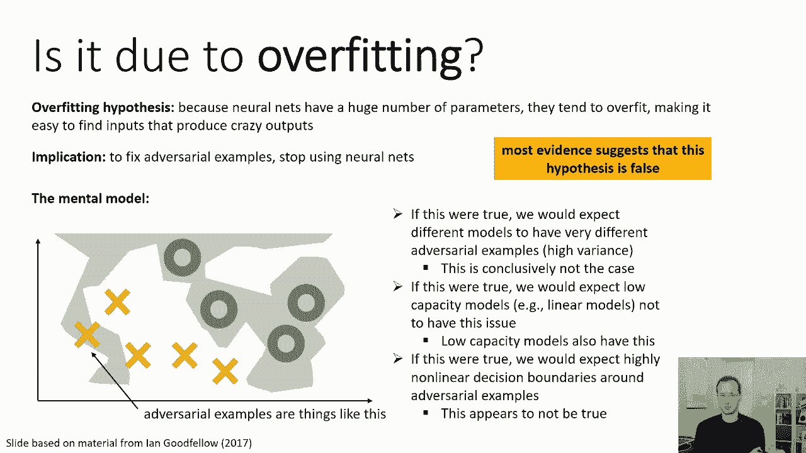

在深入细节之前，让我们先了解一些关于对抗性示例的全貌和基本事实。

以下是关于对抗性示例的几个核心事实：
*   **普遍性**：对抗性示例并不局限于将特定类别（如熊猫）变为另一种类别（如长臂猿）。通过精心设计，几乎可以将任何输入转换为任何目标类别。
*   **防御困难**：截至当前（2021年4月），尚无已知方法能为对抗性示例提供完全可靠（防弹）的防御。虽然存在许多降低其有效性的方法，但无法彻底解决。
*   **可迁移性**：对抗性示例可以在不同模型间迁移。为一个网络（如AlexNet）创建的对抗性示例，通常也能欺骗另一个网络（如ResNet）。
*   **物理世界有效性**：对抗性示例不仅存在于数字像素层面。通过精心设计的物理扰动（如标志上的污迹或贴纸），可以使真实物体的照片被错误分类。
*   **非神经网络特有**：对抗性示例并非深度神经网络独有的问题。几乎所有的学习模型（包括线性模型）都容易受到对抗性攻击。

## 对抗性示例的成因假说 🔍

一个常见的直觉是，对抗性示例可能是模型**过拟合**的症状。过拟合的模型决策边界可能非常复杂且贴近数据点，导致微小的扰动就能跨越边界。

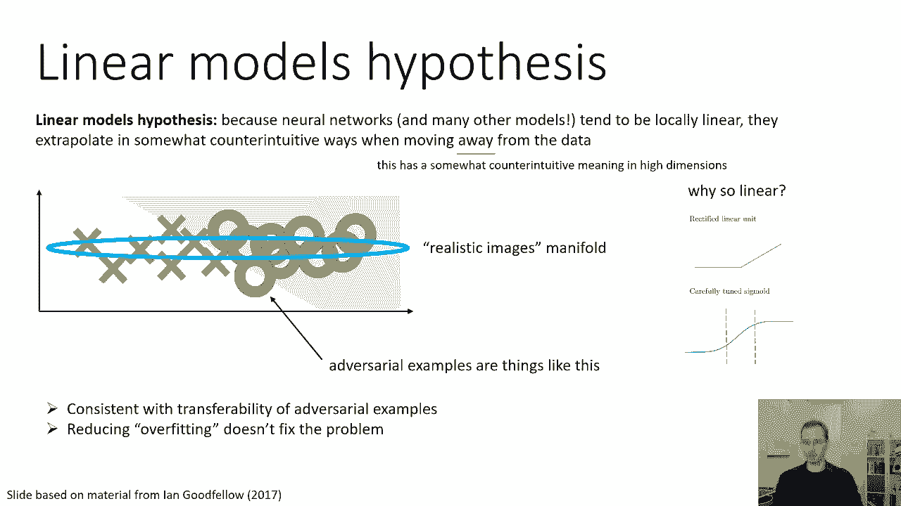

然而，证据并不支持这一假说：
*   **可迁移性矛盾**：如果是对过拟合，不同模型应有高方差，其对抗性示例应各不相同。但实际观察到的可迁移性表明方差很低。
*   **影响低容量模型**：线性模型等低容量模型同样存在对抗性示例，而过拟合通常与高容量模型相关。
*   **决策边界可视化**：对决策边界的可视化研究通常显示其局部是线性的，而非极度复杂和非线性。

另一种假说，即**线性模型假说**，认为许多模型（包括深度网络）在输入空间的大部分区域表现得**局部线性**。在高维空间中，即使沿着许多不相关维度进行微小的线性移动，累积起来也可能导致输出发生巨大变化。

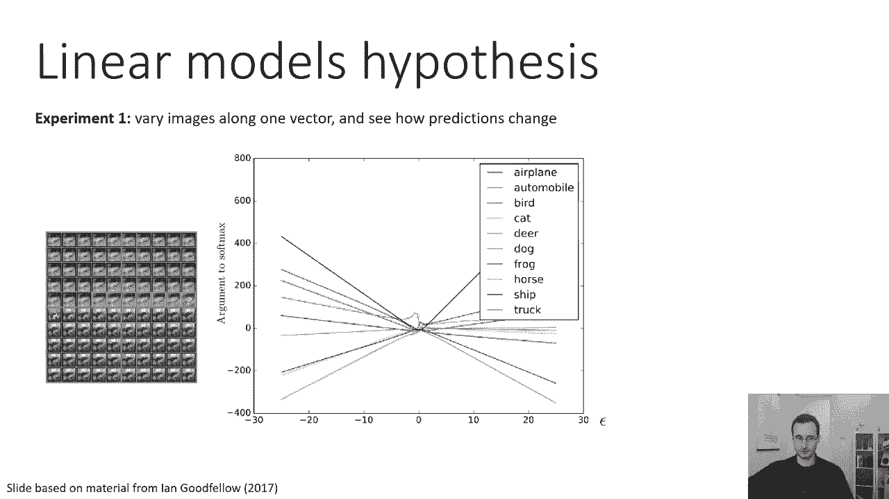

支持线性假说的证据包括：
*   **模型结构**：ReLU等激活函数使网络是分段线性的。即使使用Sigmoid，模型也通常在中间区域近似线性，且易于训练。
*   **外推行为**：实验表明，当输入沿着某些方向远离数据流形时，模型的logits（softmax前的值）会呈线性变化，而非反映不确定性的饱和。
*   **决策边界可视化**：对图像空间进行二维切片可视化时，决策边界通常呈现为直线，这与线性假说一致。

## 对抗性示例与人类感知 👁️

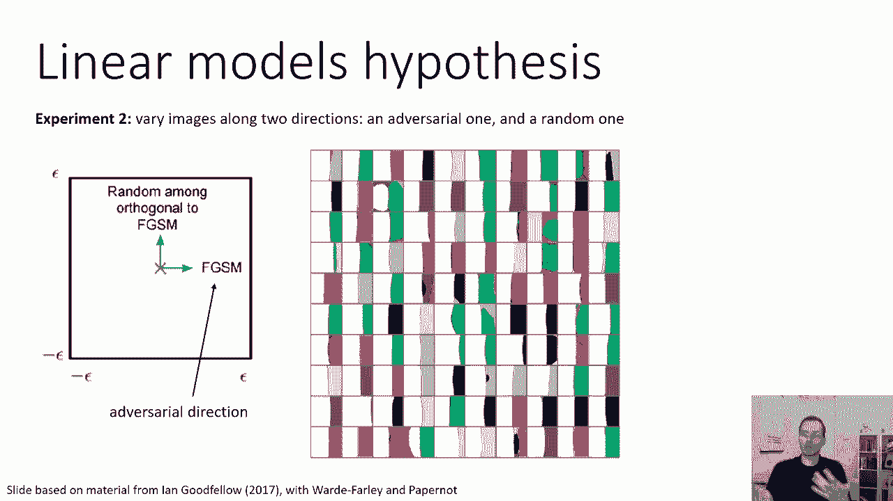

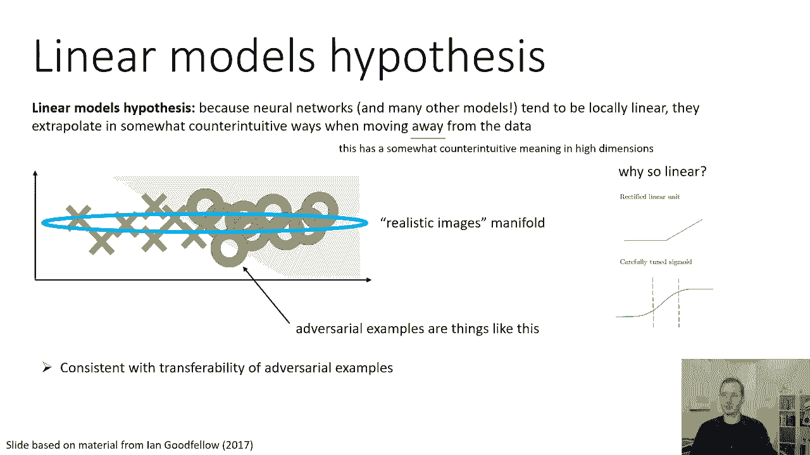

对抗性示例并非机器独有。人类感知系统也存在类似现象，即**视错觉**。例如，一些由正方形组成的同心圆看起来像螺旋。

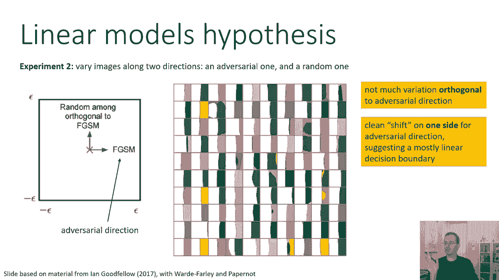

更有研究表明，存在能同时欺骗计算机视觉系统和**时间受限**的人类观察者的对抗性示例。当人类只有极短时间（如不到100毫秒）进行判断时，他们也可能被这些精心修改的图像所误导。

## 对抗性示例与泛化的关系 🧠

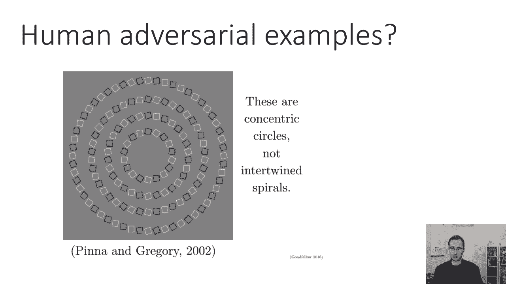

线性假说不仅解释了对抗性示例，也揭示了深度网络泛化的某些方面。当模型被训练来区分猫和狗时，它学习的是数据集中有效的模式，并沿着这些模式进行线性外推。对抗性方向可能恰恰是模型在训练数据上获得高准确率所依赖的“特征”。

因此，对抗性示例可能不完全是模型的“缺陷”，而是模型**高度优化**于特定任务（在训练分布上取得高精度）的副产品。这与控制理论中的观察类似：最优的控制器往往鲁棒性较差。

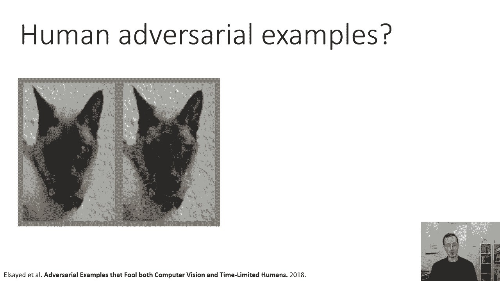

## 总结 📚

本节课中，我们一起学习了对抗性示例的核心概念。我们了解到，神经网络虽然在同分布测试集上泛化良好，但它们可能通过学习数据中的特定模式（成为“聪明的汉斯马”）来实现这一点。当输入分布发生微小变化（尤其是沿着模型敏感的线性方向）时，这些模式可能失效，导致错误的分类。

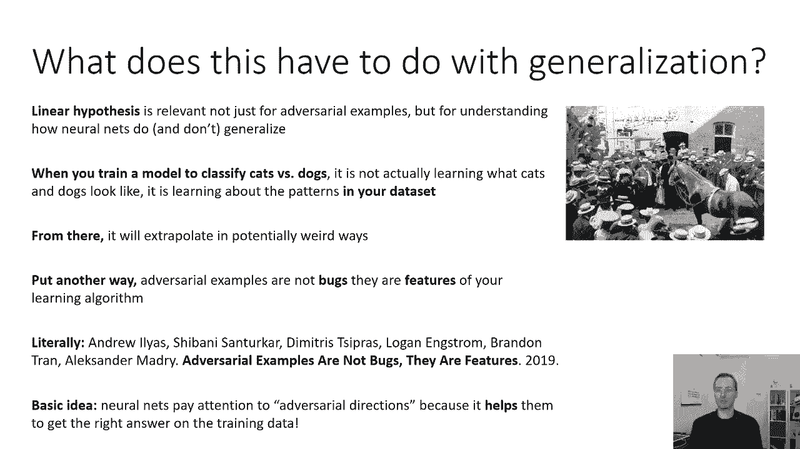

对抗性示例很可能不是过拟合的症状，而是由于模型在输入空间中的**过度线性行为**或**简单外推**所致。它们影响着从线性模型到深度网络的各种学习模型，甚至人类感知。对抗性示例可以在物理世界中构造，并且目前难以彻底防御。理解这一现象对于构建安全、可靠的机器学习系统至关重要。

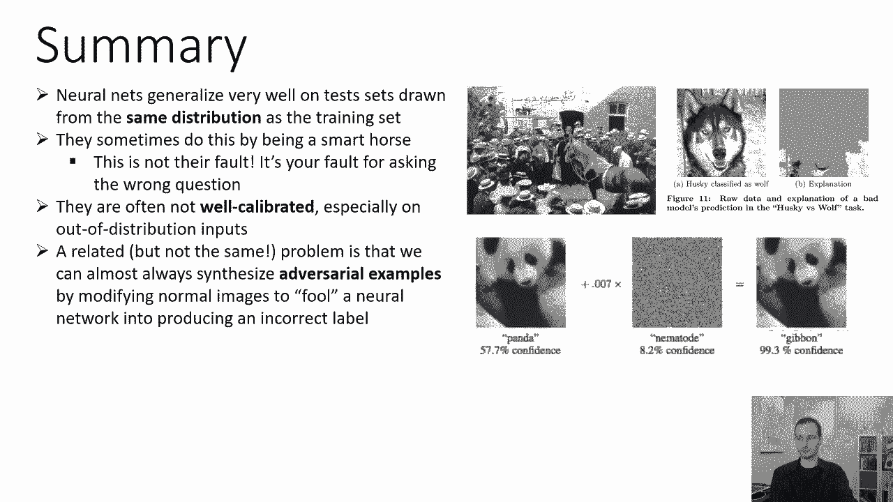

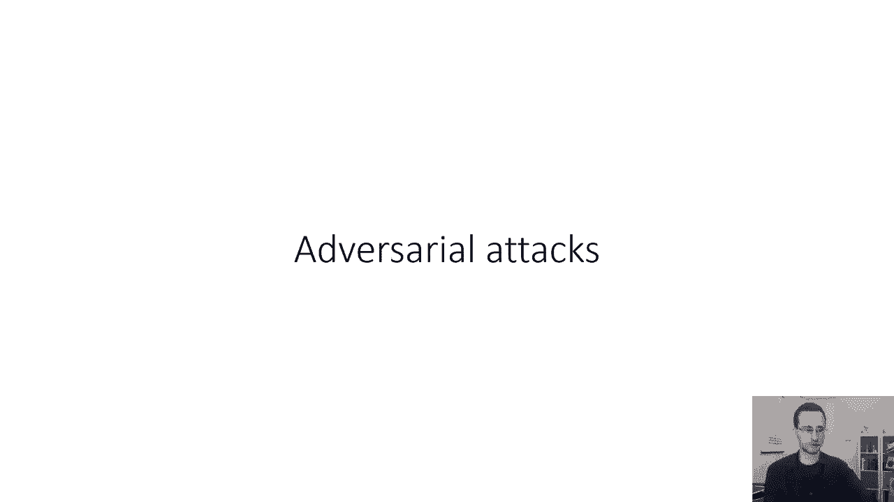

在接下来的课程中，我们将探讨如何具体生成对抗性示例，以及有哪些方法可以尝试增强模型的鲁棒性。