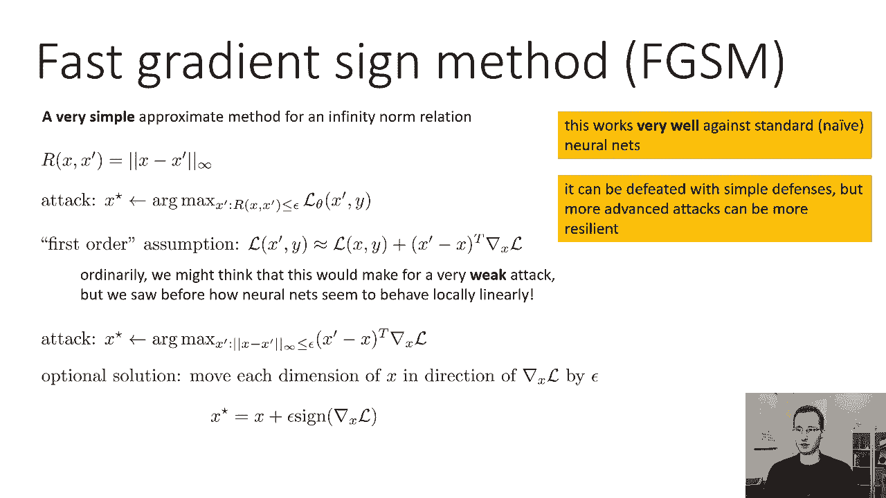
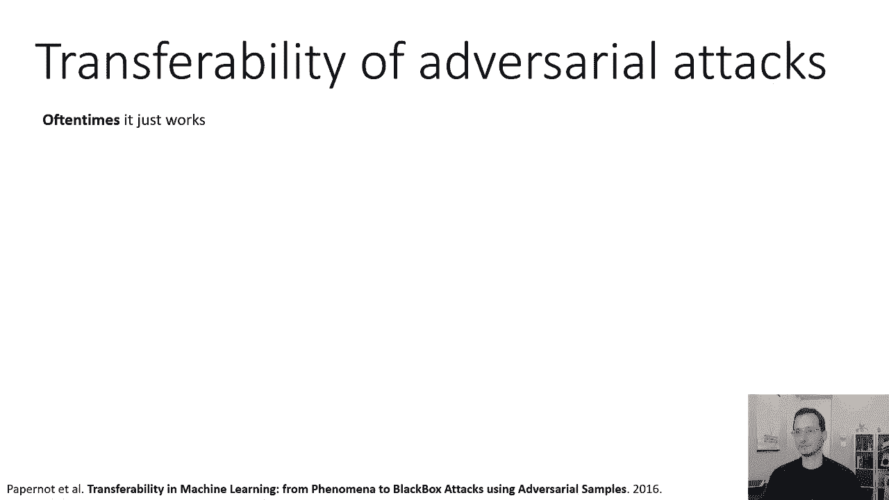
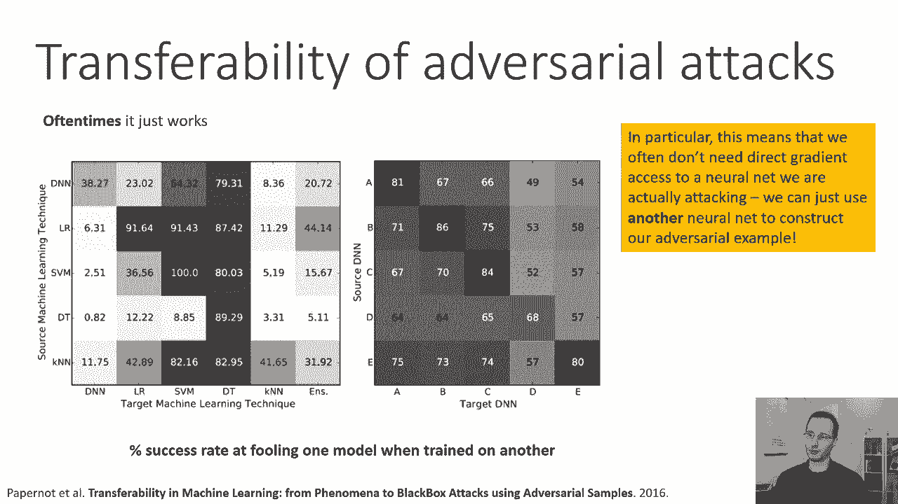
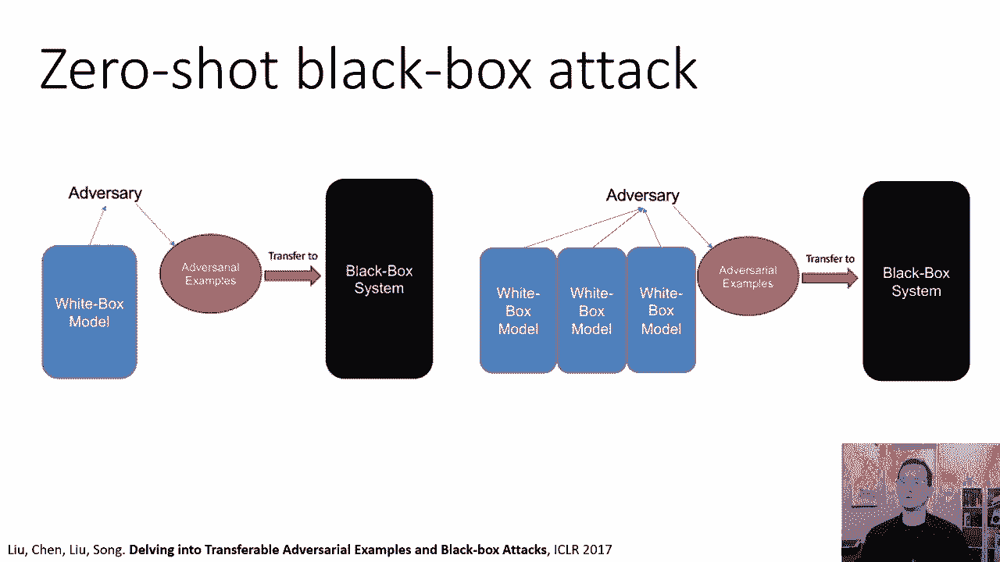
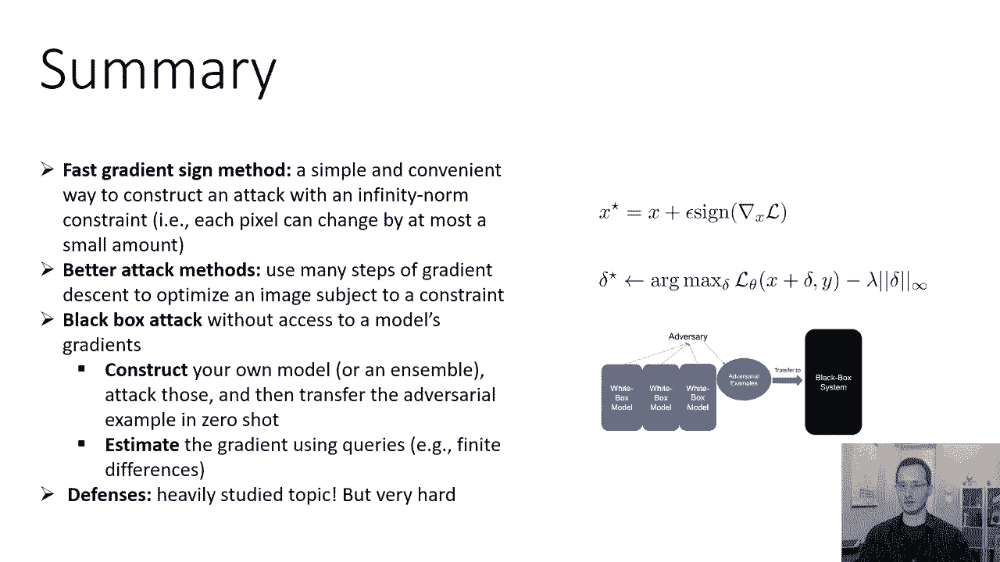

# 63：第3部分：对抗样本 📚

在本节课中，我们将学习如何构建对抗样本。我们将从形式化定义开始，介绍经典的快速梯度符号法，探讨对抗样本在不同模型间的可转移性，并简要讨论如何防御此类攻击。

***

## 🎯 对抗样本的形式化定义

为了创建对抗样本，我们需要一个形式化的定义。我们不只是想随意修改图像，而是需要以某种方式限制我们的修改。

我们可以引入一个关系 **R(x, x')**，它描述了原始图像 **x** 与修改后的图像 **x'** 有多接近。**R** 有许多不同的选择，一个非常简单的选择是 **x** 和 **x'** 之间的无穷范数。

无穷范数正式定义为 **x** 和 **x'** 中差异最大的两个元素之间的差。如果 **x** 和 **x'** 是向量，我们取每个维度的差值，然后在差值的绝对值的维度上取一个最大值。直观地说，这意味着每个像素最多只能改变 **ε**。

因此，对抗攻击可以定义为一个约束优化问题。我们的目标是使模型 **θ** 的损失函数 **L** 最大化，同时满足 **R(x, x') ≤ ε** 的约束。如果 **R** 是无穷范数，就意味着在最大化损失的同时，每个像素最多只能改变 **ε**。

损失的一个例子可能是负对数似然。最大化负对数似然意味着将正确标签的可能性降至最低。当然，我们的网络训练的目标是相反的，即最小化损失。

我们也可以基于非常相似的原则，为防御对抗攻击构造一个定义。防御被表述为一个学习目标：寻找 **θ** 以最小化损失函数。但这里不是最小化数据集 **D** 中 **(x, y)** 元组上的损失，而是最小化在最坏扰动 **x'** 下的损失。

注意，这里的最大值在最小值内部。这模拟了一个场景：我们首先选择模型，然后对手可以为我们的模型选择最糟糕的图像。如果我们比较防御方程和标准的经验风险最小化问题，唯一的区别就是这个最大值。

一个警告是，虽然形式化定义对数学家很有帮助，对证明定理和设计实用的攻击算法也很有帮助，但它可能隐藏一些重要的现实世界考量。真正的攻击者不在乎我们的定义，他们只在乎攻击是否奏效。因此，简单地使网络对无穷范数扰动鲁棒，并不能让我们对真正的攻击免疫，但这仍然是一个很好的起点。

***

## ⚡ 快速梯度符号法

构建对抗样本最著名、最经典的方法之一是快速梯度符号法。这是对无穷范数关系的一种非常简单的近似。

我们的攻击目标是找到 **x'**，在约束 **R(x, x') ≤ ε** 下，最大化损失 **L(θ, x', y)**。我们要做的是做一个一阶假设：假设局部损失函数（作为 **x'** 的函数）近似于 **x** 处的损失加上 **x' - x** 与损失函数关于 **x** 的梯度的点积。这基本上是一个一阶泰勒展开。

虽然神经网络不是线性的，一阶泰勒展开可能不精确，但我们之前看到过神经网络在局部表现出线性行为。因此，这种近似在实践中可能效果很好。

要实施这次攻击，我们用这个一阶泰勒展开近似代替损失函数。现在我们的目标是找到 **x'**，在约束 **||x - x'||_∞ ≤ ε** 下，最大化 **x' - x** 与损失函数关于 **x** 的梯度的点积。

无穷范数意味着我们可以在每个维度上独立地改变 **x**。最优解是将 **x** 的每一维沿着该维度梯度符号的方向移动 **ε**。这可以表示为一个方程：**x' = x + ε * sign(∇_x L(θ, x, y))**。

这就是为什么它被称为快速梯度符号法：我们取损失关于 **x** 的梯度，取其符号，然后沿着那个方向快速移动。它很快，因为计算成本仅相当于一次梯度计算。虽然这不是世界上最强的攻击，但对于不鲁棒的简单模型，它可能相当强大。

***

## 🔄 更通用的攻击方法

现在我们可以写下这次攻击的更一般的表述。我们可以不处理约束优化问题，而是将其写成一个带有拉格朗日乘数的拉格朗日函数。

这样，我们就把约束变成了一种惩罚，它会惩罚优化器偏离 **x** 太远。然后我们可以对任何可微关系 **R** 运行常规的梯度上升来优化，以获得最佳攻击。我们可以启发式地选择拉格朗日乘数，或者使用一些原则性的方法。

在文献中，这种攻击通常不是用 **x'** 表示，而是用扰动 **δ = x' - x** 来表示。优化目标变为：最大化 **x + δ** 处的损失，减去 **λ** 乘以 **δ** 的某种范数。如果我们使用无穷范数，就会得到类似于上一张幻灯片上的攻击。但我们可以使用其他类型的范数，甚至是一些感知损失，这实际上量化了人类区分修改的难易程度。一般来说，构建这种类型的攻击有很大的灵活性，如果做得好，它们可能很难被打败。

***

## 🌐 对抗样本的可转移性

如果我们为一种类型的模型构造一个对抗样本，它也会是不同类型模型的对抗样本吗？通常，可转移性是存在的。

研究表明，可转移性并不完美，但也绝对不是微不足道的。对抗样本似乎更容易从较强的模型转移到较弱的模型。例如，为深度神经网络训练的对抗样本，可能会成功欺骗逻辑回归或支持向量机。而在不同类型的神经网络之间，转移率也相当高。

这意味着，我们通常不需要直接访问目标神经网络的梯度来攻击它。我们可以用另一个神经网络来构建对抗样本。这就是所谓的零次黑盒攻击：我们可以训练自己的模型并攻击它，然后将生成的对抗样本部署到我们只能进行黑盒查询的目标模型上。

更进一步，如果我们对一个模型有有限的访问权限，我们可以做得更好。例如，可以使用有限差分法来估计梯度。通过查询模型对每个像素进行微小扰动后的损失，我们可以估计出梯度的方向。虽然这需要的查询次数等于像素数，但也有一些技巧可以减少所需的查询数量。或者，我们可以查询一些图像来获得标签，构建自己的小训练集，训练一个替代模型，然后攻击这个替代模型。

***

## 🛡️ 防御对抗攻击

让我们简单讨论一下防御对抗攻击。我们一开始提到，可以将防御正式定义为优化鲁棒损失。那么，我们怎样才能真正做好这件事呢？

文献中有许多不同的鲁棒方法。一个非常简单的方案叫做对抗训练。对抗训练是对小批量随机梯度下降的一个简单修改，它基本上实现了这种鲁棒损失。

它是这样工作的：对于小批量中的每个样本，我们使用快速梯度符号法生成一个对抗样本。然后，我们在损失函数上采取SGD步骤，但是用对抗样本来代替原始数据。在实践中，我们通常将对抗样本的损失和原始样本的损失结合起来优化，这往往会在一定程度上提高性能。

这个过程被称为对抗训练，它可以显著提高模型的鲁棒性。虽然它不能抵御所有的攻击，而且通常不是免费的。它会增加你对对抗性攻击的鲁棒性（通常表现为更低的欺骗率），但与原始网络相比，这通常会降低模型在测试集上的总体准确性。这很有道理，因为为了变得更鲁棒，模型通常会变得不那么精确。

***

## 📝 总结

在本节课中，我们一起学习了对抗样本的构建与防御。

*   我们介绍了**快速梯度符号法**，这是一种在无穷范数约束下（每个像素最多改变少量值）构建对抗样本的简单便捷方法。
*   我们描述了如何使用**多次梯度下降步骤**来进行更好的攻击，通过优化受到约束或惩罚的图像。
*   我们探讨了**黑盒攻击**，这些攻击可以在不访问模型梯度的情况下执行，例如通过构建自己的模型或集成模型进行攻击，然后将对抗样本零次转移到目标模型中，或者通过有限差分等方法估计梯度。
*   最后，我们简要讨论了像**对抗训练**这样的防御方法，这是一个在文献中被大量研究的话题。