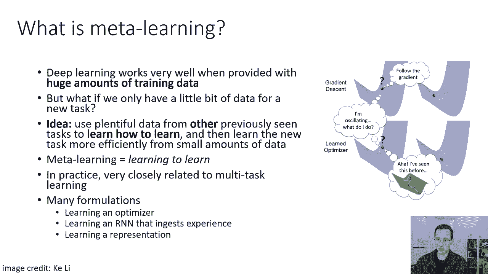
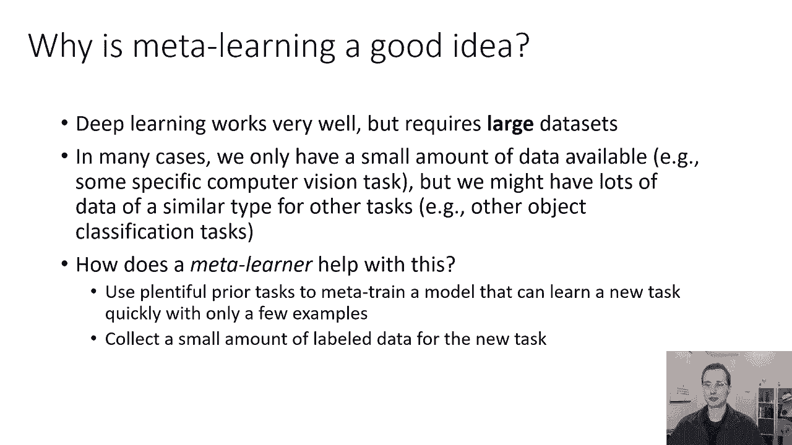
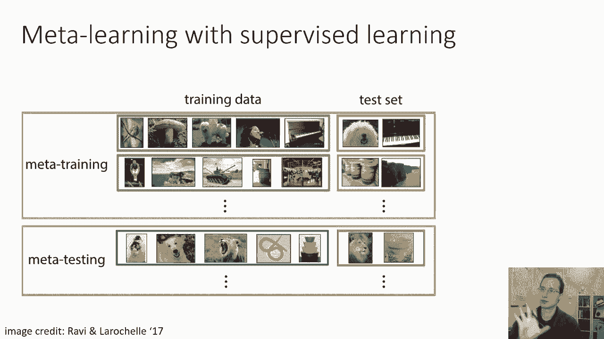
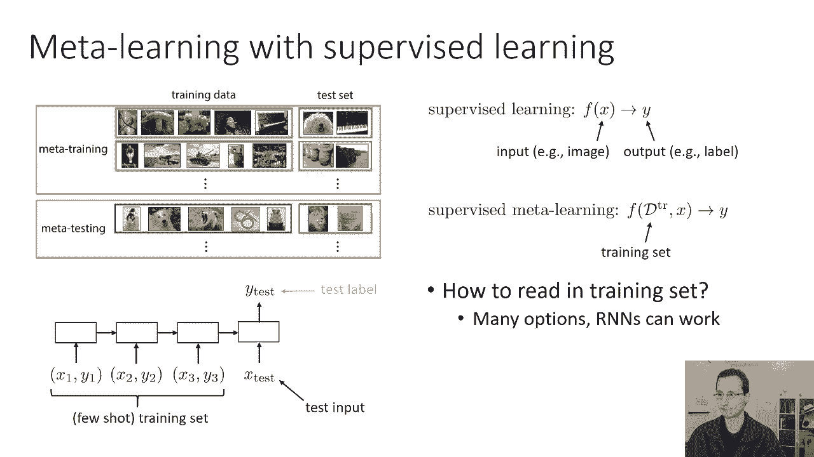
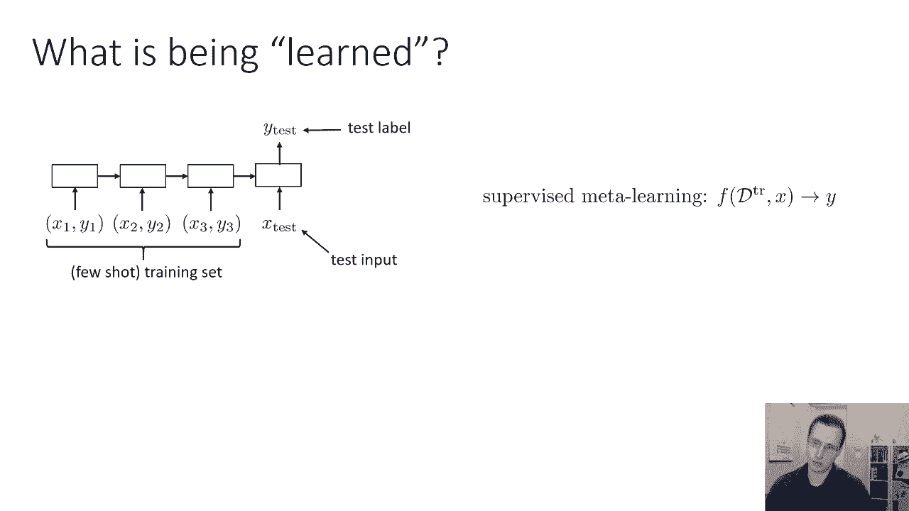
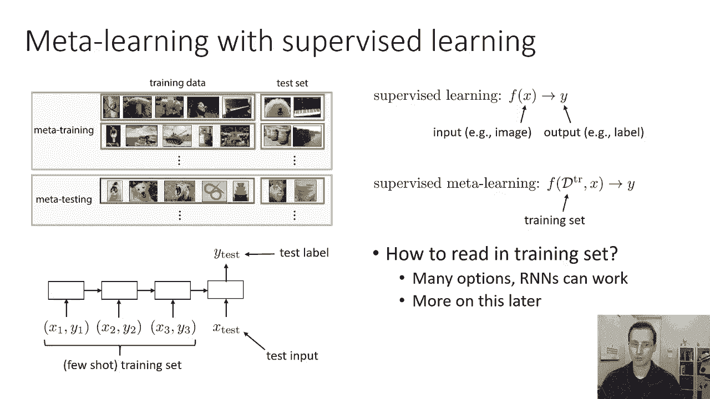
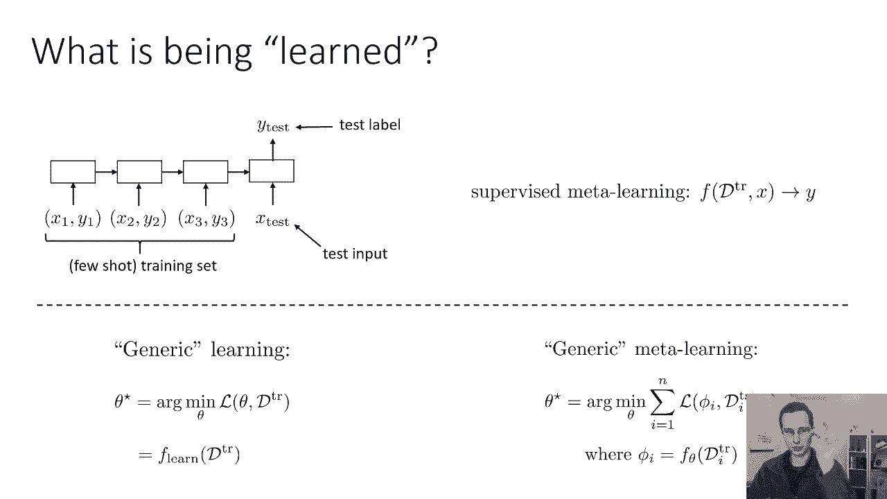
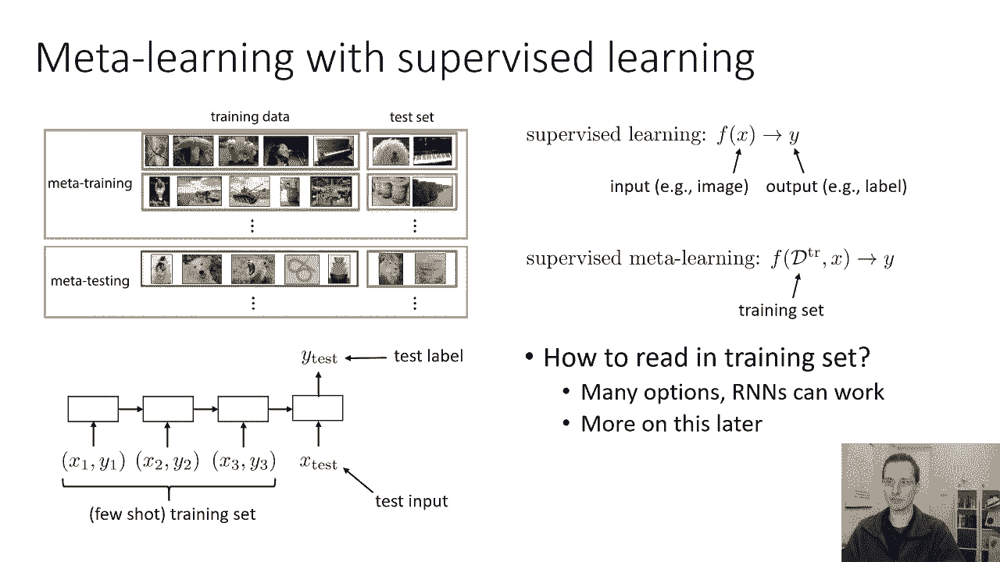
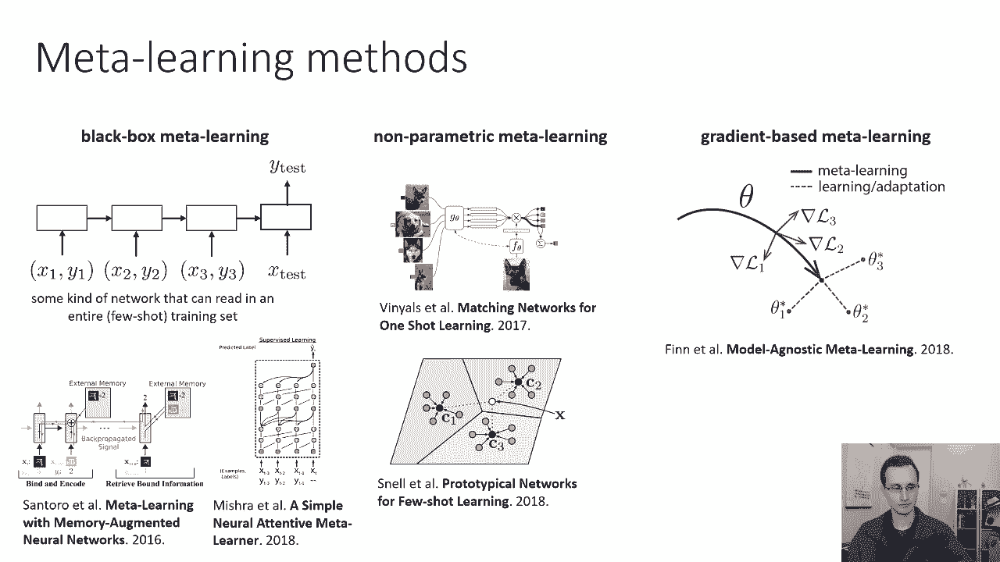

# 64：CS 182 - 第21讲 - 第1部分 - 元学习 🧠

在本节课中，我们将要学习一种名为“元学习”的方法。元学习旨在让深度学习技术能够利用非常、非常小的数据集进行有效学习。我们将探讨其核心思想、如何将其形式化为一个监督学习问题，并介绍几种主要的元学习方法。

---

## 什么是元学习？🤔

从这门课的第一节课开始，我们就了解到，当你有大量数据时，深度学习非常有效。使用超大型模型和深度学习技术可以取得很好的效果。

但是，如果你只有一个新任务的一点点数据呢？此时应用传统的深度学习方法实际上并不那么简单。

那么我们能做什么呢？一个想法是：如果我们有来自其他任务的大量数据，这些任务与当前任务相似，也许我们可以利用它们来学习新任务。这不仅仅是学习，而是“学习如何学习”。然后，利用对如何有效学习的理解，即使从少量数据中，我们也可以更有效地学习新任务。

所以，如果这些先前的任务在结构上与新任务提出的挑战相似（例如，它们都是图像识别任务），那么也许我们可以利用这些先前的任务来了解学习过程本身。这可以让我们在这项新任务中更有效率，即使只有少量数据可用。

因此，元学习基本上是指“学习如何学习”的过程。

在实践中，元学习与多任务学习密切相关。我们在这节课中要讨论的设置是：你拥有大量先前任务的情况。也许这些先前的任务本身都只有少量的数据，但是任务数量很大。然后，你有一些在结构上相关的新任务（稍后我们将定义“结构相关”的含义）。

有很多方法来制定元学习。你可以将其表述为学习优化器、在读取先前数据的RNN中学习、学习表征等等。我们将主要关注元学习问题的一个子集，称为“少样本学习”问题。

少样本学习是指学习一项新任务时，只使用少量称为“样本”的例子。“几个样本”意味着几个例子。

---

## 为什么需要元学习？📈

深度学习效果很好，但它需要非常大的数据集。在许多情况下，我们可能只有少量的数据可用。例如，对于某些特定的医学成像诊断任务，我们可能只有一点点数据，但是我们可能有很多类似类型的数据用于其他任务（就像其他类型的图像识别任务一样）。

那么元学习对此有什么帮助呢？元学习使用大量的先验任务进行“元训练”，从而训练出一个只需几个例子就能快速学习新任务的模型。这意味着你只需要为新任务收集少量的标签数据，然后用你的元学习模型快速适应这个任务，然后解决它。

---

## 将元学习形式化为监督学习 🎯

这可能一开始看起来有点抽象和神秘，但有一个非常强大的技术可以让我们掌握元学习：简单地将元学习问题重新定义为另一个层次的监督学习问题。

这个框架展示了我们如何将少样本图像识别任务制定为一个元学习问题。少样本图像识别意味着你只能得到每个类的少量例子，然后你需要很快地使用这些少量的例子来学习识别该类的新对象。

这个特殊的插图实际上是在说明“单样本”案例。在这种情况下，我们只能得到每个类的一个示例（即非常、非常小的训练集）。你的任务是区分鸟类、蘑菇、狗等。假设你是一家制造图像分类器的公司，你的顾客会跟你说：“我想要区分鸟、蘑菇、狗、人和钢琴，但我只有一个例子，你能给我一个分类器吗？”

将元学习或少样本学习框架化为另一个监督学习任务，意味着把事情提升一个层次。我们要说的是：我们有一个“元训练集”，它本身由许多不同的数据集组成。在这种情况下，每一个都是一次分类任务。

在元训练集中，你有很多、很多任务（也许成千上万的任务）。每一个任务都是由一个小训练集（在这种情况下是一个单样本训练集，所以只有五张照片）和一个小测试集（里面有一些属于这些类的图像）决定的。

在实践中，也许这些任务会更连贯一点。我们通过创建这个数据集所做的，就是将少样本分类的问题，转化为读取一个单样本训练集并对新的测试图像进行预测的问题。

如果我们能训练一个模型来处理这个，那么在“元测试”时间，模型将面对一组新的五个图像（一套新的单样本训练器），里面包含我们从未见过的类别。所以，在元测试时间（这是客户真正想要将其适应新任务的时候），他们可能会展示一个冰淇淋的图像、一张狗的照片、一个线的图像、一个虫子的图像和一个碗的图像。也许这些类别中的一些以前见过，但通常你会假设这些是以前从未见过的新类。

因此，模型学会了快速计算出如何将不同的“五人组”分类。现在它展示了一个新的“五人小组”，他们的类别是以前从未见过的，但是任务的结构是相似的（它们都是图像）。这个想法有意义的正式假设是：我们需要元训练集从某个“任务分布”中取样。这不仅仅是图像的分布，它实际上是对任务的分配。元测试任务需要来自相同的分布。这就像将监督学习的假设，向上移动了一个层次。

如果这看起来有点抽象，别担心。我们将通过具体的模型来使其变得更明显。

---

## 元学习的抽象模型 🔄

在监督学习中，我们学习一些从输入 `x` 映射到输出 `y` 的函数 `f`。你的输入可能是图像，输出 `y` 可能是一个标签。

在元学习中，我们学习一个从训练集（称之为 `D_train`）和测试图像 `x` 映射到对应标签 `y` 的函数 `f`。所以，在我们学习从 `x` 到 `y` 的映射之前，现在我们正在学习从训练集 `D_train` 和 `x` 到 `y` 的映射。对于不同的任务，我们现在给这个 `f` 函数一个不同的 `D_train`。

当然，在现实中，我们可能想要分解这个函数。我们可能首先读取 `D_train` 并产生一些足够的统计数据或参数，然后我们可以用它来分类许多不同的 `x`。但在定义问题方面，我们可以很好地像这样定义它。

如果我们说的是普通的、我们在这节课中已经讨论过的算法（像梯度下降），那么 `f` 就是一个对 `D_train` 运行梯度下降的函数，收敛于它得到的参数，然后用它们来分类 `x`。但在元学习中，用许多其他方式表示 `f` 会更有帮助。

---

## 如何表示元学习函数 `f`？🧩

花点时间想想如何表示函数 `f`。如果你需要学习一个函数，输入是训练集 `D_train` 和测试点 `x`，输出是标签 `y`，你如何表示这个函数？

`D_train` 是一个训练集，这是一组图像和它们的标签。为了设置 `f`，我们需要回答几个问题。第一个问题是：`f` 实际上是如何读取训练集 `D_train` 的？`f` 在所有 `D_train` 中实际上是如何摄入的？

这样做有很多选择。RNNs 可以很好地工作，Transformers 也可以很好地工作，但也有其他选择。为了让事情变得简单，假设我们要使用 RNN（就像一个 LSTM）。这样我们就可以把我们的训练集 `D_train` 当作一个序列：`(x1, y1), (x2, y2), (x3, y3), ...`。我们可以按照某个顺序创建序列，一次读取一个 `(x, y)` 元组。然后我们可以在最后有一个小头部来读取测试图像，并对测试图像进行预测。

这是建立元学习方法的一个非常合理的方法。然后你可以训练这个小 RNN 或 LSTM。在元训练集中的每个任务中（例如，在图像中，因为所有的训练集都有五个图像，这是一个五向分类任务），你会有长度为五的序列。然后，你会有一个单独的小网络来接收 RNN 的最后一个隐藏状态和测试输入（测试图像）。

---

## 理解元学习过程 🧠

当我们向模型展示一项新任务时，它实际上学到了什么？元学习过程训练整个 LSTM 的参数，这是一种外部过程。当你给它一个新任务时（元测试后的新训练集），这里的图像将由五张图片和它们的标签组成。

以下是我们如何理解这种通用学习。标准的非元学习可以看作是采取一些损失函数和一些训练集 `D_train`，并恢复最佳模型参数 `θ*` 的过程。我们可以称之为函数 `F_learn(D_train)`。所以 `F_learn` 吸收 `D_train`，它产生 `θ*`。`F_learn` 的例子包括梯度下降、带动量的 Adam、SGD 等。

通用元学习可以被看作是承担多项任务（在这种情况下，`n` 项任务），并最小化这 `n` 个任务在测试集上损失函数的和。对于每一项任务 `i`，你有一套训练集 `D_train_i` 和一套测试集 `D_test_i`。你有 `N` 个这样的对。

你的学习函数 `f_θ` 读入 `D_train_i`，它产生了某种参数向量 `φ_i`（它不必对应于神经网络的权重，它只是一些数的向量）。`φ_i` 可以用来分类从 `D_test_i` 中拍摄的同一任务的其他图像。所以，我们从 `D_test_i` 取一个 `x`，我们使用从将 `f_θ` 应用于 `D_train_i` 中得到的 `φ_i` 来预测相应的 `y`，并最小化损失。所以，它在说：最小化测试集上的损失，在使用训练集获得 `φ` 之后。梯度当然会回传到 `f_θ`。

这就是元学习如何工作的抽象模型。幻灯片顶部的这个 RNN，非常适合这个抽象模型。为了弄清楚如何适应这个抽象模型，你得回答几个问题：什么是 `f_θ`？什么是 `φ`？

对于我们简单的 RNN 元学习器来说，`f_θ` 基本上是 RNN（`θ` 表示 RNN 的参数）。它在 `D_train` 中很好地阅读后产生了什么？它会产生一些 RNN 隐藏状态（即最后一个 LSTM 状态）。在你读完整个训练集后，最后一个 RNN 隐藏状态被一个小分类器网络使用，对测试点进行分类。所以我们称 `φ` 由 RNN 隐藏状态以及最后这个小分类器的参数组成。因为那个接收隐藏状态 `h_i` 和 `x` 并产生 `y` 的小网络也有一些参数，这些参数是元训练的一部分。

`f_θ(D_train_i)` 产生 `φ_i`。关于 `D_train` 的大部分知识就编码在最后一个 RNN 隐藏状态下，还有分类器的参数（这些参数不是由 RNN 产生的，它们是固定的，和其他东西一样受过元训练）。

从这种心理模型出发，你可以想象可以用很多其他的方法来制定元学习。你可以设计许多其他的架构，定义许多其他类型的 `φ`。当我在这节课剩下的时间里谈论不同的元学习算法时，请思考一下它们是如何映射到这个模板上的：想想什么是 `f_θ`（读取 `D_train` 的部分），什么是 `φ`（参数和数的向量，这足以对新的测试点进行分类）。对于我将讨论的每种方法，它将有不同的答案。

为了避免任何混乱，我在这里描述的一切都是以不同的方式看待 RNN。实际的方法非常简单：实际的方法基本上是处理每一个 `(D_train, x, y)` 元组作为训练点，将 `D_train` 和 `x` 作为 RNN 的输入，并教它产生相应的 `y`。就 RNN 而言，这只是一个监督学习问题。但这样看，我们也可以把它看作是一个元学习问题。

所以，如果这对你来说有点困惑，只要记住在最后，你实际这样做的机械方式是：你只需设置一个常规的序列标注问题，其中序列由 `D_train` 组成，然后是测试点 `x`，所需的输出只是与 `x` 一起的标签 `y`（`(x, y)` 元组来自测试集）。

---

## 主要的元学习方法 📚

有哪些实际的元学习方法我们可以在实践中很好地使用？我们可以把它们分为三类。

以下是三类主要的元学习方法：

1.  **黑盒元学习算法**：这些基本上是类似于我之前描述的 RNN 技术的方法。它们基本上是使用某种神经网络（通常是序列模型）来读取整个训练集和测试点，然后输出测试点标签。它们只是接受监督学习的训练，将元学习问题重铸为监督学习问题。它们通常在使用的特定架构上有所不同（例如，RNN、LSTM、带外部记忆的模型、Transformer 等）。训练它们的实际算法正是我到目前为止讨论的。大多数元学习的巧妙之处实际上在于数据处理。

2.  **非参数的元学习方法**：不要让名字欺骗你，实际的元学习是参数化的，但“适应”过程不是参数化的。所以你可以把这些方法看作是学习如何做“最近邻”查询。它们解决新任务的方式是使用某种最近邻查询，但它们会在元学习阶段学习表征，这将使那些最近邻查询工作得很好。这类方法包括匹配网络和原型网络，我们将在第二部分讨论。

3.  **基于梯度的元学习算法**：这些一开始看起来和其他的很不一样，但在许多方面，它们实际上有很多相似之处。基于梯度的元学习方法的原理是：你适应新任务的方式，只是通过梯度下降进行微调。所以，你实际上会通过在这项任务上运行梯度下降来适应新的任务。但是在元训练中，你实际上会训练你的模型，使得梯度下降适应效果很好。起初，这似乎是一个完全不同的原则。

---

## 总结 📝

在本节课中，我们一起学习了元学习的基本概念。我们了解到，元学习是“学习如何学习”的过程，旨在利用先前的任务经验来快速适应只有少量数据的新任务。我们将元学习问题形式化为一个更高层次的监督学习问题，并介绍了表示元学习函数 `f` 的一种方法（使用 RNN）。最后，我们概述了三种主要的元学习方法：黑盒方法、非参数方法和基于梯度的方法，为后续深入探讨具体算法奠定了基础。